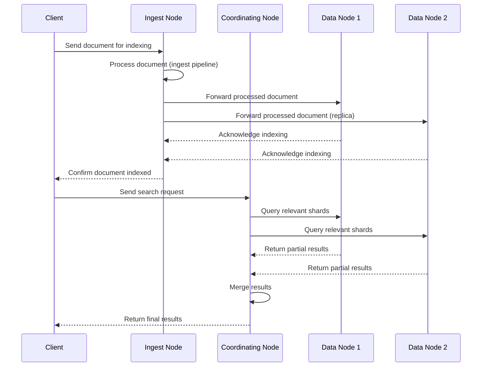
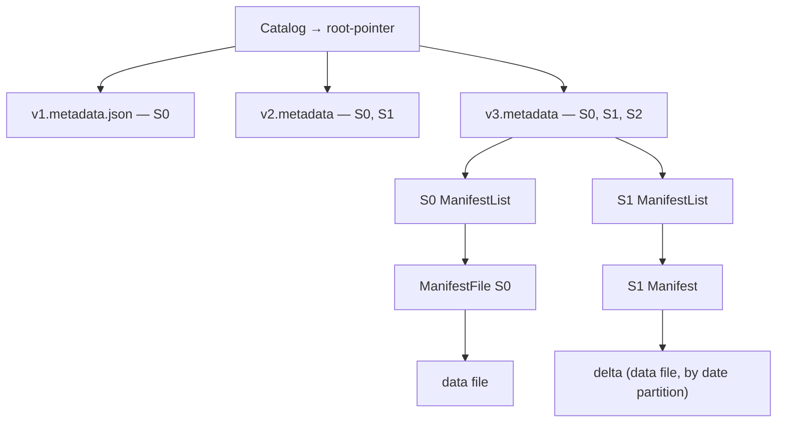
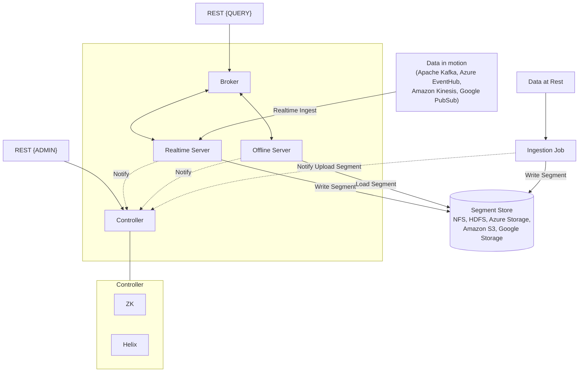

# HLD Appendix — Notes

*Transcribed from handwritten Xournal++ notebook (`hld_appendix.xopp`), 24 pages.*

[← Appendix index](README.md) · [All docs](../README.md)

## Table of Contents

**[A) Different Types of Consistencies](#a-different-types-of-consistencies)**
1. [Single Node, with single thread](#1-single-node-with-single-thread)
2. [Single Leader + Replica (Asynchronous)](#2-single-leader--replica-asynchronous)
3. [Single Node + Replica (Synchronous)](#3-single-node--replica-synchronous)
4. [Single Node with multiple thread](#4-single-node-with-multiple-thread)
5. [Partitioning (Sharding)](#5-partitioning-sharding)
6. [Sharding + Replication (Leaderless)](#6-sharding--replication-leaderless) — Cassandra-style, tunable consistency
7. [Sharding + Replication (Leader-based)](#7-sharding--replication-leader-based) — Spanner/CockroachDB-style
   - [Linearizability guarantee](#linearizability-guarantee)
   - [Serializability guarantee](#serializability-guarantee)

**[B) Technologies](#b-technologies)**
1. [Elastic Search](#1-elastic-search-eventual-consistent) *(with sequence diagram)*
2. [Cassandra](#2-cassandra)
3. [Kafka](#3-kafka)
4. [Redis](#4-redis)
5. [Iceberg](#5-iceberg) *(with diagram)*
   - [Iceberg — full worked example](#5a-iceberg--full-worked-example-salesorders) — 4 commits, read path, MERGE (COW vs MOR), concurrency, expiry, layer table
6. [Pinot](#6-pinot) *(with architecture diagram)*

---

## A) Different Types of Consistencies
- Linearizability
- Serializability, etc.

Start with simple to complex.

### 1) Single Node, with single thread

**Solves:** 100% consistent, simple

**Problems:**
1. Fault tolerance (availability) — what if the node goes down?
2. Not scalable
   - Load handling (read/write requests)
   - Storage limited to single node

### 2) Single Leader + Replica (Asynchronous)

**Solves:**
- Node failure
- Better throughput if reads allowed from replica (for high availability)

**Problems:**
1. Consistency
   - Lost writes during node failure
   - Replica lags — read-your-writes violated
2. Throughput
   - Reads limited to master + replica
   - Writes limited

### 3) Single Node + Replica (Synchronous)
→ Client requests write
→ Write to leader (WAL) → Write to replica (WAL)
→ Replica ACK → Leader commits write
→ Client ACK

**Solves:**
- Node failure
- Consistency (read/writes from leader)

Read your writes ✓

**Alternative:** Client waits till replica catches [up]
Eg: write at ts:105. Future reads require replica ts ≥ 105.
Read your writes ✓

**Problems:**
1. Latency — client has to wait for replica to write & ACK
2. Throughput — single-threaded read/write ops from leader is bottleneck

### 4) Single Node with multiple thread

**Solves:** to scale read/writes, multiple transactions executed concurrently (poor throughput)

**Problems:**
- (a) Check-then-act. Eg: seat booking.
- (b) Read-Modify-Write. Eg: bank account balance, counters.
  Two transactions "race" to update same data object.

**Solution:**
- Pessimistic concurrency control (locking)
- Optimistic concurrency control (rollback)
- MVCC

*(Isolation levels are discussed in depth in google sheet HLD cheatsheet)*

**Problems:**
1. Vertical scaling limitation
   - CPU threads limited
   - RAM limited
   - Storage limited

### 5) Partitioning (Sharding)

**Solves:** This solves vertical limits by horizontally scaling the database — scales storage, queries (throughput), latency (geo-located)

**Considerations**
1. How to partition — hot partitioning
2. Query routing? — how to route query to exact node?

- Partition/Shard key
- Consistent hashing
- Service discovery (when node joins/fails)

**Problems**
1. Query latency — some queries which are cross-shard (joins)
2. Fault tolerance — what if a node goes down?

### 6) Sharding + Replication (Leaderless)
— Cassandra

**Solves**
Availability
- By replicating shard, if a shard fails automatic failover is performed
- It uses consistent hashing

We can define:
- partition-key — MD5 used to consistent-hash
- primary-key: this MUST include partition-key

**Tunable consistency** based on quorum reads & quorum writes

1. Quorum write (W) aka write concern
   - How many nodes to ACK for write to be successful
2. Read concern (R) aka read concern
   - R nodes are read and replica with latest value returned

**Guarantee:** latest committed value is read
If write is acknowledged by quorum (W), any read will return value ≥ [that write]
(monotonic visibility)

Since any node can accept writes, **Not guaranteed:** linearizability OR global ordering.

Two concurrent writes by independent replicas:
```
ts:100 A: 10 write
ts:100 B: 20 write
```
C: non-deterministic (either 10 or 20). Eg applies 20, then 10.

**Why linearizability is problem?** (violation)
1. Last write-wins can lose updates
   - Eg: counter can change 99, 101, 100
   - Bank balance can change
2. Stale reads
   - Based on when client quorum reads, value of data is non-deterministic (inconsistent downstream)

**Not guaranteed:** transactional support — ACID

**Problems:** (Not guaranteed)
- Linearizability — LWW, stale reads, lost update
- Transaction support — multi-key modifications not atomic

⭐ When we refer linearizability, it is on single object.
*(Note: Lightweight Transactions (LWT) add linearizability for single partition/key by Paxos. They do not make it ACID.)*

No 2PC or MVCC.

### 7) Sharding + Replication (Leader-based)
Spanner / CockroachDB

- Linearizable writes
- 2PC commit (solves atomicity)
- Locking or MVCC

It guarantees strong consistency. It is leader-based, single leader/region and replicas (linearizability + serializability).

**How?**
1. Replication consensus — RAFT
2. Leader-based
3. MVCC
4. Global timestamp — Hybrid Logical Clocks
5. Concurrency control — detect conflicts (MVCC + SSI or locking + global timestamp)
6. Atomic commit — all or none transaction. 2PC.

### Linearizability guarantee
1. Replication log consensus
   - On leader-election
   - On every write (majority ACK)
2. Leader based — a single ordering for writes
3. Correct read protocol
   - (a) Read leader-only (not scalable)
   - (b) Global timestamp + allow read replicas

By having global timestamp, replica can wait while performing a read for local replica log to catch-up.

Eg:
```
replica-log ts:120
read         ts:110  ✓ (as of timestamp)

replica-log ts:120
read         ts:125  ✗
```

"As of timestamp" provided by transaction or client.
- If still need freshness guarantee, route reads to **leader**.

### Serializability guarantee
Concurrency control + atomic commit.

---

## B) Technologies

### 1) Elastic Search (eventual consistent)
- Criteria
- Sort by?
⇒ Results

Documents: JSON blobs / PDF

Define fields & types (Mappings)
- title: text
- price: float

```
// PUT /books: {
  shards
  replicas
}

/books/_mappings  // nested definition of fields
```

Supported types: keyword (exact match), date, text (enum), nested (arrays with objects)

### Ingestion
```
// POST /books/_doc
// PUT /books/_doc/:docId  ?versionNo
// POST /books/_update
```

### Search
```
GET /books/_search
```
- Return: entire document/specific field, **relevance score**
- Sort by: with formula, nested object, exact fields, OR score (relevance)
  - TF-IDF
  - Doc1: how many "elastic" — TF
  - `TF × 1/(# doc frequency)` (where term appears)

- Limit + pagination
  - Stateful pagination — server state (cursor)
  - Stateless — client offset. `offset, limit` / `timestamp After, id` (preferable, more efficient)

**What if result set keeps changing?**
- Result set constantly added, deleted
- Snapshot: create — PIT (point-in-time), `keep-alive = 1m` (TTL)

### When to use?
- It's **not** primary DB — ✗ durable, ✗ available guarantees
- Best read-heavy (not frequent writes)
- Eventual consistent
- Denormalize data, no joins
- Really need it? — text search, billion documents

### Nodes
- **Master** (leader): admin, overlook nodes, create indexes
- **Coordinator** (API): accept requests
- **Data**: indexes + doc
- **Ingest**: analysis, CPU bound
- **ML**

Sharding ↑ throughput — load balancing

Segment writes: immutable. SST + LSM + soft deletes.

**Segment Documents**
```
id: 12 {}
id: 53 {}
```
**Index** (inverted index): `lazy: [12, 5]`

Cleaning = parsing + tokenization + stemming + lemmatization

Keep columnar fields for **fast** querying.
Eg: sort by price.
In index store, create full-flattened columnar store for **all** doc fields.
Name: **DocValues**

Optimization: query optimizations planner, push-down predicate.

### Elasticsearch Indexing & Search Sequence Diagram



### 2) Cassandra
- Scalable + fault tolerant
- Highly available + low latency R/W

✗ joins, ✗ consistency

**Keyspace**: # replicas
- Tables, flexible columns
- Rows: PK
- Columns: name

Wide columnar store. Lot of columns null.

```
Client → Server → Node1
                 → Node2
                 → Node3
```
Use consistent-hashing.

**Primary-Key** = Partition-key : clustering-key (sort-key)
Eg: primary-key: user_id + message_id

Tunable consistency: ONE, QUORUM, ALL

- Partitioning + consistent-hashing
- Replication
- Gossip & leaderless design
- Tunable consistency

✗ Coordinator — client contacts **any** node.

```
Client --write req--> CommitLog (WAL) — (Durability)
                    → Memtable --flush--> SSTable (append-only + compaction)
```

read → check Memtable + SSTable (fast) — bloom-filters

### Data Model (aka query driven)
- Denormalize, avoid joins (since reads are incredibly slow!)

Duplication is fine — Post table, User table (parallel)

**Use when:**
- High writes (100k+ rps)
- Write >> read
- Predictable, limited query patterns

Eg:
1. Get all posts/user
2. Activity feeds
3. Timeseries
4. Messaging systems
5. Event log

**Don't use**
- Flexible/custom queries
- Need strong consistency

✗ Adhoc analytics
✗ Complex joins. No consistency cross-table.
✗ Cross-partition consistency
✗ ACID ✗ transactions

### 3) Kafka
- Ordering issue
- Partition by business-key
- Lot of events — consumer lag
- Consumer group — multiple consumers (guaranteed processed by 1 consumer)

- Topics: write to a topic, read from topic

**Broker**: holds the "queue" (server)
**Partition**: ordered, immutable sequence-log file
**Topic**: a logical [grouping] of partitions

Producers, Consumers — max parallelism ≤ # partitions. Partition by key ↓

**Message**: headers, key, value, timestamp

Periodically commit offset (auto-commit)
Leader-follower replica (durability)

**Auto-commit is dangerous.**
Better: `poll()`, `sendMessage` (SQS) → wait for success → `commitSync()`
Eg with SQS

### When to use Kafka?
- Processing can be done async
- In-order message processing. Eg: TicketMaster.
- Decouple producer & consumer (different needs for scaling). Eg: online judge submissions.
- Ad-click aggregator — infinite stream of input data (Flink)
- FB live comments — pub-sub, fan-out

**Kafka deep-dive**
1. Scalability
2. Fault tolerance (durability)
3. Errors, retries
4. Performance optimizations
5. Retention

**Scale:** 1MB/message, 1 broker (TB, 10k rps) — good partition key + more brokers.

**Hot partitions**
- Remove key? Compound-key: `ad + user_id`
- Partition-key salting
- Backpressure, slow down producer

**Settings**
`acks = all` — always available
`replication factor = 3`

Consumer: commit offset correctly

**Producer Retries:** n/w issues. Retry 5, `idempotent=true`.

**Consumer Retries** (not natively supported in Kafka)
- Main topic
- Retry topic       } SQS handles it via visibility timeout
- DLQ topic

**Performance:** compress + batch messages.

**Retention Policy**
- `retention.ms` (time)
- `retention.bytes` (based on size)

### 4) Redis
✗ Durability

**Motivation**
```
SET foo 1
GET foo
INCR foo (atomically)
XADD mystream ...   ✗read
       ↑ stream
```

Leader-based, replicated.

✗ consistent hashing — **Slot**
- If a node goes down, replica → promoted to primary

**Shard:** Only way to shard Redis is **key**.

**Problem:** hot-key. **Solution:** salting.

`Map<Key, Object>`

- Redis as rate-limiter (high R/W). Expiry: TTL.

**Stream:** at-least-once
- Claim an item. Delete an item.
- Problem (orphan item) — delete not committed

### Sorted sets
`POP` — `ZREMRANGEBYRANK`. Remove all but the top 5.

### Geospatial Index
```
GEOSEARCH FROMLONLAT BYRADIUS (5km WITHDIST)
```
Static locations?

### PubSub
Server — subscribers & publishers.
At-most-once (best-effort)

### 5) Iceberg

Catalog → Root-pointer



Time-travel, auditability.

### 5a) Iceberg — full worked example (`sales.orders`)

One table, four commits, one read, one `MERGE`, one concurrent-writer conflict. Every file
that gets written is shown. Read this top-to-bottom once, then you can reconstruct any layer
from the summary table at the end.

#### Setup

```sql
CREATE TABLE sales.orders (
  order_id    BIGINT,
  customer_id BIGINT,
  order_date  TIMESTAMP,
  amount      DECIMAL(12,2),
  status      STRING
)
USING iceberg
PARTITIONED BY (days(order_date))          -- hidden partitioning: transform, not a column
TBLPROPERTIES ('write.merge.mode' = 'copy-on-write');
```

Catalog: AWS Glue (or any REST catalog — same behaviour). Warehouse: `s3://lake/`.

On disk, every object lives under the table location. Nothing is ever modified in place;
every commit only **adds** files and then swaps one pointer.

```
s3://lake/sales/orders/
├── metadata/
│   ├── v1.metadata.json            ← commit 1 (CREATE)
│   ├── v2.metadata.json            ← commit 2 (INSERT)
│   ├── v3.metadata.json            ← commit 3 (INSERT)
│   ├── v4.metadata.json            ← commit 4 (MERGE)
│   ├── snap-8001-....avro          ← manifest LIST for snapshot 8001 (one per snapshot)
│   ├── snap-8002-....avro
│   ├── snap-8003-....avro
│   ├── m0-....avro                 ← manifest (immutable, shared by many snapshots)
│   ├── m1-....avro
│   ├── m2-....avro
│   └── m3-....avro
└── data/
    ├── order_date_day=2026-09-19/
    │   └── 00000-0-a1.parquet
    ├── order_date_day=2026-09-20/
    │   ├── 00000-0-b7.parquet
    │   ├── 00001-0-c2.parquet
    │   └── 00000-1-d9.parquet      ← written by the MERGE (replaces b7)
    └── order_date_day=2026-09-21/
        └── 00000-0-e4.parquet
```

> The `order_date_day=…/` directory names are **cosmetic**. The engine never lists or parses
> them. Partition values are stored as data inside manifests (below). This is what makes
> partition evolution and hidden partitioning possible.

#### Commit 1 — `CREATE TABLE` → `v1.metadata.json`

No snapshot yet; just the table definition. Note what is versioned: **schemas**, **partition
specs**, **sort orders** are all *lists* with a "current" id, because they can evolve and old
data files were written under old ids.

```json
{
  "format-version": 2,
  "table-uuid": "6f1c…",
  "location": "s3://lake/sales/orders",
  "last-sequence-number": 0,
  "last-updated-ms": 1790000000000,
  "last-column-id": 5,
  "current-schema-id": 0,
  "schemas": [
    { "schema-id": 0, "type": "struct", "fields": [
      { "id": 1, "name": "order_id",    "required": true,  "type": "long" },
      { "id": 2, "name": "customer_id", "required": false, "type": "long" },
      { "id": 3, "name": "order_date",  "required": false, "type": "timestamp" },
      { "id": 4, "name": "amount",      "required": false, "type": "decimal(12,2)" },
      { "id": 5, "name": "status",      "required": false, "type": "string" }
    ]}
  ],
  "default-spec-id": 0,
  "partition-specs": [
    { "spec-id": 0, "fields": [
      { "source-id": 3, "field-id": 1000, "name": "order_date_day", "transform": "day" }
    ]}
  ],
  "last-partition-id": 1000,
  "default-sort-order-id": 0,
  "sort-orders": [ { "order-id": 0, "fields": [] } ],
  "properties": { "write.merge.mode": "copy-on-write" },
  "current-snapshot-id": -1,
  "snapshots": [],
  "snapshot-log": [],
  "metadata-log": [],
  "refs": {}
}
```

Catalog row after commit 1:

| table | metadata_location |
|---|---|
| `sales.orders` | `s3://lake/sales/orders/metadata/v1.metadata.json` |

Key point: **columns are tracked by `id`, not name.** `RENAME COLUMN status TO state` only
edits the schema; no data file is touched. Parquet files store field ids in their metadata,
so a reader maps `id 5 → "state"` regardless of what the file called it.

#### Commit 2 — first `INSERT` (append) → snapshot 8001

```sql
INSERT INTO sales.orders VALUES
  (1, 42, TIMESTAMP '2026-09-19 10:00', 120.00, 'NEW'),
  (2, 42, TIMESTAMP '2026-09-20 09:30',  80.00, 'NEW'),
  (3, 77, TIMESTAMP '2026-09-20 18:45', 999.00, 'NEW');
```

**Step 1 — data files.** Spark tasks write Parquet, one file per (task, partition):

| file | partition | rows |
|---|---|---|
| `data/order_date_day=2026-09-19/00000-0-a1.parquet` | `{1000: 20715}` | order 1 |
| `data/order_date_day=2026-09-20/00000-0-b7.parquet` | `{1000: 20716}` | orders 2, 3 |

(`20715` = days since epoch for 2026-09-19. The transform output is what gets stored.)

**Step 2 — manifest `m0.avro`.** One row per data file. This is where the stats live that
make planning fast *without opening Parquet footers*:

| status | file_path | partition | record_count | lower_bounds | upper_bounds | null_counts |
|---|---|---|---|---|---|---|
| `ADDED` (1) | `…/00000-0-a1.parquet` | `{order_date_day: 20715}` | 1 | `{1:1, 2:42, 4:120.00}` | `{1:1, 2:42, 4:120.00}` | `{2:0, 4:0}` |
| `ADDED` (1) | `…/00000-0-b7.parquet` | `{order_date_day: 20716}` | 2 | `{1:2, 2:42, 4:80.00}` | `{1:3, 2:77, 4:999.00}` | `{2:0, 4:0}` |

Manifest header: `schema-id: 0`, `partition-spec-id: 0`, `content: data`. Every manifest is
written under exactly **one** partition spec. Status vocabulary: `1 = ADDED` (by this
snapshot), `0 = EXISTING` (carried forward from an earlier snapshot when a manifest was
rewritten), `2 = DELETED` (removed by this snapshot — kept so expiry and changelogs know when
the file left).

**Step 3 — manifest list `snap-8001.avro`.** One row per manifest, with a **partition
summary** per partition field. This is the coarse pruning index:

| manifest_path | added_files | existing_files | deleted_files | partitions[0] (`order_date_day`) |
|---|---|---|---|---|
| `metadata/m0.avro` | 2 | 0 | 0 | `{contains_null: false, lower: 20715, upper: 20716}` |

**Step 4 — `v2.metadata.json`.** Copy of v1 plus:

```json
  "last-sequence-number": 1,
  "current-snapshot-id": 8001,
  "snapshots": [
    { "snapshot-id": 8001, "sequence-number": 1, "timestamp-ms": 1790000100000,
      "manifest-list": "s3://lake/sales/orders/metadata/snap-8001.avro",
      "schema-id": 0,
      "summary": { "operation": "append", "added-data-files": "2", "added-records": "3",
                   "total-data-files": "2", "total-records": "3" } }
  ],
  "snapshot-log": [ { "timestamp-ms": 1790000100000, "snapshot-id": 8001 } ],
  "metadata-log": [ { "timestamp-ms": 1790000000000,
                      "metadata-file": "s3://lake/sales/orders/metadata/v1.metadata.json" } ],
  "refs": { "main": { "snapshot-id": 8001, "type": "branch" } }
```

**Step 5 — the only atomic operation.** Compare-and-swap at the catalog:

```
UPDATE iceberg_tables
SET    metadata_location = '…/v2.metadata.json'
WHERE  table = 'sales.orders'
AND    metadata_location = '…/v1.metadata.json'      -- must still be v1
→ 1 row affected  ⇒ committed
```

Until this succeeds, steps 1–4 wrote files that **no reader can see**. A crash at any point
before step 5 leaves orphan files, never a corrupt table. (Glue does the same with a
`VersionId` precondition; Hive Metastore with a table lock + check; REST catalogs with
`requirements: [assert-ref-snapshot-id: -1]` in the commit request.)

#### Commit 3 — second `INSERT` → snapshot 8002 (manifest reuse)

```sql
INSERT INTO sales.orders VALUES
  (4, 42, TIMESTAMP '2026-09-20 22:00', 50.00, 'NEW'),
  (5, 99, TIMESTAMP '2026-09-21 08:15', 300.00, 'NEW');
```

New files written: `00001-0-c2.parquet` (day 20716), `00000-0-e4.parquet` (day 20717),
manifest `m1.avro` (2 `ADDED` entries), manifest list `snap-8002.avro`, `v3.metadata.json`.

`snap-8002.avro` — note `m0` is **reused, not rewritten**:

| manifest_path | added_files | existing_files | partitions[0] |
|---|---|---|---|
| `metadata/m0.avro` | 2 | 0 | `{lower: 20715, upper: 20716}` |
| `metadata/m1.avro` | 2 | 0 | `{lower: 20716, upper: 20717}` |

`v3.metadata.json` now has `snapshots: [8001, 8002]`, `current-snapshot-id: 8002`,
`parent-snapshot-id: 8001` on 8002, two entries in `snapshot-log`, two in `metadata-log`.
Snapshot 8001 is still fully readable (time travel) because *nothing it referenced was
modified*.

Cost of an append: **O(files added)** new manifest rows + one manifest list of O(#manifests)
rows + one metadata.json of O(#snapshots) size. Never O(total files in table).

#### A read — every object touched, in order

```sql
SELECT order_id, amount FROM sales.orders
WHERE order_date >= TIMESTAMP '2026-09-20' AND order_date < TIMESTAMP '2026-09-21'
AND   amount > 500;
```

| step | layer | I/O | what it decides |
|---|---|---|---|
| 0 | **Catalog** | 1 catalog call | `sales.orders → v3.metadata.json`. Also gives snapshot isolation: this location is pinned for the whole query, later commits are invisible. |
| 1 | **metadata.json** | 1 GET | `current-snapshot-id = 8002` → manifest list `snap-8002.avro`. Read `partition-specs` to learn `order_date_day = day(order_date)`. **Rewrite the predicate**: `order_date ∈ [2026-09-20, 2026-09-21)` ⇒ `order_date_day = 20716`. The user never mentioned the partition column. |
| 2 | **Manifest list** | 1 GET | Two rows. `m0` covers `[20715, 20716]` → keep. `m1` covers `[20716, 20717]` → keep. (With a year of daily appends this step drops ~360 of 365 manifests without opening them.) |
| 3 | **Manifests** `m0`, `m1` | 2 GETs | Row-level filter on `partition` struct: `a1` (20715) ✗, `b7` (20716) ✓, `c2` (20716) ✓, `e4` (20717) ✗. Then column stats: `amount > 500` — `b7` upper = 999 ✓, `c2` upper = 50 ✗. **Result: 1 file.** |
| 4 | **Data file** `b7.parquet` | 1 GET (+ footer) | Parquet row-group stats / dictionary / page pruning as usual, then decode. |

Five metadata reads to plan against a table that could hold millions of files. In Hive the
same query does `LIST s3://…/order_date=2026-09-20/` and opens every file's footer.

Time travel is the same path with a different entry point:
`SELECT … FROM sales.orders VERSION AS OF 8001` → step 1 picks `snap-8001.avro` instead;
`TIMESTAMP AS OF '…'` resolves through `snapshot-log`.

#### Commit 4 — `MERGE INTO … WHEN MATCHED` → snapshot 8003

```sql
MERGE INTO sales.orders t
USING (SELECT 2 AS order_id, 'CANCELLED' AS status) s
ON t.order_id = s.order_id
WHEN MATCHED THEN UPDATE SET t.status = s.status
WHEN NOT MATCHED THEN INSERT *;
```

Order 2 lives in `b7.parquet` (day 20716) together with order 3, which is *not* touched.
Parquet is immutable, so "update one row" is really "decide what to do with the file that
contains it". Two strategies; the table property `write.merge.mode` chooses.

**Copy-on-write (default, what this table uses)**

1. Scan target with the join keys pushed down (`order_id = 2` — manifest stats prune to
   `b7` only, since `b7` has `order_id ∈ [2,3]`). Join with source. Determine the **set of
   files containing at least one matched row**: `{b7}`.
2. Re-read *all rows* of those files, apply the update to matched rows, write out **whole
   replacement files**: `00000-1-d9.parquet` = order 2 (CANCELLED) + order 3 (unchanged copy).
3. Write manifest `m2.avro` — because `m0` is immutable, `b7`'s removal is recorded by
   **rewriting `m0`** into `m2` with a `DELETED` entry:

   | status | file_path | partition |
   |---|---|---|
   | `EXISTING` (0) | `…/a1.parquet` | `{20715}` |
   | `DELETED` (2) | `…/b7.parquet` | `{20716}` |

   and manifest `m3.avro`: `ADDED …/d9.parquet {20716}`.
4. Manifest list `snap-8003.avro` → `[m2, m1, m3]` (`m1` reused). `v4.metadata.json` adds
   snapshot 8003 with `"operation": "overwrite"`, `parent-snapshot-id: 8002`,
   `sequence-number: 3`.
5. CAS `v3 → v4` at the catalog.

Reads are unchanged — a plain scan, no merge-on-read cost. Write amplification is the price:
updating 1 row rewrote a whole file. Fine for batch/nightly; bad for CDC-frequency updates.
Snapshot 8002 still sees `b7` (it's `EXISTING`/`ADDED` in that snapshot's manifests), so the
old file cannot be physically deleted until 8002 is expired.

**Merge-on-read (`write.merge.mode = merge-on-read`)** — same SQL, different files:

1. Same scan + join to find matched rows, but now Iceberg records the **positions** of the
   matched rows: `(b7.parquet, row 0)`.
2. Write a **positional delete file** `delete-…-f1.parquet` in partition 20716:

   | file_path | pos |
   |---|---|
   | `…/00000-0-b7.parquet` | 0 |

   plus a normal data file containing the *new version* of order 2 (and any `NOT MATCHED`
   inserts).
3. Manifests: one **delete manifest** (`content: deletes`) listing `f1` with `ADDED`, one data
   manifest listing the new data file. **`m0` is not rewritten; `b7` is still live.**
4. Manifest list `[m0, m1, m_data_new, m_delete_new]`, `v4.metadata.json` with
   `"operation": "overwrite"`, `sequence-number: 3`. CAS as before.

How readers apply it — this is where **sequence numbers** matter. Every manifest entry
carries the `data_sequence_number` of the snapshot that added it: `b7` = 1, `c2` = 2, delete
file `f1` = 3. Rule:

- a **positional** delete applies to data files with `data_sequence_number ≤` its own
  (it names files explicitly, so 3 ≥ 1 → applies to `b7`);
- an **equality** delete (`WHERE order_id = 2`, no file path — what Flink CDC writes)
  applies to data files with `data_sequence_number <` its own, i.e. only to rows that
  existed *before* the delete. A row for order 2 inserted in the same or later snapshot is
  not accidentally deleted.

Planning attaches the applicable delete files to each data file task; the reader anti-joins on
`(file, pos)` or on the equality columns at scan time. Cheap writes, slower reads until
**compaction** (`rewrite_data_files` + `rewrite_position_delete_files`) folds the deletes back
into clean data files — which is itself just another commit producing `DELETED`/`ADDED`
manifest entries. Format v3 replaces per-file positional delete files with **deletion vectors**
(bitmaps in Puffin files, one per data file) to cut the small-file explosion.

**What `MERGE` validates at commit time.** MERGE runs under **serializable** isolation by
default (`write.merge.isolation-level`). When the CAS is attempted, Iceberg checks every
snapshot committed since the one it read (8002 → current): if any of them **added or deleted
data/delete files that match the MERGE's target filter** (here `order_id = 2`, i.e. any file
in the overlapping partition whose stats could contain it), the commit is rejected and the
whole MERGE re-plans from the new snapshot. Under `snapshot` isolation only *conflicting
deletes* of files this MERGE also touched cause a retry — concurrent appends are allowed
through.

#### Two writers, one table — optimistic concurrency

Both writer A (nightly `MERGE`) and writer B (streaming append) read `v3.metadata.json`
(snapshot 8002) at the same time.

```
 A: read v3 ── scan, join, write d9, m2, m3, snap-8003, v4 ──── CAS v3→v4 ✓ (commit 8003)
 B: read v3 ── write e5, m4, snap-8003', v4' ───────────────────── CAS v3→v4' ✗ (0 rows: current is v4)
 B: refresh → v4 (8003) ── re-validate: did 8003 delete anything I depend on? append ⇒ no
    ── rewrite ONLY snap-8004 (now [m2,m1,m3,m4]) + v5 ─────────── CAS v4→v5 ✓ (commit 8004)
```

- The loser does **not** rewrite data files or manifests; those are still valid. It re-reads
  metadata, re-runs conflict validation for its operation type, writes a new manifest list +
  metadata.json, and retries the CAS (`commit.retry.num-retries`, default 4, with backoff).
- Appends conflict with nothing, so B always succeeds on retry. Had B been a second `MERGE`
  on `order_id = 2`, validation would find that 8003 deleted `b7` — a file B's plan depended
  on — and B would fail with a `ValidationException` and re-plan from scratch.
- No locks are held during the (long) data-writing phase; only the CAS is serialized. This is
  why Iceberg scales to many concurrent writers on object storage with no coordinator.

#### Cleanup — what expiry does with all those files

```sql
CALL system.expire_snapshots('sales.orders', TIMESTAMP '2026-09-21 00:00', 1);
```

Expiring 8001 and 8002 removes them from `snapshots[]` in a new `v6.metadata.json`, then
computes reachability: a data file is garbage iff **no remaining snapshot's manifests list it
as `ADDED`/`EXISTING`**. `b7.parquet` is `DELETED` in 8003 and referenced only by expired
snapshots → physically deleted from S3, along with `m0`, `snap-8001`, `snap-8002`. The
`DELETED` status entry is what makes this computable without diffing full file lists.
Separately, `remove_orphan_files` walks the directory and deletes anything that *no* metadata
references at all (leftovers from crashed commits).

#### The whole stack in one table

| Layer | File(s) | One per… | Answers | Without it |
|---|---|---|---|---|
| **Catalog** | Glue / HMS / JDBC row / REST server | table | "Where is the *current* `metadata.json`?" — and performs the single atomic CAS that *is* the commit | no atomicity; two writers corrupt each other; no consistent "current" for readers |
| **Metadata file** | `vN.metadata.json` | commit | "What is this table (schemas, partition specs, sort orders, properties), what has it been (snapshot list, logs, refs), which snapshot is current?" | no schema/partition evolution, no time travel, no branches/tags |
| **Manifest list** | `snap-<id>.avro` | snapshot | "Which manifests make up this snapshot, and what partition range does each cover?" | metadata.json grows O(#files × #snapshots); planning must open every manifest |
| **Manifest** | `m*.avro` | write task / group of files (immutable, reused across snapshots) | "Which data & delete files exist, in which partition (as *data*, not path), with what column stats, and which snapshot added/removed each?" | no file-level pruning without opening Parquet footers; no cheap expiry / changelog; directory listing required |
| **Data files** | Parquet / ORC / Avro | task × partition | the rows, with field ids in the footer for schema evolution | — |
| **Delete files** (v2) / **deletion vectors** (v3) | positional / equality delete Parquet, Puffin DV | MOR write × partition | "Which rows of which files are logically gone, as of which sequence number?" | every update/delete is a full file rewrite (COW only) |

Invariants worth stating out loud in an interview:

1. **Every file is write-once.** Commits add files, then swap one pointer. Readers pin a
   `metadata.json` and see a frozen tree — that is snapshot isolation for free.
2. **The catalog points only at `metadata.json`.** Never at a manifest list or manifest.
3. **1 snapshot ↔ 1 manifest list ↔ N manifests ↔ M data files.** Manifests are shared
   between snapshots; manifest lists are not.
4. **Partition values and column stats live in manifests, transforms live in
   `metadata.json`.** Prune at the manifest list (partition ranges per manifest), then at the
   manifest (partition tuple + min/max per file), then inside Parquet.
5. **Columns are ids, partitions are specs, snapshots are sequence numbers.** All three can
   evolve without rewriting data.

### 6) Pinot

**Controller** — cluster manager (ZK, Helix based)
**Broker** — query management

### Pinot Architecture



**Segment**: SST → replace segments
**Store**:
- Partition by month
- Segment push type = replace

Recreate monthly segments.

---

*End of transcription.*
