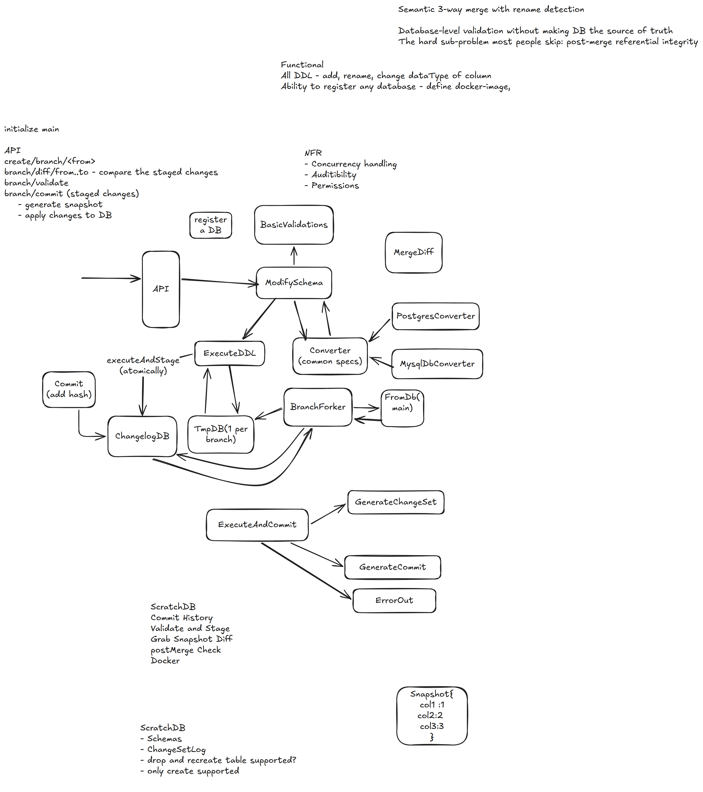

# Database Version Control (Zamp)

*Standalone whiteboard design. Not part of the HLD problem set — kept separately because there is no
matching problem in [`hld_problems (3).md`](<hld_problems (3).md>).*



<sub>Whiteboard source — [open in Excalidraw](https://excalidraw.com/#json=gDZaB82qUw0VxIaSXnd4t,cyECNJ4ugt4VwxDNF-8jrQ) · offline copy: [`diagrams/excalidraw/zamp-database-version-control.excalidraw`](diagrams/excalidraw/zamp-database-version-control.excalidraw)</sub>

## Requirements

**Functional**
- All DDL — add, rename, change dataType of a column.
- Ability to register any database — define docker-image.
- Initialise `main`.

**NFR**
- Concurrency handling
- Auditability
- Permissions

## API

```
create/branch/<from>
branch/diff/from..to      # compare the staged changes
branch/validate
branch/commit             # staged changes
    - generate snapshot
    - apply changes to DB
```

## Flow

1. **Register a DB** → **API** → **ModifySchema**.
2. **ModifySchema → BasicValidations** before anything is applied.
3. **ModifySchema ↔ Converter (common specs)** — dialect-specific converters plug in here:
   **PostgresConverter**, **MysqlDbConverter**.
4. **ModifySchema → ExecuteDDL → TmpDB (1 per branch)** — `executeAndStage` runs **atomically**.
5. **BranchForker** — forks **FromDb(main)** into a **TmpDB** per branch and records the fork in the
   **ChangelogDB**; **ChangelogDB → BranchForker** supplies the history to replay.
6. **Commit (add hash) → ChangelogDB** — commits are content-hashed.
7. **MergeDiff** sits on top of the branch pair for merges.
8. **ExecuteAndCommit** branches three ways: **GenerateChangeSet**, **GenerateCommit**, **ErrorOut**.
9. A commit stores a **Snapshot** of the schema, e.g. `{ col1: 1, col2: 2, col3: 3 }`.

## Hard sub-problems called out

- Semantic **3-way merge with rename detection**.
- Database-level validation **without making the DB the source of truth**.
- The one most people skip: **post-merge referential integrity**.

## ScratchDB notes

- ScratchDB holds: Schemas, ChangeSetLog.
- Commit history, validate-and-stage, grab snapshot diff, post-merge check, Docker.
- Open question: is drop-and-recreate table supported, or only create?
