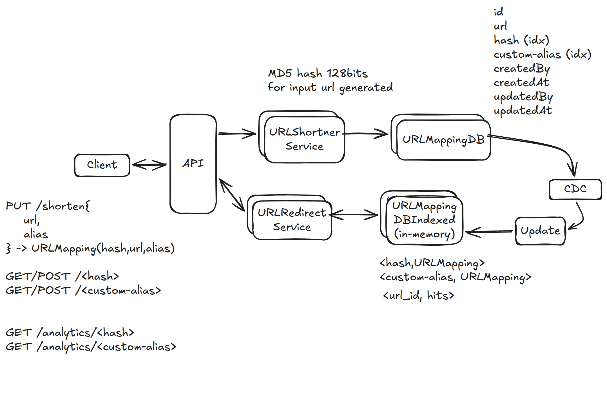

# 1. Bit.ly (URL Shortener) — 1h

[← HLD index](README.md) · [All docs](../README.md)

---

- Given a URL, shorten it. Optionally, custom alias. Also analytics, like hits for URLs.
- When user uses the short URL, redirect to the original one.
- Solve for main website
- Verification of website out of scope

## HLD Diagram



<sub>Whiteboard source — [open in Excalidraw](https://excalidraw.com/#json=WT2EFU3JY0P8enlgIToll,5QtCoQ75ZJedhQaDZu7rMg) · offline copy: [`bitly.excalidraw`](../diagrams/excalidraw/bitly.excalidraw)</sub>

## Functional requirements
1. Client requests for a URL to shorten; return shortened URL. Optionally custom-alias.
2. When any client hits the shortened URL, redirect to long URL.
3. For a URL, give analytics — # hits

## NFR
- Consistency in URL mappings. At a time, exactly one short URL mapped.
- Availability — uptime should be high, 5 9's
- Latency — minimal, sub-millisecond
- Durability — should not lose mappings
- Scalability — 10k/s reads, 100 writes
- Consistency for hits: tolerable

## Observation
Read heavy: 100:1

## Out of scope
Analytics

## API
```
PUT /shorten {
  url: <my-url>
} → hash + alias

PUT /shorten {
  url: <my-url>
  alias
} → error / result

GET/POST bit.ly/<hash> {
} → analytics

GET /analytics/<hash>
→ Analytic
```

## Entities
- URL
- ShortURL
- Analytics

## Deep dive Q&A
1. **Consistency in URL mappings? Uniqueness**
   - When user requests to shorten URL: PUT request (idempotent)
   - Check if hash/custom-alias exists → error out, or treat it as upsert

2. **How durability is ensured for URL mappings?**
   - Store in distributed + replicated + strongly consistent leader-based DB
   - Write to cache later (write-around)

3. **Latency** is < 1ms for redirection

4. **Scalability** — need to scale cache, index horizontally. LB + horizontal-scale service.
   - 1B rows, single Postgres with replicas is sufficient (1GB × 1KB)

## Summary
- Use MD5 hash (+ custom-alias) + PUT + DB to achieve uniqueness.
- Use cache for GET (fast redirects).
- For 1B URLs, single Postgres + replica sufficient.
- Use cache to track hits, write to analytics DB periodically — CDC + Flink.
