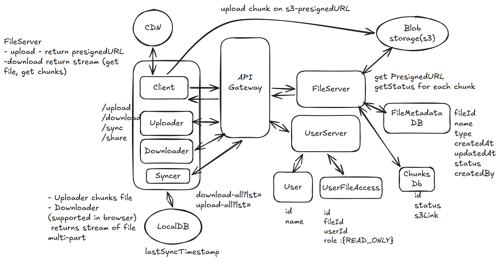
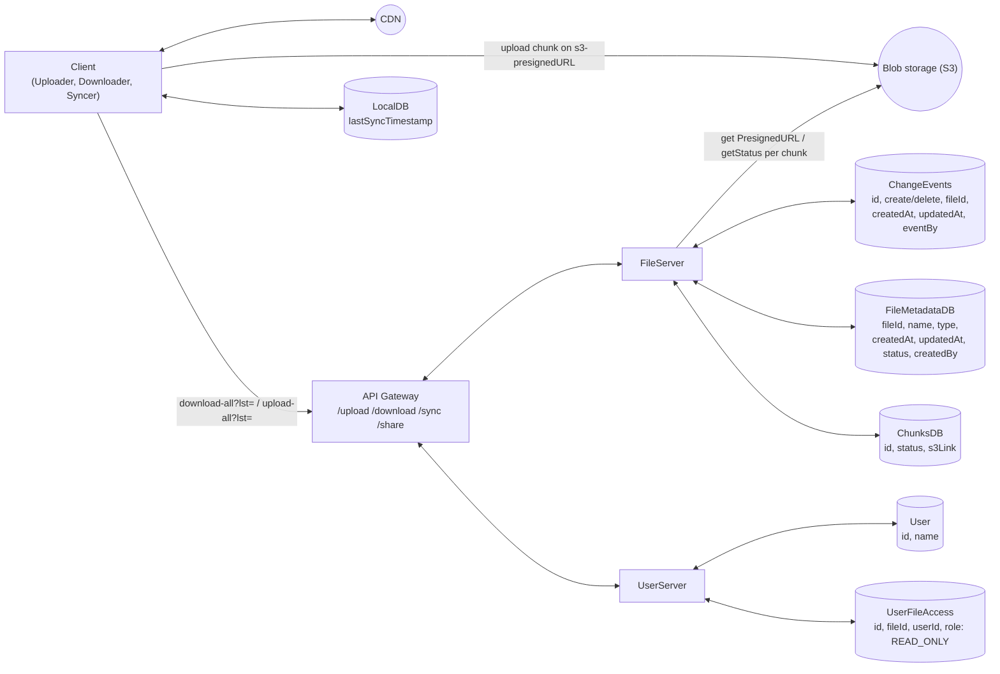

# 2. Dropbox — 8h(?)

[← HLD index](README.md) · [All docs](../README.md)

---

## Scoping
- Cloud-based service
- Store & share files
- Secure, reliable access to files across devices

- User can upload file
  - Max size?
  - Concurrent users?
  - Scale/load?
- CAP? Define: C — any kind of stale (during partition), A — obsolete
- Multiple users can download a file; access restriction to be modeled
- Key characteristics: latency + CAP + security + scale + concurrency

## Functional
- User can upload a file from any device
- User can download file from any device
- User can give access (view) to other users
- User can sync files

## NFR
- System should be highly available
- Secure
- Low latency
- Scale: 50 GB

## Out of scope
- UI
- Edit files
- Limits
- Pricing etc.

## HLD Diagram



<sub>Whiteboard source — [open in Excalidraw](https://excalidraw.com/#json=nID9gxJejWa3D-TxY3SaW,9D05b95SJD66wdE80jGenw) · offline copy: [`dropbox.excalidraw`](../diagrams/excalidraw/dropbox.excalidraw)</sub>

**Mermaid recreation of the same design:**



**Notes on FileServer:**
- `upload` → return presignedURL
- `download` → return stream (get file, get chunks)

**Notes on Client sub-components:**
- Uploader chunks the file
- Downloader (supported in browser) returns stream of file, multi-part

## Questions
1. S3 presigned possible?
2. S3 callback on complete (webhook) — reliable?
3. How to enable user access?
   - Maintain access table (indexed on file, indexed on user)
   - Support: (a) for a user, `getAllFiles`; (b) for a file, `getAllUsers`
   - More preferred: index on file
   - Why not store in metadata? — Difficult to perform `getAllFiles`.
4. How to automatically sync (Remote → Local)
   1. Keep a local DB which has `lastSync`
   2. Always pull before upload
   3. Keep a history of file change events

   `FileChangeEvent { CREATE, DELETE }` → File / FileMetadata / eventAt (indexed)

> ⭐ This is a product-like question. Go one by one through functional requirements.

## Core entities
- User
- File
- FileMetadata

## API
*Tip: File resource can be made RESTFUL*

```
- headers: user-token
POST /upload {
  File
  FileMeta
}

- headers: user-token
GET /download {
  fileId
} → File (Object downloaded)

/share {
  File
  users: []
}

/sync {
  lastSuccessfulUpdate
} → ChangeEvent[]
```

## Storage
1. FileMeta — Postgres (simple, reliable, fixed attributes, simple fast reads, low latency)
2. File — Blob storage (S3) → cheap

## Local → Remote sync
1. Have a watcher-agent installed. Call `/upload` API for any change.

## Deep dive
**1) How to support large file?**
- Chunking (S3 has inbuilt limit 10MB)
- Break the file via client utility
- Upload part-part to S3
- Collect the acknowledgements from FileChunks DB
- Return progress to user
- In case of n/w failures → **support resume**: return FileChunks object to client so that missing parts are re-uploaded.

**Complete Multipart Upload:** S3 reassembles the file and returns `completeMultipart` flag

**Download large file:** HTTP natively supports **Range requests**

**2) How to make upload/download faster?**
- Compression
- CDN (caching)
- Chunking (parallel upload/download)

**3) How to ensure file security**
- HTTPS (client-server encryption)
- S3 storage encryption
- ACL-based token access with expiry

## Summary
- Split File, FileMeta, FileChunks, Blob
- Chunking → resumable downloads, large file (both download/upload)
- Latency: CDN, compression, chunking
- Secured access control, e2e security
- Syncing across devices — change events
