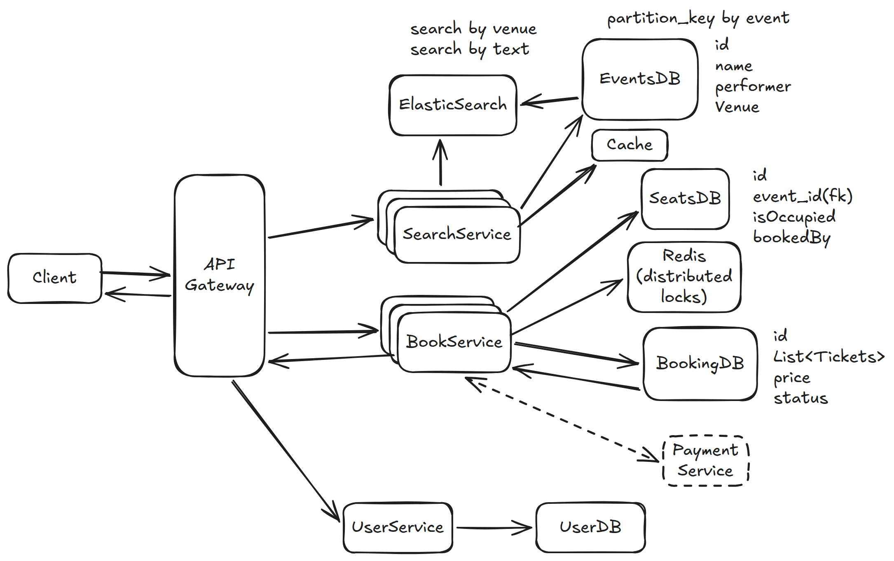
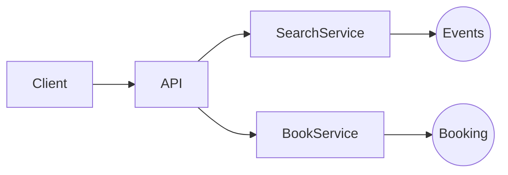

# 5. Design a TicketMaster — 8h

[← HLD index](README.md) · [All docs](../README.md)

---

- Purchase tickets: concerts, events, theatre
- Concurrency?
- Consistency > Availability?
- Latency
- User experience — HOLD?

- Book a ticket
- View booked ticket
- View all events (based on location/city) → `getAllEvents`
- Search for event → `getAllEvents`

## Functional requirements
1. Given selected event, book tickets
2. View all events (in a city)
3. Search for event (based on search string)

## Out of scope
- Payment flow
- Admin (add, update events)
- Dynamic pricing
- Security

## Non-functional requirements
1. Consistency: users should have at least write consistency, no double booking
2. Fast read/write latency (search/book < 50ms)
3. Support for concurrency
4. Can HOLD tickets for some time
5. Support scale (10M users)

## Observations
- Low contention
- Can have peak load — popular events
- Read heavy (100:1)

## Entities
- **User**
- **Event** (List\<Seat\>, sTime, eTime, name, location)
- **Book** (user, List\<Seats\>, event)
- **Booking/Order** { List\<Ticket\> ← price × discount, byUser, event, venue }
- **Ticket** { event, seat, (bearer) }

## API
```
Book tickets:
POST /events/:eventId {
  List<Seat>
  user
} → Ticket

GET /events/search {
  searchText
} → elastic

View:
GET /events/search {
  city
} → event[]

View Seats:
GET /events/:id
→ Seat[]
```

## HLD Diagram



<sub>Whiteboard source — [open in Excalidraw](https://excalidraw.com/#json=sDUW_qleuTdBh7rOnsknW,8Oviae-K2f89zgtfX8FXTA) · offline copy: [`ticketmaster.excalidraw`](../diagrams/excalidraw/ticketmaster.excalidraw)</sub>

**Mermaid recreation of the same design:**



## Deep dive
**1) How to ensure no double booking at this scale? + Fault tolerance**
- ACID distributed DB + Replica
- When payment successful, mark seats
- Generate/book tickets

**2) How to ensure quick search (text, location)**
- Elastic search — title, text, city
- Built on top of events
- Break events & seats

**3) How to handle popular event with scale — 10M concurrent requests?**
- Cache
- HOLD locks — to block duplicate requests for some seats
- Horizontal scale app + Load Balancer

**4) How to improve the booking experience by reserving tickets?**
- Distributed locking with TTL. Implement HOLD locks on event with expiry.

**5) Good experience with high demand seat booking?**
- Seat already booked as they repeatedly click
- Virtual queue to **control**/rate-limit access to popular events

**6) Ensure low-latency for search?**
- Elastic search — but venue

**7) Reduce search query compute — cache results**

## Summary
- Strong consistent distributed DB to avoid double booking
- Distributed HOLD locks for good UX
- Elastic search — text, venue
- Cache for popular reads
- CDN? for images of static content
