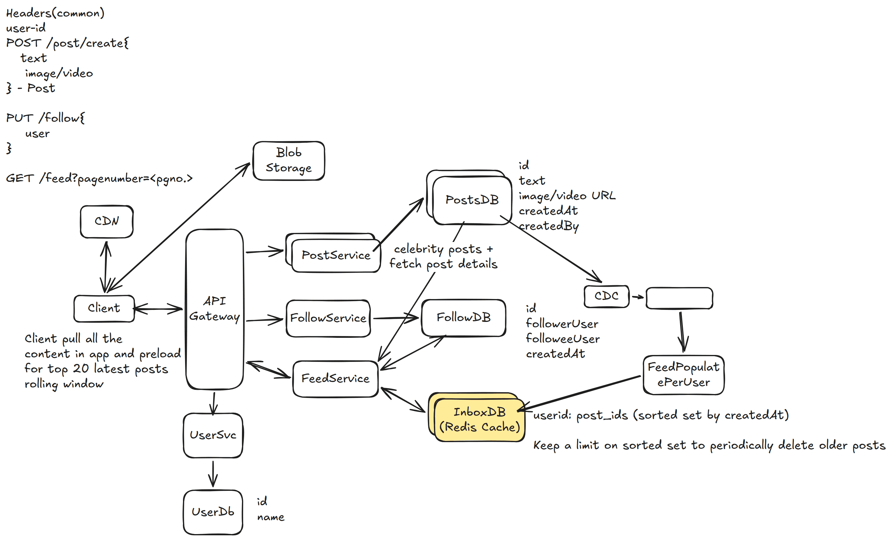

# 6. Instagram — 6h

[← HLD index](README.md) · [All docs](../README.md)

---

Social media, focused on visual content, allowing users to share photos & videos with followers.
- Share photos & videos
- Follow other content
- Show feed
- Fast load times
- Different quality support?
- Different devices, notify?
- Infinite scroll?
- Archival?
- Any specific order for scrolling?

## HLD Diagram



<sub>Whiteboard source — [open in Excalidraw](https://excalidraw.com/#json=zwT6qrMUDrkBnFJ845zD6,V8nuSYhIovpTSFJs16EGEA) · offline copy: [`instagram.excalidraw`](../diagrams/excalidraw/instagram.excalidraw)</sub>

## Functional requirements
1. User should be able to post
2. User should be able to follow other users
3. User gets feed for followed users (chronological, ascending)

## NFR
1. Latency of feed minimal < 50ms. Load/play video/images quickly.
2. Availability: uptime 5 9's
3. Scale:
4. History limit — 1 year? Irrelevant

## Out of scope
- Security
- Comments, likes

## Observations
- Celebrity problem

## API
```
POST /post/create {
  text
  image/video
} → Post
Header: user

PUT /follow {
  user
}
Header: user

GET /feed → Post[]
  ?page=
```

## Deep dive
**1) System should deliver content with low latency (< 500ms)**
- Fan-out write (inbox pattern)
- The feeds DB is a redis cache, which is reverse-chronologically sorted
- For celebrity — perform fan-out on read
- **Hybrid**: fan-out-write + fan-out-read
  - Shard by user_id, sort-key createdAt in Redis

**2) The system should render photos/videos instantly**
- S3 + CDN optimization + prefetch posts in the app
- Additional: quality support, compression, adaptive algorithms

**3) System should be scalable to 500M DAU**
- Distributed DB — Posts
- Feed service scaling
- Extract media to blob storage
- Indexing by user_id, post_id
