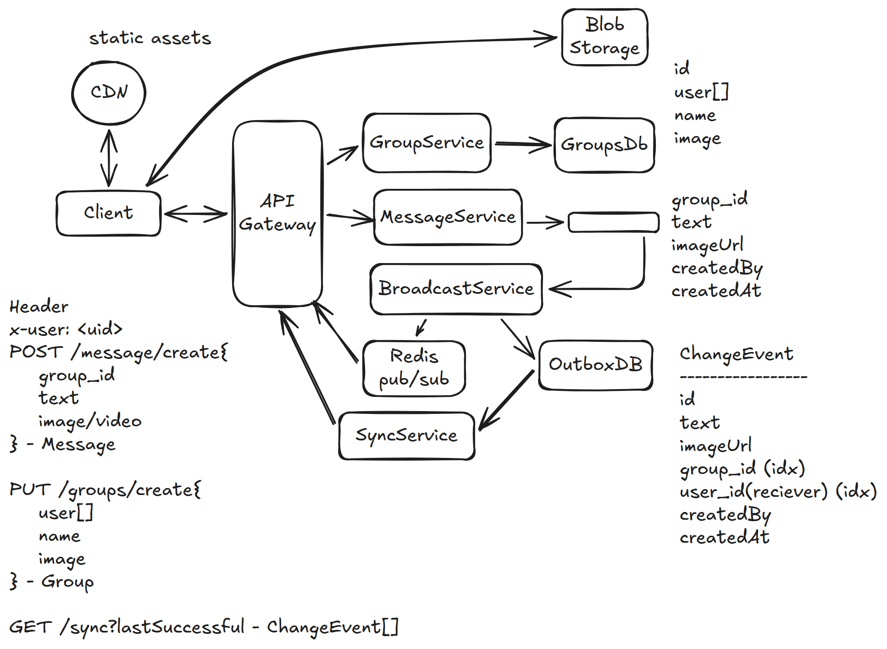

# 10. WhatsApp — 18h(?)

[← HLD index](README.md) · [All docs](../README.md)

---

- Send & receive messages & calls from phone/computer
- Users are able to send messages to group or single user. Notify them, view messages.
- Messages should be in order
- Should not be lost (Durability)
- Available system. Security, low latency
- Local DB storage? History view?
- Multiple devices

## HLD Diagram



<sub>Whiteboard source — [open in Excalidraw](https://excalidraw.com/#json=mW43XyI2CzMsUr971I347,_Mdoj88cQ9pAKldBgwxRrw) · offline copy: [`whatsapp.excalidraw`](../diagrams/excalidraw/whatsapp.excalidraw)</sub>

## Functional Requirements
1. User should be [able to] send/calls in group
2. User should be able to create groups
3. When user sends, notify to other users (if user offline, sync when online)
4. Support for media

## NFR
1. Durability — not hard. Only when user joins on phone storage. (Max 30 days)
2. Low latency < 500ms
3. Consistency — message should be in order
4. Scalability: 10k/sec writes, 100k reads. Limited by phone storage.

## Out of scope
- UI
- Storage-full warnings
- Security — E2E encryption

## API
```
i) X-Header: user_id
POST /message {
  group_id
  text
  image/video
} → success

ii) X-header: user_id
GET /sync?lastTimestamp
→ ChangeEvent[]

iii) X-header: group_id
PUT /groups/create {
  userId[]
  name
} → Group
```
*Treat 1:1 & group as same*

## Deep dive
**1) Handle billions of users simultaneously?**
- Outbox DB
- Simultaneously write to Redis Pub/Sub; subscribers by receiver user_id.
- Use websockets for real-time message consumption — **Redis pub/sub + websockets** (reduce latency)

**2) Partition by chat or user?**
- Normal case: multiple chats around 250, most of them 1:1, one of them 100 participants
- Partition by user: #users = channels
- Partition by chat: #users × 250 = channels

**3) What if multiple clients for a user?**
- User must register device
- Now the broadcast will happen for each user/device. Limit it to 3 maybe.

**4) What if websocket fails? What if Redis fails?**
- Client will periodically call `/sync`

**5) Handle out-of-order message?**
- We don't! We have to partition by group_id.

## Summary
- Use Outbox pattern, partitioned by user_id
- Use Redis pub/sub for optimization
- Separate GroupManagement, MessageService, BroadcastService
- No need to handle out-of-order
