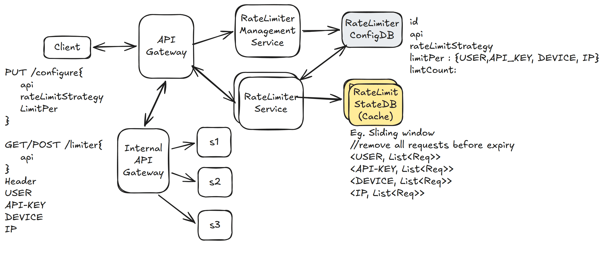

# 13. Rate Limiter — 12h(?)

[← HLD index](README.md) · [All docs](../README.md)

---

Controls request, 4xx — too many requests, or return response.
Eg. 100 requests/user in a minute.

- When user hits API — reject or return
- Return with tries remaining
- Highly available
- (Not hard) Consistent in terms of managing quota
- Latency low < 10ms
- Should we keep history?
- Security (o-o-s)

## HLD Diagram



<sub>Whiteboard source — [open in Excalidraw](https://excalidraw.com/#json=LtnIGz-XUrIoJxhaMSeEX,aEQ1_DinfWdXLBeogXYFUg) · offline copy: [`rate-limiter.excalidraw`](../diagrams/excalidraw/rate-limiter.excalidraw)</sub>

## Functional requirements
1. When client/device requests (API key) — either reject or accept, return response
2. Configure rate limiter for different APIs with different strategies
3. In response, return proper limit, quota, strategy, when can be retried

## NFR
1. Available all the time — 5 9's
2. Slight inconsistency tolerable
3. Latency < 10ms
4. Scale

## Out of scope
- Security
- Keeping rate limit history

## API
```
PUT /configure {
  api
  rateLimitStrategy
  limitPer
  limit
}

GET/POST /limiter {
  api
}
Header:
  user
  api-key
  device
  IP
```

## Deep dive
**1) How do we scale to handle 1M requests/second?**
- Distributed Redis `LADD` requests
- Consistent hashing + LB

**2) High availability**
- Redis + consistent hashing + async read replicas

**3) Minimize latency overhead**
- Connection pooling (network bottleneck)
- Redis
- Shard by geo-locality

**4) Hot-keys**
- Add clients to temp **blocklist**

**5) Dynamic rule config**
- Keep polling after some intervals

## Summary
1. Configurable rate limiters, separate management from action
2. Sliding window — keep requests with timestamps (delete on expiry)
3. Scale state writes on cache — network bottleneck → connection pooling; cache write + consistent hashing + async
4. Fault tolerance/availability — async replicas (can read from replicas depending on how hard consistency is)
