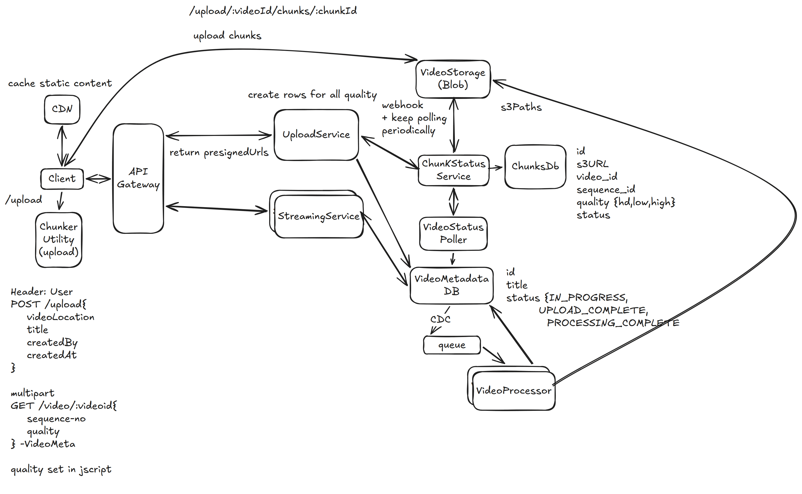

# 17. YouTube — 4h

[← HLD index](README.md) · [All docs](../README.md)

---

*(numbered "17" in the original notes — problems 15 & 16 are not present/labeled in the notebook)*

Video sharing platform that allows upload, view, and interact with video.

## HLD Diagram



<sub>Whiteboard source — [open in Excalidraw](https://excalidraw.com/#json=Qo6-izWdN-5OeVSdeHY6J,23jKl3dLnys9RH5998uP7Q) · offline copy: [`youtube.excalidraw`](../diagrams/excalidraw/youtube.excalidraw)</sub>

## Scoping
- Upload, stream videos
- Security
- Latency to load videos
- Scalability
- User auth security
- Durability
- Availability: the service should be up
- Freshness < 15 mins
- Thumbnails, comments, likes

## Functional Requirements
1. User can upload video
2. Multiple users can stream the video

## NFR
1. The video should load quickly < 500ms
2. No buffering
3. Service should be available 5 9's
4. Video stored is durable once uploaded
5. Consistency — eventual. Freshness < 15 mins
6. Multi quality support — low network environment
7. Resumable uploads

## Out of scope
- Thumbnails, comments, likes
- UI
- Security, user management
- Search, subscribe

## API
```
Header: user
POST /upload {
  videoLocation
  name
  title
} →

GET /video/:videoId
→ Video & VideoMeta
```

## Deep dive
**1) How can we handle processing video to support adaptive bitrate streaming?**
- Chunked downloads with different adaptive quality support
- An async job uploads video in different quality
- When user requests, different quality rendered based on n/w bitrate

**2) How to make resumable uploads?**
- When n/w drops & user reconnects, fetch from chunk-status service all uploaded & non-uploaded chunks
- Upload only the pending ones

**3) Scale to large # videos uploaded**
- Scale video processor service — can be a DAG: quality processing & compress
- S3 + CDN replication — n/w latency
- Scale streaming service, read-only

**Speeding uploads**
- Can also pipeline chunks with quality & compression processing

## Summary
- S3 + CDN as a storage for cost-effective and n/w latency optimized
- Upload + quality processing + compression
- Consistent hashing + web sockets for streaming
- Chunked upload — separate VideoMetaDB & Chunk DB
- Client-side chunking utility
- Client-side streaming script
