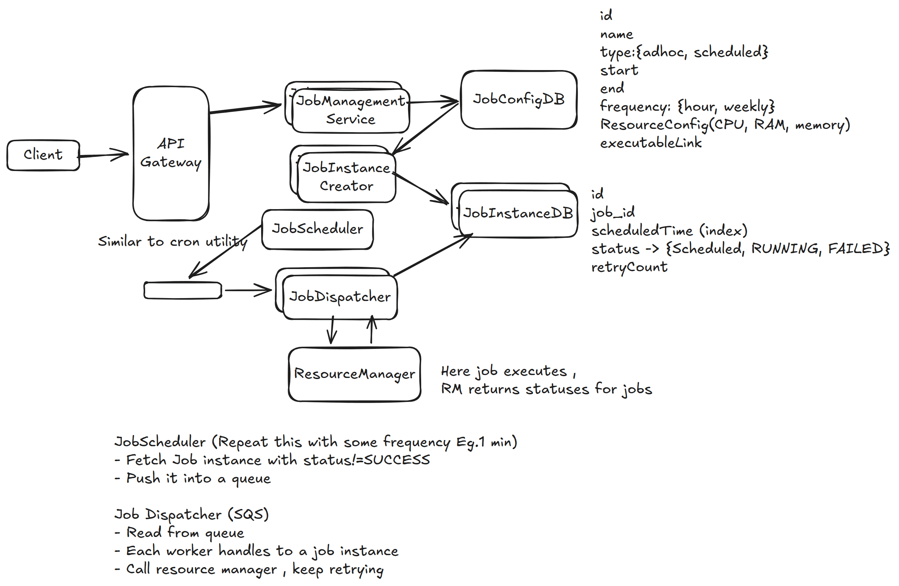
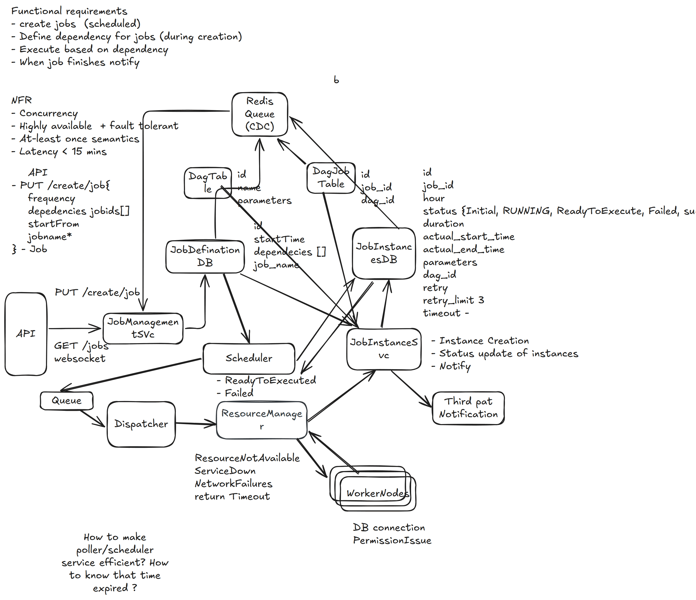

# 18. Job Scheduler — 14h(?)

[← HLD index](README.md) · [All docs](../README.md)

---

Job scheduler automatically schedules & executes jobs at specified times or intervals.

## HLD Diagram

The board holds two passes at this problem. First pass — scheduler + dispatcher + resource manager:



Second pass — DAG / dependency-aware version:



<sub>Whiteboard source (both passes on one board) — [open in Excalidraw](https://excalidraw.com/#json=PdkuLRHRkSKDPcxxzznI4,oZP6D_ZFfvofSiBbR0aLow) · offline copies: [`job-scheduler.excalidraw`](../diagrams/excalidraw/job-scheduler.excalidraw) (full board), [`job-scheduler-v1.excalidraw`](../diagrams/excalidraw/job-scheduler-v1.excalidraw), [`job-scheduler-dag.excalidraw`](../diagrams/excalidraw/job-scheduler-dag.excalidraw)</sub>

## Scoping / Considerations
- One-time, adhoc, scheduled
- NFR — lowest cadence?
- Where will the jobs execute — resource manager designed?
- Success/failure of the job; success/failure of resource manager
- List all active jobs?
- Retries

## NFR
- API latency
- Consistency (duplicate runs)

## Functional requirements
1. User registers scheduled/adhoc job (assume simple executable)
2. When triggered, resources allocated to job. Job is executed, success/failure returned. Retry?
3. Log → job scheduling statuses; job statuses
4. Monitor jobs

## Non-functional requirements
1. Latency < 50ms to schedule, trigger job
2. Job should start < 1min from schedule/trigger time
3. Consistency — no duplicate runs; should run as scheduled (exactly once)
4. Retries: if job instance fails
5. Scale: how many jobs run concurrently? 10k/second

→ Availability is preferred — **at-least-once**

## Entities
- Job
- JobInstance
- ResourceManager

## API
```
POST /create {
  name
  type
  start
  end, frequency
  resourceConfig
  executableLocation
} → JobConfig
```

## Deep dive
**1) How to ensure system executes jobs within 2s of scheduled time?**
- Create JobInstances from JobConfig
- Keep a thread pool
- JobDispatcher manages this thread pool
- Fetch all instances with status != SUCCESS
- Assign one thread to each job:
  - (a) This thread monitors the status for each job, retries if needed
  - (b) Calls RM (Resource Manager) to assign resources
  - (c) Collects statuses & updates DB
- Repeat

To scale more, put a queue where JobInstances are pushed (based on ascending execution time). Consumer — SQS.

**2) How to ensure scalable 10k jobs/s**
- Same as above
- Use queue for durability
- Scale job creation service + DB
- Queue for `/create`, maybe overkill. LB + horizontal scale job management.

**3) Ensure at-least-once execution?**
- The scheduler fetches all unprocessed jobs within limit
- SQS retries & updates DB

**Failures:**
- (a) **Visible failures**: job exits with error code, SQS retries
- (b) **Invisible failures**: SQS worker consumes & fails. **Timeout**: SQS makes message automatically visible after timeout (if no explicit delete called)

**Prerequisite:** At-least-once execution means job should be **idempotent**.

## Summary
Clear separation of:
- JobConfig — when & what type of job
- JobInstance — create instances based on scheduled time
- JobScheduler — get due jobs & put in queue
- JobDispatcher — actually run job

- Scale services & DB
- Idempotent at-least-once execution
