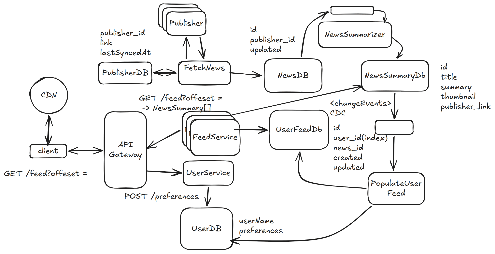

# 20. News Aggregator — 6h

[← HLD index](README.md) · [All docs](../README.md)

---

Google News — aggregates & displays news articles from 1000's of publishers, scrollable interface.

## HLD Diagram



<sub>Whiteboard source — [open in Excalidraw](https://excalidraw.com/#json=_kd9RWnO2ZgV-1CEqx2oK,MLSlyH1OCZi4X_yayQA5Cw) · offline copy: [`news-aggregator.excalidraw`](../diagrams/excalidraw/news-aggregator.excalidraw)</sub>

## Scoping
- Scrape 1000's publishers
- Fetch for latest
- Process articles: title, summarize, tag with categories
- For user, which is served — display top 100 based on preferences

## NFR
- Latency
- Consistency (freshness)
- Availability

## Functional requirements
1. Scrape publisher sites — fetch, process, store latest news: title, category, summary, link
2. User configures preferences
3. User gets top N news → scroll, next top N
4. User clicks on article — redirected to publisher website

## Non-functional requirements
1. Latency, reasonably fast (< 1s) top 100
2. Availability: high — user should get feed whenever requested
3. Consistency — stale publish tolerable (within few minutes)
4. Scale & concurrency: 100M DAU, spike: 500M

## Observation
- Read-heavy
- Popular posts (celebrity)

## Entities
- User
- Publisher
- FeedSummary
- UserPreference

## API
```
Header: X-Header: User
GET /feed?offset

Header: User
POST /preferences
```

## Deep dive
**1) How to ensure news feed gets generated quickly < 1s**
- Index UserFeed DB on user_id
- The feed is pre-generated
- CDN + cache

**2) How to make sure news is fresh (few minutes)**
- Implement poller, for each publisher (lastSync)
- Fetch news, put it in the queue & summarize
- Keep user feed ready
- Publisher webhook? (not sustainable)

**3) How to support scale**
- (a) Geographically partitioned. Partition key = location + user_id. UserDB — Cassandra
- (b) CDN for NewsSummaryDB

**4) How to handle popular news?**
- Cache NewsSummaryDB
- Regional feed

**5) System support peak load**
- (a) Scale reads: news GET (Cassandra); NewsSummary cache; horizontally scale, LB, autoscale (multiple read replicas)
- (b) Scale writes: increase queue consumers

**6) Improve pagination consistency & efficiency?**
Problem: duplicate articles in feed
- Server maintains a cursor-timestamp
- Client needs to send this for every request

**7) Store media content efficiently**
- S3 + CDN cache

## Summary
1. Separate news summarizer flow
2. Populate feed for every user in a DB
3. (a) Scale reads: read replica, cache, DB choice, precompute feed; CDN (images), App (horizontal), DB (horizontal), index uid in feed
   (b) Popular post — cache + CDN (regional)
4. Scale writes: DB choice, App (horizontal)
5. Freshness: stream E2E + CDC + RSS webhook/polling
6. Latency: CDN, Redis cache
7. Pagination trick: keep cursor-timestamp/user
