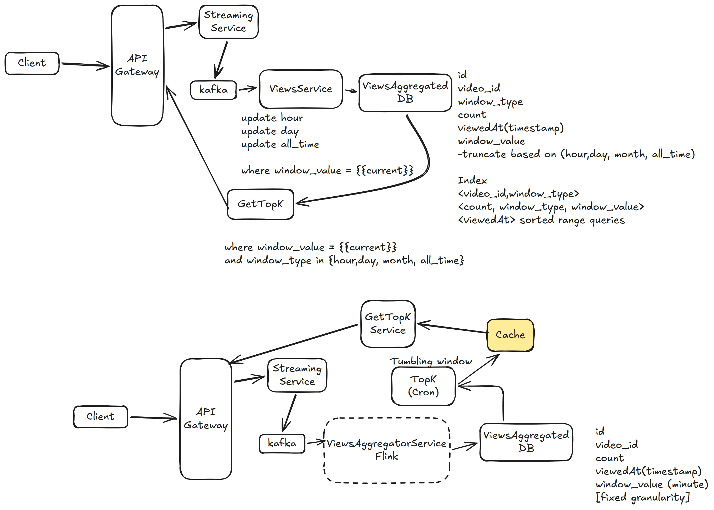

# 22. YouTube Top K — 9h

[← HLD index](README.md) · [All docs](../README.md)

---

Top-K system for YouTube video views.
- Precisely top-K most viewed videos from 1 hour, 1 day, 1 month
- Highly consistent
- Lag is tolerable?
- Durability — all time
- Scale?

## HLD Diagram



<sub>Whiteboard source — [open in Excalidraw](https://excalidraw.com/#json=qFpXLkEEF_co8vwYTo3_E,PR7nZg2bYd-QARXv3oaiVw) · offline copy: [`youtube-top-k.excalidraw`](../diagrams/excalidraw/youtube-top-k.excalidraw)</sub>

## Functional requirements
1. Given a window {hour, day} — return top K videos; all time.
2. Tumbling window: last 1 hour, 1 day, 1 month, all time
   - ⭐ No arbitrary time periods

## NFR
1. The views should be exact — consistency
2. Queryable for all time — durable
3. Latency < 10ms. Result set < 1k
4. Scale — massive
5. Freshness — 1 minute

## API
```
GET /views/top-k?window=HOUR&k=<K>
→ Videos[]
```

## Deep dive
**1) How can we cut down # queries to DB?**
- GET bottleneck, query for every GET request
- Precompute Top-K for each time window. Periodically refresh this (per minute).

**2) Handle massive number of writes?**
Writes: 700k ops/sec — massive.
- Sharding ingestion — partition by video_id
- Microbatch for 1hr (works well for tumbling window)
- Use **Flink**! Exactly designed for this. Define frequency of writes.
- This controls writes. Partition by video_id & process.

**3) How do we optimize Top-K queries?**
- Disallow random windows
- Compute from pre-aggregated & sort (hours)

**4) How to support sliding windows**
- Flink job at **minute** grain
- Write to sink (DB) at minute grain; update hour, day, all-time accordingly

Specialized DB: Pinot, Druid, Clickhouse (avoid if possible)

## Summary
1. Need to reduce write to DB a lot — use Flink at minute granularity
2. Need to reduce read (Top-K) — introduce a cache with all granularity

*(Note: Flink aggregates at lowest, minute granularity)*
