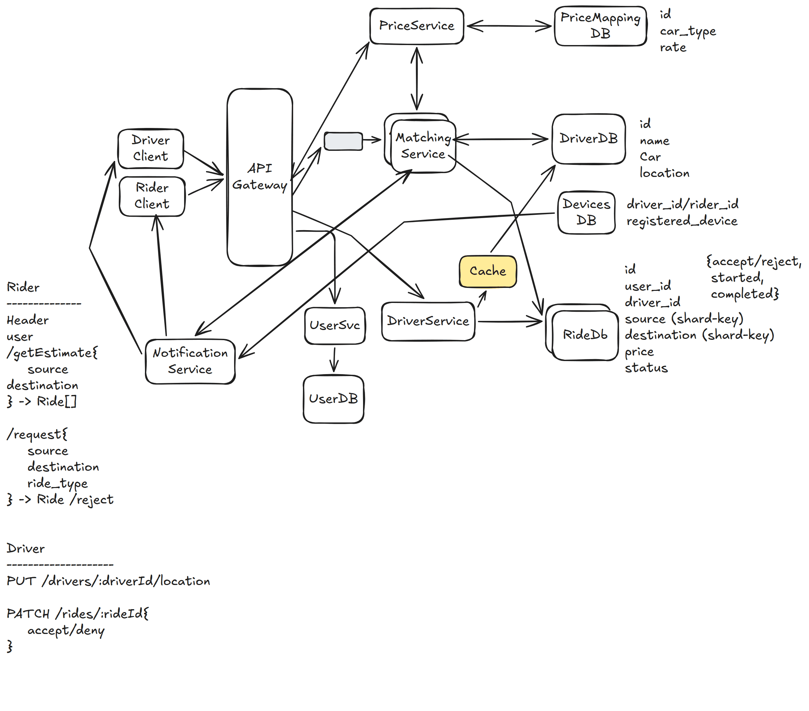

# 23. Uber — 4h

[← HLD index](README.md) · [All docs](../README.md)

---

- Ride sharing platform
- Book rides on-demand. Match them with nearby drivers.

## HLD Diagram



<sub>Whiteboard source — [open in Excalidraw](https://excalidraw.com/#json=WMC8ktijaBd36WtqVmDF7,zogX5KbAdt46Mn-5JKDwbw) · offline copy: [`uber.excalidraw`](../diagrams/excalidraw/uber.excalidraw)</sub>

## Scoping
- Phones by driver & rider: single phone?
- Track route?
- Request & match based on GPS
- User management & security
- Different states, different cars — automated matching?
- User checks ride — source, destination
- Options, selects a car type
- User requests ride with a car type
- Multiple riders notified
- Rider accepts ride. Ride started.
- Ride completed.
- Scope down to matching

## Functional requirements
1. Riders input source, dest — get fare estimate
2. Riders should be able to request ride
3. Rider matched to nearest & available [driver]
4. Drivers accept/decline a request
5. Track car

## NFR
1. Low latency < 1min match
2. No double booking — consistent
3. Support scale for concurrent users. Celebrity problem: high requests from same location (100k)

## API
```
Rider:
Header: user
POST /getEstimate {
  source
  destination
} → Ride[]

Header: user
POST /request {
  source
  destination
  ride-type
} → Ride/reject

Driver:
POST /drivers/location { }
PATCH /rides/:rideId {
  accept/deny
}
```

## Deep dive
**1) How to handle frequent driver update location**
High-frequency writes.
- Write-back cache
- Periodically update DB for durability
- Rider reads cache
- In-memory geospatial data (Redis)

**2) How can ensure location accuracy?**
- Read from cache
- Adaptive location update intervals on client side, based on speed, direction

**3) How to prevent double booking?**
- Use transactional ACID-compliant distributed DB
- Concurrency management

**4) How to prevent multiple ride requests from being sent to same driver?**
- Ideally, should be allowed
- Redis with TTL

**5) Ensure no ride requests dropped**
- Introduce a queue to matching service with dynamic horizontal scaling

**6) What happens if a driver fails to respond in timely manner**
- Durable execution — **Temporal**

**7) Further scale & reduce latency, & improve throughput**
- Geosharding DB to reduce latency + consistent hashing for fault tolerance

## Summary
- Lot of things with user actions should be scoped down
- Notification service — driver/rider
- Workflows (Temporal) — for user actions
- Redis cache — optimize location updates
- ACID compliant DB to handle double booking
- Geosharding for latency
- Queue with dynamic scaling — peak requests
- Handle duplicate requests to rider — Redis + TTL
