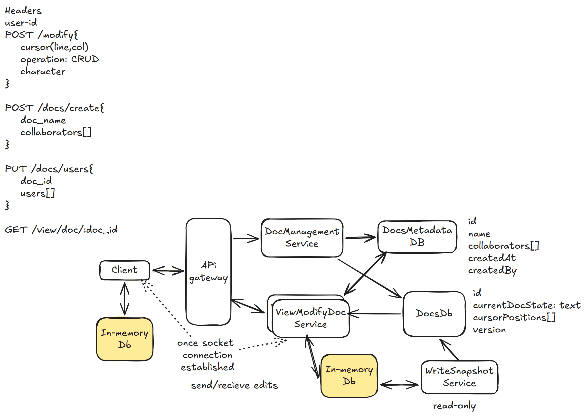

# 25. Google Docs — 5h

[← HLD index](README.md) · [All docs](../README.md)

---

Document editor. Collaborate with others in real-time.
- Conflict should be resolved
- Online utility?
- Only text?
- Security?
- Low latency
- Doc management?
- Read/write management

## HLD Diagram



<sub>Whiteboard source — [open in Excalidraw](https://excalidraw.com/#json=Ws1HV9V--frtwYbR5sGAs,HoZwm6nrUfLbWnx2e42R_g) · offline copy: [`google-docs.excalidraw`](../diagrams/excalidraw/google-docs.excalidraw)</sub>

## Functional requirements
1. Create a new doc
2. Add users with permissions
3. Make text changes to the doc — autosave
4. User should be able to view other cursor positions

## NFR
1. Highly consistent collaboration and conflict resolution
2. Latency — instant < 50ms (near real-time)
3. Available — service should not go down
4. Scalability
5. Durability — save docs

## Out of scope
- Security, heavy user management
- Document history

## API's
```
Headers: user
POST /modify {
  cursor (line, col)
  op: create/update/delete
  char
  readVersion
  doc-id
} → DOC

POST /docs/create {
  name
  collaborators[]
}

PUT /docs/users {
  docId
  users[]
}
```

## Deep dive
**1) How to ensure latency is minimal?**
- Bring doc into cache
- Modify doc in-memory
- Write snapshot periodically
- Use websockets. Use consistent hashing for distribution.

**2) How to ensure concurrent writes?**
- MVCC + optimistic locking
- User reads
- Modifies
- Before applying, service checks if conflict-free. If so, apply changes; else reject.
- Apply changes

OR CRDT, OT (operational transforms) — adaptive transforms on edits

**3) How to keep storage under control?**
- Write snapshots

## Summary
1. Minimal latency — CRDT + OT (or MVCC + OCC) + in-memory client + in-memory service + websockets
2. Separate Docs Metadata & Doc Service
3. Scale: consistent hashing on websockets
4. Snapshotting for durability
