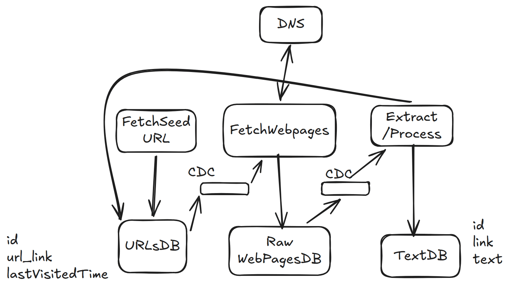

# 26. Web Crawler — 5h

[← HLD index](README.md) · [All docs](../README.md)

---

Traverse web pages, index web pages which will be used by search engines.
- Seed URLs, traverse, duplicate webpages
- Page rank?
- Freshness, elastic search used?

## HLD Diagram

Whiteboard source — [open in Excalidraw](https://excalidraw.com/#json=Bxy9fIfz8fu-Q8bbOLRUp,qrRvXHX9enCFHnNmkmAI-A) · offline copy: [`web-crawler.excalidraw`](../diagrams/excalidraw/web-crawler.excalidraw)

## Functional requirements
1. Start with seedURL and traverse webpages
2. Extract text data from each web page & store the text for later processing

## NFR
1. Freshness — few hours
2. Fault tolerance — handle failures & resume
3. Scale
4. Efficient to crawl in 5 days

## Out of scope
- Security, rate limiting

## Steps
1. Get seed URLs
2. Fetch webpages for seed URL
3. Extract: (a) text (b) URLs
4. Store text
5. Repeat from (ii)

## Deep dive
**1) How to ensure fault tolerant & don't lose progress?**
- Separate services
- Use CDC + queues + SQS
- Maintain last visited time

For each process, keep a retry limit.
- (a) What if we fail to fetch URL? — SQS with retries, if still fails put in DLQ
- (b) What if fetcher goes down? — still requests are there in queue

**2) How can we ensure politeness (robots.txt)?**
- Fetch robots.txt
- Keep a state for some domain
- Rate limit (some domain)

**3) How to scale to 10B pages < 5 days**
- Deduplicate URL
- Deduplicate content by hashing
- Horizontal scale
- Max depth for crawler for a website

## Summary
1. Separate SeedURL, WebpageFetcher, Extraction
2. Maintain CDC queues in between + SQS
3. Rate limit for politeness
4. Horizontal scale, deduplicate URL + content

DNS optimizations (caching)
