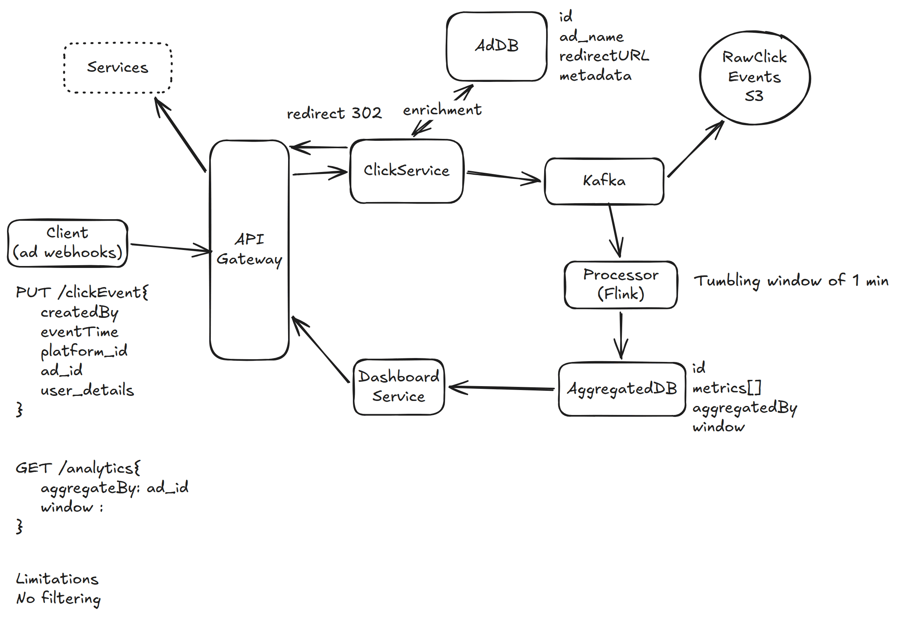

# 27. Ad Click Aggregator — 3h

[← HLD index](README.md) · [All docs](../README.md)

---

Collects & aggregates data on ad clicks. Advertisers track ad performance. E.g. ads on Facebook. (Flink?)

## HLD Diagram



<sub>Whiteboard source — [open in Excalidraw](https://excalidraw.com/#json=AuugT7GZ615GJ1icbeexX,B0nJOzIy3U1s--pLHiU3DA) · offline copy: [`ad-click-aggregator.excalidraw`](../diagrams/excalidraw/ad-click-aggregator.excalidraw)</sub>

## Functional requirements
1. When user clicks on ad, capture all telemetry info as part of the event
2. Advertisers can query ad click metrics over time window

## NFR
1. Minimum granularity is 1 min
2. Scale
3. Eventual consistency. Freshness of < 15 mins
4. Fault tolerant — no event should be missed
5. Idempotent click tracking
6. Query latency ≈ sub-second

## API
```
PUT /click {
  ClickDetails
}

GET /analytics {
  aggBy: campaign
  window: <start, end>
}
```

## Deep dive
**1) How can we scale to support 10k clicks per second?**
- Kafka + partitions + Flink horizontally scalable
- Limit writes to 1min on all dimensions

**Hot shards:** partition-key(ad_id) + salt(0-N)

**2) How do we ensure we don't lose clicks?**
- Durable replicated Kafka
- Aggregation window of 1 min
- Durable replicated DB (aggregated)

⭐ Because of bad node, events can be lost.
- Archive events periodically to S3 + Kafka window period = guarantee

**3) How to enforce idempotency of event?**
E.g. user clicks multiple times, same event.
- Based on user_id + duplicate window in Flink
- If not user_id, (device_id, IP etc)

**4) How to ensure advertisers can query fast?**
- Pre-aggregated OLAP tables

## Summary
1. ClickService — push clicks to queue, redirect
2. Pre-aggregated analytics table
3. Ads DB to store all info + redirect URL
4. Idempotency (user_id/IP) + duplicity window
5. Store all clicks in S3 to avoid loss
