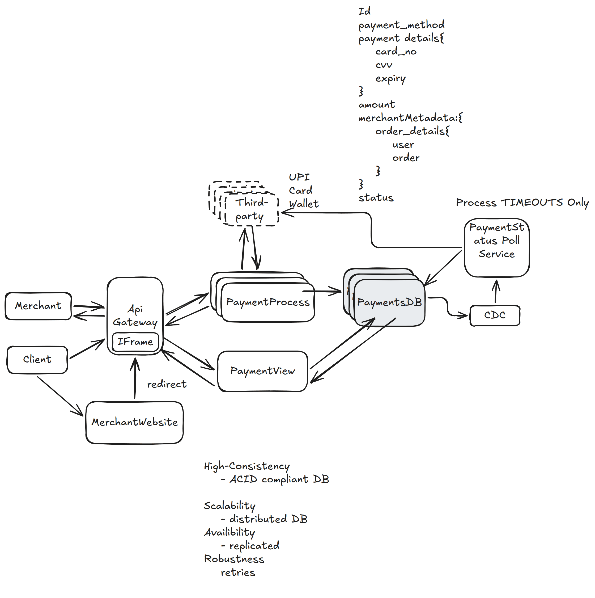

# 29. Payment System — 1h

[← HLD index](README.md) · [All docs](../README.md)

---

## HLD Diagram



<sub>Whiteboard source — [open in Excalidraw](https://excalidraw.com/#json=mV_Y1DRdYdFUZ9r771chc,YIpzvyvTsYzkUPKbh5um6Q) · offline copy: [`payment-system.excalidraw`](../diagrams/excalidraw/payment-system.excalidraw)</sub>

## Goals
1. Merchants: single Stripe API
2. Operational complexity hidden — refund, chargeback (customer init), tax, Stripe fees etc.

Payment processing like Stripe.
- Businesses accept payments from merchants
- Customer → payment details, on merchant website → Stripe

## Scoping / Considerations
- Business registered on Stripe
- Business has OMS → redirected [to] Stripe's payment page
- Support different payment methods (cards)

**On submit:**
```
card {
  - request to Issuer Bank
  - request to Depositor Bank
} → success/failure
```

- Stripe notifies the business of successful payment

## Functional requirements
1. Merchants initiate payment requests
2. Users pay with different payment methods
3. Merchants view status for a payment

## Non-functional requirements
1. High consistency: no double transaction, no inconsistent payment
2. High availability: 99.99999% uptime, but consistency > availability
3. Robustness: attempt payment retry
4. Latency < 1s payment completion
5. Security: E2E encrypted, storage encrypted, UI encrypted (hide)
6. Durability & auditability: no transaction loss, dropped
7. Scalable: 10k+ TPS

**CAP, ACID, recovery, robustness**

## Deep dive
*(Legend: Client = C, PG = Payment Gateway, public key = PU, private key = PR)*

**1) The system should be highly secure**
1. Merchant displays payment page. The UI page has iframe, JavaScript SDK.
2. Encrypt payment details using PU_pg
3. The client & server share a symmetric key K_cs. The payload is encrypted via SSL. (Don't [store] payment details on PG.)
4. PG forwards data to external payment network (decrypt by K_cs), encrypt by K_pgc (SSL)

**2) The system should guarantee durability & auditability**
- Online DB handles read/writes to transactions
- CDC — WAL or oplog capture every committed change
- Immutable event stream: CDC publishes to Kafka
- Different subscribers listen to this (can recreate whole world)

Can CDC fail? — Can be recovered from WAL or OPLOG (replica set)

**3) External payment networks async. How to guarantee correctness/integrity?**

**Approach 1:**
- Keep a PENDING state
- Background job keeps on polling payment network for success
- + Idempotency key on payment_id (when user retries, return same record)

**Problem:**
- When lot of payments stuck in PENDING
- Database has to serve read load for these

**Approach 2:**
1. Record the attempt — 'PENDING' in DB
2. Call the payment n/w with timeout
3. If success, mark [success]
4. If timeout, push this into CDC queue for recon call. Keep polling till response.
5. If failed, mark failed

**4) How to handle scale**
- Services + Kafka + DB

## Summary
1. Consistency: strong consistent DB, ACID
2. Security: iframe + SSL
3. Robustness + Async 3rd-party payment n/w:
   - Async payment-status check based on payment n/w timeout, CDC
   - Have PENDING status
4. Availability: replica in DB
5. Recovery: immutable event log in Kafka
