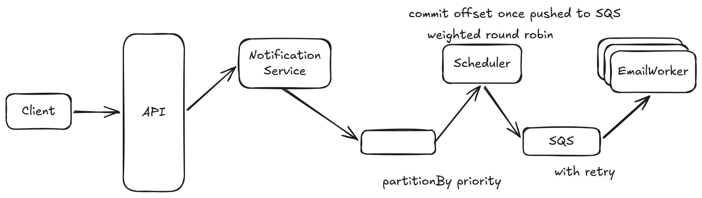

# 33. Notification System — 11h

[← HLD index](README.md) · [All docs](../README.md)

---

## HLD Diagram



<sub>Whiteboard source — [open in Excalidraw](https://excalidraw.com/#json=GH-RfT38opkc2eLY6iRuz,41CwgV6vRifRhK3qKmlWcA) · offline copy: [`notification-system.excalidraw`](../diagrams/excalidraw/notification-system.excalidraw)</sub>

## Functional
- Send email notifications
- Priority 1-10
- Retry failures
- At-least-once delivery

## NFR
- High throughput
- High available
- No email loss
- Fair scheduling
- Retry
- Horizontal scaling

## API
```
POST /notification {
  userId
  email
  template
  priority
}
```

→ Notification service → Kafka → Scheduler → SQS → Email Workers

Kafka: 1-10 partitions based on priority

## Deep dive
**1) Why not 1 topic with priority field?**
- Cannot efficiently "skip" low priority message

**2) Low-priority — delayed but no starvation**

**3) At-least-once guarantee** — delete message from SQS only after sent
