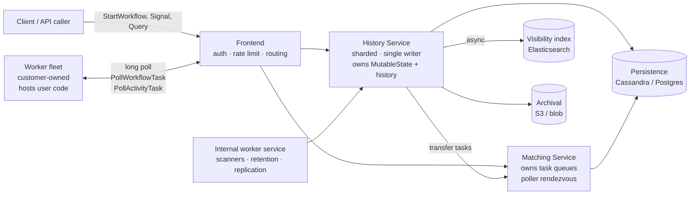

# 36. Durable Execution Engine (Temporal-style)

[← HLD index](README.md) · [All docs](../README.md)

---

*(added, not from the notebook)*

An ordinary service loses its call stack the moment the process dies. Everything the
function knew — which step it was on, what the third API returned, that it was 40 minutes
into a 2-hour wait — was in RAM, and RAM is gone. So engineers rebuild that state by hand:
a `status` column, a cron that re-reads it, a `retry_count`, a dead-letter table, and a
dozen `if status == 'PAYMENT_DONE'` branches that are really a hand-rolled interpreter for
a program the language could have run for them.

**Durable execution inverts that.** The call stack itself becomes a persisted, replayable
object. You write ordinary sequential code — `charge(); sleep(3 * day); if approved {…}` —
and the engine guarantees the function *completes*, across process crashes, deploys,
machine loss and multi-month waits, without the author writing a single line of
persistence code.

The whole design is one question: **how do you make an arbitrary program survive process
death, without the program's author checkpointing anything?**

- [What durable execution actually means](#what-durable-execution-actually-means)
- [Requirements](#requirements)
- [Core model](#core-model)
- [Event history — the heart of it](#event-history--the-heart-of-it)
- [Replay](#replay)
- [Architecture](#architecture)
- [Sharding and the single-writer trick](#sharding-and-the-single-writer-trick)
- [Request flows](#request-flows)
- [Scale and capacity](#scale-and-capacity)
- [Advantages](#advantages)
- [Pitfalls](#pitfalls) ← *the part interviews actually probe*
- [When not to use it](#when-not-to-use-it)
- [Build vs buy](#build-vs-buy)
- [Where it fits — four systems, four verdicts](#where-it-fits--four-systems-four-verdicts) — [OMS](#a-order-management-system--partial-fit) · [payments](#b-payment-system--yes-but-not-the-ledger-and-not-the-hot-path) · [agentic](#c-agentic-systems--the-strongest-fit-and-the-sharpest-edges) · [reconciliation](#d-reconciliation-and-data-heavy-jobs--wrap-it-dont-run-it)
- [What actually fails candidates](#what-actually-fails-candidates)
- [Runnable example](#runnable-example)

## What durable execution actually means

One invariant carries the entire system:

> **Workflow code is deterministic. Every non-deterministic effect goes through the engine
> and is recorded. Recovery is replay.**

Split the world in two:

| | **Workflow code** | **Activity code** |
|---|---|---|
| What it is | The orchestration — the sequence, branches, waits | The actual side effects — HTTP calls, DB writes, LLM calls |
| Runs | Many times (replayed on every recovery) | Once per scheduling attempt, at-least-once overall |
| Allowed to | Compute, branch, loop, call engine APIs | Anything |
| Forbidden | `time.Now()`, `rand`, `uuid`, network I/O, disk, unordered map iteration, raw threads | nothing |
| Persisted as | An **event history** of the commands it issued and the results it received | An input/output pair inside that history |

Because the workflow function is deterministic and every input it ever observed is
recorded, re-running it from the top against the recorded history reconstructs its exact
in-memory state — local variables, position in the loop, which branch it took. The stack
is rebuilt by re-execution rather than by serialisation. That is the whole trick.

## Requirements

**i) Functional**

- (a) Register **workflow types** and **activity types**; start an execution by type + input
- (b) Schedule activities with per-activity **timeouts** and a **retry policy**
- (c) **Durable timers** — sleep for seconds or for six months
- (d) **Signals** — deliver an external event into a running execution (approval granted, order cancelled)
- (e) **Queries** — read a running execution's state without mutating it
- (f) **Cancellation** (cooperative, runs compensation) and **termination** (hard kill, no compensation)
- (g) **Child workflows** and **continue-as-new**
- (h) **Versioning** — change workflow code while executions are mid-flight
- (i) **Visibility** — list and search executions by type, status, custom attributes
- (j) Full **history export** for audit and offline replay

**ii) NFR**

- (a) **Durability** — once `StartWorkflowExecution` returns, the execution is never lost
- (b) **Exactly-once *state transitions*** in the engine; **at-least-once** activity execution (see [pitfall 4](#4-at-least-once-activities-always))
- (c) Millions of **concurrently open** executions, the vast majority idle
- (d) Task dispatch p99 < 100 ms when a poller is waiting
- (e) **Multi-tenant** isolation — namespace-level quotas, no cross-tenant blast radius
- (f) A history written today must be **replayable years later**
- (g) The engine never links or executes user code

**Out of scope** — the workers themselves (customer-owned), the user's language SDK
internals, and the business logic. Say this out loud; the boundary is the design.

## Core model

| Entity | Key | Notes |
|---|---|---|
| `Namespace` | name | tenant boundary; retention, quotas, and auth attach here |
| `WorkflowExecution` | `(namespace, workflow_id, run_id)` | `workflow_id` is caller-supplied and **is the dedup key**; `run_id` is a new UUID per attempt/continue-as-new |
| `MutableState` | `(shard, run_id)` | the live cursor: current state, pending activities, pending timers, next event id, sticky worker |
| `HistoryEvent` | `(run_id, event_id)` | append-only, monotonic, immutable |
| `TaskQueue` | `(namespace, name, type)` | `type ∈ {workflow, activity}` — a *rendezvous point*, not a stored queue |
| `TransferTask` / `TimerTask` | `(shard, task_id)` | the engine's internal outbox rows |
| `Worker` | — | **customer process** that long-polls task queues and hosts user code |

The architectural inversion worth stating explicitly in an interview: **workers poll; the
engine never calls user code.** That single choice buys polyglot SDKs, lets workers sit
behind a customer firewall with no inbound ports, keeps user dependencies out of the
engine, and makes backpressure natural — if no worker polls, tasks simply queue.

## Event history — the heart of it

Every execution is an append-only log. A representative history for
"charge card, wait for approval, ship":

| `event_id` | Event | Payload |
|---:|---|---|
| 1 | `WorkflowExecutionStarted` | input, task queue, timeouts, retry policy |
| 2 | `WorkflowTaskScheduled` | |
| 3 | `WorkflowTaskStarted` | worker identity |
| 4 | `WorkflowTaskCompleted` | commands: `ScheduleActivity(chargeCard)` |
| 5 | `ActivityTaskScheduled` | activity type, input, timeouts |
| 6 | `ActivityTaskStarted` | attempt 1 |
| 7 | `ActivityTaskCompleted` | `{auth_id: "ch_9f2"}` ← **the recorded result** |
| 8 | `WorkflowTaskScheduled` | |
| … | `WorkflowTaskCompleted` | commands: `StartTimer(72h)`, `WaitForSignal` |
| … | `TimerStarted` | fire-at timestamp |
| … | `WorkflowExecutionSignaled` | `{approved: true, by: "cfo@…"}` |
| … | `TimerCanceled` | |
| … | `WorkflowExecutionCompleted` | result |

Three properties make this work:

1. **The history is the audit log.** Every input, every output, every decision, every
   retry, with timestamps and worker identity — for free, not as a feature someone
   remembered to add. This is why the pattern keeps showing up in finance and compliance
   systems.
2. **It is the recovery log.** No separate checkpointing.
3. **It is the test corpus.** Archived production histories can be replayed against a
   candidate code change in CI to prove the change is backward-compatible. See
   [pitfall 2](#2-versioning-is-the-hard-part).

## Replay

```mermaid
sequenceDiagram
    participant W as Worker (user code)
    participant S as SDK
    participant H as History Service
    Note over W,H: worker crashed mid-execution; a new worker picks up the task
    H->>S: WorkflowTask + full event history
    S->>W: re-run workflow function from line 1
    W->>S: chargeCard()
    S-->>W: return "ch_9f2" (from event 7 — NOT re-executed)
    W->>S: sleep(72h)
    S-->>W: return immediately (timer already fired in history)
    W->>S: if approved → ship()
    Note over S: no matching event — history exhausted
    S->>H: NEW command: ScheduleActivity(ship)
```

The workflow function is re-executed; the *activities are not*. Each engine call the
function makes is matched positionally against the recorded history: if a matching event
exists, the SDK returns the recorded result instantly. Once the history is exhausted, the
function has caught up to the present, and any further call becomes a genuinely new
command sent to the engine.

Two consequences that candidates miss:

- Replay is **CPU-only and local** — no downstream system is touched. Recovery of a
  million idle workflows is cheap.
- Replay only works if the function is deterministic. Every pitfall in the next section
  descends from that sentence.

## Architecture



| Service | Owns | Why it is separate |
|---|---|---|
| **Frontend** | auth, per-namespace rate limits, routing by `workflow_id` hash | stateless; the only thing customers reach |
| **History** | `MutableState` + event history; **the only writer** | shard-owned so updates to one execution serialise without distributed transactions |
| **Matching** | task queues, poller registry, sync-match fast path | decouples "a task exists" from "a worker is free"; scales independently of history |
| **Internal worker** | timer scans, retention/deletion, archival, cross-region replication | background work that must not compete with the request path |
| **Persistence** | histories, mutable state, task rows | see [pitfall 8](#8-the-database-is-the-actual-system) |
| **Visibility** | searchable index of executions | eventually consistent by design; never on the correctness path |

### Matching's fast path

If a poller is already waiting when a task is created, Matching hands it over **in
memory** and never writes the task row — the "sync match." Under healthy load most tasks
take this path, which is why dispatch latency is single-digit milliseconds despite a
database sitting underneath. Under backlog it degrades to the persisted path. Knowing this
distinction is a strong signal in an interview.

## Sharding and the single-writer trick

`shard = hash(namespace, workflow_id) % N` where N is fixed at cluster creation (typically
512–4096, and painful to change — call that out).

Each shard has exactly **one owning History host at a time**, established through a
membership ring with a lease. That gives you:

- **Serialised updates per execution** without any distributed transaction or lock service
- A per-shard monotonic `task_id`, so ordering is free
- A per-shard **timer wheel** — the owner keeps only the next window of due timers in
  memory and pages more from the DB

### The internal outbox

The engine faces the classic dual-write problem: append a history event *and* tell Matching
a task exists. It solves it the same way you would:

```
BEGIN
  INSERT history_event      (…)      -- ActivityTaskScheduled
  UPDATE mutable_state      (…)      -- pending activity registered
  INSERT transfer_task      (…)      -- "hand this to Matching"
COMMIT
                                     -- then, asynchronously:
transfer queue processor → Matching.AddActivityTask()  → ack → delete transfer_task
```

The transfer task is retried until acked, so handoff is **at-least-once**, and Matching
dedups on `(run_id, scheduled_event_id)`. **Exactly-once state transition, at-least-once
task delivery** — that is the honest guarantee, and stating it in exactly those words is
worth a lot in the room.

## Request flows

**1) Start.** Frontend → History shard: write `WorkflowExecutionStarted` +
`WorkflowTaskScheduled` + transfer task in one transaction. `workflow_id` collides with a
running execution → reject or dedup per the caller's reuse policy. **This is the
idempotency handle for the client** — same `workflow_id`, same execution.

**2) Workflow task.** Worker long-polls → Matching hands over a task → SDK fetches history
(or uses its **sticky cache** — see [pitfall 6](#6-sticky-cache-misses-and-queue-starvation))
→ runs/replays the function → returns a list of **commands** →
History appends `WorkflowTaskCompleted` plus one event per command.

**3) Activity.** `ActivityTaskScheduled` → transfer task → Matching → worker polls →
`ActivityTaskStarted` → user code runs (heartbeating if long) → worker reports
`Completed`/`Failed` → History appends it and schedules the next workflow task.

**4) Retry.** Activity fails → History consults the retry policy (initial interval,
backoff coefficient, max interval, max attempts, non-retryable error types) → writes a
timer task → on fire, re-schedules the activity. **Retries do not consume workflow tasks
and are not separate history events per attempt** — only the final outcome and the attempt
count are recorded, which keeps history small.

**5) Timer.** `TimerStarted` with fire-at → shard timer wheel → on fire, `TimerFired` +
workflow task. A 6-month sleep costs one row and zero CPU until it fires.

**6) Signal.** Frontend routes by `workflow_id` → History appends
`WorkflowExecutionSignaled` → schedules a workflow task. Signals are durable *before* they
are delivered, so a worker crash cannot lose one.

**7) Crash recovery.** Worker dies mid workflow task → `WorkflowTaskTimeout` fires →
task redelivered → new worker replays. Worker dies mid *activity* → `StartToClose` timeout
fires → activity retried. **Neither case is a special code path** — the timeout machinery
that exists for slow workers is the same machinery that handles death.

## Scale and capacity

Rough numbers for a mid-size deployment, useful for the Phase-4 conversation:

- **10k workflow starts/s**, average 20 activities each → **~200k activity tasks/s**
- Each activity costs roughly 4 history events + 2 transfer tasks → **~1.2M persisted rows/s**
  at peak. This is why the datastore choice dominates the design.
- **50M open executions**, ~99% idle at any instant. Idle executions cost *storage and one
  timer row*, not CPU — the property that makes month-long workflows viable.
- History size is **capped** (Temporal: warn at 10k events, hard limit 50k events / 50 MB)
  → long-running loops must `continue-as-new`.
- Payload caps (~2 MB per input/result, 4 MB per gRPC message) → **pass references, not
  blobs** (claim-check pattern: write to S3, put the key in the payload).
- Retention: completed histories are deleted or archived after N days. Deletion at this
  volume is itself a capacity problem in Cassandra (tombstones).

## Advantages

| What you get | What it replaces |
|---|---|
| **Crash is a non-event** | status columns, resume logic, "which step was I on" reconstruction |
| **Sequential code for distributed flows** | a hand-rolled state machine interpreter per business process |
| **Declarative retries and timeouts** | bespoke backoff, DLQs, and a cron that re-drives stuck rows |
| **Free multi-month waits** | scheduled re-check jobs, `pending_since` scans, and the bugs in them |
| **Complete audit trail by construction** | an audit table someone has to remember to write to |
| **Human-in-the-loop is native** (signal + timer + escalation) | approval tables plus a reminder cron |
| **Live introspection** (`Query` a running execution) | log spelunking |
| **Replay testing** — run yesterday's production history against today's code | "we think this refactor is safe" |
| **Compensation/saga as ordinary `defer`/`try-finally`** | a compensation orchestrator |
| **Backpressure for free** — no pollers, no dispatch | queue-depth alerting and manual throttles |

The one-line version for an interview: *durable execution moves reliability from
application code into the runtime, and hands you the audit log as a side effect.*

## Pitfalls

This is where the round is won. Each of these is a real production failure mode.

### 1. The determinism constraint is viral

No `time.Now()`, `rand`, `uuid.New()`, environment reads, unordered map iteration, raw
threads, or direct I/O inside workflow code. The SDK supplies deterministic substitutes
(`workflow.Now()`, `workflow.NewTimer`, `workflow.SideEffect`, deterministic goroutines),
but the practical cost is real: **your orchestration logic is written in a dialect of the
language, not the language.** New engineers violate it constantly, and the violation is
often silent until a replay months later.

*Mitigation:* static analysis / SDK determinism linters in CI, a hard code-review rule
that workflow files import nothing but the SDK and pure helpers, and mandatory replay tests.

### 2. Versioning is the hard part

Deploy new workflow code while 400k executions are mid-flight. Replay of an old history
against new code takes a different branch → **non-determinism error** → the execution is
stuck, not failed.

Three strategies, in increasing order of sanity:

| Strategy | How | Cost |
|---|---|---|
| **Patch / `GetVersion`** | branch inside the code on a version marker recorded in history | branches accumulate as archaeological layers; someone must eventually remove them, and removing them is itself a versioning event |
| **Worker build-id versioning** | pin existing executions to old workers, route new ones to new workers | must run both worker versions until the old cohort drains — unbounded if workflows are long |
| **Drain via continue-as-new** | let old executions finish; start new ones on new code | only viable for short workflows |

**This is the single biggest ongoing operational tax of the pattern**, and naming it
unprompted separates people who have run one from people who have read about one.

### 3. History bloat

A `for { poll(); sleep(1m) }` loop generates events forever and hits the cap. Large
payloads hit the size cap sooner. Symptoms: replay latency climbs, workers OOM holding
histories, and eventually the execution is force-terminated.

*Mitigation:* `continue-as-new` at a bounded iteration count (carries state forward into a
fresh history — but note you lose history continuity for debugging, and any pending
signals must be drained first); claim-check large payloads; prefer signals over polling.

### 4. At-least-once activities, always

People hear "exactly once" and believe it. What the engine guarantees is exactly-once
*state transition in the history*. An activity can genuinely run twice: the worker
completes the side effect, then dies before reporting completion, the `StartToClose`
timeout fires, and it is retried.

**Every activity must be idempotent** — idempotency key derived from
`(workflow_id, activity_id, attempt-invariant input)`, and the downstream must honour it.
For money movement this is the whole ballgame. Say the words "at-least-once execution,
exactly-once effects via idempotency keys."

### 5. Retry storms and poison workflows

A misconfigured retry policy (`max_attempts: unlimited`, `initial_interval: 1s`) across
50k executions turns a downstream blip into a self-inflicted DDoS, and because retries are
durable, **restarting your service does not stop it**.

*Mitigation:* bounded `max_attempts` and `max_interval` by default, jitter, non-retryable
error classification (a 400 must never retry), a circuit breaker *inside* the activity, and
per-namespace/per-task-queue rate limits at the engine.

### 6. Sticky cache misses and queue starvation

Workers cache workflow state in memory and Matching routes tasks back to the same worker
("sticky execution"). A deploy, a scale-in, or cache eviction turns a 5 ms task into a full
history fetch and replay — a **latency cliff**, exactly at deploy time when you are already
watching graphs.

Separately: putting a 10-minute activity and a 50 ms activity on the same task queue gives
head-of-line blocking on a saturated worker pool. **Separate task queues per SLA class**,
and size worker pools per queue.

### 7. Hot shard, hot workflow

Single-writer-per-execution is a feature for correctness and a bottleneck for throughput.
A workflow receiving 1000 signals/s serialises them all through one shard owner. Modelling
a *global* entity ("the inventory workflow") as a single execution is the classic mistake —
one execution per *order*, per *invoice*, per *tenant-entity*, never one for the world.
Unbalanced `workflow_id` distribution also produces hot shards, and shard count is fixed
at cluster creation.

### 8. The database is the actual system

Self-hosted, you are not operating a workflow engine; you are operating a
Cassandra/Postgres cluster with an unusually demanding write pattern plus an Elasticsearch
cluster for visibility. Compaction, tombstones from retention deletes, repair, and
multi-region replication become *your* on-call. This is the single most common reason
teams move to the managed offering after a year.

### 9. Cost model surprises

Managed pricing is per action (≈ every state transition) plus stored history. A polling
loop that "just checks every minute" is nearly free in a cron and expensive here.
Self-hosted, the cost reappears as storage and DB nodes.

### 10. Debugging is genuinely different

There is no live stack trace — the stack you see is replayed. You debug by fetching a
history and replaying it locally. Powerful once learned, disorienting at 2 a.m. Budget for
tooling and for the learning curve on a new team.

### 11. Signal races on completion

A signal that arrives after the workflow decided to complete but before it committed is
dropped. If signals matter, **drain** them: check the signal channel for buffered messages
in a final non-blocking loop before returning. Same class of bug applies to
`continue-as-new`.

### 12. It is not a data pipeline

Multiple durable writes per event means per-event overhead measured in milliseconds and
multiple DB rows. Excellent for 10k business processes/s; wrong for 1M events/s of
telemetry. Reach for Kafka/Flink there. Using durable execution as a stream processor is a
recognisable and costly mistake.

### 13. Long timers outlive their assumptions

A workflow sleeping 12 months must be replayable by code you have not written yet, on a
cluster you may have migrated, with a payload schema that has since changed. Very long
waits argue for storing an external durable record and starting a *fresh* execution on
wake, rather than holding a year-long sleep in memory-of-history.

### 14. Multi-tenancy needs explicit quotas

Without per-namespace limits on actions/s, open executions, and task-queue throughput, one
tenant's retry storm becomes everyone's outage — and the durability that makes the system
good makes the incident persist across restarts.

## When not to use it

| Need | Reach for |
|---|---|
| Retry one flaky call | app-level retry + idempotency key. Do not deploy a cluster for this. |
| Stateless fan-out compute | queue (SQS/Kafka) + worker pool |
| Scheduled batch **data** DAG (nightly ETL) | Airflow / Dagster — DAG-of-datasets on a schedule, not process-per-entity |
| Simple fixed cloud-service pipeline | AWS Step Functions — cheaper, JSON-defined, but limited branching and no arbitrary code |
| High-throughput event stream | Kafka + Flink |
| **Long-lived, per-entity business process with human steps, compensation and audit** | **durable execution** |

The Airflow-vs-Temporal question comes up constantly and the crisp answer is: *Airflow
orchestrates **pipelines over datasets** on a schedule; durable execution orchestrates
**one process per business entity**, started by an event, possibly running for months.*
Millions of concurrent Airflow DAG runs is a category error; millions of concurrent
workflow executions is the design point.

## Build vs buy

A credible minimal in-house version:

```
workflow_run(id, type, state_blob, current_step, status, version, updated_at)
step_log(run_id, step_idx, name, input, output, status, attempt)   -- the history
outbox(run_id, due_at, kind)                                        -- timers + dispatch
```

…plus a poller that claims due rows (`SELECT … FOR UPDATE SKIP LOCKED`), a switch over
`current_step`, an idempotency key per step, and Postgres advisory locks for
single-writer-per-run. That is a weekend, and it genuinely covers a handful of fixed
workflow shapes.

**What you do not get**, and what you will build badly over the following two years:
transparent replay (so you are back to writing explicit state machines), code versioning
for in-flight runs, signals and queries, durable timers at scale, visibility/search,
per-tenant quotas, and replay-based testing.

Reasonable rule: **fewer than ~5 workflow shapes, one language, and steps that are short →
build it.** Arbitrary user-defined processes, long human waits, or an audit requirement →
buy or adopt an engine, because those four features are exactly the expensive ones.

## Where it fits — four systems, four verdicts

A durable execution engine is expensive: an operational dependency, a determinism dialect,
and a versioning tax forever. It earns that cost when a process has **all four** of these:

1. It spans **more than one failure domain** (your DB, a PSP, a warehouse, an LLM provider)
2. It outlives a **single request** — minutes to months
3. **Partial completion is expensive** — stopping halfway leaves money, stock or a customer
   in a bad state
4. Someone will later ask **"what exactly happened, and why"**

Three of four is arguable. Two of four means you want a queue and an idempotency key, not
a cluster. The interesting part is that most real systems have *some* processes that clear
the bar and many that do not — so the answer is almost never "adopt it everywhere."

### A) Order Management System — *partial fit*

An [OMS](../lld/17-order-management-system.md) looks like the perfect candidate and mostly
is not, for one structural reason: **durable execution models orchestration you drive; an
OMS is mostly choreography you receive.** The order does not decide when payment clears or
when the carrier scans — five external systems push events at it, out of order, duplicated,
sometimes after cancellation.

| | |
|---|---|
| **Argues for** | Cancellation and return are textbook **sagas** — reverse the charge, release the stock, notify the WMS, each step compensable. Timeout-driven escalation ("no carrier scan in 48h → open a ticket") is free. Full audit of the order's life is a compliance requirement anyway. |
| **Argues against** | The core state machine must accept *any* event in *any* order and reject illegal ones. Expressing "any event at any time" in sequential workflow code becomes a giant signal-select loop — which is a state machine again, now with a versioning tax on top. |
| **Also against** | Operations wants to query across orders: *"everything stuck in `ALLOCATED` over 24h."* Workflow state is not a database; the visibility index is eventually consistent and weakly queryable. You will keep an orders table regardless — and then you have two sources of truth to reconcile. |
| **And** | Order volume is high and per-order value of the guarantee is low. Millions of cheap executions is exactly where the per-action cost model bites. |

**Verdict — hybrid, and say it this way:** the `orders` table plus an explicit transition
table stays the system of record for *state*. Durable execution owns the **bounded sagas
that hang off it** — `CANCELLING` (reverse payment, release inventory, recall from WMS,
each with compensation), the return-and-refund arc, and backorder wait-with-escalation.
Those clear all four criteria; the order lifecycle itself does not.

The failure mode to name: making the order *itself* a long-lived workflow. Then every
schema change, every new event source, and every ops query fights the engine — and you own
a five-year versioning problem for a process that a state machine handled fine.

### B) Payment system — *yes, but not the ledger and not the hot path*

The strongest orchestration case of the three, with two hard boundaries.

**What fits.** Authorize → capture → settle → reconcile spans days across a PSP, a bank
and your ledger. Refunds, chargebacks and disputes are compensation flows with human steps
and statutory deadlines — timers with real legal meaning. Every regulator question is
answered by the history. See [29. Payment System](29-payment-system.md).

**Boundary 1 — the history is not a ledger.** Money state belongs in a double-entry ledger
with ACID transactions and a queryable balance. The workflow *coordinates* transitions; it
does not *hold* balances. The history has a retention policy, is scoped per execution, and
cannot answer "sum of everything pending" — three properties that disqualify it as a book
of record. Candidates who blur this lose the room.

**Boundary 2 — the authorization path is synchronous and latency-bound.** A card auth is
on a user's critical path at a few hundred milliseconds; a durable execution round trip
adds engine hops and several durable writes. The common split is: **synchronous auth
outside the engine**, then everything after — capture, settlement, retriable failures,
refunds, disputes — inside it.

**The trade-off that actually bites:** at-least-once means a capture can be attempted
twice. Every PSP call needs an idempotency key the PSP honours, and the key must be stable
across *both* retry and replay — derive it from `(workflow_id, activity_id)`, never from
`uuid.New()`. And because the workflow's belief can still diverge from the PSP's reality
(the classic: side effect landed, ack lost, retry rejected as duplicate, workflow marks it
failed), you still need an **independent reconciliation sweeper** against PSP settlement
files. Durable execution reduces the number of stuck payments by an order of magnitude; it
does not remove the need to reconcile.

Cost is a live concern at payment volumes: 10k TPS × ~30 state transitions is 300k actions
per second, which is a real budget line, self-hosted or managed.

### C) Agentic systems — *the strongest fit, and the sharpest edges*

This is why the pattern is having a moment, and it is the
[Zamp brief](../zamp/01-r2-system-design-round.md#3-agent-task-orchestration-platform--kenans-likely-angle).
An agent run is long, multi-step, tool-calling, failure-prone, needs human approval, and
must be auditable — all four criteria, comfortably.

It also has one advantage over every DSL-based orchestrator (Step Functions, Airflow):
**the plan is not known upfront.** The model decides the next tool call at runtime. A
static DAG cannot express that; a durable *program* can, because the workflow is real code
with real branching.

**The boundary rule, and it is the most important line in the design:** the **LLM call is
an activity**, never workflow code. A model call is non-deterministic by definition; put it
in the workflow and replay diverges on the first recovery. The workflow holds the loop, the
tool-selection plumbing and the human gates; the model call, every tool call, and every
retrieval are activities. Pin model id, prompt version and parameters **in the activity
input** so the history records what was actually asked.

Edges specific to agents:

- **History bloat is acute.** Agent turns carry conversation context; payload caps (~2 MB)
  and event caps (50k) arrive fast. Claim-check the context to blob storage and keep only
  a reference in the payload; `continue-as-new` every N turns with a summarised carry-over.
- **Replay is not re-decide.** Replaying a history reproduces the *recorded* decisions.
  Re-running the agent from scratch produces a different plan. Both are useful — one for
  recovery and audit, one for evaluation — and conflating them confuses everyone.
- **Tool idempotency is harder than API idempotency.** "Send the email," "post to the
  vendor portal," "file the invoice" often have no idempotency key to offer. You need your
  own dedup ledger keyed by `(run_id, step_id, tool, hash(args))`, checked before the side
  effect — because at-least-once means the agent *will* eventually send something twice.
- **Prompts change weekly; workflow code should not.** If prompt text lives inline in
  workflow code, every prompt tweak is a mid-flight code version. Keep prompts in a
  versioned store, reference them by id from the activity.
- **Human-in-the-loop is the killer feature.** Confidence below threshold → signal-wait
  with a timer → escalate on expiry → resume. That is four lines here and a subsystem
  otherwise. For a finance-ops product it is the whole differentiator.
- **Chattiness meets per-action cost.** Agents take many small steps. Cost scales with
  steps, not with value delivered — worth modelling before committing.

**Verdict:** the engine is the **control plane** for agent runs; the model and the tools
are activities; and the business object the agent is acting on (the invoice, the
reconciliation, the ticket) still lives in a normal database that outlives the run. The
run's history is the audit trail — which, for a compliance-facing product, is not a
nice-to-have but a large part of why you would adopt the pattern at all.

### D) Reconciliation and data-heavy jobs — *wrap it, don't run it*

Do **not** put per-row matching in a workflow. A million statement lines is a throughput
problem, and per-event durable writes make it the wrong tool by two orders of magnitude —
that work belongs in a batch job or a stream processor.

Do put the **job around it** in a workflow: pull statements from N banks → normalise →
invoke the matching job → wait for it → route exceptions to a human queue → wait days for
resolution → post entries → close the period. **One execution per reconciliation run**,
not per row. The workflow's activities are "start Spark job" and "poll for completion,"
not "compare two amounts."

The same rule generalises: *durable execution orchestrates the job; it is not the job.*

### Summary

| System | Fit | Put **in** the engine | Keep **out** |
|---|:---:|---|---|
| **OMS** | partial | cancellation saga, return/refund, backorder escalation | the order state machine, ops queries, the orders table |
| **Payments** | strong | capture → settle, refunds, disputes, dunning | the ledger, the synchronous auth path, reconciliation sweeps |
| **Agentic** | strongest | the agent run loop, human gates, tool sequencing | the LLM call itself (activity), prompt text, the business object |
| **Reconciliation** | wrapper only | the run: fetch → match → exceptions → post | per-row matching, bulk transforms |
| **Streaming / ETL** | none | — | all of it — use Kafka/Flink/Airflow |

The through-line: **durable execution is a control plane, not a data plane, and not a
database.** Most bad adoptions are one of those two boundaries being crossed.

## What actually fails candidates

- Saying **"exactly-once execution."** It is at-least-once execution with exactly-once
  recording. Volunteering the distinction is a strong positive signal.
- **Ignoring versioning entirely.** If you never mention what happens when code changes
  mid-flight, you have not run one of these.
- **Putting non-determinism in workflow code** — a `time.Now()`, a UUID, or, in an
  agent-platform design, the **LLM call itself**. The model call is an *activity*; the
  orchestration around it is the workflow. Getting this boundary right is the single most
  important line in an agentic-workflow design.
- **Unbounded history** — designing a poll loop with no `continue-as-new`.
- **No idempotency key on activities.**
- **One global workflow** instead of one per entity.
- Treating the engine as a queue, or as a stream processor.
- Presenting only advantages. The pitfalls list *is* the seniority signal.

## Runnable example

[`src/main/java/org/example/temporal/`](../../src/main/java/org/example/temporal/README.md) —
the same invoice-approval process on the **real Temporal Java SDK**, carried through every
failure mode above.

```sh
mvn -q compile exec:java -Dexec.mainClass=org.example.temporal.TemporalDemo
```

No server to install: it runs on Temporal's in-memory time-skipping test server, so a
72-hour approval deadline and a 2-day settlement window elapse in milliseconds while
producing a genuine event history. Eight scenarios — `happy`, `retry`, `lost-ack`,
`approve`, `reject`, `escalate`, `parked`, `compensate` — each printing the activity trace,
the history as a table, and the elapsed execution time against the wall clock:

```
  SCENARIO: escalate  -  TIMEOUT, ESCALATION, THEN APPROVAL
  virtual time elapsed   5d 8h      wall clock  38ms      gateway real charges  1
```

The one to run twice is `lost-ack`: the gateway charges, the ack is lost, Temporal retries,
and the key — from `Workflow.randomUUID()`, so recorded in history — makes the second
attempt a no-op. Swap it for `java.util.UUID.randomUUID()` and the vendor is charged twice.
That one line is the whole of [pitfall 4](#4-at-least-once-activities-always).

There is also a worker + CLI for running against `temporal server start-dev` with the web UI
and a real `kill -9`, and a `ReplayCheck` that replays an exported production history against
current code — the CI guard for [pitfall 2](#2-versioning-is-the-hard-part).

## Signals graders are reading

- Do you state the guarantee precisely (exactly-once transition / at-least-once effect)?
- Do you reach for the **outbox** when you spot the dual write, unprompted?
- Do you know why **workers poll** rather than being called?
- Do you separate **workflow determinism** from **activity side effects** cleanly?
- Can you name the **operational** costs — versioning, history bloat, the datastore — and
  not just the happy path?
- Do you know when *not* to use it?

## Related

- [18. Job Scheduler](18-job-scheduler.md) — the simpler cousin: time-triggered execution
  without replay or durable call stacks
- [29. Payment System](29-payment-system.md) — idempotency and exactly-once effects
- [33. Notification System](33-notification-system.md) — retry policies and dead-lettering
- [17. Order Management System](../lld/17-order-management-system.md) — what you write by
  hand when you *don't* have durable execution: explicit states, transition table, outbox
- [Temporal SDK example](../../src/main/java/org/example/temporal/README.md) — this design, on the real SDK, with runnable failure scenarios
- [01. Task Scheduler (LLD)](../lld/01-task-scheduler.md) ·
  [Task Execution Engine](../appendix/lld.md#b-task-execution-engine) — DAG orchestration internals
- [Zamp R2 round](../zamp/01-r2-system-design-round.md#3-agent-task-orchestration-platform--kenans-likely-angle)
  — the brief this doc is the deep dive for
