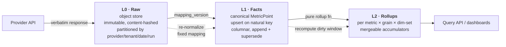
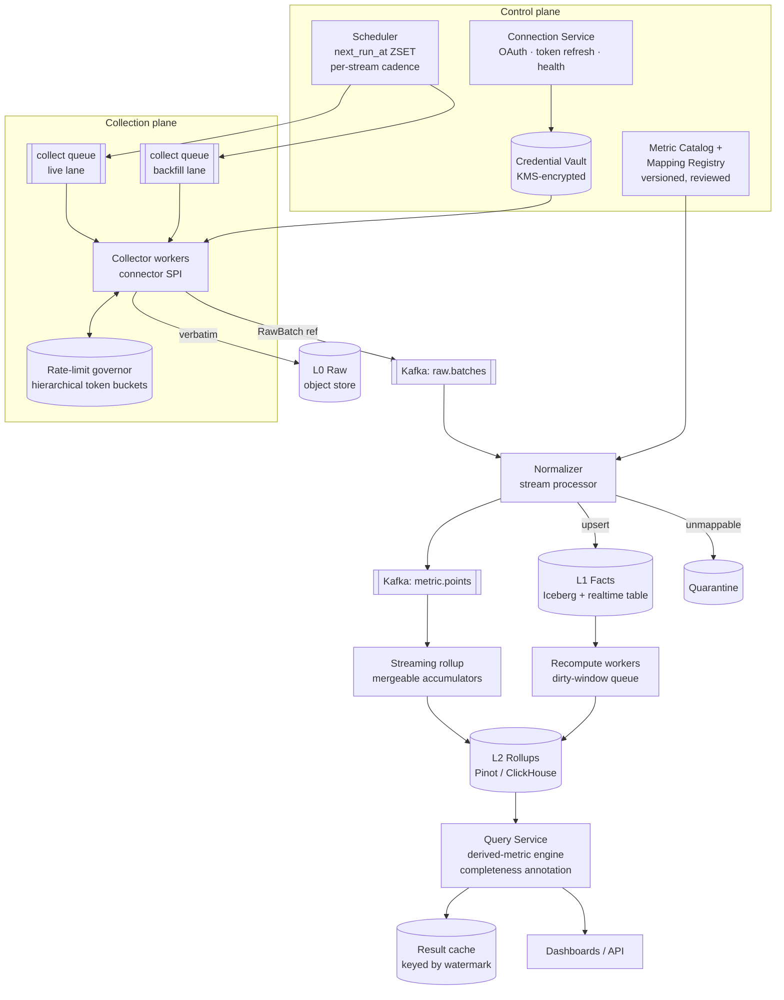
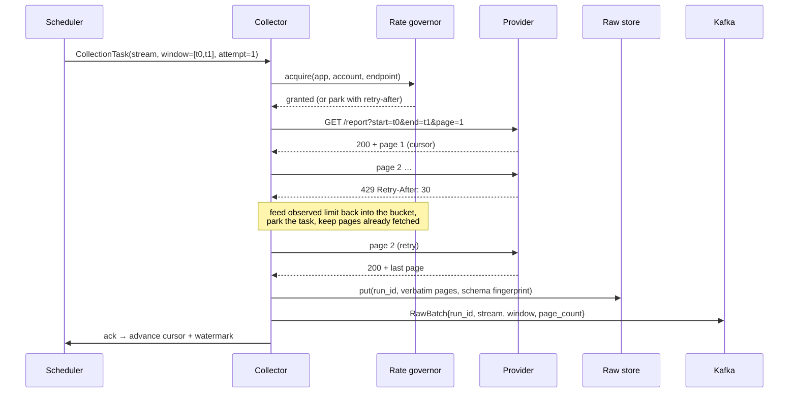
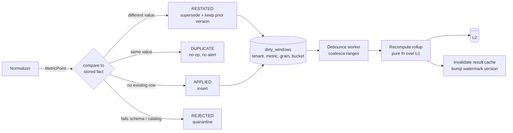

# 38. Metrics Aggregation Platform

[← HLD index](README.md) · [All docs](../README.md)

---

*(added, not from the notebook)*

A monitoring system is easy in one specific way: **you own the emitters**. Your agents push,
in your schema, on your clock, and a data point, once written, is true forever.

This problem is the inverse. The metrics live inside Stripe, Salesforce, Google Ads, Meta,
Shopify, NetSuite, Zendesk, CloudWatch — systems you do not control, cannot instrument,
and can only *ask*. Each one has its own auth, its own rate limit, its own pagination, its
own vocabulary, its own idea of when a day starts, and — the part that breaks most designs —
**its own right to change the past**. Stripe reclassifies a charge as refunded three days
later. Meta drops bot clicks at T+48h. A CRM rep backdates a closed-won opportunity to last
quarter. NetSuite reopens a closed period.

So the design is one question:

> **How do you build an aggregate you can trust, out of numbers that arrive late, twice,
> out of order, in forty different schemas, from systems that reserve the right to restate
> them?**

- [Requirements](#requirements)
- [Why this is not a monitoring system](#why-this-is-not-a-monitoring-system)
- [The three-layer data model](#the-three-layer-data-model) ← *the load-bearing decision*
- [Architecture](#architecture)
- [Collection: scheduling, rate limits, fairness](#collection-scheduling-rate-limits-fairness)
- [Time is the hard part](#time-is-the-hard-part)
- [Normalization](#normalization)
- [Aggregation](#aggregation)
- [Restatement and recompute](#restatement-and-recompute)
- [Serving](#serving)
- [Scale and capacity](#scale-and-capacity)
- [Multi-tenancy](#multi-tenancy)
- [Pitfalls](#pitfalls) ← *the part interviews actually probe*
- [Build vs buy](#build-vs-buy)
- [What actually fails candidates](#what-actually-fails-candidates)
- [Related](#related)

## Requirements

**i) Functional**

- (a) A tenant **connects an account** per provider (OAuth or API key); the platform stores
  and refreshes credentials
- (b) **Periodic collection** per provider on a per-metric cadence (1 min → 1 day),
  configurable, with a **historical backfill** on first connect (e.g. 24 months)
- (c) **Normalize** provider-specific responses into one canonical metric schema —
  names, units, currencies, dimensions, metric type
- (d) **Aggregate**: time rollups (1m/5m/1h/1d), dimensional group-bys, and **cross-provider
  derived metrics** (`CAC = (google_ads.spend + meta.spend) / stripe.new_customers`)
- (e) **Serve** dashboards and a query API: time series, group-by, top-K, period comparison
- (f) Surface **connection health** to the tenant — expired token, rate-limited, stale stream
- (g) Handle **restatement**: a value the provider changes after we collected it

**ii) NFR**

- (a) **Freshness SLO, tiered per stream**: fast connectors p95 < 5 min behind the provider,
  slow/report-style connectors p95 < 1 h. State this per tier — a single global number is a
  lie, because the provider's own latency dominates.
- (b) **Query p99 < 300 ms** for a dashboard panel; a dashboard is ~20 panels
- (c) **Correctness under at-least-once collection** — the same window fetched twice must
  produce identical aggregates (idempotent by construction, not by dedup luck)
- (d) **Fault isolation per connection**: one tenant's revoked token, one provider's outage,
  one bad mapping must not degrade anything else
- (e) **Multi-tenant**: 10k tenants, hard quotas on collection, cardinality and query concurrency
- (f) **Repairable**: a mapping bug discovered today must be fixable for data collected last
  year *without re-hitting the provider*
- (g) Provider API budget is a **first-class scarce resource** — the design must degrade
  cadence, never correctness, when it runs low

**Out of scope** — say these out loud: alerting/anomaly detection (a consumer of this
platform, not part of it), the dashboard front-end, per-provider OAuth app registration and
review, billing, and provider-side data quality. Scoping is graded.

## Why this is not a monitoring system

Worth two minutes at the whiteboard, because the interviewer is often checking whether you
noticed. Compare with [30. Metrics Monitoring](30-metrics-monitoring.md) /
[27. Ad Click Aggregator](27-ad-click-aggregator.md):

| | **Monitoring / click aggregation** | **This platform** |
|---|---|---|
| Transport | push, you own the agent | **pull**, you own nothing |
| Schema | one, yours | N, theirs, drifting under you |
| Volume driver | your traffic | provider **rate limits** |
| A written point | immutable | **restatable for days** |
| Failure | your agent dies | *their* API 429s, their token expires, their field renames |
| Time | your clock, NTP-synced | their clock, their timezone, their "day" |
| Hard part | throughput | **correctness and API budget** |

The consequence that drives everything below: an ad-click aggregator can aggregate on
ingest and never look back. Here, **an aggregate is a derived, recomputable view — never a
place where the only copy of a number lives.**

## The three-layer data model

This is the decision the rest of the design hangs off. Three physically separate layers,
each a deterministic function of the one before it:



| Layer | Contents | Why it exists | Retention |
|---|---|---|---|
| **L0 Raw** | the provider's response **verbatim**, plus request params, status, schema fingerprint, `run_id` | so a mapping bug is repairable *without re-hitting the provider* — the API budget you already spent is a sunk asset. Also the audit trail and the golden-fixture corpus for mapping tests. | 30–90 d hot, then cold |
| **L1 Facts** | canonical `MetricPoint`, one row per (metric, dims, time bucket), carrying `mapping_version` and `observed_at` | the **system of record**. Idempotent upsert on a natural key makes at-least-once collection safe. | 13 mo at base grain |
| **L2 Rollups** | pre-aggregated cubes for the query paths dashboards actually use | latency. Recomputable from L1 at any time, so it may be dropped and rebuilt. | tiered (below) |

**The dotted arrows are the point.** Both are backfill paths, and both are the same code as
the forward path with a different trigger. If re-normalizing the past requires a
one-off script, you built it wrong.

The `MetricPoint` schema:

```
tenant_id        uuid
metric_key       string        -- canonical, e.g. "revenue.gross"
metric_type      enum          -- COUNTER | GAUGE | DELTA | RATIO  ← decides the rollup fn
ts               timestamp     -- bucket start, UTC
grain            enum          -- RAW | M1 | M5 | H1 | D1
value            decimal
unit             string        -- "USD_minor", "count", "ms", "bytes"
dims             map<str,str>  -- normalized, allowlisted, bounded cardinality
provider         string
connection_id    uuid
comparability    string        -- which cross-provider class this may be summed into
mapping_version  int
run_id           uuid          -- → L0 lineage
observed_at      timestamp     -- provider's "as of"
ingested_at      timestamp     -- ours
```

**Natural key** = `hash(tenant_id, metric_key, provider, connection_id, dims, ts, grain)`.
Everything else — collection retries, duplicate deliveries, overlapping re-polls — becomes
harmless because writing the same fact twice is a no-op. Volunteer this key early; it is the
single sentence that answers half the follow-up questions.

## Architecture



| Component | Owns | Why separate |
|---|---|---|
| **Connection Service** | credentials, OAuth refresh, per-connection health state | the only component touching secrets; blast radius |
| **Scheduler** | *what to poll, when* — one row per **stream** = (connection, endpoint, metric group) | scheduling is a fairness and budget problem, not a worker concern. Same time-bucketed design as [18. Job Scheduler](18-job-scheduler.md) |
| **Collector** | provider I/O, pagination, retries, raw persistence | the only place provider-specific *transport* lives; everything downstream is provider-agnostic |
| **Rate-limit governor** | hierarchical token buckets + per-account leases | limits are shared across workers, so they cannot live in a worker |
| **Normalizer** | raw → canonical, driven by the mapping registry | stateless and replayable; a mapping fix means re-running it over L0 |
| **Rollup / recompute** | L2 as a pure function of L1 | one implementation, two triggers (stream tip, dirty window) |
| **Query Service** | derived metrics, FX, completeness, cache | the only place that knows what a "partial bucket" means |

**Two queues, not one.** Backfill is a separate lane with its own (smaller) share of the API
budget and lower priority. A tenant connecting a 24-month Shopify history must not starve
every live stream on that provider — this is the most common self-inflicted outage in this
class of system.

## Collection: scheduling, rate limits, fairness

**The unit of scheduling is a *stream*, not a connection.** A stream is
`(connection_id, endpoint, metric_group)` with its own cadence, cursor, watermark, health and
`finalization_lag`. One connection may have six streams polled at five different rates.

**Scheduling.** A Redis ZSET (or a bucketed table) keyed by `next_run_at`, dispatcher pops
due streams, enqueues a `CollectionTask`, and sets `next_run_at = now + cadence + jitter`.
Jitter is not cosmetic: without it, 50k streams created by a batch import all fire on the
same second, forever.

**Rate limits are hierarchical, and that is the interesting part.** A single call may need
budget from three buckets at once:

| Scope | Example | Shared across |
|---|---|---|
| per **app** (your OAuth client) | Meta Marketing API app-level points | *all your tenants* ← the dangerous one |
| per **account** | Stripe 100 req/s per account | one tenant |
| per **endpoint** | Google Ads report vs search | one tenant, one endpoint |

The collector acquires from **every applicable bucket, in a fixed global order**, and
releases on completion — the same consistent lock-ordering discipline as the
[LLD file system](../lld/10-file-system.md). Get the order wrong and you deadlock the fleet
under saturation.

The app-level bucket is where multi-tenancy bites: one tenant's backfill can exhaust a quota
that every other tenant shares. Defences: per-tenant share caps on the app bucket, the
separate backfill lane, and — if the provider allows — per-tenant OAuth apps.

**Fairness.** Per-tenant queues drained weighted round-robin, plus a hard per-tenant
in-flight cap. Without it a tenant with 500 connections monopolises the workers.

**Adaptive cadence** is the largest single API saving available. Track the change rate per
stream; a stream whose payload hash has been identical for 40 polls gets exponentially
backed off (bounded), and any observed change snaps it back to base cadence. Typical fleets
see 60–80 % of polls return nothing new.

**Circuit breaking is per connection, not per provider** — an expired token is one tenant's
problem and must not trip a breaker for everyone. Provider-wide 5xx/429 storms *do* trip a
provider-level breaker, which downgrades cadence globally and raises an operator alert.



Note what is **not** in that flow: the collector never writes a metric. It writes bytes and
a pointer. If the process dies after `put` but before the Kafka publish, the run is retried,
L0 is content-addressed so the re-write is a no-op, and the natural key makes the eventual
double-normalize idempotent. **At-least-once everywhere, effectively-once by key.**

## Time is the hard part

Four timestamps, and conflating any two is a bug:

| | Meaning | Trap |
|---|---|---|
| `event_time` | when the thing happened, per the provider | may be in **account-local** time, not UTC |
| `observed_at` | the provider's "as of" / `updated_at` | their clock, unsynchronized with yours |
| `collected_at` | when we called them | the only clock you trust |
| `ingested_at` | when it landed in L1 | used for replay ordering, never for bucketing |

The specific failures worth naming out loud:

- **"Day" is not a universal.** Google Ads days are in the *account's* timezone; Stripe is
  UTC; NetSuite is the subsidiary's fiscal calendar. Store the stream's reporting timezone as
  configuration, bucket in UTC, and render in the tenant's chosen zone. A daily revenue
  number that silently shifts by a timezone is the single most common production bug here.
- **DST** makes one local day 23 or 25 hours long. UTC buckets plus a rendering layer is the
  only sane answer; a `D1` grain stored in local time is not mergeable.
- **Provider data finalizes late.** Ad platforms restate for 48–72 h; payment processors for
  the refund window; CRMs whenever a human edits a record.

**The rule that follows: never trust a provider's incremental cursor for correctness.**
Every stream has a `finalization_lag` and is collected on two schedules:

1. the **tip** — `[now - cadence, now]`, frequently, for freshness
2. the **trailing sweep** — `[now - finalization_lag, now]`, on a coarser cadence
   (say hourly or daily), for truth

Because writes are idempotent on the natural key, the overlap costs nothing but API budget,
and it converts "did we miss an update?" from a hope into a bounded guarantee. Then, quarterly
or on demand, a **full reconciliation** against the provider's own totals endpoint — because
the sweep only catches changes inside the lag window, and someone will always edit a record
from 2023.

**Watermarks.** Per stream, `watermark = min(collected_window_end)` across in-flight runs.
The query layer uses it to mark buckets **complete / partial / stale** — see
[Serving](#serving).

## Normalization

Two registries, both versioned, both **data rather than code**:

**1. Metric Catalog** — the canonical vocabulary. One row per metric:

```yaml
metric_key: revenue.gross
type: DELTA                     # rollup fn = SUM
unit: currency_minor
dimensions: [product_id, country, channel, currency]
comparability: revenue.recognized_gross
description: "Gross transaction value before refunds and fees"
```

**2. Mapping Registry** — one versioned mapping per `(provider, endpoint, mapping_version)`:

```yaml
provider: stripe
endpoint: /v1/balance_transactions
mapping_version: 7
records: "$.data[*]"
points:
  - when: "$.type == 'charge'"
    metric_key: revenue.gross
    value: "$.amount"                     # already minor units
    unit_from: "$.currency"
    ts: "$.created"
    ts_unit: epoch_seconds
    dims:
      country: "$.source.country"
      channel: "literal:online"
    comparability: revenue.recognized_gross
```

**Why config and not a `StripeNormalizer` class.** Forty providers × fifty metrics is two
thousand mappings. As code: every fix is a deploy, every mapping is untested, and nothing
can re-normalize history. As versioned config: mappings are reviewable diffs, testable
against golden L0 fixtures, shippable without a deploy, and — because every fact carries its
`mapping_version` — a fix is "bump the version, replay L0 for the affected window". The
class model for the transform chain is in the companion LLD:
[18. Metric Normalization Engine](../lld/18-metric-normalization-engine.md).

### The four things normalization actually has to fix

**a) Units and currency.** Normalize to minor units and *keep the currency as a dimension*.
Do **not** convert FX at ingest: rates are themselves restated, and a tenant may switch
reporting currency next quarter. Convert at query time against a dated rate table, and record
which rate table version a result used.

**b) Metric type.** Providers hand you counters, gauges and deltas interchangeably and label
none of them. The type decides the rollup function, so it must be captured at mapping time:

| Type | Example | Rollup over time | Trap |
|---|---|---|---|
| `DELTA` | charges in the period | `SUM` | double-counting overlapping windows (natural key saves you) |
| `COUNTER` | monotonic lifetime total | `LAST` then diff | **counter resets** — a decrease means reset, not negative traffic |
| `GAUGE` | subscribers right now | `LAST` in bucket | summing gauges is meaningless and looks plausible |
| `RATIO` | CTR, conversion rate | **not mergeable** — store numerator and denominator | averaging ratios is the classic wrong answer |

**c) Semantic mismatch — the one candidates skip.** GA "sessions" and Mixpanel "sessions" are
different definitions. Stripe MRR and a CRM's MRR disagree by design. The dangerous failure
is not a crash; it is a chart that silently sums two things that are not the same thing.
Defence: every mapping declares a `comparability` class, and **cross-provider aggregation is
permitted only within a class**. Otherwise the metric stays namespaced by provider
(`ga.sessions`, `mixpanel.sessions`) and the UI refuses to add them. Saying "some metrics
must not be unified, and the platform should enforce that" is a strong senior signal.

**d) Cardinality.** Provider dimensions are unbounded — campaign names, URLs, SKUs, user
emails. Left alone they will destroy the OLAP store's index. Defence: a per-metric dimension
**allowlist**, a per-tenant cardinality budget, and a top-N + `__other__` rollup for
long-tail dimensions, with the raw values still available in L0 for drill-down.

### Schema drift

Fingerprint the shape of every raw payload (sorted key paths, hashed). A new fingerprint
means the provider changed something. Unknown fields are logged, never silently dropped;
a field the mapping *requires* that has gone missing sends the record to **quarantine** with
the mapping version and the raw pointer, raises a per-stream health alert, and — critically —
does **not** advance the stream's watermark. A silently-dropped metric that shows as a flat
zero line is worse than a visible gap.

## Aggregation

**The rollup is a pure function** `rollup(facts in window) → accumulator`, executed by two
triggers: the streaming path for the tip (freshness) and the recompute path for dirty
windows (truth). One implementation, two schedulers — this is what keeps it from becoming a
Lambda-architecture double-maintenance trap.

**Only mergeable accumulators are allowed in L2.** This is a hard interface rule, not a
style preference:

| Aggregate | Stored as | Merge |
|---|---|---|
| sum, count, min, max | scalar | trivially associative |
| **average** | `(sum, count)` | never store the average |
| **distinct count** | HyperLogLog sketch | union of sketches |
| **percentile** | t-digest / DDSketch | merge of sketches |
| **ratio** | `(numerator, denominator)` | sum both, divide at read |

If it cannot `merge()`, it does not get to be an aggregate — it is computed at query time
from a lower grain. Exact distinct counts across arbitrary time ranges are the classic
example: either accept HLL's ~2 % error, or answer from L1 with a slower query, and *say
which you chose*.

**Grain and retention tiering:**

| Grain | Retention | Rationale |
|---|---|---|
| L1 base facts | 13 months (then Iceberg cold) | recompute source, drill-down, audit |
| `M5` | 30 days | intraday debugging |
| `H1` | 13 months | the default dashboard grain |
| `D1` | indefinite | YoY comparisons, cheap |

**Do not materialize the full cube.** With 8 dimensions that is 256 combinations per metric
per grain. Materialize the base grain plus the specific `group_by` sets the dashboards
actually issue (harvested from query logs), and let the OLAP engine scan for the rest. Then
revisit monthly — a materialized view no query hits is pure cost.

**Derived, cross-provider metrics** are evaluated at query time by a small formula engine
over aligned series (`cac = (google_ads.spend + meta.spend) / stripe.new_customers`), and
materialized only when a specific formula is hot. Two rules that must be explicit: operands
must share a grain and timezone, and **a derived bucket is only as complete as its least
complete operand** — otherwise a fresh spend series divided by a lagging customers series
produces a spike that looks exactly like a real one.

## Restatement and recompute

The mechanism the whole design was built to support.



Four outcomes, not two — the same shape as the
[OMS state machine](../lld/17-order-management-system.md#the-four-outcomes-of-an-inbound-event),
and for the same reason: **`DUPLICATE` is normal and must not page anyone**, and `RESTATED`
is a first-class business event, not an error.

Three details that make it work at scale:

1. **Coalescing.** A restated day produces thousands of dirty-window rows. The debounce
   worker merges them into range entries per `(tenant, metric, grain)` and recomputes once
   per cycle — bounded work regardless of restatement fan-out.
2. **Supersede, do not overwrite.** Keep the prior fact version (`valid_to` stamped). "Why did
   last month's revenue change?" is a question finance *will* ask, and the answer is a diff
   with a `run_id` pointing at the exact L0 payload.
3. **Cache invalidation falls out for free**: the result cache key includes the
   `(metric, grain)` watermark version, which the recompute bumps. No explicit purge, no
   stale-key hunting.

**Backfill on connect** is the same machinery with a different driver: walk the history
window backwards in chunks in the backfill lane, at low priority, writing L0 → L1 → dirty
windows. Backwards, because the tenant wants recent months usable on day one, not month 1 of
24. Progress is per-chunk and resumable — a backfill that cannot survive a deploy is not a
backfill.

## Serving

```
POST /v1/query
{
  "metrics":    ["revenue.gross", "ads.spend"],
  "range":      {"from": "2026-08-01", "to": "2026-09-01", "tz": "America/New_York"},
  "grain":      "D1",
  "group_by":   ["country"],
  "filters":    {"channel": ["online"]},
  "compare_to": "previous_period",
  "currency":   "USD"
}
```

Response carries per-bucket **completeness metadata**, and this is the detail that separates
a real design from a sketch:

```json
{"ts": "2026-09-06", "value": 41200, "completeness": "PARTIAL",
 "streams": {"stripe": "COMPLETE", "google_ads": "PARTIAL(watermark=14:00Z)"}}
```

Without it, every dashboard shows a cliff at the right-hand edge — today's bucket is half
collected — and users learn to distrust the platform. With it, the UI dims the partial
bucket, and a stream that has stopped collecting shows as `STALE` rather than as zero.
**A gap must never render as a zero.**

Serving stack: a real-time OLAP store (Pinot or ClickHouse — see the
[appendix on Pinot](../appendix/hld.md#6-pinot)) for L2 and hot L1, backed by Iceberg for the
cold fact archive and the recompute engine; the same shape as the
[revenue recognition pipeline](../revenue_recognition_pipeline.md). Query Service adds
FX conversion, the derived-metric formula engine, completeness annotation, per-tenant
concurrency limits and the result cache.

Every query is scoped by `tenant_id` as the leading partition key **in the store, not in the
WHERE clause the application happens to add** — cross-tenant leakage in an analytics API is a
breach, not a bug.

## Scale and capacity

Assume 10k tenants, 5 connections each, 6 streams per connection:

| | |
|---|---|
| Streams | 10k × 5 × 6 = **300k** |
| Collection jobs | 300k / 15 min ≈ **330/s** (28.8 M/day) |
| Provider API calls | ~3 pages avg → **~1k calls/s** ← the real constraint |
| Raw payloads (L0) | 28.8 M/day × ~20 KB gz ≈ **~600 GB/day**, 30 d hot ≈ 18 TB (object store, cheap) |
| Normalized points | ~200/job → **~67k points/s**, 5.8 B/day |
| L1 storage | ~12 B/point columnar ≈ **70 GB/day**, ~25 TB/yr |
| L2 rollups | ~2 orders of magnitude smaller; hot set fits in a few TB of OLAP |
| Query load | peak **~2k QPS**, p99 < 300 ms |

What the numbers tell you:

- **1k provider calls/s is the binding constraint**, not CPU or storage. Adaptive cadence and
  the trailing-sweep design are budget decisions before they are correctness decisions.
- Collectors are I/O-bound and mostly idle — async, high-concurrency workers, sized by
  in-flight requests rather than cores.
- 67k points/s is unremarkable for Kafka + a stream processor; the normalizer is stateless
  and scales linearly with partitions keyed by `connection_id` (which also gives per-stream
  ordering for free).
- L1 at 25 TB/yr is why L1 is columnar-on-object-store and not Postgres, and why L2 exists
  at all.

## Multi-tenancy

- **Partition by `tenant_id` first** in every store — Kafka key, Iceberg partition, OLAP
  table, cache key.
- **Quotas per tenant**: streams, collection jobs/hour, dimension cardinality, query
  concurrency, backfill chunks in flight. Enforced, visible to the tenant, and the reason a
  noisy neighbour degrades only itself.
- **Credential isolation**: tokens in a KMS-encrypted vault, fetched per run, never logged,
  never in the raw payload (strip auth echoes before writing L0).
- **The shared-app rate limit is the one real cross-tenant coupling** — mitigated by per-tenant
  share caps, the backfill lane, and per-tenant OAuth apps where the provider allows.

## Pitfalls

1. **Treating aggregates as append-only.** The provider will restate. If L2 is the only copy
   of a number, you cannot fix it.
2. **No raw layer.** A mapping bug then costs a full re-collection — which the rate limit may
   make literally impossible for a 24-month history.
3. **Trusting the provider's incremental cursor.** Cursors skip records when the provider's
   `updated_at` is set by the writer rather than the storage layer. Always sweep a trailing
   window.
4. **Timezone and day boundaries.** The most common production bug in this category, and the
   hardest to notice because the number is only wrong by a few hours' worth.
5. **Averaging averages / summing gauges / averaging ratios.** Non-mergeable aggregates stored
   as scalars.
6. **Cardinality explosion** from an unbounded provider dimension.
7. **Backfill sharing the live API budget** — one onboarding starves every live stream.
8. **Provider-wide circuit breaking on a per-tenant fault** (one expired token stops the fleet)
   or the reverse (no breaker at all, so a provider outage becomes a retry storm that gets
   your app banned).
9. **Silent semantic unification** — summing two providers' "sessions".
10. **Rendering gaps as zeros.** Users lose trust exactly once.
11. **Normalization in code.** Two thousand mappings, no tests, a deploy per fix.
12. **FX converted at ingest.** Unfixable when rates are corrected or the tenant switches
    reporting currency.

## Build vs buy

Say this unprompted; it is a seniority signal:

| Situation | Answer |
|---|---|
| Internal analytics, < 10 sources, daily freshness | **Buy**: Fivetran/Airbyte → warehouse → dbt → BI. Do not build this. |
| Multi-tenant SaaS, per-tenant SLOs, sub-hour freshness, embedded dashboards | **Build** — the ELT stack has no per-tenant isolation, no per-tenant freshness SLO, and no story for tenant-visible connection health |
| You need the *connectors* but not the platform | Hybrid: Airbyte/Singer as the collector SPI, your own normalization, aggregation and serving |

The part genuinely worth building is not the HTTP clients — it is **the normalization
registry, the restatement machinery and the per-tenant serving layer**. The part you should
never hand-roll is a connector for a provider whose API changes monthly.

## What actually fails candidates

- Designing a **push** pipeline for a **pull** problem — reaching for agents, StatsD, or
  "the services emit to Kafka" when the whole premise is that you do not own the sources.
- No answer for **restatement**. If aggregates are immutable, the design is wrong at layer one.
- **Skipping the raw layer** to "save storage" — it is the cheapest layer and the only one
  that makes mistakes recoverable.
- Ignoring **rate limits and fairness**, or modelling them as a single global bucket.
- Normalization as a `switch (provider)`.
- No position on **semantic comparability** — silently summing metrics that are not the same
  metric.
- Storing **non-mergeable** aggregates.
- No **completeness/watermark** story, so every dashboard's newest bucket is a lie.
- Presenting only the happy path. The restatement, timezone and API-budget sections *are* the
  design.

## Related

- [30. Metrics Monitoring](30-metrics-monitoring.md) — the push-based cousin: you own the emitters
- [27. Ad Click Aggregator](27-ad-click-aggregator.md) — high-throughput aggregation where facts are immutable
- [20. News Aggregator](20-news-aggregator.md) · [26. Web Crawler](26-web-crawler.md) —
  the other pull-from-systems-you-don't-own designs: politeness, scheduling, dedup
- [18. Job Scheduler](18-job-scheduler.md) — the `next_run_at` dispatch loop reused here
- [13. Rate Limiter](13-rate-limiter.md) — the token buckets, but applied *outbound*
- [36. Durable Execution Engine](36-durable-execution-engine.md) — wrap the backfill *run*
  in a workflow; never the per-point collection ([why](36-durable-execution-engine.md#d-reconciliation-and-data-heavy-jobs--wrap-it-dont-run-it))
- [18. Metric Normalization Engine (LLD)](../lld/18-metric-normalization-engine.md) —
  the companion class design: connector SPI, transform chain, mergeable accumulators, the four outcomes
- [Revenue Recognition pipeline](../revenue_recognition_pipeline.md) — the same
  Iceberg + Pinot serving shape, on internal data
- [HLD appendix](../appendix/hld.md) — [Kafka](../appendix/hld.md#3-kafka) ·
  [Iceberg](../appendix/hld.md#5-iceberg) · [Pinot](../appendix/hld.md#6-pinot)
