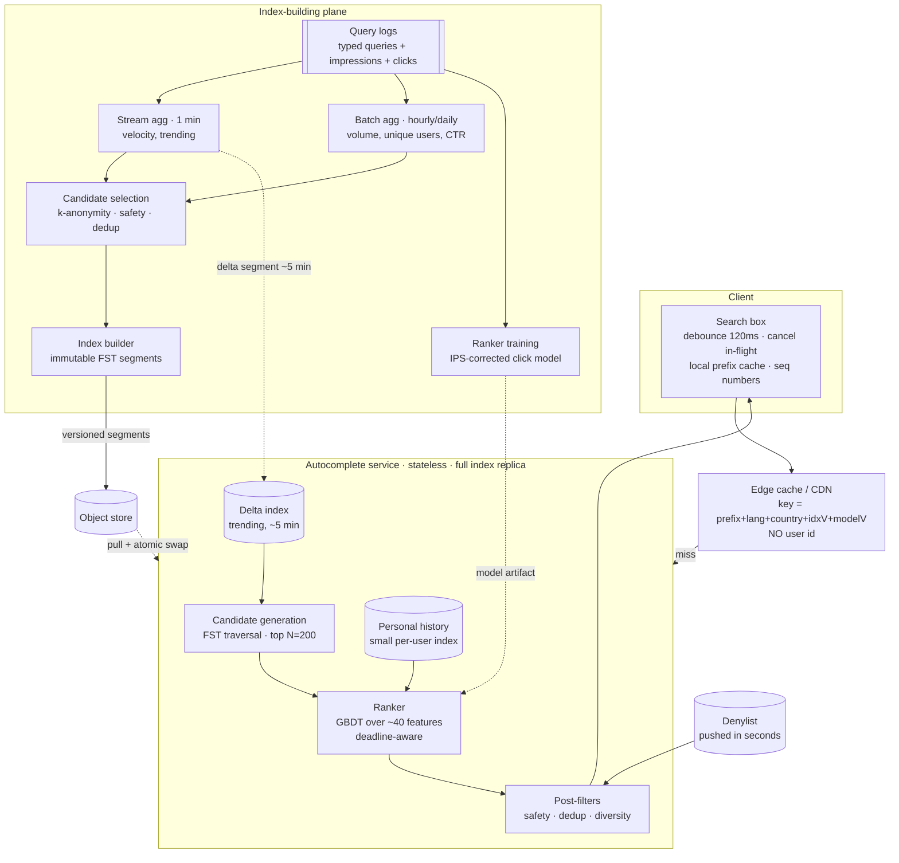
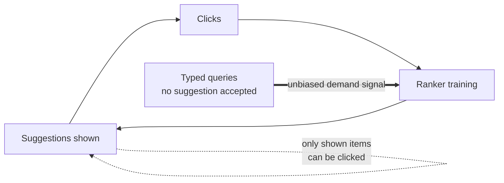
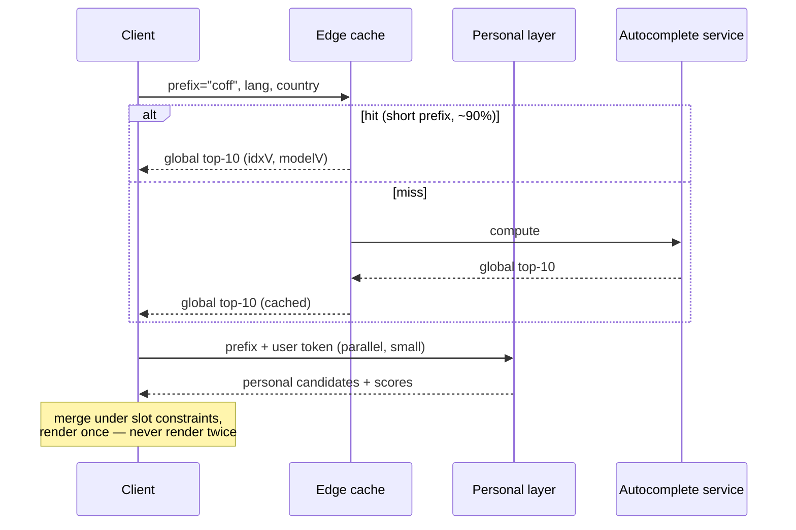

# 39. Search Autocomplete with Relevance

[← HLD index](README.md) · [All docs](../README.md)

---

*(added, not from the notebook)*

Almost every candidate given this problem builds a trie, caches the top 10 at each node, and
stops. That is a *data structure* answer to a *system* question, and it fails on the first
follow-up, because the interesting properties of autocomplete are not in the prefix match:

- **It is a ranking problem, not a matching problem.** Ten thousand queries start with
  `"how to"`. Finding them is trivial; ordering them is the entire product.
- **The QPS is a multiple of your search traffic, not a fraction of it.** Every search issues
  five to ten autocomplete requests. Autocomplete is the highest-QPS surface you own.
- **The latency budget is perceptual, not technical.** Past ~100 ms end to end the dropdown
  feels laggy and users stop looking at it. That budget includes the network.
- **The training signal is produced by the system itself.** You rank by what gets clicked,
  and only what you show can be clicked. Left alone, the ranker converges on last month's
  suggestions forever.
- **A suggestion reads as a statement by the platform.** Typing a person's name and being
  offered a defamatory completion is a legal problem, not a relevance problem.

So the design question is:

> **How do you rank a candidate set in under 50 ms, at 200k QPS, from a signal your own
> product biases, without ever putting words in a user's mouth that you cannot defend?**

- [Requirements](#requirements)
- [Capacity — the numbers that decide the architecture](#capacity--the-numbers-that-decide-the-architecture)
- [Why not precompute top-10 per prefix](#why-not-precompute-top-10-per-prefix) ← *the load-bearing decision*
- [Architecture](#architecture)
- [Candidate generation](#candidate-generation)
- [Ranking](#ranking)
- [The feedback loop](#the-feedback-loop) ← *the part that separates seniors*
- [Freshness and index publishing](#freshness-and-index-publishing)
- [Caching and the personalization tension](#caching-and-the-personalization-tension)
- [Safety, privacy and abuse](#safety-privacy-and-abuse)
- [Internationalization](#internationalization)
- [Degradation](#degradation)
- [Measuring relevance](#measuring-relevance)
- [Pitfalls](#pitfalls)
- [Build vs buy](#build-vs-buy)
- [What actually fails candidates](#what-actually-fails-candidates)
- [Related](#related)

## Requirements

**i) Functional**

- (a) Given a prefix, return the top **K = 10** suggestions ranked by relevance
- (b) Candidates come from **multiple sources**: historical query logs, an entity catalog
  (products, videos, people), and the **user's own history**
- (c) Match **mid-query**, not only from the first character — `"pizza"` should reach
  `"chicago deep dish pizza"`
- (d) **Typo tolerance** — `"iphon"`, `"recieve"`
- (e) **Trending**: a query that spikes now appears within minutes
- (f) **Personalization and context**: user history, locale, session (the previous query),
  and the surface the search box sits on
- (g) **Suppression**: unsafe, defamatory, PII-bearing and low-volume strings never appear,
  and a takedown applies within seconds

**ii) NFR**

- (a) **p99 server < 50 ms**, end-to-end < 100 ms including network — the perceptual budget
- (b) **~200k peak QPS** (derived below, not assumed)
- (c) **99.99 % availability with graceful degradation** — a stale or shorter suggestion list
  is fine; a slow one is worse than none
- (d) **Asymmetric freshness**: trending in ≤ 5 min, new entities in ≤ 5 min, **removals in
  ≤ 30 s**
- (e) Relevance is **measurable and improvable** — offline replay plus online A/B
- (f) Multi-language, multi-script

**Out of scope** — say it out loud: the search results page and its retrieval/ranking,
query spell-correction *after* submission, and the indexing of the corpus being searched.
Autocomplete suggests **queries**; it does not find **documents**. Candidates who blur those
two end up designing Elasticsearch by accident.

## Capacity — the numbers that decide the architecture

Do this early, because two of the numbers change the design shape.

| | |
|---|---|
| DAU | 100 M |
| Searches / user / day | 10 → **1 B searches/day** ≈ 12k/s avg, **36k/s peak** |
| Avg query length | ~20 chars |
| Requests per query **after client debounce** | ~6 |
| **Autocomplete QPS** | **72k avg, ~220k peak** ← 6× your search traffic |
| Distinct queries/day | ~1 B, extremely Zipfian |
| Queries passing the volume threshold | **~100 M** |
| Index size | 100 M × ~25 B string + ~12 B payload, FST-compressed → **~3–4 GB** |

**Two findings do real work.**

**1. The index fits in RAM on one machine.** So do **not** shard it. Replicate it: every
serving node holds the whole index, reads scale linearly with node count, there is no
scatter-gather, no tail-latency amplification from a slow shard, and a node is a pure
function of `(index version, model version)`. Sharding a 4 GB index to serve a 50 ms budget
is a self-inflicted wound. (This changes if you index a billion-item product catalog — then
shard **by vertical**, not by prefix, and merge the per-vertical top-K.)

**2. The debounce interval is a capacity lever with a product cost.** 150 ms debounce vs
50 ms is roughly a 2× difference in fleet size. That is a trade-off to *name* — it is one of
the few places where a UI constant is a line item in the infrastructure budget.

Third, less obvious: **prefix length distribution is Zipfian in both directions.** There are
only ~18k prefixes of 1–3 characters per language, and they carry ~40 % of requests — so they
are almost perfectly cacheable. Long prefixes are a huge distinct set but each is rare and
has a tiny candidate set, so they are cheap to compute. The expensive middle is 4–6
characters. Your caching strategy follows directly from this shape.

## Why not precompute top-10 per prefix

The classic answer — a trie with the top 10 materialized at each node — is genuinely good,
and you should be able to say precisely where it stops working:

| | **Top-10 per prefix (precomputed)** | **Top-N candidates + rank at request** |
|---|---|---|
| Latency | ~1 ms, a pointer walk | ~10–20 ms |
| Personalization | **impossible** — K per prefix per user does not exist | natural, features are per request |
| Context (session, locale, surface) | needs a separate index per context combination | a feature |
| Freshness | every log update dirties every ancestor prefix | delta index merged at query time |
| A/B testing a ranker | rebuild the index per variant | swap a model, same index |
| Memory | top-10 at every node ≈ 10× the node count | one score per term |

**The answer is both, split by stage:**

1. **Candidate generation** — a static, global, prefix-ordered structure returns the top
   **N ≈ 200** by a static score. Cheap, cacheable, shared across all users.
2. **Ranking** — a model reorders those 200 using per-request features (personal, session,
   geo, trending, freshness) in ~3–5 ms.

Then keep the precomputed top-10 as a **cache tier, not as the design**: for 1–3 character
prefixes, the globally-ranked top 10 is served straight from the edge with a >90 % hit rate,
and personalization is layered on top (see [Caching](#caching-and-the-personalization-tension)).

Say the two-stage split early. It is the sentence that separates "I have read the trie
problem" from "I have built one of these."

## Architecture

| Component | Owns | Note |
|---|---|---|
| **Client controller** | debounce, cancellation, **response sequencing**, local cache | more of the latency budget is spent here than anywhere else — see the [LLD](../lld/19-autocomplete-index-and-ranker.md) |
| **Edge cache** | global, non-personalized results for hot prefixes | the single largest QPS reduction available |
| **Autocomplete service** | full index replica + ranker, stateless | replicate, never shard, at this index size |
| **Delta index** | last few hours of trending, rebuilt every ~5 min | merged with the base index at query time |
| **Denylist** | suppression, pushed out-of-band in seconds | must **not** wait for an index build |
| **Index builder** | immutable versioned segments | atomic swap, roll forward only |
| **Trainer** | the ranking model, from bias-corrected logs | shipped as an artifact, versioned in the cache key |

The two planes are deliberately decoupled: the serving plane has **no** write path and no
database. A serving node is a pure function of an index version, a model version and a
denylist version — which is what makes it trivially replicable, rollback-able, and
cache-key-able.

## Candidate generation

**Structure: a weighted FST, not a pointer trie.** A trie of 100 M strings in object form is
tens of gigabytes of pointers and GC pressure. A finite-state transducer (what Lucene's
completion suggester uses) shares prefixes *and suffixes*, stores a weight on each output
arc, and lands at ~3–4 GB for the same corpus — memory-mappable, immutable, page-cache
friendly, and traversable to the top-N by weight without materializing the subtree.

Immutability is a feature here, not a constraint: readers need no locks, a new segment is an
atomic pointer swap, and rollback is swapping back.

**Three matching problems, three answers:**

| Problem | Approach | Cost |
|---|---|---|
| Prefix from the start | direct FST traversal | free |
| **Mid-query match** (`"pizza"` → `"chicago deep dish pizza"`) | index each **word-boundary suffix** as an additional entry pointing at the same suggestion | index size × ~3–4 (avg words per query) |
| **Typos** | intersect the FST with a **Levenshtein automaton** (d=1 for ≤ 8 chars, d=2 beyond) | ~5–10× slower traversal |

The rule on fuzzy matching, and it matters: **run it as a fallback, not as the default.**
Exact prefix first; only if it yields fewer than K good candidates do you widen to edit
distance 1, then 2. Fuzzy-first costs both latency and precision — `"cat"` fuzzily matches
`"car"`, `"cap"`, `"bat"`, and the user who typed three correct characters gets a worse list
than the one who typed two.

**Multiple sources are unioned, then ranked together**, each contributing its own candidates
with a source tag that becomes a ranking feature:

- **global** — the base index, static score
- **trending** — the delta index (see below)
- **personal** — the user's own past queries, a small per-user structure; these are
  disproportionately likely to be re-issued and deserve a strong prior, but must never
  crowd out the whole list
- **entity** — catalog completions (`"iphone 15 pro"` as a product, not as a past query),
  which carry structured metadata the ranker can use

Blending is done by the ranker with **slot constraints** (e.g. at most 3 personal, at least
6 global), not by a fixed interleave — a fixed interleave is how you end up showing a stale
personal query above the obviously-correct global one.

## Ranking

Score ~200 candidates in under 5 ms. That budget rules out anything heavier than a small
GBDT (or a linear model) over precomputed features; a transformer re-ranker does not fit,
and saying so is better than pretending it does. Feature families:

| Family | Examples | Note |
|---|---|---|
| **Popularity** | log volume over 28 d, **distinct users** (not raw count), CTR-weighted volume | distinct-user counting is also the anti-abuse mechanism |
| **Velocity** | `count(1 h) / expected(1 h)` against a seasonal baseline | this is what surfaces breaking news |
| **Match quality** | prefix length, match at word boundary?, edit distance, fraction of the suggestion typed | a longer typed prefix should dominate popularity |
| **Personal** | has the user issued this before, recency of that, similarity to the session's previous query | |
| **Geo / locale** | popularity of this query *within this country/region*, language match | `"football"` means two different sports |
| **Outcome quality** | did accepting this suggestion lead to a **successful session** (a click with dwell, no reformulation)? | the most valuable feature, and the one people forget |
| **Safety / quality** | classifier scores, source reputation | inputs to filtering as well as ranking |

**The objective function is the thing to get right.** Optimizing suggestion click-through
teaches the model to show what the user was about to type anyway — trivially clicked, zero
keystrokes saved — and to favour sensational strings. The objective should be closer to
**keystrokes saved on sessions that ended successfully**, which values a suggestion that
jumps the user *forward*, and penalizes one that wins the click but loses the session.

**Post-processing is not optional:**

1. **Normalize and collapse near-duplicates.** `"iphone 15"`, `"iphone15"`, `"i phone 15"`,
   `"Iphone 15 "` are one suggestion. Collapse on a normalized key (case-fold, NFKC, strip
   punctuation, collapse whitespace) and display the highest-volume surface form. Without
   this, one intent eats five of your ten slots — the most common visible defect in a
   home-grown autocomplete.
2. **Diversity.** Ten variations of one intent is a bad list even after dedup;
   cap per-intent slots.
3. **Safety filter**, applied last, over the denylist — see below.

## The feedback loop

The part that distinguishes a senior answer, and the reason a naive system degrades over
months rather than failing outright.

Three distinct biases, three distinct fixes:

- **Position bias.** Rank 1 is clicked far more than rank 5 regardless of quality. Training
  on raw clicks bakes in your current ordering. Fix: a position-based click model, or
  inverse-propensity weighting, so the label is "clicked *given it was shown at position p*".
- **Presentation bias / rich-get-richer.** A query that was never suggested never gets
  suggestion-clicks, so it never rises. Fix: **the primary demand signal is the typed-query
  log, not the suggestion-click log.** Every query a user finished typing without accepting a
  suggestion is a vote you failed to serve — that stream is unbiased by your UI and is the
  right input to candidate selection. Add a small exploration allocation (an occasional
  candidate promoted above its score) to gather counterfactual data.
- **Staleness bias.** Popularity over 28 days cannot surface something that started an hour
  ago. Fix: the velocity feature and the delta index, deliberately weighted to be *aggressive*
  — autocomplete is a surface where being briefly wrong about a trend costs little and being
  slow costs a lot.

State the general principle: **your logs measure what your UI showed, not what users wanted.
Any ranking system trained on its own impressions needs an outside signal.** The same
reasoning applies to feeds and recommendations.

## Freshness and index publishing

Two-tier, because "rebuild 100 M entries" and "surface this in five minutes" are
irreconcilable in one artifact:

| Tier | Contents | Rebuild | Merged |
|---|---|---|---|
| **Base** | the full corpus, full features | hourly (or daily) | — |
| **Delta** | the last few hours: new, trending, rising | every ~1–5 min | at query time, union + rank |
| **Denylist** | suppressions | **pushed in seconds** | post-filter at serve time |

Segments are **immutable and versioned**; a replica pulls a new version, builds it in the
background, and swaps a pointer. No in-place mutation, no reader locks, and rollback is a
swap back to the previous version. The index version is part of the edge cache key, so a new
index invalidates the cache implicitly rather than by a purge.

**The asymmetry between adds and removes is a design requirement, not an accident.** A new
trending query can wait five minutes. A defamatory suggestion attached to a real person's
name cannot wait an hour for the next base build — legal timelines are measured in hours, and
the operational one should be in seconds. Hence the denylist ships out-of-band on its own
fast path and is applied as a serve-time filter, so suppression never depends on a build
succeeding.

## Caching and the personalization tension

These two goals are in direct conflict, and the resolution is worth stating explicitly:

- **Cache hit rate wants the key to be `(prefix, lang, country)`** — coarse, shared,
  >90 % hit rate on short prefixes.
- **Personalization wants the key to include the user** — which drops the hit rate to
  roughly zero and multiplies the fleet.

**The resolution is a split response.** The edge serves the cached *global* list; a thin
personalization layer merges in the user's own candidates:

Two practical notes. The personal index is small enough (hundreds of queries per user) that
it can live **on the client**, which removes a network hop and a privacy surface entirely —
a genuinely good answer when the platform allows it. And the merge must be a single render:
showing the global list and then reshuffling it 40 ms later is more annoying than being 40 ms
slower.

**Client-side caching has one subtlety.** It is tempting to filter the cached results for
`"coff"` locally when the user types `"coffe"`, since the candidate set is monotonically
shrinking. That is only sound if ranking is a pure function of the prefix — with trending,
session context and personalization it is not. Use it as an *instant provisional* render
that the real response replaces, not as the answer.

## Safety, privacy and abuse

The section most candidates skip, and the one with real-world incidents behind it.

**A suggestion is read as the platform speaking.** `"[person's name] is a"` completing to
something defamatory is a legal exposure, not a ranking miss. Mitigations:

- **A k-anonymity threshold on candidate selection** — never suggest a string issued by
  fewer than *N* distinct users across *M* days. This one rule does three jobs at once: it
  keeps personal data (someone's pasted email, an account number, a private name) out of the
  global index; it blocks single-actor manipulation; and it removes the long tail that is
  mostly noise. If you name one privacy mechanism, name this one.
- **Count distinct users, not events**, everywhere in the popularity pipeline, with a per-user
  daily cap on contribution. A scripted client issuing a query a million times must move the
  ranking by exactly one user's worth.
- **Blocklists and classifiers** for profanity, self-harm, medical/legal advice, and
  suggestions attaching predicates to named individuals — the last usually implemented as
  "suppress completions of a detected person-entity beyond neutral continuations," and tuned
  per market, since the legal standard differs by jurisdiction.
- **Anomaly detection on velocity**, since a coordinated campaign looks exactly like a trend
  except in its distributional fingerprint (few users, uniform timing, correlated IP/device).
- **A takedown path with an SLA**, ending in the fast denylist push above.
- **Log hygiene**: query logs are among the most sensitive data a search product holds.
  Retention limits, PII scrubbing before aggregation, and the k-anonymity gate before
  anything reaches an index.

## Internationalization

- **Prefix ≠ what was typed.** In CJK, a user types romaji or pinyin and expects kanji or
  hanzi. The index must carry a transliterated form keyed to the display form, and matching
  runs against the transliteration. This is the single largest source of "our autocomplete is
  broken in Japan."
- **Normalization**: Unicode NFKC, case folding, diacritic folding (`café` ↔ `cafe`) — with
  the caveat that in some languages diacritics are semantic and folding is wrong.
- **Word boundaries are not spaces** in Chinese, Japanese or Thai, so the word-boundary suffix
  trick needs a segmenter per language.
- **Per-language indices**, selected from locale + script detection + user setting; a shared
  index across languages produces confident nonsense.

## Degradation

Autocomplete is the most degradable surface in a search product, and should be engineered to
exploit that. A budget-aware pipeline sheds in a fixed order:

| Pressure | Shed |
|---|---|
| Ranker over budget | return candidate-generation order (static popularity) |
| Still over budget | drop personalization, then the delta index |
| Service overloaded | serve edge-cached results only; raise the debounce interval via config |
| Index build failed | keep serving the previous version — indefinitely, if needed |
| Total failure | render nothing, degrade to plain search |

Every one of these is better than a 400 ms response. The controlling principle: **a stale
suggestion is a minor defect; a slow suggestion is a broken feature.** Push the debounce
interval to the client as config so you have a load-shedding lever that costs no capacity.

## Measuring relevance

| | |
|---|---|
| **Online** | suggestion acceptance rate; **keystrokes saved**; MRR of the accepted suggestion; successful-session rate after acceptance; query abandonment |
| **Offline** | replay logged sessions against a candidate ranker with IPS correction; NDCG against the accepted suggestion as the label |
| **Guardrails** | p99 latency, safety-filter firing rate, fraction of impressions from the delta index |

The metric to lead with is **keystrokes saved on successful sessions**. Acceptance rate
alone is gameable by suggesting what the user already typed; latency alone says nothing about
quality; and successful-session rate alone will not move enough to A/B in a reasonable window.

## Pitfalls

1. **Building a trie and calling it a system.** No ranking, no freshness, no safety.
2. **Precomputing top-10 per prefix**, then having no answer for personalization or A/B.
3. **Missing the keystroke multiplier** — sizing the fleet for search QPS.
4. **Training on raw suggestion clicks** — position bias plus rich-get-richer, and the
   suggestion list slowly freezes.
5. **Fuzzy matching by default** — latency and precision both fall.
6. **User id in the cache key** — hit rate collapses and the fleet triples.
7. **No fast removal path**, so a takedown waits for a six-hour index build.
8. **No k-anonymity threshold** — private strings and single-actor manipulation reach the
   index.
9. **No near-duplicate collapsing** — one intent occupies half the list.
10. **Sharding a 4 GB index**, adding scatter-gather tail latency to a 50 ms budget for no reason.
11. **Counting events instead of distinct users** in the popularity signal.
12. **No degradation ladder** — a dependency slows down and the search box becomes unusable.

## Build vs buy

| Situation | Answer |
|---|---|
| Site search, < 10 M items, no personalization | **Buy** — Elasticsearch/OpenSearch completion suggester, Algolia, Typesense. All of this is a config file. |
| Product catalog, some ranking signal, one language | **Buy, then customize** the scoring; keep your own log pipeline for the popularity signal |
| Search is the product; relevance, safety and freshness are differentiators | **Build** — the candidate structure is the commodity part; the ranker, the log pipeline and the safety layer are the work |

Be precise about what "build" means: nobody should hand-write an FST. The value you add is
**candidate selection, the ranking model, the bias-corrected training pipeline, and the
safety layer** — and, notably, none of those are the part a candidate usually spends the
interview on.

## What actually fails candidates

- Answering with a **data structure** and never reaching ranking, freshness or safety.
- **Not deriving the QPS** from the keystroke multiplier — it changes the architecture.
- No **two-stage** (generate → rank) split, so personalization has nowhere to live.
- No awareness that **the training signal is self-generated and biased**.
- **Sharding by prefix** without checking whether the index fits in memory first.
- No **fast-path removal**, no **k-anonymity**, no answer on defamatory completions.
- No **degradation** story — treating autocomplete as if it must be correct rather than fast.
- Confusing **suggesting queries** with **searching documents**.

## Related

- [28. FB Post Search](28-fb-post-search.md) — the document-retrieval side of the same box
- [22. YouTube Top K](22-youtube-top-k.md) — the popularity aggregation underneath the
  static score: windowed counts, Flink at minute grain, precompute-and-cache
- [26. Web Crawler](26-web-crawler.md) · [20. News Aggregator](20-news-aggregator.md) —
  corpus construction and freshness for the entity sources
- [13. Rate Limiter](13-rate-limiter.md) — per-user caps, which here double as the anti-abuse
  mechanism in the popularity pipeline
- [38. Metrics Aggregation Platform](38-metrics-aggregation-platform.md) — the same
  "aggregate is a recomputable view over an immutable log" shape, and mergeable accumulators
- [19. Autocomplete Index & Ranker (LLD)](../lld/19-autocomplete-index-and-ranker.md) —
  the class model: immutable segments with lock-free swap, the deadline-aware pipeline, and
  the stale-response bug on the client
- [HLD appendix](../appendix/hld.md) — [Elasticsearch](../appendix/hld.md#1-elastic-search-eventual-consistent) ·
  [Redis](../appendix/hld.md#4-redis) · [Kafka](../appendix/hld.md#3-kafka)
