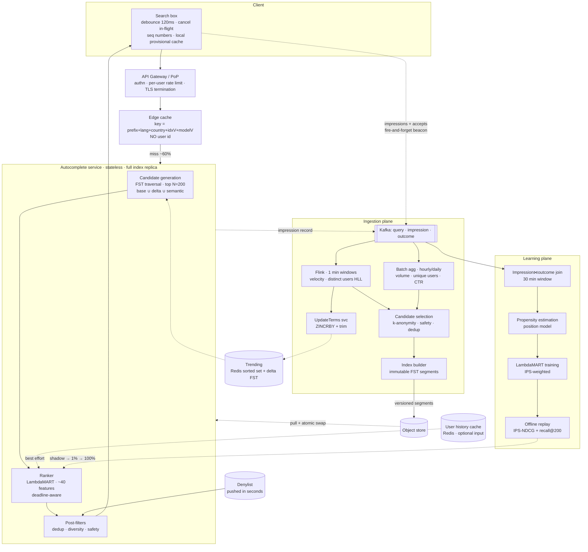
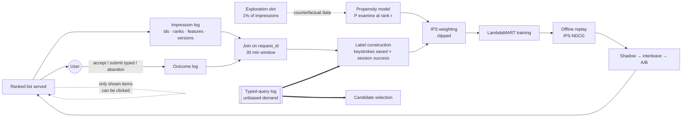
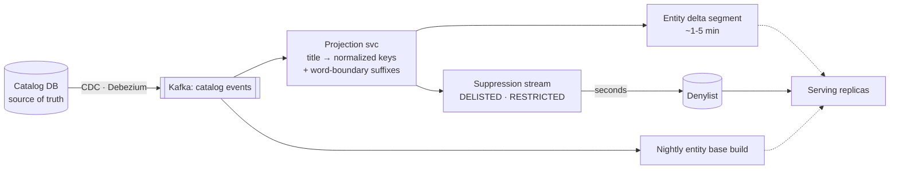
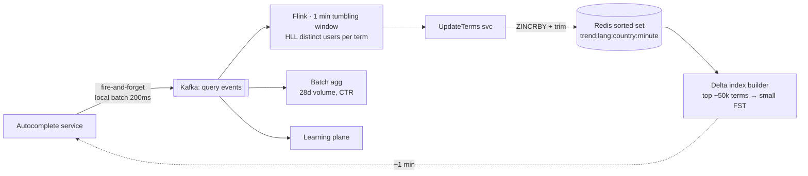
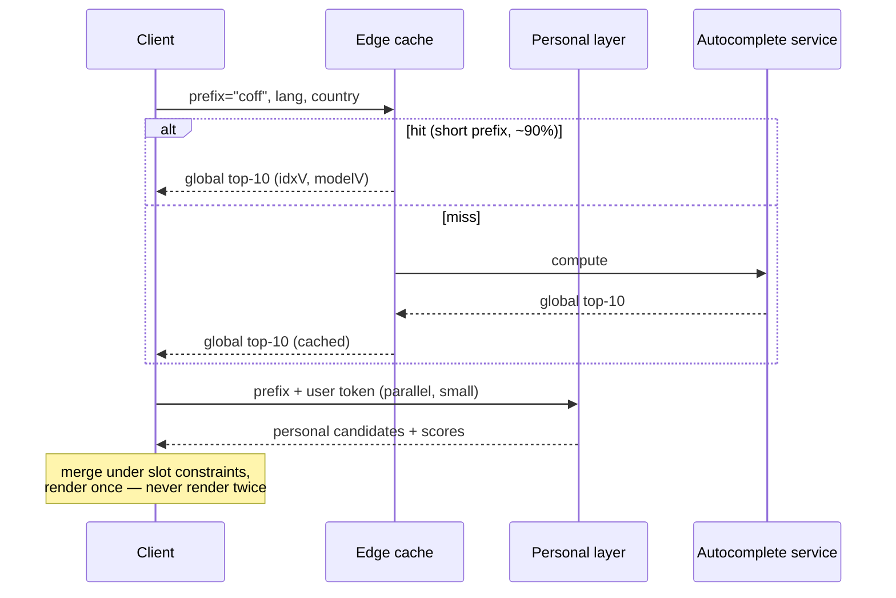

# 39. Search Autocomplete with Relevance — 1h

[← HLD index](README.md) · [All docs](../README.md)

---

*(added, not from the notebook; restructured to the
[HLD interview flow](00-interview-framework.md#hld-interview-flow) after the 2026-09
whiteboard pass)*

## Scoping

**What it is.** The dropdown under the search box on Google or Amazon: as the user types,
suggest the queries they are likely to be typing, and — on a commerce surface — the
**products** and **category scopes** that match. It blends a fast prefix match with ranking
signals (popularity, trend, the user's own history) to cut keystrokes and absorb typos.

**Is it similar to something?** Yes, and saying so early saves ten minutes:

| It looks like | It is actually |
|---|---|
| A trie problem | A **ranking** problem with a trivial matching stage |
| Search | The opposite side of it — autocomplete suggests **queries**; search finds **documents** |
| [22. YouTube Top K](22-youtube-top-k.md) | Exactly that, for the popularity signal underneath |
| [07. FB News Feed](07-fb-news-feed.md) | Exactly that, for the click-trained-on-its-own-output problem |
| [27. Ad Click Aggregator](27-ad-click-aggregator.md) | Exactly that, for the impression⋈click join |

Almost every candidate builds a trie, caches the top 10 at each node, and stops. That is a
*data structure* answer to a *system* question, and it fails on the first follow-up:

- **It is a ranking problem, not a matching problem.** Ten thousand queries start with
  `"how to"`. Finding them is trivial; ordering them is the entire product.
- **The QPS is a multiple of your search traffic, not a fraction of it.** Every search issues
  five to ten autocomplete requests. Autocomplete is the highest-QPS surface you own.
- **The latency budget is perceptual, not technical.** Past ~100 ms end to end the dropdown
  feels laggy and users stop looking at it. That budget includes the network.
- **The training signal is produced by the system itself.** You rank by what gets clicked,
  and only what you show can be clicked. Left alone, the ranker converges on last month's
  suggestions forever.
- **A suggestion reads as a statement by the platform.** Typing a person's name and being
  offered a defamatory completion is a legal problem, not a relevance problem. On a commerce
  surface, suggesting a product you cannot sell is the same class of mistake.

So the design question is:

> **How do you rank a candidate set in under 50 ms, at 200k QPS, from a signal your own
> product biases, while the catalog underneath you changes continuously?**

**Out of scope** — say it out loud: the search results page and its retrieval/ranking, query
spell-correction *after* submission, and indexing the corpus being searched. Candidates who
blur autocomplete with search end up designing Elasticsearch by accident.

## The 60-minute plan

The whole point of the structure below is that it fits an hour with time left for the
interviewer's follow-ups. Budget it out loud at minute one:

| Min | Phase | What lands on the board | If you are behind |
|---:|---|---|---|
| 0–5 | **Scope** | queries vs products, K=10, in/out of scope, the "it's a ranking problem" line | never cut this — it is what stops you designing search by accident |
| 5–12 | **FR + NFR** | the 9 FRs, p99 < 50 ms, 99.99 %, the removals-are-different asymmetry | cut FR (g)/(i) wording, keep the asymmetry |
| 12–20 | **Capacity** | the keystroke multiplier → 220k QPS, index 3–4 GB → **replicate, don't shard**, the latency split | cut the Zipfian aside, keep the two findings |
| 20–26 | **Entities + API** | the six entities and where each lives; `GET`, ids in the response, `seq` | cut the field lists; keep `suggestion_id` and `GET` |
| 26–45 | **Design** | two-stage split → boxes → candidate generation → ranking → freshness/trending | this is the hour; protect it |
| 45–57 | **Deep dive** | whichever one they pull: learning loop, hot keys, caching, safety | let them choose; have all four ready |
| 57–60 | **Tradeoffs** | the summary table, and one sentence on what you would do differently at 1/100th the scale | |

**The four sentences that have to be said**, whatever else gets cut:

1. "Autocomplete QPS is ~6× search QPS, because of the keystroke multiplier."
2. "The index is 3–4 GB, so I replicate it rather than shard it."
3. "Two stages: a static structure generates ~200 candidates, a model ranks them — because
   personalization has nowhere to live in a precomputed top-10."
4. "Clicks are not labels; they are labels times a bias I introduced, and the pipeline
   exists to divide that back out."

Everything else in this document is elaboration on those four.

- [The 60-minute plan](#the-60-minute-plan)
- [Functional requirements](#functional-requirements)
- [NFR](#nfr) · [Capacity](#capacity--the-numbers-that-decide-the-architecture)
- [Entities](#entities)
- [API](#api)
- [Design](#design)
  - [Why not precompute top-10 per prefix](#why-not-precompute-top-10-per-prefix) ← *the load-bearing decision*
  - [Architecture](#architecture)
  - [Candidate generation](#candidate-generation)
  - [Ranking](#ranking)
  - [Learning from clicks](#learning-from-clicks) ← *the part that separates seniors*
  - [Hot keys and the read path](#hot-keys-and-the-read-path)
  - [Freshness: query index, catalog, trending](#freshness-query-index-catalog-trending)
  - [Caching and the personalization tension](#caching-and-the-personalization-tension)
  - [Personal history](#personal-history)
  - [Safety, privacy and abuse](#safety-privacy-and-abuse)
  - [Internationalization](#internationalization)
  - [Degradation](#degradation)
- [Tradeoffs](#tradeoffs) ← *the summary slide*
- [Measuring relevance](#measuring-relevance)
- [Pitfalls](#pitfalls)
- [Build vs buy](#build-vs-buy)
- [What actually fails candidates](#what-actually-fails-candidates)
- [Related](#related)

## Functional requirements

- (a) Given a prefix, return the top **K = 10** suggestions ranked by relevance
- (b) Candidates come from **multiple verticals**: historical query logs, a **product /
  entity catalog**, and the **user's own history**
- (c) Match **mid-query**, not only from the first character — `"pizza"` should reach
  `"chicago deep dish pizza"`, `"pro"` should reach `"iphone 15 pro"`
- (d) **Typo tolerance** — `"iphon"`, `"recieve"`
- (e) **Trending**: a query that spikes now appears within minutes
- (f) **Personalization and context**: user history, locale, session (the previous query),
  category scope, and the surface the search box sits on
- (g) **Catalog fidelity**: a product that is delisted or unavailable stops being suggested
  quickly; a newly listed one appears within minutes
- (h) **Suppression**: unsafe, defamatory, PII-bearing and low-volume strings never appear,
  and a takedown applies within seconds
- (i) The system **improves from its own usage** — impressions and acceptances train the
  ranker, and the loop is auditable

## NFR

- (a) **p99 server < 50 ms**, end-to-end < 100 ms including network — the perceptual budget
- (b) **~200k peak QPS** (derived below, not assumed)
- (c) **99.99 % availability with graceful degradation** — a stale or shorter suggestion list
  is fine; a slow one is worse than none
- (d) **Asymmetric freshness**: trending in ≤ 5 min, new products in ≤ 5 min, **removals
  (unsafe, delisted, unavailable) in ≤ 30 s**
- (e) **Read-only serving path** — no synchronous writes, no database on the request path
- (f) Relevance is **measurable and improvable** — offline replay plus online interleaving
- (g) Multi-language, multi-script, multi-marketplace

Against the [SCALE checklist](00-interview-framework.md#nfr-checklist-scale-for-cloud-designs),
the two that dominate are **Latency** (it sets the whole architecture) and **CAP** — where
this system sits at an unusually extreme corner: **AP for everything except removals.** Every
suggestion may be stale; a suppressed suggestion may not be. That single asymmetry explains
the denylist fast path, the two-tier index, and most of the freshness design.

### Capacity — the numbers that decide the architecture

Do this early, because two of the numbers change the design shape.

| | |
|---|---|
| DAU | 100 M |
| Searches / user / day | 10 → **1 B searches/day** ≈ 12k/s avg, **36k/s peak** |
| Avg query length | ~20 chars |
| Requests per query **after client debounce** | ~6 |
| **Autocomplete QPS** | **72k avg, ~220k peak** ← 6× your search traffic |
| Distinct queries/day | ~1 B, extremely Zipfian |
| Queries passing the volume threshold | **~100 M** |
| Query index size | 100 M × ~25 B string + ~12 B payload, FST-compressed → **~3–4 GB** |
| Product catalog | ~100 M sellable items → a title-projection index of similar size |

**Two findings do real work.**

**1. The index fits in RAM on one machine.** So do **not** shard it. Replicate it: every
serving node holds the whole index, reads scale linearly with node count, there is no
scatter-gather, no tail-latency amplification from a slow shard, and a node is a pure
function of `(index version, model version)`. Sharding a 4 GB index to serve a 50 ms budget
is a self-inflicted wound. (This changes if you index a billion-item catalog with full
metadata — then shard **by vertical or marketplace**, not by prefix, and merge the
per-vertical top-K.)

**2. The debounce interval is a capacity lever with a product cost.** 150 ms debounce vs
50 ms is roughly a 2× difference in fleet size. That is a trade-off to *name* — it is one of
the few places where a UI constant is a line item in the infrastructure budget.

Third, less obvious: **prefix length distribution is Zipfian in both directions.** There are
only ~18k prefixes of 1–3 characters per language, and they carry ~40 % of requests — so they
are almost perfectly cacheable. Long prefixes are a huge distinct set but each is rare and
has a tiny candidate set, so they are cheap to compute. The expensive middle is 4–6
characters. Your caching strategy follows directly from this shape, and so does the answer to
the `"iph"` hot-key question.

**The latency budget, decomposed.** "< 50 ms" is not one number, and the split tells you
where to spend:

| Segment | Budget | Consequence |
|---|---|---|
| Client debounce | 100–150 ms | a product decision, not an engineering one |
| Network RTT (with PoPs) | 20–40 ms | **the largest term** — hence edge termination, hence the edge cache |
| Edge cache hit | < 1 ms | ~40 % of traffic never reaches you |
| Candidate generation | ~5 ms | FST traversal, top N = 200 |
| Ranking | ~5 ms | ~200 candidates × a small GBDT |
| Post-filter + serialize | ~2 ms | dedup, diversity, safety |

The server budget is really **~15 ms p99**, and network dominates the rest. Saying that out
loud is what justifies PoPs and the edge cache instead of "add more app servers."

## Entities

Five entities matter, and the useful move is to state **where each one lives and whether it
is mutable** — because the whole architecture is an argument about that.

| Entity | Store | Mutability | On the request path? |
|---|---|---|---|
| `Suggestion` | immutable FST segment, in RAM on every replica | rebuilt, never updated | **yes** — read only |
| `Product` | catalog DB (source of truth) → projected into an entity segment | high churn via CDC | only the projection |
| `UserHistory` | Redis (cache) + Cassandra/Dynamo (truth) | per-user writes | **optional input** |
| `TrendingTerm` | Redis sorted set → delta FST segment | per-minute buckets | via the delta segment |
| `ImpressionEvent` / `OutcomeEvent` | Kafka → object store | append-only | no (fire-and-forget) |
| `IndexSegment` / `RankingModel` | object store, versioned | published artifacts | pulled, swapped |

```
Suggestion                          # the indexed unit — one row per normalized string
  suggestion_id       string        # stable; the join key for impressions and clicks
  normalized_key      string        # NFKC + casefold + punctuation-stripped; dedup key
  display_text        string        # highest-volume surface form
  type                enum          # QUERY | PRODUCT | CATEGORY
  lang, country       string        # index is partitioned by these
  static_score        float         # baked in at build time — one array lookup at serve
  volume_28d          int
  distinct_users_28d  int           # the popularity signal AND the abuse control
  acceptance_rate     float
  success_rate        float         # accepted → session ended well
  safety_flags        bitset
  entity_ref          string?       # product/category id when type != QUERY

Product                             # catalog source of truth; only a projection is indexed
  product_id          string
  title, brand        string
  category_path       string
  price, currency
  availability        enum          # IN_STOCK | OOS | RESTRICTED | DELISTED
  marketplace         string        # a product is sellable in some regions, not others
  rating, review_cnt
  glance_views_7d     int           # the static score for PRODUCT suggestions
  image_url                         # the dropdown shows a thumbnail
  updated_at

UserHistory                         # small, per-user, deletable in place
  user_id             string
  entries             list<{normalized_key, count, last_ts, accepted}>   # last ~200
  updated_at

TrendingTerm
  term                string
  bucket_minute       ts            # one Redis key per minute, TTL a few hours
  distinct_users      HLL           # not a raw counter — see Safety
  velocity            float         # count(1h) / seasonal_expected(1h)

ImpressionEvent                     # the learning loop's raw material
  request_id, ts, user_hash, session_id
  prefix, prefix_len, lang, country, surface, category_scope
  idx_version, model_version, variant, degraded[]
  shown               list<{suggestion_id, rank, score, source, explored}>
  features_sampled    bool          # full feature vectors on a 1% hash-sampled slice

OutcomeEvent
  request_id, suggestion_id, rank
  action              enum          # ACCEPT | SUBMIT_TYPED | ABANDON
  typed_len, accepted_len           # → keystrokes saved
  session_success     bool          # delayed; resolved within the 30-min join window
```

Two field-level decisions carry real weight. **`suggestion_id` must be stable across index
rebuilds** (hash the normalized key, don't use a build-local ordinal) or every impression
logged before a rebuild becomes unjoinable and your training set silently loses a day.
And **`distinct_users_28d`, not `volume_28d`, is the popularity feature** — the raw count is
what a script moves.

## API

It is a **read**, so it is a `GET`. This matters more than it looks: making it a `POST`
(the instinct, because you are "sending" a term) forfeits edge caching, HTTP conditional
requests and CDN behaviour — and the edge cache is the single largest QPS reduction
available.

```http
GET /v1/suggest?q=iph&lang=en&country=US&surface=web&scope=electronics&session=S8f2&seq=7&limit=10
Authorization: Bearer <token>        # user identity — never in the cache key
```

```json
{
  "prefix": "iph", "seq": 7,
  "idx_version": "2026-09-09T11:00Z-a31",
  "model_version": "rank-v37",
  "request_id": "01JX...",
  "suggestions": [
    {"id":"q_8812f","type":"QUERY","text":"iphone 15 pro","source":"global","rank":1,"score":0.91},
    {"id":"p_B0C1","type":"PRODUCT","text":"iPhone 15 Pro 256GB","rank":2,"score":0.88,
     "entity":{"product_id":"B0C1","price":999.00,"rating":4.6,"image_url":"…","in_stock":true}},
    {"id":"c_9911","type":"CATEGORY","text":"in Cell Phones","rank":3,"score":0.72}
  ]
}
```

```http
POST /v1/suggest/feedback          # fire-and-forget beacon, never in the render path
{ "request_id":"01JX...", "action":"ACCEPT", "suggestion_id":"p_B0C1",
  "rank":2, "typed_len":3, "accepted_len":19 }
```

Five things in that contract exist for reasons worth stating:

- **`id` per suggestion, not a bare `String[]`.** Without stable ids you cannot join a click
  back to the impression that produced it, and without that join there is no training data —
  see [Learning from clicks](#learning-from-clicks). A `String[]` response quietly makes the
  entire learning loop impossible, and nobody notices for a quarter.
- **`type` + `entity`**, because the dropdown renders products with a thumbnail and price and
  queries as plain text. The API returns *what to render*, not just text.
- **`idx_version` / `model_version`** make every impression attributable to an exact serving
  configuration, and they are components of the cache key so a new index invalidates the
  cache implicitly instead of by purge.
- **`seq`** is echoed back so the client can drop stale responses.
- **The feedback beacon is a separate call** — it must never sit in the render path and must
  survive the page navigating away (`sendBeacon`).

**The client contract is part of the API** and carries a real share of the latency budget:

| Rule | Why |
|---|---|
| Debounce ~120 ms, and **cancel in-flight** requests | the capacity lever from Capacity |
| Echo `seq`; **drop any response with `seq` < the latest rendered** | otherwise `"iph"`'s response lands after `"ipho"`'s and the list flickers backwards — the most common visible bug in a home-grown autocomplete |
| Render **once** per keystroke | never show a global list and reshuffle it 40 ms later |
| Local prefix cache is a *provisional* render only | see [Caching](#caching-and-the-personalization-tension) |
| Fire the feedback beacon on accept / submit / abandon | this is the training signal |

## Design

*Sections tagged **core** go on the board in the 26–45 minute block. Sections tagged
**deep dive** are what you pull out when the interviewer picks a thread — do not volunteer
all of them, you will run out of clock.*

### Why not precompute top-10 per prefix

*(core — say this in the first two minutes of the design block)*

The classic answer — a trie with the top 10 materialized at each node — is genuinely good,
and you should be able to say precisely where it stops working:

| | **Top-10 per prefix (precomputed)** | **Top-N candidates + rank at request** |
|---|---|---|
| Latency | ~1 ms, a pointer walk | ~10–20 ms |
| Personalization | **impossible** — K per prefix per user does not exist | natural, features are per request |
| Context (session, locale, surface) | needs a separate index per context combination | a feature |
| Freshness | every log update dirties every ancestor prefix | delta index merged at query time |
| A/B testing a ranker | rebuild the index per variant | swap a model, same index |
| Memory | top-10 at every node ≈ 10× the node count | one score per term |

**The answer is both, split by stage:**

1. **Candidate generation** — a static, global, prefix-ordered structure returns the top
   **N ≈ 200** by a static score. Cheap, cacheable, shared across all users.
2. **Ranking** — a model reorders those 200 using per-request features (personal, session,
   geo, trending, freshness) in ~3–5 ms.

Then keep the precomputed top-10 as a **cache tier, not as the design**: for 1–3 character
prefixes, the globally-ranked top 10 is served straight from the edge with a >90 % hit rate,
and personalization is layered on top (see [Caching](#caching-and-the-personalization-tension)).

Say the two-stage split early. It is the sentence that separates "I have read the trie
problem" from "I have built one of these."

### Architecture

*(core)*

Three planes, and the discipline is that they fail independently: the **serving plane** has
no write path and no database; the **ingestion plane** turns raw events into aggregates and
indices; the **learning plane** turns impressions into a model.



| Component | Owns | Note |
|---|---|---|
| **Client controller** | debounce, cancellation, **response sequencing**, local cache | more of the latency budget is spent here than anywhere else — see the [LLD](../lld/19-autocomplete-index-and-ranker.md) |
| **API gateway / PoP** | TLS, authn, per-user rate limits | terminate close to the user; the RTT is the budget |
| **Edge cache** | global, non-personalized results for hot prefixes | the single largest QPS reduction available |
| **Autocomplete service** | full index replica + ranker, stateless | replicate, never shard, at this index size |
| **Delta index + sorted set** | last few hours of trending, rebuilt every ~1–5 min | merged with the base index at query time |
| **User history cache** | last ~200 queries per user | an **optional** ranker input — never a blocking dependency |
| **Denylist** | suppression, pushed out-of-band in seconds | must **not** wait for an index build |
| **Index builder** | immutable versioned segments | atomic swap, roll forward only |
| **Learning plane** | propensities, training set, model artifact | versioned; `model_version` is in the cache key |

A serving node is a pure function of `(index version, model version, denylist version)` —
which is what makes it trivially replicable, rollback-able, and cache-key-able. Everything
that mutates lives in the other two planes, and both of them can be down for an hour without
the search box noticing.

### Candidate generation

*(core)*

**Structure: a weighted FST, not a pointer trie.** A trie of 100 M strings in object form is
tens of gigabytes of pointers and GC pressure. A finite-state transducer (what Lucene's
completion suggester uses) shares prefixes *and suffixes*, stores a weight on each output
arc, and lands at ~3–4 GB for the same corpus — memory-mappable, immutable, page-cache
friendly, and traversable to the top-N by weight without materializing the subtree.

Immutability is a feature here, not a constraint: readers need no locks, a new segment is an
atomic pointer swap, and rollback is swapping back.

**Three matching problems, three answers:**

| Problem | Approach | Cost |
|---|---|---|
| Prefix from the start | direct FST traversal | free |
| **Mid-query match** (`"pizza"` → `"chicago deep dish pizza"`) | index each **word-boundary suffix** as an additional entry pointing at the same suggestion | index size × ~3–4 (avg words per query) |
| **Typos** | intersect the FST with a **Levenshtein automaton** (d=1 for ≤ 8 chars, d=2 beyond) | ~5–10× slower traversal |

The rule on fuzzy matching, and it matters: **run it as a fallback, not as the default.**
Exact prefix first; only if it yields fewer than K good candidates do you widen to edit
distance 1, then 2. Fuzzy-first costs both latency and precision — `"cat"` fuzzily matches
`"car"`, `"cap"`, `"bat"`, and the user who typed three correct characters gets a worse list
than the one who typed two.

#### Where embeddings actually belong

A tempting design is "embed the prefix, ANN-search an embedding index, return neighbours."
It is the wrong primary structure, and being able to say why is worth more than the design
itself:

- **A prefix is not a word.** `"coff"` is a fragment; its embedding is dominated by
  subword noise, and nearest-neighbour search on it returns things that are *semantically
  near a fragment*, which is not a well-defined set.
- **Vector search answers "similar", autocomplete asks "starts with".** ANN cannot express
  the hard constraint. You would have to post-filter neighbours by prefix, which means
  over-fetching by a large factor and still missing exact matches that fell outside the
  neighbour list — worse recall *and* worse latency than an FST traversal that is exact by
  construction.
- **Latency.** An HNSW probe over 100 M vectors plus the prefix post-filter does not fit
  under 5 ms; the FST does, with room to spare.

Embeddings still earn a place — as a **third candidate source, unioned in and tagged**:

| Source | Structure | What it contributes |
|---|---|---|
| `global` | base FST | the exact-prefix backbone |
| `trending` | delta FST, ~1–5 min | what is spiking now |
| `personal` | small per-user structure | queries this user has issued |
| `entity` | catalog FST + metadata | `"iphone 15 pro"` as a product, with structured fields |
| `semantic` | ANN over completed-query embeddings, **keyed by the last complete token** | `"cheap flights to"` → `"budget airfare tokyo"` — intent expansion the FST cannot reach |

Two constraints on the semantic source: it fires only when there is at least one **complete**
token before the fragment, and it is capped at a small slot budget. It buys recall on long,
natural-language prefixes — exactly where the FST's static popularity score is weakest —
without paying its cost on the short prefixes that are 40 % of traffic.

**Blending is done by the ranker with slot constraints** (e.g. at most 3 personal, at most 2
semantic, at least 6 global), not by a fixed interleave — a fixed interleave is how you end
up showing a stale personal query above the obviously-correct global one.

#### One index or several

Do not put `user_id` in the global suggestion index. The global index is immutable,
identical on every replica, rebuilt as a unit, and covered by k-anonymity; per-user history
is mutable, tiny, per-user-deletable, and covered by privacy retention rules. They have
different lifecycles, different failure modes and different legal obligations — mixing them
means a GDPR deletion request now forces a global index rebuild.

#### Blending verticals

Queries, products and category scopes come from different generators with **incomparable
scores** — `distinct_users_28d` for a query and glance-views for a product are different
units, and a single global sort over them is arbitrary dressed up as a model.

Two legitimate answers:

- **Slot constraints (start here).** Fixed layout: 6 query suggestions, up to 3 products with
  thumbnails, 1 category scope; each vertical ranked internally, the layout fixed by product
  design. Predictable, debuggable, no calibration work.
- **Cross-vertical calibration (better, later).** Train each vertical's score to a common
  target — P(accept → successful session) — so the numbers *become* comparable, then sort
  globally with a diversity constraint. This needs the outcome logging from
  [Learning from clicks](#learning-from-clicks) to exist first, which is a good reason the
  loop is built early.

The failure mode to name: an uncalibrated global sort lets one vertical eat the dropdown
whenever its score distribution shifts — a catalog reindex silently pushes products to every
slot, and nobody can explain why.

### Ranking

*(core)*

Score ~200 candidates in under 5 ms. That budget rules out anything heavier than a small
GBDT (or a linear model) over precomputed features; a transformer re-ranker does not fit,
and saying so is better than pretending it does. Feature families:

| Family | Examples | Note |
|---|---|---|
| **Popularity** | log volume over 28 d, **distinct users** (not raw count), CTR-weighted volume | distinct-user counting is also the anti-abuse mechanism |
| **Velocity** | `count(1 h) / expected(1 h)` against a seasonal baseline | this is what surfaces breaking news |
| **Match quality** | prefix length, match at word boundary?, edit distance, fraction of the suggestion typed | a longer typed prefix should dominate popularity |
| **Personal** | has the user issued this before, recency of that, similarity to the session's previous query | plus an `is_known_user` flag — see cold start |
| **Geo / locale** | popularity of this query *within this country/region*, language match | `"football"` means two different sports |
| **Outcome quality** | did accepting this suggestion lead to a **successful session** (a click with dwell, no reformulation)? | the most valuable feature, and the one people forget |
| **Source** | which generator produced it | lets the model learn per-source calibration |
| **Safety / quality** | classifier scores, source reputation | inputs to filtering as well as ranking |

Features split cleanly into **static** (baked into the index segment at build time — one
array lookup) and **dynamic** (computed per request: match quality, personal, trending). That
split is what makes 200 × 40 features affordable inside 5 ms; see the
[LLD](../lld/19-autocomplete-index-and-ranker.md#4-the-ranker-static-vs-dynamic-features).

**The objective function is the thing to get right.** Optimizing suggestion click-through
teaches the model to show what the user was about to type anyway — trivially clicked, zero
keystrokes saved — and to favour sensational strings. The objective should be closer to
**keystrokes saved on sessions that ended successfully**, which values a suggestion that
jumps the user *forward*, and penalizes one that wins the click but loses the session. The
next section is how that objective is actually constructed from logs.

**Post-processing is not optional:**

1. **Normalize and collapse near-duplicates.** `"iphone 15"`, `"iphone15"`, `"i phone 15"`,
   `"Iphone 15 "` are one suggestion. Collapse on a normalized key (case-fold, NFKC, strip
   punctuation, collapse whitespace) and display the highest-volume surface form. Without
   this, one intent eats five of your ten slots — the most common visible defect in a
   home-grown autocomplete.
2. **Diversity.** Ten variations of one intent is a bad list even after dedup;
   cap per-intent slots.
3. **Safety filter**, applied last, over the denylist — see below.

### Learning from clicks

*(deep dive — and the one to steer them toward)*

The part that distinguishes a senior answer, and the reason a naive system degrades over
months rather than failing outright. The one-line version:

> **Clicks are not labels. A click is a label times a bias you introduced, and the whole
> pipeline is machinery for dividing that bias back out.**



#### 1. Log the impression, not just the click

You cannot learn from clicks unless you know what the click was *chosen from*. Every served
response emits one record:

```json
{
  "request_id": "01JX...", "ts": 1757330000, "user_hash": "u_9f2a", "session_id": "S8f2",
  "prefix": "coff", "prefix_len": 4, "lang": "en", "country": "US", "surface": "web",
  "idx_version": "…a31", "model_version": "rank-v37", "variant": "control",
  "degraded": [],
  "shown": [
    {"suggestion_id": "q_8812f", "rank": 1, "score": 0.91, "source": "global",   "explored": false},
    {"suggestion_id": "q_1f0aa", "rank": 2, "score": 0.88, "source": "global",   "explored": false},
    {"suggestion_id": "q_55c31", "rank": 3, "score": 0.84, "source": "personal", "explored": false}
  ],
  "features_sampled": true
}
```

And the client emits outcomes against the same `request_id`:

```json
{"request_id": "01JX...", "action": "accept", "suggestion_id": "q_8812f", "rank": 1,
 "typed_len": 4, "accepted_len": 14}
```

Three decisions inside that record are load-bearing:

**Log the feature vector that was actually used, not one recomputed later.** Features are
time-varying — the trending score at 14:03 is not the trending score at 23:00, and the
user's history has changed by the time the batch job runs. Recomputing features offline
produces a training set that describes a world the model will never see, and the resulting
**training/serving skew** is the single most common reason a model that looks great offline
does nothing online. If you name one operational rule in this whole section, name this one.

**But you cannot log 200 feature vectors per request at 220k QPS.** 220k × 200 × 40 floats
is ~7 GB/s. So: **sample.** Every impression logs the compact record above (ids, ranks,
scores, versions — ~300 bytes, ~65 MB/s, fine); a **1 % sample** additionally logs full
feature vectors, chosen by hashing `request_id` so the choice is deterministic and
reproducible. 1 % of 220k QPS is still ~2k impressions/s ≈ 170 M/day — far more training
data than a GBDT needs. Bias the sampler toward long-tail prefixes if the head dominates.

**Version-stamp everything.** `idx_version`, `model_version` and `variant` on every
impression are what let you attribute a metric regression to a specific artifact, and what
let you exclude a bad window from training.

#### 2. Join impressions to outcomes

The two streams arrive separately and seconds-to-minutes apart. A Flink job keyed by
`request_id` with a **30-minute window** emits one training row per impression:

- window closes with an `accept` → positive for the accepted item, negatives for the rest
- window closes with nothing → the whole list was unhelpful
- late outcome after the window → dropped, and *counted* (if the drop rate rises above a
  fraction of a percent, your beacon or your window is broken)

Why 30 minutes and not 30 seconds: **session success is delayed feedback.** Whether the
accepted suggestion led to a good session — a result click with dwell, no reformulation — is
only knowable after the session ends. Holding the row for the window is the price of the
best feature you have.

#### 3. Not all non-clicks are the same

This is where most designs flatten a rich signal into a binary and lose most of its value.
Four distinct outcomes, four distinct meanings:

| Outcome | Ranking signal | Candidate-generation signal |
|---|---|---|
| Accepted suggestion at rank *r* | **positive**, weighted by *r*'s propensity | the string is good |
| User typed a query in full **that was shown** | **negative for ranking** — it was there and they ignored it | the string is good |
| User typed a query in full **that was never shown** | none | **a recall miss** — the strongest signal you have, and the only unbiased one |
| Abandoned the search box entirely | weak negative for the list | none |

Row three is the important one. **The typed-query log is generated regardless of what you
showed**, so it is the one demand signal your UI does not contaminate. It drives candidate
*selection* (which strings deserve to be in the index at all) and it is the basis of the
only honest recall metric you have: for a sample of typed queries, replay their prefixes
and measure **recall@200** — what fraction of what people actually typed was in the
candidate set. A ranker cannot fix a candidate set that never contained the answer.

#### 4. Position bias, and how to actually measure it

Rank 1 in a dropdown collects something like 40–50 % of all accepts regardless of quality.
Train on raw clicks and the model learns to reproduce **your current ordering**, forever.

The standard remedy is the **position-based model**: a suggestion is clicked only if it is
examined and relevant, and examination depends only on rank.

```
P(click | s, r) = P(examine | r) × P(relevant | s)
                = p_r × relevance(s)
```

If you know `p_r`, you recover an unbiased estimate of relevance by **inverse propensity
scoring** — weight each observed click by `1/p_r`, so a click at rank 8 counts far more than
a click at rank 1.

Estimating `p_r` honestly is the part that gets skipped. Three options, in increasing order
of how much they cost you:

| Method | How | Cost |
|---|---|---|
| **Intervention harvesting** | exploit natural variation — the same `(prefix, suggestion)` pair appears at different ranks across index/model versions and A/B arms; compare its click rate across ranks | free, but noisy and only covers pairs that moved |
| **RandPair** | on a small traffic slice, swap two randomly chosen positions | ~0.1 % of traffic, small relevance cost, clean estimate |
| **Full randomization** | shuffle the top-K on a tiny slice | cleanest estimate, most visible damage — keep it under 0.1 % and never on logged-in power users |

Start with intervention harvesting, add RandPair on a 0.1 % slice when the estimates look
unstable. Re-estimate `p_r` per surface (mobile dropdowns are examined differently from
desktop) and per prefix-length bucket.

**Clip the propensities.** `1/p_r` for rank 10 can be 30 or more, and a handful of
high-weight examples then dominate the gradient — unbiased but with variance so high the
model is worse than the biased one. Cap the weight (typically at 10–20). You are trading a
little bias for a large variance reduction, deliberately, and saying that is the difference
between having read about IPS and having used it.

#### 5. Construct the label from the objective, not from the click

Now fold in the objective from [Ranking](#ranking). Per training row:

```
keystrokes_saved = len(accepted_suggestion) - len(typed_prefix)
success          = 1 if the session ended in a click with dwell and no reformulation, else 0
label            = keystrokes_saved × success
weight           = min(1 / p_rank, W_max)
```

Consequences worth stating out loud:

- A suggestion accepted at prefix length 3 that saved 15 characters outranks one accepted at
  prefix length 12 that saved 2 — which is precisely the behaviour you want and precisely
  what raw CTR does not give you.
- **An accepted suggestion followed by a reformulation is a negative**, not a positive. The
  user clicked it and it was wrong. CTR optimization cannot express this; it is the main
  reason CTR-trained autocomplete drifts toward clickbaity, sensational completions.
- Because `success` is downstream of the search results page, the autocomplete ranker is
  partly trained on the quality of a system it does not own. Accept that and monitor for it —
  a results-page regression will show up as an autocomplete relevance regression.

#### 6. The model

**LambdaMART (a pairwise/listwise GBDT) is the default, and the group is one impression.**
Reasons, in the order an interviewer will want them:

- You care about **ordering**, not calibrated probability, so a pairwise objective beats
  pointwise `P(click)` regression — it optimizes an NDCG-shaped target directly.
- The features are heterogeneous tabular counters and log-scaled counts, which is exactly
  where GBDTs beat neural nets on the same data budget, with no normalization work.
- **It fits the budget.** ~300 trees of depth 6 over 200 candidates, vectorized, is ~1–3 ms.
  A cross-encoder transformer over 200 candidates is two orders of magnitude too slow; a
  two-tower model is affordable but belongs offline, producing the semantic candidate
  source and a similarity feature, not the final ordering.
- Retrain **daily** on a rolling 28 days of IPS-weighted rows; refresh the static popularity
  features hourly from the batch aggregation. Model artifact is versioned and pushed like
  the index.

#### 7. Exploration: paying for counterfactual data

The loop is self-reinforcing: a candidate that never reaches the top 10 never gets accepted,
so it never earns the evidence it needs to reach the top 10. Fix it by deliberately
spending a little relevance:

- **Reserve one low slot** (rank 8–10) on ~1 % of impressions for a candidate sampled from
  ranks 10–50 by score, flagged `explored: true` in the log.
- Exploring in the **bottom** slots is nearly free — those slots earn few accepts anyway —
  and it still produces the counterfactual data you need. Exploring in the top 3 is visible,
  costly, and unnecessary.
- Prefer sampling by **uncertainty** rather than uniformly: a candidate with few impressions
  has a wide posterior on its relevance, so a count-based bonus (`score + c·sqrt(1/n)`,
  i.e. a bandit-style optimism term) concentrates exploration where the model actually does
  not know.

Budget it explicitly: 1 % of impressions × one slot out of ten ≈ 0.1 % of served slots. That
is the price of not freezing your index, and it is cheap.

#### 8. Offline evaluation, and its one hard limit

Before anything reaches users, replay held-out impressions against the candidate model:

- **IPS-corrected NDCG / MRR** on the accepted item, plus a **self-normalized (SNIPS)** or
  **doubly-robust** estimator of expected reward — the plain IPS estimate has high variance
  at these propensities and will happily tell you a model is 8 % better when it is not.
- Slice every metric by prefix length, language, surface and known/unknown user. An
  aggregate win that is a loss on short prefixes is a loss, because short prefixes are 40 %
  of traffic.

**The hard limit, and it is worth volunteering:** offline replay can only score items that
were in the *logged* candidate set. It therefore evaluates **ranking** changes and is
structurally incapable of evaluating **candidate generation** changes — a new generator's
best idea appears in no log, so replay scores it as if it were never shown. Candidate-set
changes are validated instead by `recall@200` against the typed-query log, and then online.

#### 9. Online: interleave first, A/B second

**Team-draft interleaving** mixes the two rankers' lists into one served list and attributes
each accept to the ranker that contributed the item. It removes between-user variance
entirely and is roughly 10–100× more sensitive than a split A/B — for autocomplete, where a
good ranking change moves acceptance rate by well under a percent, that is the difference
between a 3-day read and a 6-week one.

So: **interleave to choose the winner, then A/B the winner** to measure the business metrics
interleaving cannot see (session success, search abandonment, revenue) and to hold the
latency and safety guardrails.

#### 10. Shipping the model

| Stage | What it catches |
|---|---|
| **Shadow** — compute the new model's scores in the serving path, serve the old list, log both | latency regressions and **feature parity** — if the new model's offline and shadow scores diverge for the same request, you have training/serving skew, and you find it before users do |
| **Interleave at 1 %** | relevance |
| **A/B ramp 1 → 5 → 50 %** | business metrics and guardrails |
| **100 %**, previous artifact retained | rollback is a pointer swap, same as the index |

`model_version` is in the edge cache key, so a ramp does not serve one user two different
rankings from cache, and a rollback invalidates implicitly.

#### 11. Cold start

- **New suggestion, no click history.** It has no learned relevance, so it must not be
  scored as if it had evidence of being *bad*. Back it with the typed-frequency prior from
  candidate selection, give it the uncertainty bonus from §7, and let the exploration slot
  do the rest.
- **New or logged-out user.** Personal features are absent. Do **not** impute zeros silently
  — that tells the model "this user has never searched this," which is a different claim
  from "we do not know." Pass an explicit `is_known_user` flag alongside the defaults so the
  model can learn to discount the personal family when it is missing. A GBDT handles this
  natively with a missing-value branch, which is another small reason to prefer one here.

#### 12. The failure mode this whole section exists to prevent

State the general principle, because it generalizes to feeds, recommendations and ads:

> **Your logs measure what your UI showed, not what users wanted. Any ranking system trained
> on its own impressions needs an outside signal and a source of randomization, or it
> converges on its own past.**

Here the outside signal is the typed-query log and the randomization is the exploration
slot. Both are cheap. A system missing them does not fail loudly — it slowly stops
improving, and nobody notices for two quarters.

### Hot keys and the read path

*(core — the interviewer will ask about `"iph"` by name)*

The instinct is that a hot prefix is a problem. **On the read path it is the opposite: it is
the single best thing about this workload.** `"iph"` is one cache key. It is requested
millions of times an hour with an identical answer for every user in a locale, so it lives at
the edge with a >90 % hit rate and never reaches your fleet. The Zipfian head is what makes a
220k QPS system affordable — 40 % of traffic served from ~18k cache entries per language.

The real hot-key hazards are in four other places, and naming them is the answer that scores:

**1. Cache stampede at index publish.** `idx_version` is in the cache key, so flipping to a
new index invalidates *every* entry at once and 220k QPS lands on origin. Three fixes, used
together:

- **Pre-warm before the flip.** Replay the top ~20k prefixes per locale against the new
  version, populate the edge, *then* move the version pointer. The warm set is small and
  known — it is exactly the head of the distribution you already measure.
- **Serve-stale-while-revalidate** at the edge, so a miss returns the previous version's
  answer instantly and refreshes behind it. A one-minute-stale suggestion is invisible.
- **Single-flight per key** at the edge: 10k concurrent misses on `"iph"` produce **one**
  origin request, not 10k. Without request coalescing the hot key becomes the outage.

**2. Single-key write contention in trending.** `ZINCRBY trend:en:US:<minute>` for a viral
term is one Redis key taking the full write rate of that term. Do not shard the key first —
**pre-aggregate in Flink** so Redis receives one write per term per one-minute window instead
of one per event. That converts ~220k writes/s into ~50k writes/*minute*, and the hot key
stops existing. Key sharding (`…:<minute>:<shard>`, merged on read) is the fallback if a
single window still concentrates.

**3. Hot user, not hot key.** A shared/enterprise account or a scripted client hammers one
`UserHistory` entry. Per-user rate limit at the gateway ([13. Rate Limiter](13-rate-limiter.md)),
and the optional-input rule below means the cheap response is simply to drop personalization
for that user rather than to scale for them.

**4. Hot product during a deal event.** A Prime-Day item concentrates catalog CDC and glance
-view updates on one row. The serving path never reads the catalog — it reads a projection
baked into an index segment — so this is a problem for the ingestion plane's partitioning,
not for the 50 ms budget. That separation is the point of the read path having no database.

**The general principle to state:** *a hot key on a read path you can cache is a gift; a hot
key on a write path is a hazard.* This design deliberately puts every hot thing on the read
side and pre-aggregates everything on the write side.

### Freshness: query index, catalog, trending

*(core — "how do you keep the index fresh as the catalog changes" is the other question you
are guaranteed)*

Three sources change on three different clocks, and the mistake is trying to serve them from
one artifact.

| Tier | Contents | Rebuild | How it reaches the user |
|---|---|---|---|
| **Base query index** | the full ~100 M query corpus, full static features | hourly / daily | full segment, pulled and swapped |
| **Entity (catalog) index** | product + category projections | daily base, **CDC delta every ~1–5 min** | segment + delta segment |
| **Trending delta** | the last few hours: new, rising, spiking | every ~1 min | small delta FST, unioned at query time |
| **Denylist / suppression** | unsafe, delisted, unavailable | **pushed in seconds** | serve-time post-filter |

**Publishing is immutable and versioned.** A replica pulls a new segment, builds it in the
background, and swaps a pointer. No in-place mutation, no reader locks, rollback is a swap
back. The index version is in the edge cache key, so a new index invalidates the cache
implicitly rather than by purge (which is why the pre-warm in
[Hot keys](#hot-keys-and-the-read-path) exists).

**The asymmetry between adds and removes is a design requirement, not an accident.** A new
trending query can wait five minutes. A defamatory completion on a real person's name, or a
product you legally cannot sell in that marketplace, cannot wait for the next base build.
So suppression ships out-of-band on its own fast path and applies as a serve-time filter,
and **never depends on a build succeeding**. This is the concrete form of the
"AP except for removals" line from the [NFR](#nfr).

#### The catalog half (the Amazon flavour)

Query suggestions are derived from logs; product suggestions are derived from a **database
that other teams write to continuously**. That is a different freshness problem:



Four rules that follow:

- **Adds go through the delta index; removes go through the denylist.** Same asymmetry, now
  for commercial rather than legal reasons.
- **Availability is a ranking feature, not a filter — until it is a filter.** Out of stock in
  the user's region should *demote* a product (a different size or seller may still convert),
  but `DELISTED`, `RESTRICTED` and marketplace-ineligible must *suppress*. Conflating the two
  either hides sellable inventory or advertises things you cannot sell.
- **Index a projection, never the row.** The suggest index needs
  `title, brand, category, static_score, availability_bit, image_ref` — not price. Price
  changes constantly and would force a rebuild for something the dropdown can fetch at render
  time or tolerate being minutes stale.
- **The static score is different per vertical.** Queries score on `distinct_users_28d`;
  products score on glance views and purchases. They are not comparable numbers, which leads
  directly to the blending rule below.

#### Trending: the fast path

The write path is the cheapest thing in the system, because it runs at 220k QPS and must
never slow a read.



**Kafka, not a Redis list, as the transport.** A Redis queue works and is tempting for its
simplicity, but it is single-consumer, non-replayable, and a consumer crash loses the window.
This log has **three** consumers — trending, batch aggregation, and ranker training — and the
training pipeline must *replay history* every time a feature definition changes. Redis is the
right choice for the trending **serving structure**; it is the wrong choice for the transport.
(At smaller scale, a Redis stream with consumer groups is a legitimate middle ground.)

**The sorted set.** One key per minute bucket with a few hours' TTL; velocity is
`sum(last 60 buckets) / seasonal_expected(this hour, this weekday)`. Increment by **distinct
users** (HyperLogLog per window), not by event count, or a script moves the trend. Bound the
set with a periodic `ZREMRANGEBYRANK` trim, or a key holding a million cold terms becomes the
thing that pages you.

**The subtlety most whiteboard versions miss:** a sorted set answers *"what is trending
globally"*, but the query is *"what is trending **that starts with `iph`**"*. A ZSET cannot
serve a prefix query. So the sorted set is never consulted at request time — it is the
**input to a delta FST**, rebuilt every ~1 minute from the top ~50k trending terms, shipped
to the replicas, and traversed by the same prefix walk as the base index, with the trending
score riding along as a ranking feature. Without that step, trending terms live in Redis and
never reach a user who is typing.

### Caching and the personalization tension

*(core)*

These two goals are in direct conflict, and the resolution is worth stating explicitly:

- **Cache hit rate wants the key to be `(prefix, lang, country, idxV, modelV)`** — coarse,
  shared, >90 % hit rate on short prefixes.
- **Personalization wants the key to include the user** — which drops the hit rate to
  roughly zero and multiplies the fleet.

**The resolution is a split response.** The edge serves the cached *global* list; a thin
personalization layer merges in the user's own candidates:



Two practical notes. The personal index is small enough (hundreds of queries per user) that
it can live **on the client**, which removes a network hop and a privacy surface entirely —
a genuinely good answer when the platform allows it. And the merge must be a single render:
showing the global list and then reshuffling it 40 ms later is more annoying than being 40 ms
slower.

**Client-side caching has one subtlety.** It is tempting to filter the cached results for
`"coff"` locally when the user types `"coffe"`, since the candidate set is monotonically
shrinking. That is only sound if ranking is a pure function of the prefix — with trending,
session context and personalization it is not. Use it as an *instant provisional* render
that the real response replaces, not as the answer.

### Personal history

*(deep dive)*

A small store, but the place where a blocking dependency sneaks into a 50 ms budget.

| | |
|---|---|
| **Shape** | one document per user: last ~200 queries with counts and timestamps, a few KB |
| **Serving** | Redis, cache-aside, TTL ~30 days |
| **Source of truth** | a partitioned store (Cassandra/DynamoDB), written **from the Kafka log**, never synchronously from the request path |
| **On cache miss** | serve the request **without** personal features and warm the cache asynchronously |

That last row is the design rule: **personal history is an optional ranker input with its own
deadline, not a dependency.** If Redis is slow, the request proceeds with `is_known_user`
false and the global ranking — a slightly less personal list, delivered on time. The
alternative, blocking on a cache miss, converts a cache incident into a total outage of the
highest-QPS surface you own. The [LLD](../lld/19-autocomplete-index-and-ranker.md#3-candidate-sources-required-vs-optional)
models this as required vs optional sources behind a shared deadline.

Privacy follows the same boundary: this store is per-user-deletable in place, it never feeds
the global index except through the k-anonymity gate, and its retention is set independently
of the query log's.

### Safety, privacy and abuse

*(deep dive)*

The section most candidates skip, and the one with real-world incidents behind it.

**A suggestion is read as the platform speaking.** `"[person's name] is a"` completing to
something defamatory is a legal exposure, not a ranking miss. Mitigations:

- **A k-anonymity threshold on candidate selection** — never suggest a string issued by
  fewer than *N* distinct users across *M* days. This one rule does three jobs at once: it
  keeps personal data (someone's pasted email, an account number, a private name) out of the
  global index; it blocks single-actor manipulation; and it removes the long tail that is
  mostly noise. If you name one privacy mechanism, name this one.
- **Count distinct users, not events**, everywhere in the popularity pipeline, with a per-user
  daily cap on contribution. A scripted client issuing a query a million times must move the
  ranking by exactly one user's worth.
- **Blocklists and classifiers** for profanity, self-harm, medical/legal advice, and
  suggestions attaching predicates to named individuals — the last usually implemented as
  "suppress completions of a detected person-entity beyond neutral continuations," and tuned
  per market, since the legal standard differs by jurisdiction.
- **Anomaly detection on velocity**, since a coordinated campaign looks exactly like a trend
  except in its distributional fingerprint (few users, uniform timing, correlated IP/device).
- **A takedown path with an SLA**, ending in the fast denylist push above.
- **Log hygiene**: query logs are among the most sensitive data a search product holds.
  Retention limits, PII scrubbing before aggregation, and the k-anonymity gate before
  anything reaches an index.
- **The learning loop is in scope for all of this.** Impression logs are query logs: they
  carry `user_hash` and get the same retention and scrubbing rules, propensity estimation
  runs on hashed users, and a suppressed suggestion must be removed from the *training set*
  as well as the index — otherwise the model keeps learning that it was good and promotes
  its near-duplicates.

### Internationalization

*(deep dive)*

- **Prefix ≠ what was typed.** In CJK, a user types romaji or pinyin and expects kanji or
  hanzi. The index must carry a transliterated form keyed to the display form, and matching
  runs against the transliteration. This is the single largest source of "our autocomplete is
  broken in Japan."
- **Normalization**: Unicode NFKC, case folding, diacritic folding (`café` ↔ `cafe`) — with
  the caveat that in some languages diacritics are semantic and folding is wrong.
- **Word boundaries are not spaces** in Chinese, Japanese or Thai, so the word-boundary suffix
  trick needs a segmenter per language.
- **Per-language indices**, selected from locale + script detection + user setting; a shared
  index across languages produces confident nonsense.
- **Position bias is not universal** either: examination decays differently in
  right-to-left layouts and on mobile, so estimate propensities per locale and surface
  rather than fitting one global curve.

### Degradation

*(deep dive)*

Autocomplete is the most degradable surface in a search product, and should be engineered to
exploit that. A budget-aware pipeline sheds in a fixed order:

| Pressure | Shed |
|---|---|
| Ranker over budget | return candidate-generation order (static popularity) |
| Personal cache slow | drop personal features, set `is_known_user` false |
| Still over budget | drop the semantic source, then the delta index |
| Service overloaded | serve edge-cached results only; raise the debounce interval via config |
| Index build failed | keep serving the previous version — indefinitely, if needed |
| Training pipeline down | keep serving the current model — it is an artifact, not a dependency |
| Total failure | render nothing, degrade to plain search |

Every one of these is better than a 400 ms response. The controlling principle: **a stale
suggestion is a minor defect; a slow suggestion is a broken feature.** Push the debounce
interval to the client as config so you have a load-shedding lever that costs no capacity.

Every shed is recorded in the impression's `degraded` field — both so dashboards show *which*
degradation is firing, and so degraded impressions can be excluded from training. Training
on impressions produced by a crippled ranker teaches the model to be crippled.

## Tradeoffs

The summary slide. Every row is a decision this design makes, the alternative it rejects, and
the condition that would flip it — which is the form an interviewer is actually testing for.

| Decision | Chosen | Alternative | Flip it when |
|---|---|---|---|
| **Serving shape** | two-stage: generate ~200 → rank | precomputed top-10 per prefix | no personalization, < 10 M items, one language — then precompute and go home |
| **Index distribution** | **replicate** the whole 3–4 GB index | shard by prefix | the index exceeds RAM — then shard **by vertical or marketplace**, never by prefix |
| **Candidate structure** | weighted FST (Lucene-style) | ANN over embeddings; `LIKE 'iph%'` in a DB | never for the primary prefix match; embeddings ride along as a secondary source |
| **Typo handling** | Levenshtein automaton as a **fallback** | fuzzy always on | never — fuzzy-first costs latency *and* precision |
| **Event transport** | Kafka | Redis list/stream | single consumer, no replay need, small scale → Redis stream is fine |
| **Trending serving** | ZSET → **delta FST** | query the ZSET at request time | never — a sorted set cannot answer a prefix query |
| **Cache key** | `(prefix, lang, country, idxV, modelV)` — **no user** | include user id | personalization is weak or absent → cache the final list and skip the merge |
| **Personalization** | client-side merge of a cached global list | server-side per-user ranking | the platform forbids client storage → server merge, and pay the hit rate |
| **Personal history** | **optional** input behind a deadline | required dependency | never — this is what turns a cache incident into an outage |
| **Ranker** | LambdaMART / GBDT | two-tower or transformer re-ranker | budget > 50 ms, or an offline surface — then a neural re-ranker earns its keep |
| **Training features** | log what was **served**, sampled 1 % | recompute offline from batch tables | never recompute — that is training/serving skew |
| **Training label** | keystrokes saved × session success, IPS-weighted | raw clicks | never — raw CTR teaches the model to suggest what the user was already typing |
| **Exploration** | 1 % of impressions, one low slot | none | none — without it the index calcifies within months |
| **Experiment method** | interleaving, then A/B | A/B only | effect sizes here are < 1 %; A/B alone means 6-week reads |
| **Availability handling** | demote OOS, **suppress** delisted | suppress both; or rank both freely | a marketplace where OOS is unsellable → suppress |
| **Consistency** | AP everywhere **except removals** | strong freshness everywhere | never — but note the exception is not negotiable |
| **Debounce** | ~120 ms | 50 ms | you are capacity-rich and latency-poor; it is a 2× fleet decision |
| **Build vs buy** | build the ranker + log pipeline, buy the FST | build everything | see [Build vs buy](#build-vs-buy) |

**The three tensions worth narrating rather than tabling**, because an interviewer will push
on each:

**Latency vs relevance.** Every feature family you add costs milliseconds inside a 15 ms
server budget. The resolution is not "optimize the ranker" — it is the
[degradation ladder](#degradation): the pipeline is deadline-aware and drops feature families
in a fixed order, so the system is *always* fast and only *usually* fully personalized.
Relevance is the thing you shed; latency is the thing you hold.

**Latency vs freshness.** The serving path holds an immutable in-memory snapshot, so it is
by construction minutes stale. The two-tier index buys back the freshness that matters
(trending, new products) without giving up the immutability that makes the read path fast,
and the denylist buys back the freshness that is *mandatory* without touching the index at
all. Notice that all three tiers have different consistency requirements and each gets its
own mechanism — that is the whole trick.

**Personalization vs cache hit rate.** The head-on version of this tension multiplies your
fleet by 10×. The resolution — cache the global list at a coarse key, merge the personal
candidates on the client, render once — is the single highest-leverage idea in the design,
and it is worth drawing rather than saying.

**And the honest one:** at 1/100th of this scale — a site search over 5 M products, no
personalization, one language — the right answer is a precomputed top-10 trie behind
Elasticsearch's completion suggester, built nightly, and none of the above. Volunteering that
is not a weakness; it demonstrates you know which constraint bought each piece of complexity.

## Pitfalls

1. **Building a trie and calling it a system.** No ranking, no freshness, no safety.
2. **Precomputing top-10 per prefix**, then having no answer for personalization or A/B.
3. **Missing the keystroke multiplier** — sizing the fleet for search QPS.
4. **Returning `String[]`** with no ids or versions — the learning loop is now impossible
   and nobody notices until the first "why is relevance flat" review.
5. **`POST` for a read**, which forfeits the edge cache and with it ~40 % of your traffic.
6. **Training on raw suggestion clicks** — position bias plus rich-get-richer, and the
   suggestion list slowly freezes.
7. **Recomputing features offline for training** instead of logging what was served —
   training/serving skew, and a model that wins offline and does nothing online.
8. **No exploration and no typed-query signal** — the loop is closed and the index calcifies.
9. **Vector search as the primary prefix matcher** — an ANN index cannot express "starts
   with", and a partial token has no meaningful embedding.
10. **Fuzzy matching by default** — latency and precision both fall.
11. **User id in the cache key** — hit rate collapses and the fleet triples.
12. **Blocking the request on the personal-history store**, turning a cache incident into an
    outage.
13. **A trending sorted set with no delta index** — trending terms exist in Redis and never
    reach a prefix query.
14. **No pre-warm before an index flip** — `idx_version` is in the cache key, so publishing
    invalidates every entry at once and the whole 220k QPS lands on origin.
15. **Build-local `suggestion_id`s** — ids change on rebuild, impressions become unjoinable,
    and the training set silently loses a day per publish.
16. **Suppressing every out-of-stock product** (hides sellable variants) or **suggesting
    delisted ones** (advertises what you cannot sell) — availability is a demotion, delisting
    is a suppression.
17. **One global sort across verticals** with uncalibrated scores — a catalog reindex pushes
    products into every slot and nobody can explain why.
18. **No fast removal path**, so a takedown waits for a six-hour index build.
19. **No k-anonymity threshold** — private strings and single-actor manipulation reach the
    index.
20. **No near-duplicate collapsing** — one intent occupies half the list.
21. **Sharding a 4 GB index**, adding scatter-gather tail latency to a 50 ms budget for no
    reason.
22. **Counting events instead of distinct users** in the popularity signal.
23. **No degradation ladder** — a dependency slows down and the search box becomes unusable.

## Measuring relevance

| | |
|---|---|
| **Online** | suggestion acceptance rate; **keystrokes saved**; MRR of the accepted suggestion; successful-session rate after acceptance; query abandonment |
| **Ranking experiments** | team-draft interleaving first (10–100× more sensitive), A/B for the business read |
| **Offline** | IPS/SNIPS-corrected NDCG on held-out impressions; `recall@200` against the typed-query log for candidate-set changes |
| **Guardrails** | p99 latency, safety-filter firing rate, fraction of impressions from the delta index, exploration rate, late-outcome drop rate |

The metric to lead with is **keystrokes saved on successful sessions**. Acceptance rate
alone is gameable by suggesting what the user already typed; latency alone says nothing about
quality; and successful-session rate alone will not move enough to A/B in a reasonable window.

## Build vs buy

| Situation | Answer |
|---|---|
| Site search, < 10 M items, no personalization | **Buy** — Elasticsearch/OpenSearch completion suggester, Algolia, Typesense. All of this is a config file. |
| Product catalog, some ranking signal, one language | **Buy, then customize** the scoring; keep your own log pipeline for the popularity signal |
| Search is the product; relevance, safety and freshness are differentiators | **Build** — the candidate structure is the commodity part; the ranker, the log pipeline and the safety layer are the work |

Be precise about what "build" means: nobody should hand-write an FST, and Lucene's
completion suggester is a perfectly good candidate generator to build on. The value you add
is **candidate selection, the ranking model, the bias-corrected training pipeline, and the
safety layer** — and, notably, none of those are the part a candidate usually spends the
interview on.

## What actually fails candidates

- Answering with a **data structure** and never reaching ranking, freshness or safety.
- **Not deriving the QPS** from the keystroke multiplier — it changes the architecture.
- No **two-stage** (generate → rank) split, so personalization has nowhere to live.
- Saying "we train the ranker on clicks" and stopping — **no impression log, no propensity,
  no exploration, no typed-query signal.** The follow-up is always "what exactly is your
  training label," and "the click" is the wrong answer.
- No awareness that **the training signal is self-generated and biased**.
- **Sharding by prefix** without checking whether the index fits in memory first.
- No **fast-path removal**, no **k-anonymity**, no answer on defamatory completions.
- No **degradation** story — treating autocomplete as if it must be correct rather than fast.
- No answer for **hot keys** beyond "add a cache" — the interesting hot keys are the
  publish stampede and the trending write path, not `"iph"` itself.
- Treating the **catalog as a log** — products change by CDC, not by aggregation, and
  removals have a commercial deadline as well as a legal one.
- Confusing **suggesting queries** with **searching documents**.

## Related

- [28. FB Post Search](28-fb-post-search.md) — the document-retrieval side of the same box
- [22. YouTube Top K](22-youtube-top-k.md) — the popularity aggregation underneath the
  static score: windowed counts, Flink at minute grain, precompute-and-cache
- [27. Ad Click Aggregator](27-ad-click-aggregator.md) — the same impression⋈click join,
  where the money makes the exactly-once and reconciliation requirements much harder
- [07. FB News Feed](07-fb-news-feed.md) — the other system whose training data is its own
  output; position bias and exploration transfer directly
- [26. Web Crawler](26-web-crawler.md) · [20. News Aggregator](20-news-aggregator.md) —
  corpus construction and freshness for the entity sources
- [13. Rate Limiter](13-rate-limiter.md) — per-user caps, which here double as the anti-abuse
  mechanism in the popularity pipeline
- [38. Metrics Aggregation Platform](38-metrics-aggregation-platform.md) — the same
  "aggregate is a recomputable view over an immutable log" shape, and mergeable accumulators
- [19. Autocomplete Index & Ranker (LLD)](../lld/19-autocomplete-index-and-ranker.md) —
  the class model: immutable segments with lock-free swap, the deadline-aware pipeline, and
  the stale-response bug on the client
- [HLD appendix](../appendix/hld.md) — [Elasticsearch](../appendix/hld.md#1-elastic-search-eventual-consistent) ·
  [Redis](../appendix/hld.md#4-redis) · [Kafka](../appendix/hld.md#3-kafka)
