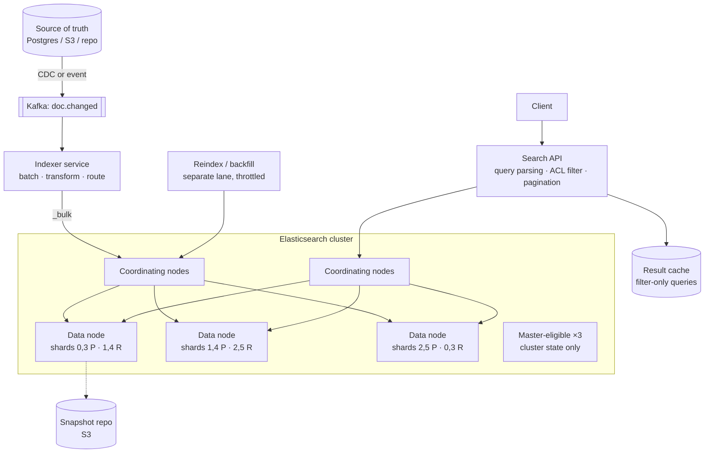
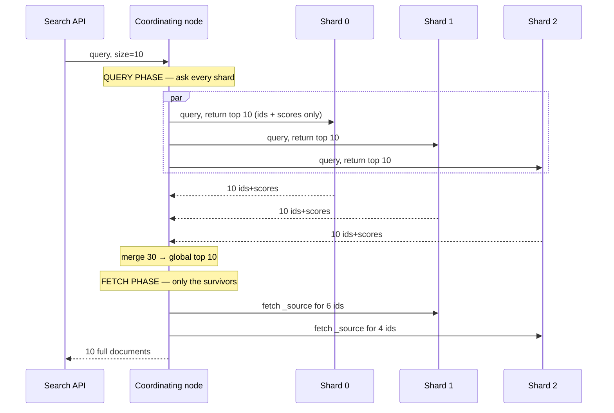

# 40. Full-Text Document Search (Elasticsearch)

[← HLD index](README.md) · [All docs](../README.md)

---

*(added, not from the notebook)*

The brief: **given a query, return every document that contains it.** Many documents may
match, and the answer is the list of all of them.

Two words in that sentence do more work than they look like they do.

**"Every."** Almost every search system you have read about returns the *top K*. That single
difference invalidates a large part of the standard playbook: you cannot early-terminate,
you cannot use block-max WAND, you cannot size a small heap and stop, and `from + size`
pagination collapses. Exhaustive retrieval and ranked retrieval are different systems wearing
the same API. The first question to ask out loud is **"how many documents can match, and does
the caller want them ranked or all of them?"** — because the honest answer for a five-million
hit result set is that this is an *export*, not a search response.

**"Contains it."** Contains what — the words anywhere in the file, or that exact line? If the
query is a phrase that must sit on one line, then the **indexing unit** is a design decision
with consequences in five directions, and it is the one most candidates never surface.

So the design is two questions, and everything else is Elasticsearch operating well:

> **What is the unit you index — the document or the line? And is the caller asking for the
> best matches, or all of them?**

- [Requirements](#requirements)
- [The indexing unit](#the-indexing-unit) ← *the load-bearing decision*
- [Why an inverted index](#why-an-inverted-index)
- [Architecture](#architecture)
- [Mappings and the analysis chain](#mappings-and-the-analysis-chain)
- [Query execution: scatter, gather, fetch](#query-execution-scatter-gather-fetch)
- [Returning *all* matches](#returning-all-matches)
- [Relevance, and when to switch it off](#relevance-and-when-to-switch-it-off)
- [Sharding](#sharding)
- [Consistency: ES is not your database](#consistency-es-is-not-your-database)
- [Scale and capacity](#scale-and-capacity)
- [Failure modes](#failure-modes)
- [Pitfalls](#pitfalls)
- [Build vs buy, and when ES is wrong](#build-vs-buy-and-when-es-is-wrong)
- [What actually fails candidates](#what-actually-fails-candidates)
- [Related](#related)

## Requirements

**i) Functional**

- (a) Index documents made of text lines, with metadata (path, author, repo, mtime, tags)
- (b) `search(query) → list of documents` containing the query
- (c) Query forms: single term, **phrase** (`"connection refused"`), boolean
  (`error AND timeout NOT test`), prefix/wildcard, and field-scoped (`author:varun`)
- (d) **Per-document evidence** — which line(s) matched, with a highlight
- (e) Filters on metadata, combinable with the text query
- (f) Return **all** matching documents (paginated or streamed), or the top K by relevance —
  the caller chooses
- (g) Documents are created, updated and deleted; the index tracks them

**ii) NFR**

- (a) **p99 < 200 ms** for a top-K query over 100 M documents
- (b) Exhaustive retrieval of a 1 M-document result set completes and does not destabilise
  the cluster — a different, explicitly weaker SLO
- (c) **Near-real-time**: a document is searchable within ~1 s of being indexed
- (d) Indexing throughput 5k docs/s sustained, 10× that during a bulk reindex
- (e) The index is **derived and rebuildable** — losing it entirely is an availability
  incident, never a data-loss incident
- (f) Result sets must be **stable across pagination** — no duplicates, no skipped documents

**Out of scope** — say it: semantic/vector retrieval (see
[35. RAG](35-rag-application.md)), personalization, the crawler or ETL that produces the
documents, and access-control design beyond the filter that enforces it.

## The indexing unit

The requirement says *"documents which have those lines"*. Match on a line, return a
document. Elasticsearch has no notion of a line, so you must choose one:

| | **Doc-per-file** (recommended) | **Doc-per-line** |
|---|---|---|
| Return the document list | direct | needs `collapse` / terms-agg on `file_id` |
| Phrase must not span line breaks | needs `position_increment_gap` | free — a line *is* the doc |
| "which line matched?" | highlighter with offsets | free, the doc is the line |
| `A AND B` **anywhere in the file** | free | expensive — a join across line-docs |
| `A AND B` **on the same line** | phrase/span/proximity query | free |
| Doc count | 100 M | ~5 B ← changes the cluster |
| Scoring | whole-file BM25, length norm across the file | per-line, then aggregate |
| Update a file | reindex 1 doc | delete + reindex N docs |

**Recommend doc-per-file** and defend it on three grounds: the caller wants files back, so
the unit of retrieval should be the unit of the answer; `A AND B anywhere in the file` is the
more common query and is free here; and 5 B line-documents is a materially larger and more
expensive cluster to run for a query shape you can get another way.

Then buy back the two things doc-per-file loses:

```json
{ "mappings": { "properties": {
    "content": {
      "type": "text",
      "analyzer": "content_analyzer",
      "position_increment_gap": 100,      // ← lines are 100 positions apart
      "index_options": "offsets"          // ← store offsets for fast highlighting
    },
    "path":   { "type": "keyword" },
    "repo":   { "type": "keyword" },
    "mtime":  { "type": "date" }
}}}
```

Index `content` as an **array of lines**, not one joined string. Elasticsearch inserts
`position_increment_gap` positions between array elements, so a phrase query with default
slop 0 physically cannot match across a line boundary — the positions are 100 apart and the
phrase requires them adjacent. That is exactly the "on one line" semantics, obtained for
free, and it is a satisfying thing to know at a whiteboard.

Highlighting then returns the matching line (the `unified` highlighter with stored offsets
avoids re-analyzing the document at query time — on large files that difference is tens of
milliseconds per hit).

**Switch to doc-per-line only when** same-line conjunction of *multiple different terms* is
the dominant query, or when lines are the thing users actually consume (log search — where
you genuinely want the line, and the "document" is a formality). Log search is the honest
counter-example, and naming it shows the decision was made rather than defaulted.

## Why an inverted index

Briefly, because the interviewer wants to hear that you know what ES is doing rather than
that you can recite it. The alternative is a scan: `WHERE content LIKE '%timeout%'` over
100 M documents reads every byte of 500 GB for every query. Even with perfect I/O that is
minutes.

An inverted index turns the question inside out. Instead of *document → its words*, store
*word → the documents containing it*:

```
"timeout"  → [ (doc 3, tf 2, pos [17, 240]), (doc 91, tf 1, pos [8]), (doc 402, …) ]
"refused"  → [ (doc 91, tf 1, pos [9]), (doc 402, …) ]
```

Now `"connection refused"` as a phrase is: fetch two posting lists, intersect them on
document id, and keep documents where a position of `refused` is exactly one greater than a
position of `connection`. Cost is proportional to the *rarest* term's posting list, not to
the corpus. That is the whole reason search engines exist, and the mechanics — posting list
iterators, leapfrog intersection, skip lists, BM25 — are the companion LLD:
[20. Inverted Index & Query Evaluator](../lld/20-inverted-index-and-query-evaluator.md).

Two properties of Lucene inherited by everything below: **segments are immutable** (a write
creates a new segment; a delete is a tombstone bit; merges reclaim), and **a shard is a
Lucene index**. Nearly every operational surprise in Elasticsearch descends from one of
those two sentences.

## Architecture



| Piece | Job | Note |
|---|---|---|
| **Indexer service** | consume changes, transform, batch into `_bulk` | never let application code call ES directly — you want one place that owns mapping, retries and batch size |
| **Search API** | parse user query, **inject the ACL filter**, own pagination | never expose ES query DSL to clients: it is an arbitrary-code-execution-shaped API (expensive scripts, deep aggregations) and it welds your clients to a mapping you want to change |
| **Coordinating nodes** | scatter, gather, merge | dedicated ones keep merge heap off the data nodes |
| **Data nodes** | shards | the actual cost |
| **Master-eligible ×3** | cluster state, shard allocation | three, always, for quorum; they hold no data |
| **Snapshot repo** | backup to S3 | plus the ability to rebuild from source, which is the real backup |

Two structural choices worth stating. **Indexing is fed from a log, not written twice**:
CDC or an event stream from the system of record, so ES is a materialized view that can be
dropped and rebuilt. And **bulk reindex runs in its own lane** with its own throttle, because
a full reindex will otherwise consume the same threadpool as live indexing and quietly push
search latency through the roof.

## Mappings and the analysis chain

The mapping is the schema, and getting it wrong is expensive to fix — you cannot change a
field's type in place, only reindex into a new index and swap an alias. **Always query
through an alias**, so a reindex is an atomic alias flip rather than a client-side migration.

The analysis chain is where "does this query match this document" is actually decided:

```
raw text
  → char filters      (strip HTML, normalize unicode)
  → tokenizer         (standard / whitespace / pattern — code needs a different one than prose)
  → token filters     (lowercase, stop words, stemming, synonyms, ascii-folding)
  → terms in the index
```

Four things that bite:

- **Index-time and query-time analysis must agree.** Stemming `running → run` at index time
  but not at query time means `running` never matches. The default is to use the same
  analyzer for both; deviate only deliberately (synonyms are the usual exception, applied at
  query time so adding a synonym does not require a reindex).
- **`text` vs `keyword` is the most common mapping mistake.** `text` is analyzed and
  searchable by word; `keyword` is a single opaque token, for exact match, sorting,
  aggregation. Most metadata fields want `keyword`; `content` wants `text`. Use a multi-field
  (`"path": {"type":"keyword","fields":{"text":{"type":"text"}}}`) when you need both.
- **Stemming and stop words are lossy and wrong for some corpora.** In code or log search,
  `error` and `errors` may be different identifiers, and stripping `not` from
  `"not found"` is a disaster. For technical corpora prefer minimal analysis: lowercase,
  no stemming, no stop words, a tokenizer that keeps `snake_case` and `kebab-case` together.
- **`dynamic: strict`.** Dynamic mapping means one document with an unexpected object field
  creates fields forever — the classic **mapping explosion**, which is a cluster-state
  problem, not a storage one, and it takes the master down. Declare the schema; reject
  surprises.

## Query execution: scatter, gather, fetch

Every search is two round trips, and knowing this explains most latency behaviour:



Consequences to state without being asked:

- **Latency is the slowest shard, not the average.** Adding shards adds tail-latency
  exposure. This is why "more shards is faster" is false past a point.
- **The query phase moves ids and scores; the fetch phase moves documents.** So `size=10` is
  cheap and `size=10000` is not — and the cost of the fetch is why you should store only what
  you display, or disable `_source` and use `docvalue_fields` for large corpora.
- **Deep pagination is quadratic-ish.** `from=100000&size=10` makes **every** shard build and
  return its top 100,010 hits, and the coordinator merges `shards × 100,010` entries in heap.
  This is why `index.max_result_window` defaults to 10,000, and raising it is the single most
  common way people take down their own cluster.
- **Scores are computed per shard.** BM25's IDF is per-shard by default, so with skewed shards
  the same document can score differently depending on where it lives. It rarely matters at
  scale; it visibly matters in small or test indices, where `dfs_query_then_fetch` (a
  preliminary round trip to collect global term statistics) is the fix.

## Returning *all* matches

The distinctive requirement. Four mechanisms, and the answer is "it depends on the size, and
you should say so":

| Result size | Mechanism | Why |
|---|---|---|
| ≤ 10k | ordinary `from`/`size` | within `max_result_window`; nothing special |
| 10k – few M | **`search_after` + PIT** | the only correct deep pagination |
| Many M, offline | **async search** or stream to object storage | this is an export job |
| Just the count | `_count` / `track_total_hits` | no fetch phase at all |

**`search_after` with a point-in-time** is the mechanism to name:

```json
POST /_pit?keep_alive=5m          →  { "id": "46ToAwMDaWR5..." }

GET  /_search
{ "pit": {"id":"46ToAwMDaWR5...", "keep_alive":"5m"},
  "size": 1000,
  "query": { ... },
  "sort": [ {"_score":"desc"}, {"_shard_doc":"asc"} ],   // ← tiebreak is mandatory
  "search_after": [ 4.213, 84772 ] }
```

Three things make this correct where `from`/`size` is not:

1. **It is a cursor, not an offset.** Each page starts from the last sort value, so per-page
   cost is constant instead of growing with depth. No shard ever builds a 100k-entry list.
2. **The PIT freezes the segments.** Without it, documents indexed or merged between pages
   cause duplicates and skips — the result set shifts underneath the caller. This is the
   "result set keeps changing" problem the [appendix](../appendix/hld.md#search) flags, and
   PIT is its answer. The cost is that frozen segments cannot be merged away, so a long
   `keep_alive` holds disk and file handles: keep it short, refresh it per page.
3. **A unique tiebreaker is required.** Sorting by score alone is not a total order; ties
   order arbitrarily and the cursor loses its place. `_shard_doc` (or any unique field) makes
   it total.

**Above a few million hits, stop calling it search.** Returning 5 M document ids is ~100 MB
of response for a user who cannot read it. The right shapes are: a **count** plus the top K
(what a user actually wants), an **async search** whose result is polled and stored, or a
**streaming export** that writes ids to object storage and returns a link. Say this explicitly
— recognising that the requirement as literally stated is an export API rather than a search
API is the senior move, and the design changes accordingly (throttled, off the interactive
tier, cancellable, with its own SLO).

Also note `track_total_hits`: since ES 7.x, the default caps counting at 10,000 (`"gte"`)
precisely because counting *all* matches forbids early termination. Exhaustive counting costs
real CPU — make it opt-in, per query.

## Relevance, and when to switch it off

Default scoring is **BM25** — TF-IDF's better-behaved successor. The appendix's `TF × 1/DF`
shorthand is the idea; BM25 adds two corrections that matter:

- **Term-frequency saturation** (`k1`): the 50th occurrence of "timeout" in a file adds
  almost nothing over the 10th. Raw TF ranks long repetitive files above relevant ones.
- **Length normalization** (`b`): a hit in a 20-line file means more than a hit in a
  20,000-line file.

Practical levers, in the order to reach for them: per-field boosts (`title^3`), `multi_match`
with `best_fields` vs `cross_fields`, phrase-match boosting via `match_phrase` in a `should`,
recency decay with a `function_score` on `mtime`, and `rank_feature` for a precomputed
popularity signal.

**The most useful relevance decision, though, is to turn it off.** In a `filter` context ES
computes no score, and — because the answer is a bitset — it caches the result. For
`repo:foo AND mtime > X` there is nothing to rank, so:

```json
{ "query": { "bool": {
    "must":   [ { "match_phrase": { "content": "connection refused" } } ],
    "filter": [ { "term": { "repo": "payments" } },
                { "range": { "mtime": { "gte": "now-30d" } } } ] } } }
```

Filters are cached, reusable across queries, and orders of magnitude cheaper. Putting a
metadata predicate in `must` instead of `filter` — paying for scoring on something that
cannot be more or less relevant — is one of the most common and most invisible performance
bugs in a real ES deployment. And for an exhaustive "return everything that matches"
retrieval, the *whole query* often belongs in filter context, since nothing is being ranked
at all.

## Sharding

The decision people get wrong in both directions.

**A shard is a Lucene index with real fixed costs** — heap for its terms dictionary, file
handles, a merge thread, its own segment set, and a slot in every scatter-gather. Two rules:

- **Target 20–50 GB per shard.** Below ~10 GB the per-shard overhead dominates; above ~50 GB
  recovery, relocation and merges get slow.
- **Aim for < 20 shards per GB of heap**, cluster-wide. Thousands of tiny shards is the most
  common self-inflicted ES outage: cluster state grows, the master struggles, and every query
  fans out to hundreds of shards to do nothing.

For 100 M documents at ~300 GB indexed: **8–10 primaries, 1 replica**. Primary count is fixed
at creation (routing is `hash(_routing) % num_primaries`), so choose for 2–3× your projected
growth, and plan to reindex behind an alias rather than trying to be clever.

**Routing is the lever most people miss.** By default a search hits every shard. If queries
are almost always scoped — one tenant, one repo — route documents by that key
(`?routing=repo_id`) and the query touches **one shard instead of ten**: 10× less work, no
tail-latency amplification, and linear scaling by adding shards rather than sublinear. The
cost is skew (one enormous tenant makes one enormous shard) and that you must remember to
pass the routing key on every read. For a multi-tenant document search this is usually the
single biggest win available.

Time-based corpora (logs) want the other shape: **rollover indices** by day or size behind an
alias, with searches restricted by date so old indices are never touched, and an ILM policy
moving them hot → warm → cold → delete. Deleting a whole index is free; deleting a billion
documents by query is not.

## Consistency: ES is not your database

The most important operational sentence: **Elasticsearch is a derived index, not a system of
record.** Write to the primary store, then propagate.

**Refresh, flush, merge** — three different things routinely conflated:

| | What it does | Cadence | Meaning |
|---|---|---|---|
| **refresh** | makes the in-memory buffer into a searchable segment | 1 s default | *visibility* — this is why ES is "near real time" |
| **flush** | fsyncs the translog, commits segments | ~30 min / 512 MB | *durability* — the translog is fsynced per request by default, so an ack means durable |
| **merge** | combines small segments, drops tombstones | background | *efficiency* — and the source of write amplification |

**Read-your-writes does not hold by default.** Index a document, search immediately, and it
is missing for up to a second. If a user must see their own edit, use `?refresh=wait_for`
(waits for the next scheduled refresh — cheap) rather than `?refresh=true` (forces one — a
new tiny segment per call, which will destroy your merge budget), or read that one document
by id with a `GET`, which is real-time because it consults the translog.

**During a bulk reindex, set `refresh_interval: -1` and `number_of_replicas: 0`**, then
restore both and force-merge. Refreshing every second while writing at 50k docs/s creates
segments faster than merges can reclaim them; this one change is routinely a 2–3× indexing
speedup.

**Deletes are tombstones.** A deleted document occupies space and is filtered at query time
until a merge rewrites its segment. A workload with heavy updates (an update is
delete + insert) will silently carry 30–40 % deleted documents. Watch `docs.deleted`.

**Dual-write is the trap.** Writing to Postgres and ES from the same request handler means
the second write can fail and leave them permanently divergent, with no mechanism to notice.
Use CDC or the transactional outbox — the same pattern as
[OMS](../lld/17-order-management-system.md) — plus a periodic reconciliation sweep comparing
counts and checksums by shard key. The failure mode without it is not an outage; it is a
search index that has been quietly wrong for six months.

## Scale and capacity

| | |
|---|---|
| Documents | 100 M, avg 5 KB text → **~500 GB raw** |
| Inverted index with positions | ~30 % of text → **~150 GB** |
| `_source` (compressed) + doc values | ~150 GB |
| **Primary index size** | **~300 GB** |
| Replicas ×1 | **600 GB** total on disk |
| Shards | 10 primaries @ ~30 GB + 10 replicas |
| Data nodes | **6 × (64 GB RAM / 31 GB heap, 1 TB NVMe)** — headroom for merges and page cache |
| Search | 1k QPS, p99 < 200 ms |
| Indexing | 5k docs/s ≈ 25 MB/s, bursting 10× on reindex |

Two sizing rules to state:

- **Heap is capped at ~31 GB** (compressed ordinary object pointers), and the rest of RAM is
  more valuable as OS page cache for segment files than as heap. A 128 GB machine runs 31 GB
  heap and gives ~90 GB to the page cache; that cache is why searches are fast.
- **Disk is not the constraint people expect** — merges need free space to write the merged
  segment before deleting the inputs, so plan for 50 % headroom, not 10 %.

## Failure modes

| | What happens | Mitigation |
|---|---|---|
| **Hot shard** | one tenant/repo dominates a routed shard | detect skew, split that tenant into its own index, or drop routing for them |
| **Deep pagination** | coordinator OOM merging `shards × from` hits | enforce `max_result_window`; reject deep `from` at the API layer and hand back a PIT cursor |
| **Mapping explosion** | dynamic fields grow cluster state until the master degrades | `dynamic: strict`, `index.mapping.total_fields.limit` |
| **Merge storm** | forced refreshes or heavy deletes create segments faster than merges reclaim | throttle refresh, batch writes, watch `segments.count` |
| **Node loss** | shards go yellow, then reallocate and copy | replicas ≥ 1, and `delayed_timeout` so a rolling restart doesn't trigger a full rebalance |
| **Red cluster** | a primary is unassigned; that slice of data is unsearchable | snapshots for restore, and the source of truth for rebuild |
| **Expensive query** | a leading-wildcard or huge regex scans the whole terms dictionary | never expose the DSL; validate and reject at the API layer; `search.allow_expensive_queries: false` |
| **Bulk reindex starving search** | shared threadpools | separate lane, throttled, or reindex into a separate cluster and swap |

## Pitfalls

1. **Treating ES as the system of record.** No transactions, eventual visibility, and a
   mapping change means a reindex.
2. **Dual-writing** from the application instead of CDC/outbox.
3. **`from`/`size` deep pagination** instead of `search_after` + PIT.
4. **Forgetting the tiebreaker** in `search_after`, so pages silently skip and duplicate.
5. **Metadata predicates in `must`** instead of `filter` — paying to score what cannot be
   scored, and losing the filter cache.
6. **Over-sharding.** Hundreds of small shards for "scalability."
7. **`?refresh=true` on every write**, then wondering why merges never keep up.
8. **Dynamic mapping in production.**
9. **Analyzer mismatch** between index and query time.
10. **Stemming and stop words applied to code or logs**, where `not` and `errors` are meaningful.
11. **Ignoring `docs.deleted`** on an update-heavy index.
12. **Returning millions of hits through the interactive search path** rather than an export.

## Build vs buy, and when ES is wrong

| Situation | Answer |
|---|---|
| < 1 M documents, search is a feature not the product | **Postgres full-text** (`tsvector` + GIN). One store, real transactions, no sync problem. The correct answer far more often than it is given. |
| Embedded, single-node, no ops | **Lucene directly**, or SQLite FTS5 / Tantivy |
| 10 M – billions, faceting, aggregations, ops team exists | **Elasticsearch / OpenSearch** |
| Relevance is the product; you need learning-to-rank and hybrid retrieval in the engine | **Vespa** — better at ranking-as-a-first-class-concern |
| Meaning, not words | **Vector search** — a different index, usually *hybrid* with BM25, not instead of it |

**When ES is the wrong answer:** as a primary datastore; when you need joins (denormalize or
don't use it); when writes dominate reads; when the corpus fits comfortably in Postgres; when
you need strict consistency; and when what you actually wanted was exact-match lookup on a
key — that is a hash index, not a search engine.

## What actually fails candidates

- **Not asking whether "all documents" means all**, and designing a top-K system for an
  exhaustive requirement — or an export pipeline for what was really a top-10 query.
- **Never choosing the indexing unit** — document vs line — and so having no answer for
  "must the phrase be on one line?"
- Not knowing that **`from`/`size` deep paging is O(shards × from)**, or that
  `search_after` needs a PIT *and* a tiebreaker.
- **`must` vs `filter`** — not knowing that one scores and caches and the other does not.
- Treating ES as **durable and authoritative**, with no rebuild story.
- Not knowing what **refresh** is, and therefore claiming read-your-writes.
- **Sharding by intuition** rather than by target shard size, and never mentioning routing.
- No answer for **reindexing behind an alias** when the mapping must change — which it will.

## Related

- [28. FB Post Search](28-fb-post-search.md) — the same engine applied to a social corpus
- [35. RAG Application](35-rag-application.md) — the vector half; hybrid BM25 + kNN retrieval
- [39. Search Autocomplete with Relevance](39-search-autocomplete.md) — suggesting *queries*,
  where this design finds *documents*; the two sit behind the same search box
- [26. Web Crawler](26-web-crawler.md) · [20. News Aggregator](20-news-aggregator.md) — how the
  corpus gets built
- [03. Yelp](03-yelp.md) · [05. TicketMaster](05-ticketmaster.md) — ES as the search tier over
  a relational source of truth
- [20. Inverted Index & Query Evaluator (LLD)](../lld/20-inverted-index-and-query-evaluator.md)
  — the internals: posting lists, leapfrog intersection, phrase matching, BM25, and why
  "return all" forbids the fastest optimizations
- [17. Order Management System (LLD)](../lld/17-order-management-system.md) — the outbox
  pattern that keeps the index in sync with the source of truth
- [HLD appendix → Elasticsearch](../appendix/hld.md#1-elastic-search-eventual-consistent) —
  mappings, node roles, DocValues, the indexing/search sequence
- [Database decision list](../appendix/database-decision-list.md) — when full-text search
  justifies a second store at all
