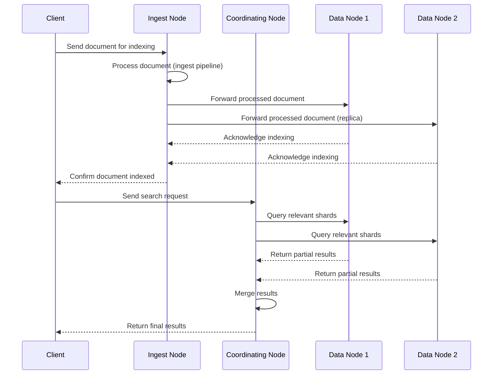

# HLD Appendix — Notes

*Transcribed from handwritten Xournal++ notebook (`hld_appendix.xopp`), 24 pages.*

---

## A) Different Types of Consistencies
- Linearizability
- Serializability, etc.

Start with simple to complex.

### 1) Single Node, with single thread

**Solves:** 100% consistent, simple

**Problems:**
1. Fault tolerance (availability) — what if the node goes down?
2. Not scalable
   - Load handling (read/write requests)
   - Storage limited to single node

### 2) Single Leader + Replica (Asynchronous)

**Solves:**
- Node failure
- Better throughput if reads allowed from replica (for high availability)

**Problems:**
1. Consistency
   - Lost writes during node failure
   - Replica lags — read-your-writes violated
2. Throughput
   - Reads limited to master + replica
   - Writes limited

### 3) Single Node + Replica (Synchronous)
→ Client requests write
→ Write to leader (WAL) → Write to replica (WAL)
→ Replica ACK → Leader commits write
→ Client ACK

**Solves:**
- Node failure
- Consistency (read/writes from leader)

Read your writes ✓

**Alternative:** Client waits till replica catches [up]
Eg: write at ts:105. Future reads require replica ts ≥ 105.
Read your writes ✓

**Problems:**
1. Latency — client has to wait for replica to write & ACK
2. Throughput — single-threaded read/write ops from leader is bottleneck

### 4) Single Node with multiple thread

**Solves:** to scale read/writes, multiple transactions executed concurrently (poor throughput)

**Problems:**
- (a) Check-then-act. Eg: seat booking.
- (b) Read-Modify-Write. Eg: bank account balance, counters.
  Two transactions "race" to update same data object.

**Solution:**
- Pessimistic concurrency control (locking)
- Optimistic concurrency control (rollback)
- MVCC

*(Isolation levels are discussed in depth in google sheet HLD cheatsheet)*

**Problems:**
1. Vertical scaling limitation
   - CPU threads limited
   - RAM limited
   - Storage limited

### 5) Partitioning (Sharding)

**Solves:** This solves vertical limits by horizontally scaling the database — scales storage, queries (throughput), latency (geo-located)

**Considerations**
1. How to partition — hot partitioning
2. Query routing? — how to route query to exact node?

- Partition/Shard key
- Consistent hashing
- Service discovery (when node joins/fails)

**Problems**
1. Query latency — some queries which are cross-shard (joins)
2. Fault tolerance — what if a node goes down?

### 6) Sharding + Replication (Leaderless)
— Cassandra

**Solves**
Availability
- By replicating shard, if a shard fails automatic failover is performed
- It uses consistent hashing

We can define:
- partition-key — MD5 used to consistent-hash
- primary-key: this MUST include partition-key

**Tunable consistency** based on quorum reads & quorum writes

1. Quorum write (W) aka write concern
   - How many nodes to ACK for write to be successful
2. Read concern (R) aka read concern
   - R nodes are read and replica with latest value returned

**Guarantee:** latest committed value is read
If write is acknowledged by quorum (W), any read will return value ≥ [that write]
(monotonic visibility)

Since any node can accept writes, **Not guaranteed:** linearizability OR global ordering.

Two concurrent writes by independent replicas:
```
ts:100 A: 10 write
ts:100 B: 20 write
```
C: non-deterministic (either 10 or 20). Eg applies 20, then 10.

**Why linearizability is problem?** (violation)
1. Last write-wins can lose updates
   - Eg: counter can change 99, 101, 100
   - Bank balance can change
2. Stale reads
   - Based on when client quorum reads, value of data is non-deterministic (inconsistent downstream)

**Not guaranteed:** transactional support — ACID

**Problems:** (Not guaranteed)
- Linearizability — LWW, stale reads, lost update
- Transaction support — multi-key modifications not atomic

⭐ When we refer linearizability, it is on single object.
*(Note: Lightweight Transactions (LWT) add linearizability for single partition/key by Paxos. They do not make it ACID.)*

No 2PC or MVCC.

### 7) Sharding + Replication (Leader-based)
Spanner / CockroachDB

- Linearizable writes
- 2PC commit (solves atomicity)
- Locking or MVCC

It guarantees strong consistency. It is leader-based, single leader/region and replicas (linearizability + serializability).

**How?**
1. Replication consensus — RAFT
2. Leader-based
3. MVCC
4. Global timestamp — Hybrid Logical Clocks
5. Concurrency control — detect conflicts (MVCC + SSI or locking + global timestamp)
6. Atomic commit — all or none transaction. 2PC.

### Linearizability guarantee
1. Replication log consensus
   - On leader-election
   - On every write (majority ACK)
2. Leader based — a single ordering for writes
3. Correct read protocol
   - (a) Read leader-only (not scalable)
   - (b) Global timestamp + allow read replicas

By having global timestamp, replica can wait while performing a read for local replica log to catch-up.

Eg:
```
replica-log ts:120
read         ts:110  ✓ (as of timestamp)

replica-log ts:120
read         ts:125  ✗
```

"As of timestamp" provided by transaction or client.
- If still need freshness guarantee, route reads to **leader**.

### Serializability guarantee
Concurrency control + atomic commit.

---

## B) Technologies

### 1) Elastic Search (eventual consistent)
- Criteria
- Sort by?
⇒ Results

Documents: JSON blobs / PDF

Define fields & types (Mappings)
- title: text
- price: float

```
// PUT /books: {
  shards
  replicas
}

/books/_mappings  // nested definition of fields
```

Supported types: keyword (exact match), date, text (enum), nested (arrays with objects)

### Ingestion
```
// POST /books/_doc
// PUT /books/_doc/:docId  ?versionNo
// POST /books/_update
```

### Search
```
GET /books/_search
```
- Return: entire document/specific field, **relevance score**
- Sort by: with formula, nested object, exact fields, OR score (relevance)
  - TF-IDF
  - Doc1: how many "elastic" — TF
  - `TF × 1/(# doc frequency)` (where term appears)

- Limit + pagination
  - Stateful pagination — server state (cursor)
  - Stateless — client offset. `offset, limit` / `timestamp After, id` (preferable, more efficient)

**What if result set keeps changing?**
- Result set constantly added, deleted
- Snapshot: create — PIT (point-in-time), `keep-alive = 1m` (TTL)

### When to use?
- It's **not** primary DB — ✗ durable, ✗ available guarantees
- Best read-heavy (not frequent writes)
- Eventual consistent
- Denormalize data, no joins
- Really need it? — text search, billion documents

### Nodes
- **Master** (leader): admin, overlook nodes, create indexes
- **Coordinator** (API): accept requests
- **Data**: indexes + doc
- **Ingest**: analysis, CPU bound
- **ML**

Sharding ↑ throughput — load balancing

Segment writes: immutable. SST + LSM + soft deletes.

**Segment Documents**
```
id: 12 {}
id: 53 {}
```
**Index** (inverted index): `lazy: [12, 5]`

Cleaning = parsing + tokenization + stemming + lemmatization

Keep columnar fields for **fast** querying.
Eg: sort by price.
In index store, create full-flattened columnar store for **all** doc fields.
Name: **DocValues**

Optimization: query optimizations planner, push-down predicate.

### Elasticsearch Indexing & Search Sequence Diagram



### 2) Cassandra
- Scalable + fault tolerant
- Highly available + low latency R/W

✗ joins, ✗ consistency

**Keyspace**: # replicas
- Tables, flexible columns
- Rows: PK
- Columns: name

Wide columnar store. Lot of columns null.

```
Client → Server → Node1
                 → Node2
                 → Node3
```
Use consistent-hashing.

**Primary-Key** = Partition-key : clustering-key (sort-key)
Eg: primary-key: user_id + message_id

Tunable consistency: ONE, QUORUM, ALL

- Partitioning + consistent-hashing
- Replication
- Gossip & leaderless design
- Tunable consistency

✗ Coordinator — client contacts **any** node.

```
Client --write req--> CommitLog (WAL) — (Durability)
                    → Memtable --flush--> SSTable (append-only + compaction)
```

read → check Memtable + SSTable (fast) — bloom-filters

### Data Model (aka query driven)
- Denormalize, avoid joins (since reads are incredibly slow!)

Duplication is fine — Post table, User table (parallel)

**Use when:**
- High writes (100k+ rps)
- Write >> read
- Predictable, limited query patterns

Eg:
1. Get all posts/user
2. Activity feeds
3. Timeseries
4. Messaging systems
5. Event log

**Don't use**
- Flexible/custom queries
- Need strong consistency

✗ Adhoc analytics
✗ Complex joins. No consistency cross-table.
✗ Cross-partition consistency
✗ ACID ✗ transactions

### 3) Kafka
- Ordering issue
- Partition by business-key
- Lot of events — consumer lag
- Consumer group — multiple consumers (guaranteed processed by 1 consumer)

- Topics: write to a topic, read from topic

**Broker**: holds the "queue" (server)
**Partition**: ordered, immutable sequence-log file
**Topic**: a logical [grouping] of partitions

Producers, Consumers — max parallelism ≤ # partitions. Partition by key ↓

**Message**: headers, key, value, timestamp

Periodically commit offset (auto-commit)
Leader-follower replica (durability)

**Auto-commit is dangerous.**
Better: `poll()`, `sendMessage` (SQS) → wait for success → `commitSync()`
Eg with SQS

### When to use Kafka?
- Processing can be done async
- In-order message processing. Eg: TicketMaster.
- Decouple producer & consumer (different needs for scaling). Eg: online judge submissions.
- Ad-click aggregator — infinite stream of input data (Flink)
- FB live comments — pub-sub, fan-out

**Kafka deep-dive**
1. Scalability
2. Fault tolerance (durability)
3. Errors, retries
4. Performance optimizations
5. Retention

**Scale:** 1MB/message, 1 broker (TB, 10k rps) — good partition key + more brokers.

**Hot partitions**
- Remove key? Compound-key: `ad + user_id`
- Partition-key salting
- Backpressure, slow down producer

**Settings**
`acks = all` — always available
`replication factor = 3`

Consumer: commit offset correctly

**Producer Retries:** n/w issues. Retry 5, `idempotent=true`.

**Consumer Retries** (not natively supported in Kafka)
- Main topic
- Retry topic       } SQS handles it via visibility timeout
- DLQ topic

**Performance:** compress + batch messages.

**Retention Policy**
- `retention.ms` (time)
- `retention.bytes` (based on size)

