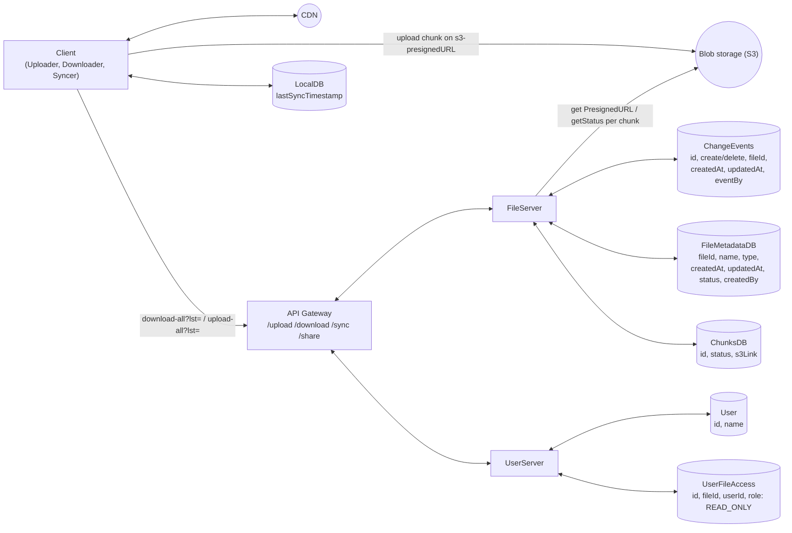
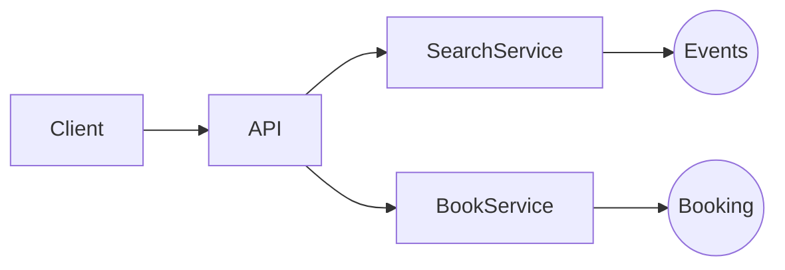

# HLD Problems — Notes

*Transcribed from handwritten Xournal++ notebook (`hld_problems.xopp`), 74 pages.*

## Table of Contents

- [HLD Interview Framework](#page-1--hld-interview-framework)
1. [Bit.ly (URL Shortener)](#problem-1--bitly-url-shortener--1h) — 1h
2. [Dropbox](#problem-2--dropbox--8h) — 8h *(with architecture diagram)*
3. [Yelp](#problem-3--yelp--4h) — 4h *(title only)*
4. [Local Delivery Service](#problem-4--local-delivery-service) *(title only)*
5. [TicketMaster](#problem-5--design-a-ticketmaster--8h) — 8h *(with architecture diagram)*
6. [Instagram](#problem-6--instagram--6h) — 6h
7. [FB News Feed](#problem-7--fb-news-feed) *(title only)*
8. [Tinder](#problem-8--tinder--2h) — 2h *(title only)*
9. [Leetcode](#problem-9--leetcode--3h) — 3h *(title only)*
10. [WhatsApp](#problem-10--whatsapp--18h) — 18h
11. [Strava](#problem-11--strava--1h) — 1h *(title only)*
12. [Distributed Cache](#problem-12--distributed-cache--1h) — 1h *(title only)*
13. [Rate Limiter](#problem-13--rate-limiter--12h) — 12h
14. [Online Auction](#problem-14--online-auction--4h) — 4h *(title only)*
17. [YouTube](#problem-17--youtube--4h) — 4h
18. [Job Scheduler](#problem-18--job-scheduler--14h) — 14h
19. [FB Live Comments](#problem-19--fb-live-comments--2h) — 2h *(title only)*
20. [News Aggregator](#problem-20--news-aggregator--6h) — 6h
21. [Price Tracking Service](#problem-21--price-tracking-service--1h) — 1h *(title only)*
22. [YouTube Top K](#problem-22--youtube-top-k--9h) — 9h
23. [Uber](#problem-23--uber--4h) — 4h
24. [Robinhood](#problem-24--robinhood--1h) — 1h *(title only)*
25. [Google Docs](#problem-25--google-docs--5h) — 5h
26. [Web Crawler](#problem-26--web-crawler--5h) — 5h
27. [Ad Click Aggregator](#problem-27--ad-click-aggregator--3h) — 3h
28. [FB Post Search](#problem-28--fb-post-search--3h) — 3h *(title only)*
29. [Payment System](#problem-29--payment-system--1h) — 1h
30. [Metrics Monitoring](#problem-30--metrics-monitoring) *(title only)*
31. [Online Chess](#problem-31--online-chess) *(title only)*
32. [ChatGPT](#problem-32--chatgpt) *(title only)*
33. [Notification System](#problem-33--notification-system--11h) — 11h
34. [Game Leaderboard](#problem-34--game-leaderboard--3h) — 3h *(title only)*
35. [RAG Application with Ingestion Pipeline](#problem-35--rag-application-with-ingestion-pipeline)

*Note: problems 15, 16 are not present in the notebook — numbering jumps from 14 to 17 in the original notes. Problem 33 was labeled "B1" and 34/35 as "B2"/"B3" in the source, likely denoting a second batch — renumbered here as 33-35 for continuity.*

---

## Page 1 — HLD Interview Framework

### HLD interview flow
- What features?
- Is it similar to something?
- Scope functional requirements
- Scope NFR (capacity / scale?)
- API
- Entities
- Observations

### HLD diagram
1. Start with API's, services & databases (simple)
   - Naturally identify cache, queue and where it is needed
2. Note database fields
   - — — Functional — — —
3. NFR
   - Add cache
   - Add queue
   - CDN
   - Maybe break service

### NFR checklist: SCALE for cloud designs
| | |
|---|---|
| Scalability | Fault tolerance |
| CAP | Compliance |
| Latency | Durability / Cloud Designs |
| Environment (special) | Security |

CDS

---

## Problem 1 — Bit.ly (URL Shortener) — 1h

- Given a URL, shorten it. Optionally, custom alias. Also analytics, like hits for URLs.
- When user uses the short URL, redirect to the original one.
- Solve for main website
- Verification of website out of scope

### Functional requirements
1. Client requests for a URL to shorten; return shortened URL. Optionally custom-alias.
2. When any client hits the shortened URL, redirect to long URL.
3. For a URL, give analytics — # hits

### NFR
- Consistency in URL mappings. At a time, exactly one short URL mapped.
- Availability — uptime should be high, 5 9's
- Latency — minimal, sub-millisecond
- Durability — should not lose mappings
- Scalability — 10k/s reads, 100 writes
- Consistency for hits: tolerable

### Observation
Read heavy: 100:1

### Out of scope
Analytics

### API
```
PUT /shorten {
  url: <my-url>
} → hash + alias

PUT /shorten {
  url: <my-url>
  alias
} → error / result

GET/POST bit.ly/<hash> {
} → analytics

GET /analytics/<hash>
→ Analytic
```

### Entities
- URL
- ShortURL
- Analytics

### Deep dive Q&A
1. **Consistency in URL mappings? Uniqueness**
   - When user requests to shorten URL: PUT request (idempotent)
   - Check if hash/custom-alias exists → error out, or treat it as upsert

2. **How durability is ensured for URL mappings?**
   - Store in distributed + replicated + strongly consistent leader-based DB
   - Write to cache later (write-around)

3. **Latency** is < 1ms for redirection

4. **Scalability** — need to scale cache, index horizontally. LB + horizontal-scale service.
   - 1B rows, single Postgres with replicas is sufficient (1GB × 1KB)

### Summary
- Use MD5 hash (+ custom-alias) + PUT + DB to achieve uniqueness.
- Use cache for GET (fast redirects).
- For 1B URLs, single Postgres + replica sufficient.
- Use cache to track hits, write to analytics DB periodically — CDC + Flink.

---

## Problem 2 — Dropbox — 8h(?)

### Scoping
- Cloud-based service
- Store & share files
- Secure, reliable access to files across devices

- User can upload file
  - Max size?
  - Concurrent users?
  - Scale/load?
- CAP? Define: C — any kind of stale (during partition), A — obsolete
- Multiple users can download a file; access restriction to be modeled
- Key characteristics: latency + CAP + security + scale + concurrency

### Functional
- User can upload a file from any device
- User can download file from any device
- User can give access (view) to other users
- User can sync files

### NFR
- System should be highly available
- Secure
- Low latency
- Scale: 50 GB

### Out of scope
- UI
- Edit files
- Limits
- Pricing etc.

### HLD Diagram



**Notes on FileServer:**
- `upload` → return presignedURL
- `download` → return stream (get file, get chunks)

**Notes on Client sub-components:**
- Uploader chunks the file
- Downloader (supported in browser) returns stream of file, multi-part

### Questions
1. S3 presigned possible?
2. S3 callback on complete (webhook) — reliable?
3. How to enable user access?
   - Maintain access table (indexed on file, indexed on user)
   - Support: (a) for a user, `getAllFiles`; (b) for a file, `getAllUsers`
   - More preferred: index on file
   - Why not store in metadata? — Difficult to perform `getAllFiles`.
4. How to automatically sync (Remote → Local)
   1. Keep a local DB which has `lastSync`
   2. Always pull before upload
   3. Keep a history of file change events

   `FileChangeEvent { CREATE, DELETE }` → File / FileMetadata / eventAt (indexed)

> ⭐ This is a product-like question. Go one by one through functional requirements.

### Core entities
- User
- File
- FileMetadata

### API
*Tip: File resource can be made RESTFUL*

```
- headers: user-token
POST /upload {
  File
  FileMeta
}

- headers: user-token
GET /download {
  fileId
} → File (Object downloaded)

/share {
  File
  users: []
}

/sync {
  lastSuccessfulUpdate
} → ChangeEvent[]
```

### Storage
1. FileMeta — Postgres (simple, reliable, fixed attributes, simple fast reads, low latency)
2. File — Blob storage (S3) → cheap

### Local → Remote sync
1. Have a watcher-agent installed. Call `/upload` API for any change.

### Deep dive
**1) How to support large file?**
- Chunking (S3 has inbuilt limit 10MB)
- Break the file via client utility
- Upload part-part to S3
- Collect the acknowledgements from FileChunks DB
- Return progress to user
- In case of n/w failures → **support resume**: return FileChunks object to client so that missing parts are re-uploaded.

**Complete Multipart Upload:** S3 reassembles the file and returns `completeMultipart` flag

**Download large file:** HTTP natively supports **Range requests**

**2) How to make upload/download faster?**
- Compression
- CDN (caching)
- Chunking (parallel upload/download)

**3) How to ensure file security**
- HTTPS (client-server encryption)
- S3 storage encryption
- ACL-based token access with expiry

### Summary
- Split File, FileMeta, FileChunks, Blob
- Chunking → resumable downloads, large file (both download/upload)
- Latency: CDN, compression, chunking
- Secured access control, e2e security
- Syncing across devices — change events

---

## Problem 3 — Yelp — 4h
*(title only in notes — no further detail recorded)*

---

## Problem 4 — Local Delivery Service
*(title only in notes — no further detail recorded)*

---

## Problem 5 — Design a TicketMaster — 8h

- Purchase tickets: concerts, events, theatre
- Concurrency?
- Consistency > Availability?
- Latency
- User experience — HOLD?

- Book a ticket
- View booked ticket
- View all events (based on location/city) → `getAllEvents`
- Search for event → `getAllEvents`

### Functional requirements
1. Given selected event, book tickets
2. View all events (in a city)
3. Search for event (based on search string)

### Out of scope
- Payment flow
- Admin (add, update events)
- Dynamic pricing
- Security

### Non-functional requirements
1. Consistency: users should have at least write consistency, no double booking
2. Fast read/write latency (search/book < 50ms)
3. Support for concurrency
4. Can HOLD tickets for some time
5. Support scale (10M users)

### Observations
- Low contention
- Can have peak load — popular events
- Read heavy (100:1)

### Entities
- **User**
- **Event** (List\<Seat\>, sTime, eTime, name, location)
- **Book** (user, List\<Seats\>, event)
- **Booking/Order** { List\<Ticket\> ← price × discount, byUser, event, venue }
- **Ticket** { event, seat, (bearer) }

### API
```
Book tickets:
POST /events/:eventId {
  List<Seat>
  user
} → Ticket

GET /events/search {
  searchText
} → elastic

View:
GET /events/search {
  city
} → event[]

View Seats:
GET /events/:id
→ Seat[]
```

### HLD Diagram


### Deep dive
**1) How to ensure no double booking at this scale? + Fault tolerance**
- ACID distributed DB + Replica
- When payment successful, mark seats
- Generate/book tickets

**2) How to ensure quick search (text, location)**
- Elastic search — title, text, city
- Built on top of events
- Break events & seats

**3) How to handle popular event with scale — 10M concurrent requests?**
- Cache
- HOLD locks — to block duplicate requests for some seats
- Horizontal scale app + Load Balancer

**4) How to improve the booking experience by reserving tickets?**
- Distributed locking with TTL. Implement HOLD locks on event with expiry.

**5) Good experience with high demand seat booking?**
- Seat already booked as they repeatedly click
- Virtual queue to **control**/rate-limit access to popular events

**6) Ensure low-latency for search?**
- Elastic search — but venue

**7) Reduce search query compute — cache results**

### Summary
- Strong consistent distributed DB to avoid double booking
- Distributed HOLD locks for good UX
- Elastic search — text, venue
- Cache for popular reads
- CDN? for images of static content

---

## Problem 6 — Instagram — 6h

Social media, focused on visual content, allowing users to share photos & videos with followers.
- Share photos & videos
- Follow other content
- Show feed
- Fast load times
- Different quality support?
- Different devices, notify?
- Infinite scroll?
- Archival?
- Any specific order for scrolling?

### Functional requirements
1. User should be able to post
2. User should be able to follow other users
3. User gets feed for followed users (chronological, ascending)

### NFR
1. Latency of feed minimal < 50ms. Load/play video/images quickly.
2. Availability: uptime 5 9's
3. Scale:
4. History limit — 1 year? Irrelevant

### Out of scope
- Security
- Comments, likes

### Observations
- Celebrity problem

### API
```
POST /post/create {
  text
  image/video
} → Post
Header: user

PUT /follow {
  user
}
Header: user

GET /feed → Post[]
  ?page=
```

### Deep dive
**1) System should deliver content with low latency (< 500ms)**
- Fan-out write (inbox pattern)
- The feeds DB is a redis cache, which is reverse-chronologically sorted
- For celebrity — perform fan-out on read
- **Hybrid**: fan-out-write + fan-out-read
  - Shard by user_id, sort-key createdAt in Redis

**2) The system should render photos/videos instantly**
- S3 + CDN optimization + prefetch posts in the app
- Additional: quality support, compression, adaptive algorithms

**3) System should be scalable to 500M DAU**
- Distributed DB — Posts
- Feed service scaling
- Extract media to blob storage
- Indexing by user_id, post_id

---

## Problem 7 — FB News Feed
*(title only in notes — no further detail recorded)*

---

## Problem 8 — Tinder — 2h
*(title only in notes — no further detail recorded)*

---

## Problem 9 — Leetcode — 3h
*(title only in notes — no further detail recorded)*

---

## Problem 10 — WhatsApp — 18h(?)

- Send & receive messages & calls from phone/computer
- Users are able to send messages to group or single user. Notify them, view messages.
- Messages should be in order
- Should not be lost (Durability)
- Available system. Security, low latency
- Local DB storage? History view?
- Multiple devices

### Functional Requirements
1. User should be [able to] send/calls in group
2. User should be able to create groups
3. When user sends, notify to other users (if user offline, sync when online)
4. Support for media

### NFR
1. Durability — not hard. Only when user joins on phone storage. (Max 30 days)
2. Low latency < 500ms
3. Consistency — message should be in order
4. Scalability: 10k/sec writes, 100k reads. Limited by phone storage.

### Out of scope
- UI
- Storage-full warnings
- Security — E2E encryption

### API
```
i) X-Header: user_id
POST /message {
  group_id
  text
  image/video
} → success

ii) X-header: user_id
GET /sync?lastTimestamp
→ ChangeEvent[]

iii) X-header: group_id
PUT /groups/create {
  userId[]
  name
} → Group
```
*Treat 1:1 & group as same*

### Deep dive
**1) Handle billions of users simultaneously?**
- Outbox DB
- Simultaneously write to Redis Pub/Sub; subscribers by receiver user_id.
- Use websockets for real-time message consumption — **Redis pub/sub + websockets** (reduce latency)

**2) Partition by chat or user?**
- Normal case: multiple chats around 250, most of them 1:1, one of them 100 participants
- Partition by user: #users = channels
- Partition by chat: #users × 250 = channels

**3) What if multiple clients for a user?**
- User must register device
- Now the broadcast will happen for each user/device. Limit it to 3 maybe.

**4) What if websocket fails? What if Redis fails?**
- Client will periodically call `/sync`

**5) Handle out-of-order message?**
- We don't! We have to partition by group_id.

### Summary
- Use Outbox pattern, partitioned by user_id
- Use Redis pub/sub for optimization
- Separate GroupManagement, MessageService, BroadcastService
- No need to handle out-of-order

---

## Problem 11 — Strava — 1h
*(title only in notes — no further detail recorded)*

---

## Problem 12 — Distributed Cache — 1h
*(title only in notes — no further detail recorded)*

---

## Problem 13 — Rate Limiter — 12h(?)

Controls request, 4xx — too many requests, or return response.
Eg. 100 requests/user in a minute.

- When user hits API — reject or return
- Return with tries remaining
- Highly available
- (Not hard) Consistent in terms of managing quota
- Latency low < 10ms
- Should we keep history?
- Security (o-o-s)

### Functional requirements
1. When client/device requests (API key) — either reject or accept, return response
2. Configure rate limiter for different APIs with different strategies
3. In response, return proper limit, quota, strategy, when can be retried

### NFR
1. Available all the time — 5 9's
2. Slight inconsistency tolerable
3. Latency < 10ms
4. Scale

### Out of scope
- Security
- Keeping rate limit history

### API
```
PUT /configure {
  api
  rateLimitStrategy
  limitPer
  limit
}

GET/POST /limiter {
  api
}
Header:
  user
  api-key
  device
  IP
```

### Deep dive
**1) How do we scale to handle 1M requests/second?**
- Distributed Redis `LADD` requests
- Consistent hashing + LB

**2) High availability**
- Redis + consistent hashing + async read replicas

**3) Minimize latency overhead**
- Connection pooling (network bottleneck)
- Redis
- Shard by geo-locality

**4) Hot-keys**
- Add clients to temp **blocklist**

**5) Dynamic rule config**
- Keep polling after some intervals

### Summary
1. Configurable rate limiters, separate management from action
2. Sliding window — keep requests with timestamps (delete on expiry)
3. Scale state writes on cache — network bottleneck → connection pooling; cache write + consistent hashing + async
4. Fault tolerance/availability — async replicas (can read from replicas depending on how hard consistency is)

---

## Problem 14 — Online Auction — 4h
*(title only in notes — no further detail recorded)*

---

## Problem 17 — YouTube — 4h
*(numbered "17" in the original notes — problems 15 & 16 are not present/labeled in the notebook)*

Video sharing platform that allows upload, view, and interact with video.

### Scoping
- Upload, stream videos
- Security
- Latency to load videos
- Scalability
- User auth security
- Durability
- Availability: the service should be up
- Freshness < 15 mins
- Thumbnails, comments, likes

### Functional Requirements
1. User can upload video
2. Multiple users can stream the video

### NFR
1. The video should load quickly < 500ms
2. No buffering
3. Service should be available 5 9's
4. Video stored is durable once uploaded
5. Consistency — eventual. Freshness < 15 mins
6. Multi quality support — low network environment
7. Resumable uploads

### Out of scope
- Thumbnails, comments, likes
- UI
- Security, user management
- Search, subscribe

### API
```
Header: user
POST /upload {
  videoLocation
  name
  title
} →

GET /video/:videoId
→ Video & VideoMeta
```

### Deep dive
**1) How can we handle processing video to support adaptive bitrate streaming?**
- Chunked downloads with different adaptive quality support
- An async job uploads video in different quality
- When user requests, different quality rendered based on n/w bitrate

**2) How to make resumable uploads?**
- When n/w drops & user reconnects, fetch from chunk-status service all uploaded & non-uploaded chunks
- Upload only the pending ones

**3) Scale to large # videos uploaded**
- Scale video processor service — can be a DAG: quality processing & compress
- S3 + CDN replication — n/w latency
- Scale streaming service, read-only

**Speeding uploads**
- Can also pipeline chunks with quality & compression processing

### Summary
- S3 + CDN as a storage for cost-effective and n/w latency optimized
- Upload + quality processing + compression
- Consistent hashing + web sockets for streaming
- Chunked upload — separate VideoMetaDB & Chunk DB
- Client-side chunking utility
- Client-side streaming script

---

## Problem 18 — Job Scheduler — 14h(?)

Job scheduler automatically schedules & executes jobs at specified times or intervals.

### Scoping / Considerations
- One-time, adhoc, scheduled
- NFR — lowest cadence?
- Where will the jobs execute — resource manager designed?
- Success/failure of the job; success/failure of resource manager
- List all active jobs?
- Retries

### NFR
- API latency
- Consistency (duplicate runs)

### Functional requirements
1. User registers scheduled/adhoc job (assume simple executable)
2. When triggered, resources allocated to job. Job is executed, success/failure returned. Retry?
3. Log → job scheduling statuses; job statuses
4. Monitor jobs

### Non-functional requirements
1. Latency < 50ms to schedule, trigger job
2. Job should start < 1min from schedule/trigger time
3. Consistency — no duplicate runs; should run as scheduled (exactly once)
4. Retries: if job instance fails
5. Scale: how many jobs run concurrently? 10k/second

→ Availability is preferred — **at-least-once**

### Entities
- Job
- JobInstance
- ResourceManager

### API
```
POST /create {
  name
  type
  start
  end, frequency
  resourceConfig
  executableLocation
} → JobConfig
```

### Deep dive
**1) How to ensure system executes jobs within 2s of scheduled time?**
- Create JobInstances from JobConfig
- Keep a thread pool
- JobDispatcher manages this thread pool
- Fetch all instances with status != SUCCESS
- Assign one thread to each job:
  - (a) This thread monitors the status for each job, retries if needed
  - (b) Calls RM (Resource Manager) to assign resources
  - (c) Collects statuses & updates DB
- Repeat

To scale more, put a queue where JobInstances are pushed (based on ascending execution time). Consumer — SQS.

**2) How to ensure scalable 10k jobs/s**
- Same as above
- Use queue for durability
- Scale job creation service + DB
- Queue for `/create`, maybe overkill. LB + horizontal scale job management.

**3) Ensure at-least-once execution?**
- The scheduler fetches all unprocessed jobs within limit
- SQS retries & updates DB

**Failures:**
- (a) **Visible failures**: job exits with error code, SQS retries
- (b) **Invisible failures**: SQS worker consumes & fails. **Timeout**: SQS makes message automatically visible after timeout (if no explicit delete called)

**Prerequisite:** At-least-once execution means job should be **idempotent**.

### Summary
Clear separation of:
- JobConfig — when & what type of job
- JobInstance — create instances based on scheduled time
- JobScheduler — get due jobs & put in queue
- JobDispatcher — actually run job

- Scale services & DB
- Idempotent at-least-once execution

---

## Problem 19 — FB Live Comments — 2h
*(title only in notes — no further detail recorded)*

---

## Problem 20 — News Aggregator — 6h

Google News — aggregates & displays news articles from 1000's of publishers, scrollable interface.

### Scoping
- Scrape 1000's publishers
- Fetch for latest
- Process articles: title, summarize, tag with categories
- For user, which is served — display top 100 based on preferences

### NFR
- Latency
- Consistency (freshness)
- Availability

### Functional requirements
1. Scrape publisher sites — fetch, process, store latest news: title, category, summary, link
2. User configures preferences
3. User gets top N news → scroll, next top N
4. User clicks on article — redirected to publisher website

### Non-functional requirements
1. Latency, reasonably fast (< 1s) top 100
2. Availability: high — user should get feed whenever requested
3. Consistency — stale publish tolerable (within few minutes)
4. Scale & concurrency: 100M DAU, spike: 500M

### Observation
- Read-heavy
- Popular posts (celebrity)

### Entities
- User
- Publisher
- FeedSummary
- UserPreference

### API
```
Header: X-Header: User
GET /feed?offset

Header: User
POST /preferences
```

### Deep dive
**1) How to ensure news feed gets generated quickly < 1s**
- Index UserFeed DB on user_id
- The feed is pre-generated
- CDN + cache

**2) How to make sure news is fresh (few minutes)**
- Implement poller, for each publisher (lastSync)
- Fetch news, put it in the queue & summarize
- Keep user feed ready
- Publisher webhook? (not sustainable)

**3) How to support scale**
- (a) Geographically partitioned. Partition key = location + user_id. UserDB — Cassandra
- (b) CDN for NewsSummaryDB

**4) How to handle popular news?**
- Cache NewsSummaryDB
- Regional feed

**5) System support peak load**
- (a) Scale reads: news GET (Cassandra); NewsSummary cache; horizontally scale, LB, autoscale (multiple read replicas)
- (b) Scale writes: increase queue consumers

**6) Improve pagination consistency & efficiency?**
Problem: duplicate articles in feed
- Server maintains a cursor-timestamp
- Client needs to send this for every request

**7) Store media content efficiently**
- S3 + CDN cache

### Summary
1. Separate news summarizer flow
2. Populate feed for every user in a DB
3. (a) Scale reads: read replica, cache, DB choice, precompute feed; CDN (images), App (horizontal), DB (horizontal), index uid in feed
   (b) Popular post — cache + CDN (regional)
4. Scale writes: DB choice, App (horizontal)
5. Freshness: stream E2E + CDC + RSS webhook/polling
6. Latency: CDN, Redis cache
7. Pagination trick: keep cursor-timestamp/user

---

## Problem 21 — Price Tracking Service — 1h
*(title only in notes — no further detail recorded)*

---

## Problem 22 — YouTube Top K — 9h

Top-K system for YouTube video views.
- Precisely top-K most viewed videos from 1 hour, 1 day, 1 month
- Highly consistent
- Lag is tolerable?
- Durability — all time
- Scale?

### Functional requirements
1. Given a window {hour, day} — return top K videos; all time.
2. Tumbling window: last 1 hour, 1 day, 1 month, all time
   - ⭐ No arbitrary time periods

### NFR
1. The views should be exact — consistency
2. Queryable for all time — durable
3. Latency < 10ms. Result set < 1k
4. Scale — massive
5. Freshness — 1 minute

### API
```
GET /views/top-k?window=HOUR&k=<K>
→ Videos[]
```

### Deep dive
**1) How can we cut down # queries to DB?**
- GET bottleneck, query for every GET request
- Precompute Top-K for each time window. Periodically refresh this (per minute).

**2) Handle massive number of writes?**
Writes: 700k ops/sec — massive.
- Sharding ingestion — partition by video_id
- Microbatch for 1hr (works well for tumbling window)
- Use **Flink**! Exactly designed for this. Define frequency of writes.
- This controls writes. Partition by video_id & process.

**3) How do we optimize Top-K queries?**
- Disallow random windows
- Compute from pre-aggregated & sort (hours)

**4) How to support sliding windows**
- Flink job at **minute** grain
- Write to sink (DB) at minute grain; update hour, day, all-time accordingly

Specialized DB: Pinot, Druid, Clickhouse (avoid if possible)

### Summary
1. Need to reduce write to DB a lot — use Flink at minute granularity
2. Need to reduce read (Top-K) — introduce a cache with all granularity

*(Note: Flink aggregates at lowest, minute granularity)*

---

## Problem 23 — Uber — 4h

- Ride sharing platform
- Book rides on-demand. Match them with nearby drivers.

### Scoping
- Phones by driver & rider: single phone?
- Track route?
- Request & match based on GPS
- User management & security
- Different states, different cars — automated matching?
- User checks ride — source, destination
- Options, selects a car type
- User requests ride with a car type
- Multiple riders notified
- Rider accepts ride. Ride started.
- Ride completed.
- Scope down to matching

### Functional requirements
1. Riders input source, dest — get fare estimate
2. Riders should be able to request ride
3. Rider matched to nearest & available [driver]
4. Drivers accept/decline a request
5. Track car

### NFR
1. Low latency < 1min match
2. No double booking — consistent
3. Support scale for concurrent users. Celebrity problem: high requests from same location (100k)

### API
```
Rider:
Header: user
POST /getEstimate {
  source
  destination
} → Ride[]

Header: user
POST /request {
  source
  destination
  ride-type
} → Ride/reject

Driver:
POST /drivers/location { }
PATCH /rides/:rideId {
  accept/deny
}
```

### Deep dive
**1) How to handle frequent driver update location**
High-frequency writes.
- Write-back cache
- Periodically update DB for durability
- Rider reads cache
- In-memory geospatial data (Redis)

**2) How can ensure location accuracy?**
- Read from cache
- Adaptive location update intervals on client side, based on speed, direction

**3) How to prevent double booking?**
- Use transactional ACID-compliant distributed DB
- Concurrency management

**4) How to prevent multiple ride requests from being sent to same driver?**
- Ideally, should be allowed
- Redis with TTL

**5) Ensure no ride requests dropped**
- Introduce a queue to matching service with dynamic horizontal scaling

**6) What happens if a driver fails to respond in timely manner**
- Durable execution — **Temporal**

**7) Further scale & reduce latency, & improve throughput**
- Geosharding DB to reduce latency + consistent hashing for fault tolerance

### Summary
- Lot of things with user actions should be scoped down
- Notification service — driver/rider
- Workflows (Temporal) — for user actions
- Redis cache — optimize location updates
- ACID compliant DB to handle double booking
- Geosharding for latency
- Queue with dynamic scaling — peak requests
- Handle duplicate requests to rider — Redis + TTL

---

## Problem 24 — Robinhood — 1h
*(title only in notes — no further detail recorded)*

---

## Problem 25 — Google Docs — 5h

Document editor. Collaborate with others in real-time.
- Conflict should be resolved
- Online utility?
- Only text?
- Security?
- Low latency
- Doc management?
- Read/write management

### Functional requirements
1. Create a new doc
2. Add users with permissions
3. Make text changes to the doc — autosave
4. User should be able to view other cursor positions

### NFR
1. Highly consistent collaboration and conflict resolution
2. Latency — instant < 50ms (near real-time)
3. Available — service should not go down
4. Scalability
5. Durability — save docs

### Out of scope
- Security, heavy user management
- Document history

### API's
```
Headers: user
POST /modify {
  cursor (line, col)
  op: create/update/delete
  char
  readVersion
  doc-id
} → DOC

POST /docs/create {
  name
  collaborators[]
}

PUT /docs/users {
  docId
  users[]
}
```

### Deep dive
**1) How to ensure latency is minimal?**
- Bring doc into cache
- Modify doc in-memory
- Write snapshot periodically
- Use websockets. Use consistent hashing for distribution.

**2) How to ensure concurrent writes?**
- MVCC + optimistic locking
- User reads
- Modifies
- Before applying, service checks if conflict-free. If so, apply changes; else reject.
- Apply changes

OR CRDT, OT (operational transforms) — adaptive transforms on edits

**3) How to keep storage under control?**
- Write snapshots

### Summary
1. Minimal latency — CRDT + OT (or MVCC + OCC) + in-memory client + in-memory service + websockets
2. Separate Docs Metadata & Doc Service
3. Scale: consistent hashing on websockets
4. Snapshotting for durability

---

## Problem 26 — Web Crawler — 5h

Traverse web pages, index web pages which will be used by search engines.
- Seed URLs, traverse, duplicate webpages
- Page rank?
- Freshness, elastic search used?

### Functional requirements
1. Start with seedURL and traverse webpages
2. Extract text data from each web page & store the text for later processing

### NFR
1. Freshness — few hours
2. Fault tolerance — handle failures & resume
3. Scale
4. Efficient to crawl in 5 days

### Out of scope
- Security, rate limiting

### Steps
1. Get seed URLs
2. Fetch webpages for seed URL
3. Extract: (a) text (b) URLs
4. Store text
5. Repeat from (ii)

### Deep dive
**1) How to ensure fault tolerant & don't lose progress?**
- Separate services
- Use CDC + queues + SQS
- Maintain last visited time

For each process, keep a retry limit.
- (a) What if we fail to fetch URL? — SQS with retries, if still fails put in DLQ
- (b) What if fetcher goes down? — still requests are there in queue

**2) How can we ensure politeness (robots.txt)?**
- Fetch robots.txt
- Keep a state for some domain
- Rate limit (some domain)

**3) How to scale to 10B pages < 5 days**
- Deduplicate URL
- Deduplicate content by hashing
- Horizontal scale
- Max depth for crawler for a website

### Summary
1. Separate SeedURL, WebpageFetcher, Extraction
2. Maintain CDC queues in between + SQS
3. Rate limit for politeness
4. Horizontal scale, deduplicate URL + content

DNS optimizations (caching)

---

## Problem 27 — Ad Click Aggregator — 3h

Collects & aggregates data on ad clicks. Advertisers track ad performance. E.g. ads on Facebook. (Flink?)

### Functional requirements
1. When user clicks on ad, capture all telemetry info as part of the event
2. Advertisers can query ad click metrics over time window

### NFR
1. Minimum granularity is 1 min
2. Scale
3. Eventual consistency. Freshness of < 15 mins
4. Fault tolerant — no event should be missed
5. Idempotent click tracking
6. Query latency ≈ sub-second

### API
```
PUT /click {
  ClickDetails
}

GET /analytics {
  aggBy: campaign
  window: <start, end>
}
```

### Deep dive
**1) How can we scale to support 10k clicks per second?**
- Kafka + partitions + Flink horizontally scalable
- Limit writes to 1min on all dimensions

**Hot shards:** partition-key(ad_id) + salt(0-N)

**2) How do we ensure we don't lose clicks?**
- Durable replicated Kafka
- Aggregation window of 1 min
- Durable replicated DB (aggregated)

⭐ Because of bad node, events can be lost.
- Archive events periodically to S3 + Kafka window period = guarantee

**3) How to enforce idempotency of event?**
E.g. user clicks multiple times, same event.
- Based on user_id + duplicate window in Flink
- If not user_id, (device_id, IP etc)

**4) How to ensure advertisers can query fast?**
- Pre-aggregated OLAP tables

### Summary
1. ClickService — push clicks to queue, redirect
2. Pre-aggregated analytics table
3. Ads DB to store all info + redirect URL
4. Idempotency (user_id/IP) + duplicity window
5. Store all clicks in S3 to avoid loss

---

## Problem 28 — FB Post Search — 3h
*(title only in notes — no further detail recorded)*

---

## Problem 29 — Payment System — 1h

### Goals
1. Merchants: single Stripe API
2. Operational complexity hidden — refund, chargeback (customer init), tax, Stripe fees etc.

Payment processing like Stripe.
- Businesses accept payments from merchants
- Customer → payment details, on merchant website → Stripe

### Scoping / Considerations
- Business registered on Stripe
- Business has OMS → redirected [to] Stripe's payment page
- Support different payment methods (cards)

**On submit:**
```
card {
  - request to Issuer Bank
  - request to Depositor Bank
} → success/failure
```

- Stripe notifies the business of successful payment

### Functional requirements
1. Merchants initiate payment requests
2. Users pay with different payment methods
3. Merchants view status for a payment

### Non-functional requirements
1. High consistency: no double transaction, no inconsistent payment
2. High availability: 99.99999% uptime, but consistency > availability
3. Robustness: attempt payment retry
4. Latency < 1s payment completion
5. Security: E2E encrypted, storage encrypted, UI encrypted (hide)
6. Durability & auditability: no transaction loss, dropped
7. Scalable: 10k+ TPS

**CAP, ACID, recovery, robustness**

### Deep dive
*(Legend: Client = C, PG = Payment Gateway, public key = PU, private key = PR)*

**1) The system should be highly secure**
1. Merchant displays payment page. The UI page has iframe, JavaScript SDK.
2. Encrypt payment details using PU_pg
3. The client & server share a symmetric key K_cs. The payload is encrypted via SSL. (Don't [store] payment details on PG.)
4. PG forwards data to external payment network (decrypt by K_cs), encrypt by K_pgc (SSL)

**2) The system should guarantee durability & auditability**
- Online DB handles read/writes to transactions
- CDC — WAL or oplog capture every committed change
- Immutable event stream: CDC publishes to Kafka
- Different subscribers listen to this (can recreate whole world)

Can CDC fail? — Can be recovered from WAL or OPLOG (replica set)

**3) External payment networks async. How to guarantee correctness/integrity?**

**Approach 1:**
- Keep a PENDING state
- Background job keeps on polling payment network for success
- + Idempotency key on payment_id (when user retries, return same record)

**Problem:**
- When lot of payments stuck in PENDING
- Database has to serve read load for these

**Approach 2:**
1. Record the attempt — 'PENDING' in DB
2. Call the payment n/w with timeout
3. If success, mark [success]
4. If timeout, push this into CDC queue for recon call. Keep polling till response.
5. If failed, mark failed

**4) How to handle scale**
- Services + Kafka + DB

### Summary
1. Consistency: strong consistent DB, ACID
2. Security: iframe + SSL
3. Robustness + Async 3rd-party payment n/w:
   - Async payment-status check based on payment n/w timeout, CDC
   - Have PENDING status
4. Availability: replica in DB
5. Recovery: immutable event log in Kafka

---

## Problem 30 — Metrics Monitoring
*(title only in notes — no further detail recorded)*

---

## Problem 31 — Online Chess
*(title only in notes — no further detail recorded)*

---

## Problem 32 — ChatGPT
*(title only in notes — no further detail recorded)*

---

## Problem 33 — Notification System — 11h

### Functional
- Send email notifications
- Priority 1-10
- Retry failures
- At-least-once delivery

### NFR
- High throughput
- High available
- No email loss
- Fair scheduling
- Retry
- Horizontal scaling

### API
```
POST /notification {
  userId
  email
  template
  priority
}
```

→ Notification service → Kafka → Scheduler → SQS → Email Workers

Kafka: 1-10 partitions based on priority

### Deep dive
**1) Why not 1 topic with priority field?**
- Cannot efficiently "skip" low priority message

**2) Low-priority — delayed but no starvation**

**3) At-least-once guarantee** — delete message from SQS only after sent

---

## Problem 34 — Game Leaderboard — 3h
*(title only in notes — no further detail recorded)*

---

## Problem 35 — RAG Application with Ingestion Pipeline

- Training documents store
- Model training
- Given a query, answer specifically — knowledge AI

### Requirements
1. API to upload documents + update
2. Model trains on every document
3. User queries → answer given
4. Based on user feedback, retrain model

### NFR
1. Response ≥ 1s
2. Availability, eventual consistent
3. Cost control checks?

### Steps (Ingestion)
1. Extraction — parse CSV, PDF, Wiki
2. Chunking — convert to specific size limit
3. Create embedding for each chunk & store
4. Create ES index

### Steps (Query)
1. Do an embedding search / text search on docs
2. Retrieve relevant chunks (ES returns this)
3. LLM reads & generates answer
   → Add in the context window

### Summary
- Store + (Temporal)
- Multistep: parse + chunk + embed + index
- Metadata: doc status
- Query Service: RAG — retrieve + augment + generate

---

*End of transcription.*
