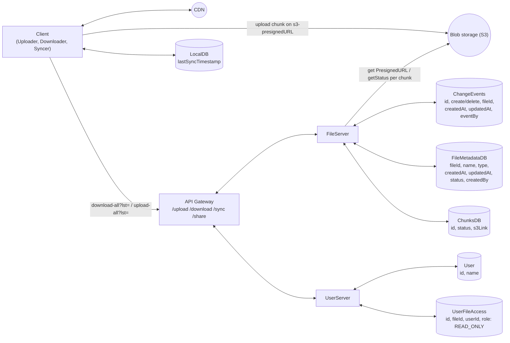
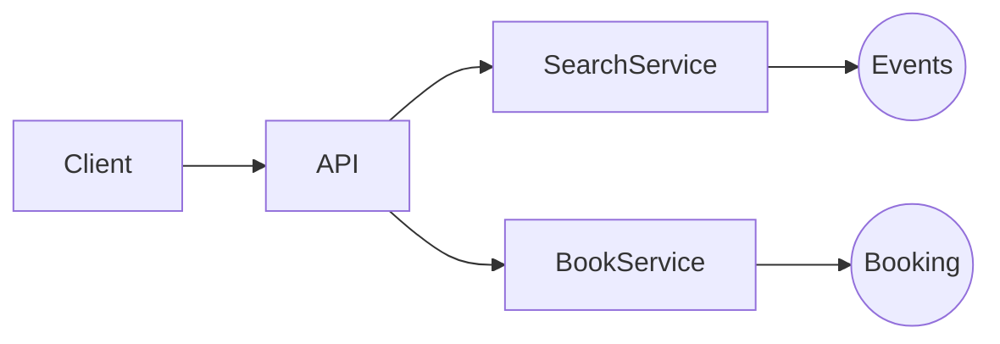

# HLD Problems — Notes

*Transcribed from handwritten Xournal++ notebook (`hld_problems.xopp`), 74 pages.*

---

## Page 1 — HLD Interview Framework

### HLD interview flow
- What features?
- Is it similar to something?
- Scope functional requirements
- Scope NFR (capacity / scale?)
- API
- Entities
- Observations

### HLD diagram
1. Start with API's, services & databases (simple)
   - Naturally identify cache, queue and where it is needed
2. Note database fields
   - — — Functional — — —
3. NFR
   - Add cache
   - Add queue
   - CDN
   - Maybe break service

### NFR checklist: SCALE for cloud designs
| | |
|---|---|
| Scalability | Fault tolerance |
| CAP | Compliance |
| Latency | Durability / Cloud Designs |
| Environment (special) | Security |

CDS

---

## Problem 1 — Bit.ly (URL Shortener) — 1h

- Given a URL, shorten it. Optionally, custom alias. Also analytics, like hits for URLs.
- When user uses the short URL, redirect to the original one.
- Solve for main website
- Verification of website out of scope

### Functional requirements
1. Client requests for a URL to shorten; return shortened URL. Optionally custom-alias.
2. When any client hits the shortened URL, redirect to long URL.
3. For a URL, give analytics — # hits

### NFR
- Consistency in URL mappings. At a time, exactly one short URL mapped.
- Availability — uptime should be high, 5 9's
- Latency — minimal, sub-millisecond
- Durability — should not lose mappings
- Scalability — 10k/s reads, 100 writes
- Consistency for hits: tolerable

### Observation
Read heavy: 100:1

### Out of scope
Analytics

### API
```
PUT /shorten {
  url: <my-url>
} → hash + alias

PUT /shorten {
  url: <my-url>
  alias
} → error / result

GET/POST bit.ly/<hash> {
} → analytics

GET /analytics/<hash>
→ Analytic
```

### Entities
- URL
- ShortURL
- Analytics

### Deep dive Q&A
1. **Consistency in URL mappings? Uniqueness**
   - When user requests to shorten URL: PUT request (idempotent)
   - Check if hash/custom-alias exists → error out, or treat it as upsert

2. **How durability is ensured for URL mappings?**
   - Store in distributed + replicated + strongly consistent leader-based DB
   - Write to cache later (write-around)

3. **Latency** is < 1ms for redirection

4. **Scalability** — need to scale cache, index horizontally. LB + horizontal-scale service.
   - 1B rows, single Postgres with replicas is sufficient (1GB × 1KB)

### Summary
- Use MD5 hash (+ custom-alias) + PUT + DB to achieve uniqueness.
- Use cache for GET (fast redirects).
- For 1B URLs, single Postgres + replica sufficient.
- Use cache to track hits, write to analytics DB periodically — CDC + Flink.

---

## Problem 2 — Dropbox — 8h(?)

### Scoping
- Cloud-based service
- Store & share files
- Secure, reliable access to files across devices

- User can upload file
  - Max size?
  - Concurrent users?
  - Scale/load?
- CAP? Define: C — any kind of stale (during partition), A — obsolete
- Multiple users can download a file; access restriction to be modeled
- Key characteristics: latency + CAP + security + scale + concurrency

### Functional
- User can upload a file from any device
- User can download file from any device
- User can give access (view) to other users
- User can sync files

### NFR
- System should be highly available
- Secure
- Low latency
- Scale: 50 GB

### Out of scope
- UI
- Edit files
- Limits
- Pricing etc.

### HLD Diagram



**Notes on FileServer:**
- `upload` → return presignedURL
- `download` → return stream (get file, get chunks)

**Notes on Client sub-components:**
- Uploader chunks the file
- Downloader (supported in browser) returns stream of file, multi-part

### Questions
1. S3 presigned possible?
2. S3 callback on complete (webhook) — reliable?
3. How to enable user access?
   - Maintain access table (indexed on file, indexed on user)
   - Support: (a) for a user, `getAllFiles`; (b) for a file, `getAllUsers`
   - More preferred: index on file
   - Why not store in metadata? — Difficult to perform `getAllFiles`.
4. How to automatically sync (Remote → Local)
   1. Keep a local DB which has `lastSync`
   2. Always pull before upload
   3. Keep a history of file change events

   `FileChangeEvent { CREATE, DELETE }` → File / FileMetadata / eventAt (indexed)

> ⭐ This is a product-like question. Go one by one through functional requirements.

### Core entities
- User
- File
- FileMetadata

### API
*Tip: File resource can be made RESTFUL*

```
- headers: user-token
POST /upload {
  File
  FileMeta
}

- headers: user-token
GET /download {
  fileId
} → File (Object downloaded)

/share {
  File
  users: []
}

/sync {
  lastSuccessfulUpdate
} → ChangeEvent[]
```

### Storage
1. FileMeta — Postgres (simple, reliable, fixed attributes, simple fast reads, low latency)
2. File — Blob storage (S3) → cheap

### Local → Remote sync
1. Have a watcher-agent installed. Call `/upload` API for any change.

### Deep dive
**1) How to support large file?**
- Chunking (S3 has inbuilt limit 10MB)
- Break the file via client utility
- Upload part-part to S3
- Collect the acknowledgements from FileChunks DB
- Return progress to user
- In case of n/w failures → **support resume**: return FileChunks object to client so that missing parts are re-uploaded.

**Complete Multipart Upload:** S3 reassembles the file and returns `completeMultipart` flag

**Download large file:** HTTP natively supports **Range requests**

**2) How to make upload/download faster?**
- Compression
- CDN (caching)
- Chunking (parallel upload/download)

**3) How to ensure file security**
- HTTPS (client-server encryption)
- S3 storage encryption
- ACL-based token access with expiry

### Summary
- Split File, FileMeta, FileChunks, Blob
- Chunking → resumable downloads, large file (both download/upload)
- Latency: CDN, compression, chunking
- Secured access control, e2e security
- Syncing across devices — change events

---

## Problem 3 — Yelp — 4h
*(title only in notes — no further detail recorded)*

---

## Problem 4 — Local Delivery Service
*(title only in notes — no further detail recorded)*

---

## Problem 5 — Design a TicketMaster — 8h

- Purchase tickets: concerts, events, theatre
- Concurrency?
- Consistency > Availability?
- Latency
- User experience — HOLD?

- Book a ticket
- View booked ticket
- View all events (based on location/city) → `getAllEvents`
- Search for event → `getAllEvents`

### Functional requirements
1. Given selected event, book tickets
2. View all events (in a city)
3. Search for event (based on search string)

### Out of scope
- Payment flow
- Admin (add, update events)
- Dynamic pricing
- Security

### Non-functional requirements
1. Consistency: users should have at least write consistency, no double booking
2. Fast read/write latency (search/book < 50ms)
3. Support for concurrency
4. Can HOLD tickets for some time
5. Support scale (10M users)

### Observations
- Low contention
- Can have peak load — popular events
- Read heavy (100:1)

### Entities
- **User**
- **Event** (List\<Seat\>, sTime, eTime, name, location)
- **Book** (user, List\<Seats\>, event)
- **Booking/Order** { List\<Ticket\> ← price × discount, byUser, event, venue }
- **Ticket** { event, seat, (bearer) }

### API
```
Book tickets:
POST /events/:eventId {
  List<Seat>
  user
} → Ticket

GET /events/search {
  searchText
} → elastic

View:
GET /events/search {
  city
} → event[]

View Seats:
GET /events/:id
→ Seat[]
```

### HLD Diagram


### Deep dive
**1) How to ensure no double booking at this scale? + Fault tolerance**
- ACID distributed DB + Replica
- When payment successful, mark seats
- Generate/book tickets

**2) How to ensure quick search (text, location)**
- Elastic search — title, text, city
- Built on top of events
- Break events & seats

**3) How to handle popular event with scale — 10M concurrent requests?**
- Cache
- HOLD locks — to block duplicate requests for some seats
- Horizontal scale app + Load Balancer

**4) How to improve the booking experience by reserving tickets?**
- Distributed locking with TTL. Implement HOLD locks on event with expiry.

**5) Good experience with high demand seat booking?**
- Seat already booked as they repeatedly click
- Virtual queue to **control**/rate-limit access to popular events

**6) Ensure low-latency for search?**
- Elastic search — but venue

**7) Reduce search query compute — cache results**

### Summary
- Strong consistent distributed DB to avoid double booking
- Distributed HOLD locks for good UX
- Elastic search — text, venue
- Cache for popular reads
- CDN? for images of static content

---

## Problem 6 — Instagram — 6h

Social media, focused on visual content, allowing users to share photos & videos with followers.
- Share photos & videos
- Follow other content
- Show feed
- Fast load times
- Different quality support?
- Different devices, notify?
- Infinite scroll?
- Archival?
- Any specific order for scrolling?

### Functional requirements
1. User should be able to post
2. User should be able to follow other users
3. User gets feed for followed users (chronological, ascending)

### NFR
1. Latency of feed minimal < 50ms. Load/play video/images quickly.
2. Availability: uptime 5 9's
3. Scale:
4. History limit — 1 year? Irrelevant

### Out of scope
- Security
- Comments, likes

### Observations
- Celebrity problem

### API
```
POST /post/create {
  text
  image/video
} → Post
Header: user

PUT /follow {
  user
}
Header: user

GET /feed → Post[]
  ?page=
```

### Deep dive
**1) System should deliver content with low latency (< 500ms)**
- Fan-out write (inbox pattern)
- The feeds DB is a redis cache, which is reverse-chronologically sorted
- For celebrity — perform fan-out on read
- **Hybrid**: fan-out-write + fan-out-read
  - Shard by user_id, sort-key createdAt in Redis

**2) The system should render photos/videos instantly**
- S3 + CDN optimization + prefetch posts in the app
- Additional: quality support, compression, adaptive algorithms

**3) System should be scalable to 500M DAU**
- Distributed DB — Posts
- Feed service scaling
- Extract media to blob storage
- Indexing by user_id, post_id

---

## Problem 7 — FB News Feed
*(title only in notes — no further detail recorded)*

---

## Problem 8 — Tinder — 2h
*(title only in notes — no further detail recorded)*

---

## Problem 9 — Leetcode — 3h
*(title only in notes — no further detail recorded)*

---

## Problem 10 — WhatsApp — 18h(?)

- Send & receive messages & calls from phone/computer
- Users are able to send messages to group or single user. Notify them, view messages.
- Messages should be in order
- Should not be lost (Durability)
- Available system. Security, low latency
- Local DB storage? History view?
- Multiple devices

### Functional Requirements
1. User should be [able to] send/calls in group
2. User should be able to create groups
3. When user sends, notify to other users (if user offline, sync when online)
4. Support for media

### NFR
1. Durability — not hard. Only when user joins on phone storage. (Max 30 days)
2. Low latency < 500ms
3. Consistency — message should be in order
4. Scalability: 10k/sec writes, 100k reads. Limited by phone storage.

### Out of scope
- UI
- Storage-full warnings
- Security — E2E encryption

### API
```
i) X-Header: user_id
POST /message {
  group_id
  text
  image/video
} → success

ii) X-header: user_id
GET /sync?lastTimestamp
→ ChangeEvent[]

iii) X-header: group_id
PUT /groups/create {
  userId[]
  name
} → Group
```
*Treat 1:1 & group as same*

### Deep dive
**1) Handle billions of users simultaneously?**
- Outbox DB
- Simultaneously write to Redis Pub/Sub; subscribers by receiver user_id.
- Use websockets for real-time message consumption — **Redis pub/sub + websockets** (reduce latency)

**2) Partition by chat or user?**
- Normal case: multiple chats around 250, most of them 1:1, one of them 100 participants
- Partition by user: #users = channels
- Partition by chat: #users × 250 = channels

**3) What if multiple clients for a user?**
- User must register device
- Now the broadcast will happen for each user/device. Limit it to 3 maybe.

**4) What if websocket fails? What if Redis fails?**
- Client will periodically call `/sync`

**5) Handle out-of-order message?**
- We don't! We have to partition by group_id.

### Summary
- Use Outbox pattern, partitioned by user_id
- Use Redis pub/sub for optimization
- Separate GroupManagement, MessageService, BroadcastService
- No need to handle out-of-order

