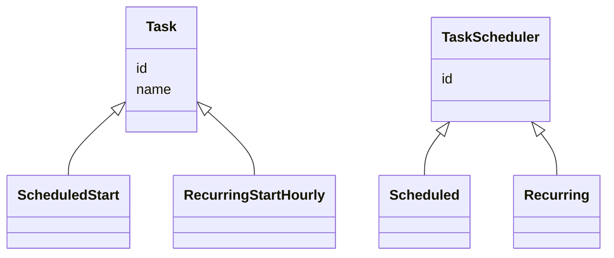

# 1. Task Scheduler

[← LLD index](README.md) · [All docs](../README.md)

---

## Requirements

**i) Functional**
- (a) Submit a scheduled Task
- (b) Submit one-time Task (start)
- Run (a) & (b)

**ii) NFR**
- (a) Concurrency, thread safe
- (b) Task failure recovery (retries: 3)
- (c) Logging task lifecycle details

## Core Components / Entities
1. Task (id, name, ...)
2. TaskScheduler (
3. Execution environment
4. API service



**iv) Priority queue, get NextTask**
- Scheduler runs every 30 seconds
- Pulls list of task from PQ
- Dispatches to Resource Manager
- Resource manager returns status
- If scheduling fails / task fails, re-add to the PQ

Base — System clock: 12:00pm

`PQ<Task> → (start-time)`

## API Service
- SubmitService API — always on some server

```
/submit { } → PQ | Tasks (queue/store)
```

Scheduler // OS — singleton on every machine
```
request ↓ (mem, CPU) ↑ accept → Resource Manager (Thread Pool) → Task.execute()
```

30 sec, resources available, waitlist

DB, schema, interfaces
DTO's, concurrency

Task object should have mechanism to arrive at task_state

`TaskStatus execute()`
