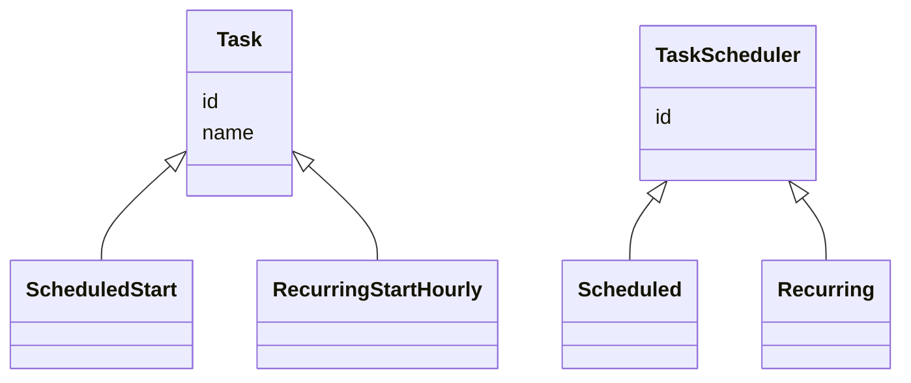

# 1. Task Scheduler

[← LLD index](README.md) · [All docs](../README.md)

---

## Requirements

**i) Functional**
- (a) Submit a scheduled Task
- (b) Submit one-time Task (start)
- Run (a) & (b)

**ii) NFR**
- (a) Concurrency, thread safe
- (b) Task failure recovery (retries: 3)
- (c) Logging task lifecycle details

## Core Components / Entities
1. Task (id, name, ...)
2. TaskScheduler (
3. Execution environment
4. API service



**iv) Priority queue, get NextTask**
- Scheduler runs every 30 seconds
- Pulls list of task from PQ
- Dispatches to Resource Manager
- Resource manager returns status
- If scheduling fails / task fails, re-add to the PQ

Base — System clock: 12:00pm

`PQ<Task> → (start-time)`

## API Service
- SubmitService API — always on some server

```
/submit { } → PQ | Tasks (queue/store)
```

Scheduler // OS — singleton on every machine
```
request ↓ (mem, CPU) ↑ accept → Resource Manager (Thread Pool) → Task.execute()
```

30 sec, resources available, waitlist

DB, schema, interfaces
DTO's, concurrency

Task object should have mechanism to arrive at task_state

`TaskStatus execute()`

---

# Interview scope — 1 hr vs 2 hr

Same problem both times. What changes is how much of the surface you are expected to **build** rather
than **name**. Depth is additive: the 2 hr bar is the 1 hr deliverable, working, plus one or two
extensions taken seriously — never a broader sketch instead of a working core.

## Timeboxes

**1 hour**

| Phase | Time | Leaving with |
|---|---|---|
| Requirements + scope | 5–8 min | FR/NFR agreed, out-of-scope stated out loud |
| Entities + class model | 8–10 min | `Task`, `TaskStatus`, `Scheduler`, worker pool |
| Core code | 25–30 min | a scheduler that actually runs tasks on time |
| Concurrency + edges | 8–10 min | why it is thread-safe; retry; cancel |

**2 hours**

| Phase | Time | Leaving with |
|---|---|---|
| Requirements + scope | 10 min | plus explicit failure/delivery semantics |
| Entities + class model | 15 min | interfaces that make the extension pluggable |
| Core code | 40 min | same working single-node scheduler |
| One or two extensions | 30 min | durability, distribution, or the dependency DAG |
| Edges, tests, ops | 15 min | clock injection, lifecycle logging, metrics |

## The 1 hr bar

Single JVM, in-memory, correct under concurrency. Must exist and run:

- submit **one-time** and **recurring** tasks; `cancel(taskId)`
- a time-ordered structure — `DelayQueue`, or `PriorityBlockingQueue` + `await(timeout)`
- a dispatcher thread **decoupled** from a worker pool
- retry with an attempt counter and a max (the notes say 3)
- a thread-safe task registry

```java
// The whole point: block until the head is genuinely due. No polling interval.
private final DelayQueue<ScheduledTask> queue = new DelayQueue<>();
private final ExecutorService workers = Executors.newFixedThreadPool(n);

private void dispatchLoop() {
  while (running) {
    ScheduledTask t = queue.take();          // parks until the earliest task is due
    workers.submit(() -> runAndReschedule(t)); // dispatcher never executes work itself
  }
}
```

> **Fix the polling loop above in these notes.** *"Scheduler runs every 30 seconds, pulls list of
> tasks from PQ"* is the single most probed weakness in this problem. It makes every task up to 30 s
> late, burns CPU waking on an empty queue, and cannot express sub-second scheduling. Say why you are
> replacing it — that reasoning is most of the credit.

## What actually fails candidates in 1 hr

| Trap | Why it fails | Fix |
|---|---|---|
| Fixed-interval polling | up to one interval of lateness; no sub-second granularity | `DelayQueue.take()`, or `wait(untilHeadDue)` |
| Executing in the dispatcher thread | one slow task delays every other task | hand off to an `ExecutorService` |
| Holding the lock across `execute()` | serialises the whole scheduler | lock only around queue/registry mutation |
| Mutating `nextRunTime` in place while queued | breaks the heap invariant; the task may never dequeue | remove → mutate → re-add, or enqueue a new immutable entry |
| `java.util.Timer` | single thread, and one uncaught exception kills all future runs | `ScheduledThreadPoolExecutor` |
| Recurring overlap | the same task runs twice concurrently | per-task in-flight guard; state **fixed-rate vs fixed-delay** |
| `cancel()` racing execution | ambiguous behaviour under review | define it: cancel prevents *future* runs; interrupt in-flight or not — pick and say so |
| Real `System.currentTimeMillis()` everywhere | untestable; you cannot demonstrate correctness | inject a `Clock` |

The last one buys more credit than its size suggests: with an injectable clock you can assert
scheduling behaviour deterministically instead of asserting with `Thread.sleep`.

## The 2 hr bar

Everything above still has to work. Then go deep on **one or two** — breadth across all five reads as
avoidance:

| Extension | What they are probing |
|---|---|
| **Durability** | survive restart. WAL or DB-backed queue; at-least-once vs at-most-once; what happens to a task that crashed *mid-execution* — and therefore why tasks must be idempotent |
| **Distribution** | many scheduler nodes, each task owned once. Partition by `hash(taskId)`, or leases with a TTL + fencing token; leader election only if you can say why. Split-brain double-execution is the question behind the question |
| **Dependency DAG** | tasks blocked on upstream outputs — see [LLD appendix § Task Execution Engine](../appendix/lld.md#b-task-execution-engine): `remainingDeps` counter decremented atomically, submit at zero, propagate SKIPPED downstream on failure |
| **Recurrence rules** | cron parsing, timezones, DST — say "library" unless asked to parse |
| **Backpressure** | bounded queue + rejection policy; what happens when submission outruns execution |

## Signals graders are reading

- You named the **delivery semantics** before writing code (at-least-once, and therefore idempotent tasks).
- Your locking has a stated **invariant**, not just `synchronized` sprinkled around.
- You said which failures you are **not** handling and why — scoping is graded, silence is not.
- The class model has a seam where the extension plugs in (`RetryPolicy`, `TaskStore`, `Clock`),
  rather than needing a rewrite to accommodate it.
