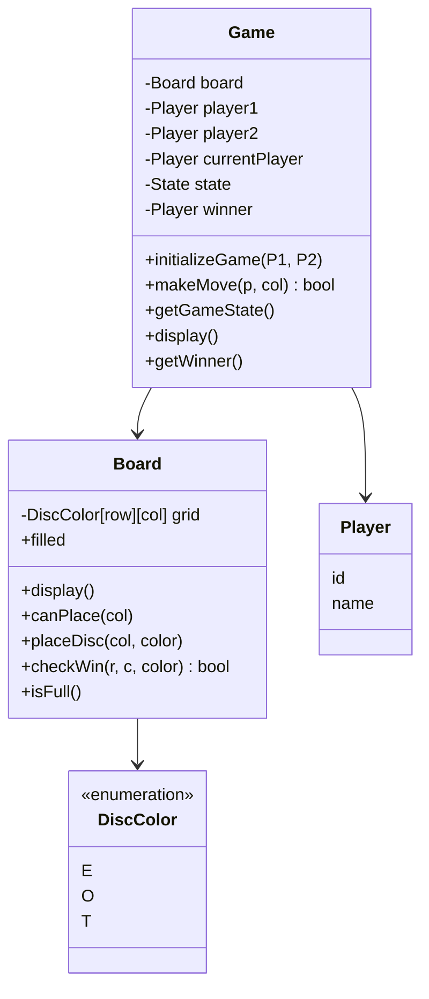

# 6. Connect Four

[← LLD index](README.md) · [All docs](../README.md)

---

*(numbered "1)" in the original notes — likely starts a new session/page group)*

## Requirements
- 7×6 grid
- Players take turns
- Connect 4 of pieces — win

## Entities
- Game
- Grid
- Player

## API
```
Game:
  trackTurn
  takeInput
  endStateReached?
  markCell()

Grid, Player:
  modifyCell
  endStateTraverse
  (POJO)
```

## Class design
- Game
  - Player: P1, P2
  - State
  - Grid

## Clarify
1. Functional
   - How do players interact?
   - How game ends? (draw & win)
2. Edge case / failure handling
3. NFR — concurrency?

## Requirements (refined)
1. Two players take turn, 7×6 board
2. Disc falls to lowest available cell in column
3. Game ends:
   - Win (V, H, D — 4 discs)
   - Draw — board is full
4. Invalid moves:
   - Dropping in full column
   - Moving out of turn
   - Game ends

## Out of scope
- UI support
- Concurrent
- Undo
- Move history
- Configurable board

## Entities & Relationships
- **Game** — Board, P1, P2; whose turn?
  - API for `move`, `gameState`, `display()`
- **Board** — 7×6 grid
  - `makeMove(col, marker)`
  - `display()`
- **Player** — id, disp-name

## Class Design


State enum: `{IN-PROG, WON, DRAW}`
*(checkWin uses DFS to trace 4-in-a-row)*
