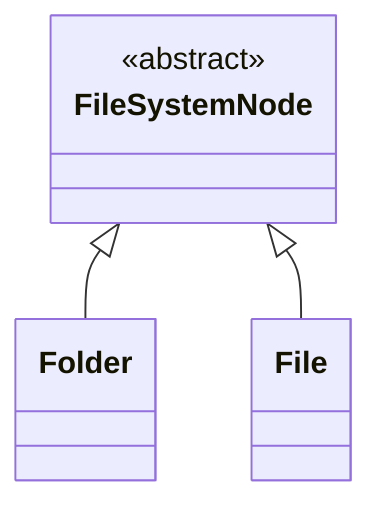

# 10. File System

[← LLD index](README.md) · [All docs](../README.md)

---

Windows Explorer (in-memory)
- Navigate folders
- Create files
- Move files

## Scoping questions
1. Input path, show all files/folders
2. Which file format supported?
3. What if file(s) with same name? *(edge)*
4. Copy from → to destination (handle clashes)
5. Move files
6. How root folder looks like? Single root?
7. Do they have content?
8. Scale?
9. What bookkeeping (created, permissions, modified)?

Any functional I missed? — 10) Deletes files/folders

## Edge cases
File, folder within same folder, same name?

## Requirements
- Create a file/folder
- Have a root
- Delete file/folder (recursive)
- Display folder contents (given path)
- Move a file from path A → B
- De-duplicate file names
- Allow to create file content (simple text)
- Rename
- Scale

## Out of scope
- UI
- Multiple formats
- Multiple roots
- Book keeping (created, modified)

## Entities
- **File**: name, text, Path
- **Folder**: name, Path
- **Path**: `List<String> nodes`, `parsePath`

## FileService
- createFile
- delete
- move
- rename
- createFolder
- list (display)

## Internal Structure
Graph / Tree

**Folder**
- name
- Path
- `Map<name, Folder>`
- `addChild()`

**File**
- setContent
- getContent
- `@addChild()` — "invalid"

⭐ Better is to have abstract base class `FileSystemNode`

⚠️ To implement `move` — cycle detection

## Extensibility
1. How to make system thread safe (check-then-act)
   - **Coarse-grained**: permit only one operation on entire filesystem by having a single lock
   - **Fine-grained lock**: create lock for every folder involved (to avoid deadlock, acquire locks in consistent order)
   - **Coarse-grained read-write lock** with retries
2. How would you add search functionality
   e.g. search config.json
   - Perform DFS on folder, return empty if !exists, return path if exists, combine paths at root. O(n)
   - If optimization? Use index
