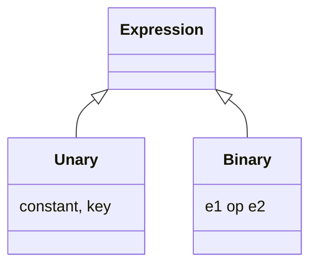

# 15. Build a Rule Engine

[← LLD index](README.md) · [All docs](../README.md)

---

*(numbered "9)")*

Users can define rules:
- `age > 18`
- `country == "IN"`

**Condition**: operator, key, value
**User**: age, salary, experience

- How is input object given? Is it a map?
- Datatype validation in scope? Is there ordering? Nested values?

**Condition**
- operator
- key
- value

**Condition** (recursive form)
- condition (type, key)
- operator
- condition (type, value)
- type

**Expression** = (expression op expression)
Type: `>`, `<`, `=`, `!=` — int, String, instanceOf

- Unary?
- Binary?
- Nested?
- Brackets?

## Solution
- Tokenize
- Parse, using a stack once expression is populated
- Collapse the stack, & evaluate

- Factory to support different types
- Composite pattern to expressions

Dynamically decide which evaluator for `(e1 op e2) op (e3 op e4)`
