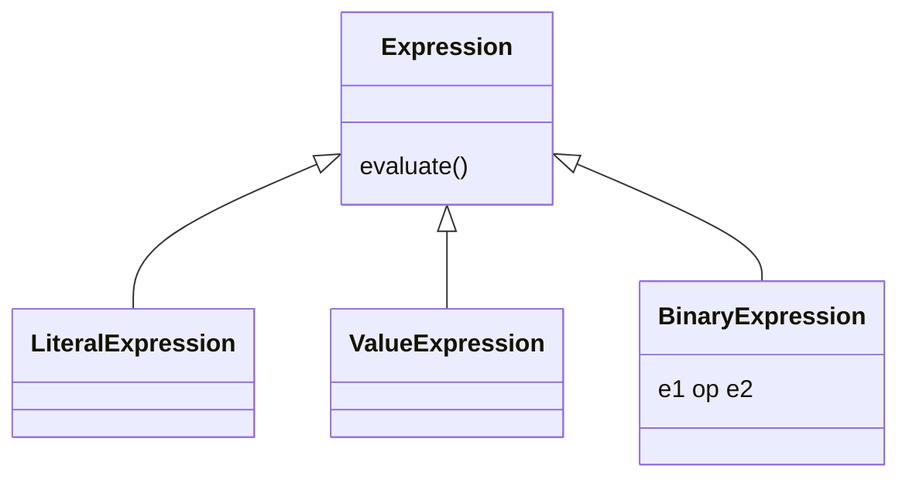

# 16. Design Spreadsheet with Formulas

[← LLD index](README.md) · [All docs](../README.md)

---

*(numbered "10)")*

## Requirements
1. Each cell can have literal
2. Cell can have formula
3. Formula: `+ - / *` (no brackets)
4. If we update x, all dependent cells updated
5. Memoize while doing so

## Out of scope
- Brackets
- Validation?

**Cell** (location, expression)
`record Location()`
- Use this in `nodesMap`
- Dependency graph: `Map<Location, Set<Location>>`

When expression starts with `=` — formula based



**Parser** — `split("\\s")`
Expression creator: operator, operand stack — alternate operator & operand

- Traverse graph to get downstreams. Re-evaluate that cell expression.
- Detect cycle in dependency graph.

While updating any cell, detect cycle with formula.

## API
```
setValue(location: str, value)
getValue(location)
```

## Excel
Dependency graphs — outDependencies, inDependencies
`Map<loc, Cell>`
- expression
- value
- → location

When we `setValue` in cell:
1. If literal → evaluate, expression = LiteralExp
2. If expression:
   - Parse & create expression
   - & upsert dependency graph

- While updating, check cycle in dependency graph; else throw error, otherwise add
- Update all downstreams (call setValue)

`Excel → Cell → Expression → VariableExp` (init)

During update, there can be cyclic dependency.
