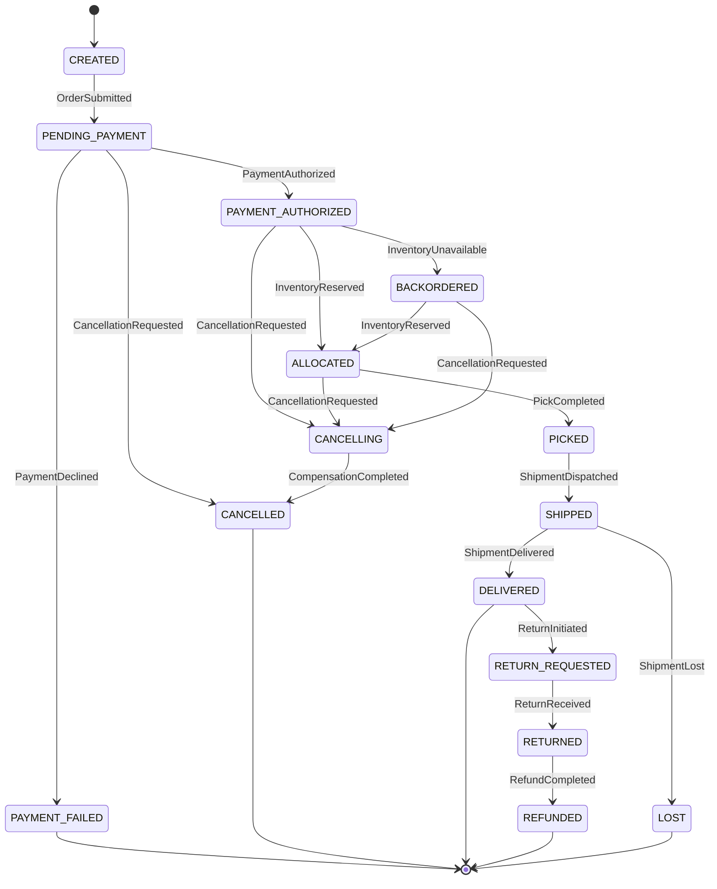
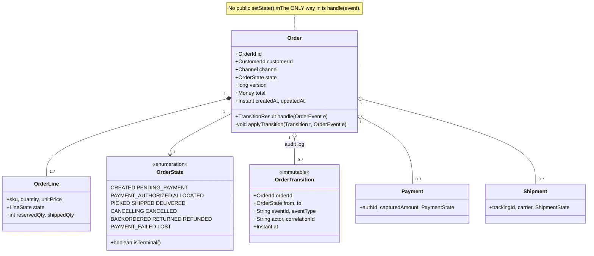
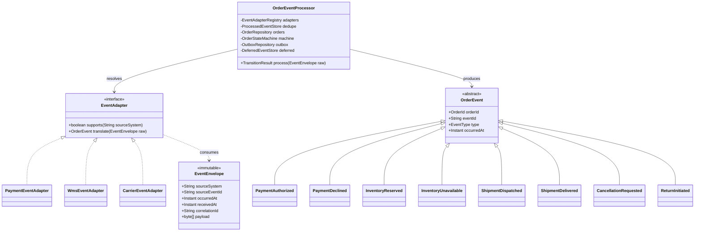
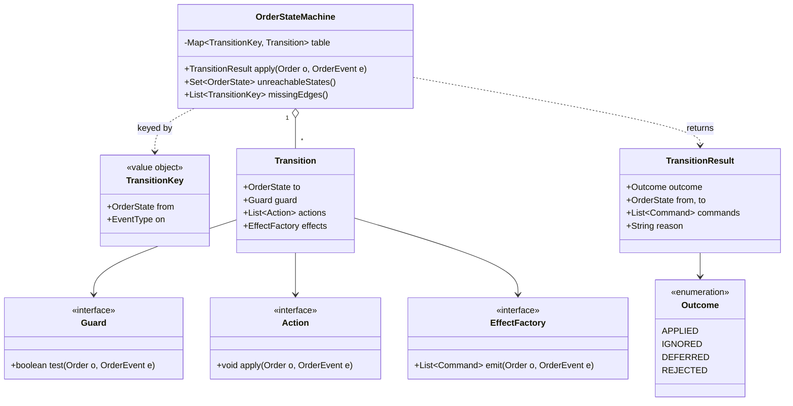
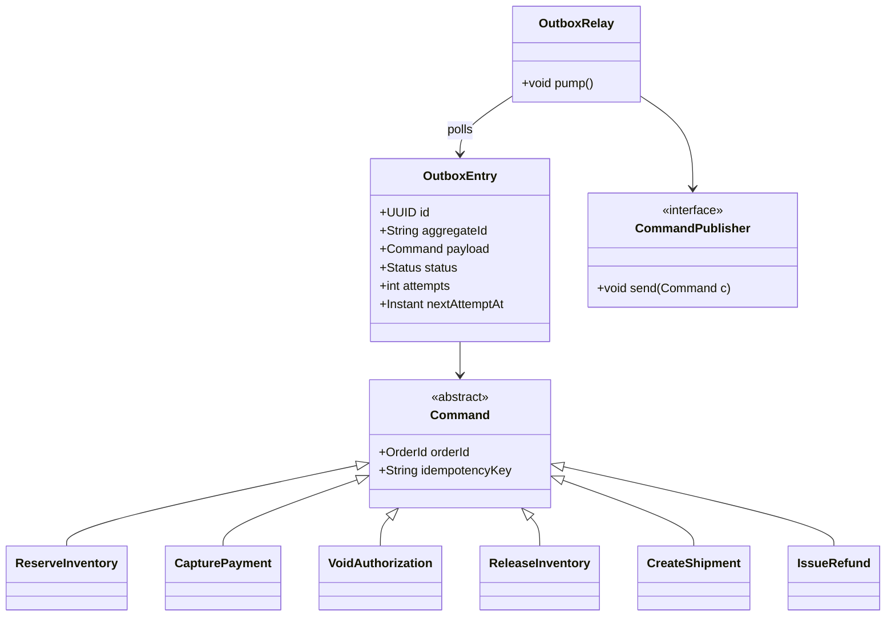
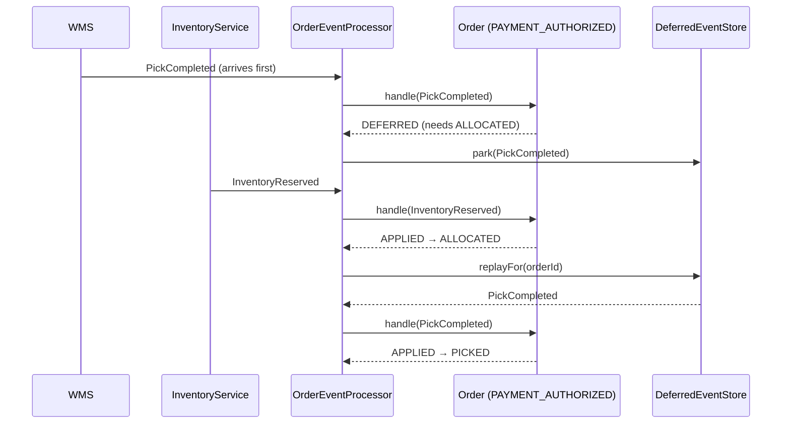

# 17. Order Management System

[← LLD index](README.md) · [All docs](../README.md)

---

An OMS is not interesting because of its data model. It is interesting because **the system
does not control its own lifecycle** — payment, inventory, fraud, the warehouse and the
carrier each decide part of it, and each tells you about it *later*, by event, possibly
twice, possibly out of order, possibly after you already cancelled the order.

So the whole design is one question: **how does an order change state, given that the
inputs are untrustworthy?**

- [Requirements](#requirements)
- [The states](#the-states)
- [Design decision: how transitions are expressed](#design-decision-how-transitions-are-expressed)
- [Class model](#class-model) — [domain](#1-domain-the-aggregate) · [events](#2-events-and-ingestion) · [state machine](#3-the-state-machine) · [side effects](#4-side-effects-the-outbox)
- [The four outcomes of an inbound event](#the-four-outcomes-of-an-inbound-event)
- [Out-of-order, duplicate and late events](#out-of-order-duplicate-and-late-events)
- [Concurrency](#concurrency)
- [Cancellation and compensation](#cancellation-and-compensation)
- [What actually fails candidates](#what-actually-fails-candidates)
- [Extensions](#extensions)

## Requirements

**i) Functional**
- (a) Accept an order from a channel (web, mobile, marketplace feed)
- (b) Drive it through payment → allocation → fulfilment → delivery
- (c) Support cancellation and return at any legal point, with compensation
- (d) Expose current status and the full history of how it got there
- (e) Ingest lifecycle events from **external systems**: `PaymentService`, `InventoryService`,
  `FraudService`, `WMS`, `CarrierService`

**ii) NFR**
- (a) Inbound events are **at-least-once**, so duplicates are normal, not exceptional
- (b) Inbound events arrive **out of order** across sources — two systems race
- (c) Every transition is **auditable**: who, what event, when, from → to
- (d) Adding a state, an event type or a source system must not require editing a `switch`
- (e) Two events for the same order may be processed **concurrently**
- (f) A side effect (charge the card, reserve stock) must fire **exactly once per transition**

**Out of scope** — pricing/promotions, tax, the actual carrier integration protocols,
multi-warehouse optimisation, returns grading, and the UI. Say this out loud; scoping is
graded.

## The states



Three things in that chart are deliberate and worth defending:

1. **`CANCELLING` is a real state, not a flag.** Cancelling an authorised order requires
   releasing stock *and* voiding the payment — both asynchronous, both able to fail. Without
   an explicit in-between state you cannot answer "what happens if the refund fails?".
   The same reasoning as `ON_HOLD` in seat booking: **the intermediate state is the answer
   to the follow-up question.**
2. **Terminal states are terminal.** No transition leaves `CANCELLED`. A `ShipmentDispatched`
   arriving afterwards is a real operational event — but it is a *reconciliation* problem, not
   a state change.
3. **`PENDING_PAYMENT → CANCELLED` is direct** while `PAYMENT_AUTHORIZED → CANCELLING` is
   not, because nothing has been reserved or charged yet. The compensation required is what
   decides whether you need the intermediate state.

## Design decision: how transitions are expressed

The thing being graded is that you did **not** write this:

```java
// the anti-design
if (order.getState() == ALLOCATED && event.getType() == SHIPPED) {
    order.setState(SHIPPED);          // a public setter is the bug
    shipmentClient.notify(order);     // a side effect inside the branch is the other bug
}
```

Two defensible alternatives:

| | **Table-driven** (recommended) | **State pattern** |
|---|---|---|
| Shape | `Map<(State, EventType), Transition>` | one class per state, each handling events |
| The machine is | in one place, printable, diffable, validatable | spread across N classes |
| Adding a state | one row per legal edge | a new class + edits to its neighbours |
| Per-state *behaviour* | limited — guards and actions only | rich; each state can hold real logic |
| Validation | you can statically find unreachable states and missing edges | you cannot |
| Config-driven | yes — the table can be loaded from a file | no |

**Pick table-driven for an OMS** and say why: 12 states × 15 event types is 180 cells, and
the value is being able to *see* the whole machine, assert on it in tests, and reject an
illegal edge by absence rather than by remembering to write an `else`. The State pattern
wins when each state has substantial distinct behaviour — a game, a UI workflow — which an
order does not.

Then split every transition into three separable pieces:

| Piece | Signature | Rule |
|---|---|---|
| **Guard** | `boolean test(Order, Event)` | **pure** — no IO, no mutation. "Is the full amount authorised?" |
| **Action** | `void apply(Order, Event)` | mutates **only** the aggregate, in memory |
| **Effect** | `List<Command> emit(Order, Event)` | returns commands; **never calls another system inline** |

That separation is the whole reason the design stays testable: guards are unit-testable with
no mocks, actions are pure state, and effects are data you can assert on.

## Class model

### 1) Domain: the aggregate



`OrderTransition` is the point of the model. **Every** state change appends one, so
"why is this order stuck?" is a query, not an investigation. It also gives you event
sourcing for free if you later want it: `state == fold(transitions)`.

### 2) Events and ingestion

External systems must not be allowed to define your domain types. Each source gets an
**adapter** that translates its payload into an internal event — an anti-corruption layer, so
a carrier renaming a JSON field never reaches the state machine.



The processor is the only transactional choreography in the system:

```java
@Transactional
TransitionResult process(EventEnvelope raw) {
    if (dedupe.seen(raw.sourceSystem(), raw.sourceEventId()))   // 1. unique constraint
        return IGNORED_DUPLICATE;

    OrderEvent e = adapters.forSource(raw.sourceSystem()).translate(raw);
    Order order  = orders.loadForUpdate(e.orderId());           // 2. optimistic version

    TransitionResult r = machine.apply(order, e);               // 3. pure decision

    switch (r.outcome()) {
        case APPLIED  -> { orders.save(order);                  // 4. version++ or conflict
                           outbox.saveAll(r.commands());        // 5. same transaction
                           deferred.replayFor(order.id()); }    // 6. late events may now fit
        case DEFERRED -> deferred.park(e);
        case REJECTED -> deadLetter.publish(raw, r.reason());
        case IGNORED  -> { /* no-op, but still recorded */ }
    }
    dedupe.record(raw.sourceSystem(), raw.sourceEventId(), r.outcome());
    return r;
}
```

### 3) The state machine



Registration reads as the specification:

```java
machine.on(PAYMENT_AUTHORIZED, INVENTORY_RESERVED)
       .guard((o, e) -> e.reservedQty() == o.totalQty())      // pure predicate
       .action((o, e) -> o.markLinesReserved(e.reservations()))
       .emit((o, e) -> List.of(new CreatePickTask(o.id())))
       .to(ALLOCATED);
```

`unreachableStates()` and `missingEdges()` exist so the machine can be **asserted on in a
test**: "every non-terminal state has a path to a terminal state" is a one-line property
test, and it catches the class of bug where an order can get permanently stuck.

### 4) Side effects: the outbox

A transition that both writes state and calls another service inline is broken in both
directions — roll back and you've already charged the card; crash after the call and you
retry a charge you already made.



**The command is written in the same transaction as the state change**; a separate relay
publishes it. That is the only way to get "exactly once per transition" without distributed
transactions — the same [transactional outbox](../hld/29-payment-system.md) the payment
system HLD uses. Every `Command` carries an `idempotencyKey` derived from
`(orderId, transitionId)`, so the downstream system can dedupe our retries.

## The four outcomes of an inbound event

This is the part most designs get wrong by having only two. An event that isn't a legal
transition is **not automatically an error**:

| Outcome | When | What you do |
|---|---|---|
| **APPLIED** | `(state, eventType)` is in the table and the guard passes | mutate, append a transition, emit commands |
| **IGNORED** | a duplicate, or an event for a state you've already moved past — `PaymentCaptured` while `SHIPPED` | record it, return success, **do not alert**. This is the normal cost of at-least-once |
| **DEFERRED** | plausibly valid *later* — `ShipmentDispatched` arrives before `InventoryReserved` because two systems raced | park it, replay on the next successful transition |
| **REJECTED** | genuinely impossible — `ShipmentDelivered` on a `CANCELLED` order | DLQ + alert; this means a real inconsistency between two systems |

Collapsing IGNORED into REJECTED gives you an alert storm that everyone learns to mute.
Collapsing DEFERRED into REJECTED loses orders whenever two upstream systems race. **Naming
all four is the single strongest signal in this problem.**

How the machine decides between them without extra configuration:

```java
Outcome classify(Order o, OrderEvent e) {
    if (table.containsKey(key(o.state(), e.type())))  return APPLIED;   // guard permitting
    if (o.state().isTerminal())                       return REJECTED;
    if (alreadyPassed(o.state(), e.type()))           return IGNORED;   // rank comparison
    if (isReachableLater(o.state(), e.type()))        return DEFERRED;  // BFS over the table
    return REJECTED;
}
```

`isReachableLater` is a graph search over the transition table you already have — which is
the payoff for making the machine data instead of control flow.

## Out-of-order, duplicate and late events

Three distinct problems, three distinct mechanisms — say which is which:

| Problem | Mechanism | Where it lives |
|---|---|---|
| **Duplicates** | unique constraint on `(sourceSystem, sourceEventId)` | `ProcessedEventStore` — a database constraint, not an `if` |
| **Out of order within one source** | per-source monotonic sequence, or partition by `orderId` so one consumer sees them in order | ingestion |
| **Out of order across sources** | the `DEFERRED` outcome + replay | the state machine |

**Do not order by `occurredAt`.** Clocks on other people's servers are not comparable, and
a payment system's timestamp being 300 ms behind the warehouse's is not a fact you can fix.
Order by the *state machine*: an event is applied when the order is ready for it, not when
its timestamp says it happened.

The deferred buffer needs three guardrails, and being asked about them is the follow-up:

- **Bounded** — cap per order (say 50) and reject beyond it, or a poison order eats memory;
- **TTL** — a deferred event that never becomes valid is expired to the DLQ after, say, 24 h;
- **Replayed on every successful transition**, in `occurredAt` order, and replay must itself
  be idempotent because a replayed event can defer again.



## Concurrency

Two events for one order arriving at once is the default, not the edge case. Two layers:

1. **Single writer per order.** Partition the inbound stream by `orderId` (Kafka key, or a
   consistent-hash of the id onto worker threads). All events for an order are then handled
   by one consumer, in order, and most contention disappears by construction — the same
   partition-key reasoning as the [HLD problems](../hld/README.md).
2. **Optimistic locking as the safety net.** `Order.version` with a compare-and-set on write;
   on conflict, **reload and re-apply the event** rather than retrying blindly, because the
   state may have changed and the correct outcome may now be `IGNORED`.

Pessimistic `SELECT … FOR UPDATE` also works and is simpler to explain, at the cost of held
locks across the transaction. Say which you chose and why. What you must *not* do is
`synchronized` on an in-memory object — it doesn't survive more than one instance, and an
OMS is never one instance.

## Cancellation and compensation

Cancellation is where the state machine earns its keep, because what you must undo depends
entirely on where you are:

| Cancel from | Compensations emitted | Goes to |
|---|---|---|
| `PENDING_PAYMENT` | none | `CANCELLED` directly |
| `PAYMENT_AUTHORIZED` | `VoidAuthorization` | `CANCELLING` |
| `ALLOCATED` | `ReleaseInventory`, `VoidAuthorization` | `CANCELLING` |
| `PICKED` | `ReleaseInventory`, `VoidAuthorization`, `CancelPickTask` | `CANCELLING` |
| `SHIPPED` | **not cancellable** — becomes a return | rejected, guard fails |

`CANCELLING → CANCELLED` fires only when *every* compensation has acknowledged — so the
order carries a small set of outstanding compensation ids, and `CompensationCompleted`
transitions only when the set empties. That is a **saga**, and the reason it is modelled as
states and events rather than a `try/catch` is that each compensation can fail
independently and be retried independently.

## What actually fails candidates

| Trap | Why it fails | Fix |
|---|---|---|
| `order.setState(X)` exists | any caller can produce an illegal state and there's no audit trail | only `handle(event)` mutates; setters are private |
| Transitions as nested `if`/`switch` | unmaintainable at 12 states; illegal edges are silent | a transition table |
| Only two outcomes (applied / error) | duplicates and races alert as errors until everyone mutes the alerts | [four outcomes](#the-four-outcomes-of-an-inbound-event) |
| Ordering by `occurredAt` | clocks across systems aren't comparable | order by the state machine, not by time |
| Side effect called inline in the transition | double-charges on retry, lost effects on rollback | outbox in the same transaction |
| No dedupe store | at-least-once delivery double-applies transitions | unique index on `(source, eventId)` |
| Deferred buffer with no bound or TTL | one poison order consumes memory forever | cap + expire to DLQ |
| Terminal states that still accept events | a delivered order gets re-shipped | `isTerminal()` checked before lookup |
| `synchronized` on the order object | works on one node, breaks on two | optimistic version, or partition by `orderId` |
| Cancellation as a boolean flag | can't express "refund pending" or a failed compensation | an explicit `CANCELLING` state |
| No `correlationId` on events | you cannot trace one order across five systems | propagate it from ingestion into every transition and command |

## Extensions

| Extension | What it probes |
|---|---|
| **Partial fulfilment** | per-`OrderLine` state machines with the order's state derived from its lines — "what if 3 of 5 items ship?". The honest answer is a second, smaller state machine, not more order states |
| **Event sourcing** | drop the mutable `state` column entirely; `state = fold(transitions)`, with a snapshot every N. You already store every transition, so this is a small step — and it makes "what did this order look like on Tuesday?" free |
| **Config-driven machine** | load the transition table from YAML so ops can add a state without a deploy. The table-driven design is what makes this possible; the State pattern cannot |
| **Timeouts as events** | `PENDING_PAYMENT` for 30 min should auto-cancel. Model it as a scheduled `PaymentTimedOut` event so timeouts go through the same machine — see [Task Scheduler](01-task-scheduler.md) |
| **Idempotent replay / rebuild** | replay the whole event log into a fresh database and get the same states. This is the strongest correctness argument you can offer, and it falls out of the audit log |
| **Multi-warehouse allocation** | allocation becomes a strategy plugged into the `ALLOCATED` transition, not new states |

## Signals graders are reading

- You separated **guard / action / effect** rather than mixing IO into transition logic.
- You named **four** outcomes for an inbound event, not two.
- You said **at-least-once, therefore idempotent** before writing any code.
- Your side effects go through an **outbox**, and you can say why inline calls break.
- `CANCELLING` exists — you modelled the asynchronous undo instead of assuming it succeeds.
- The transition table is **data**, so you can test properties of the machine itself.

## Related

- [Task Scheduler](01-task-scheduler.md) — timeouts as scheduled events
- [Payment Wallet](03-payment-wallet.md) — idempotency keys, saga vs 2PC
- [Inventory Management](14-inventory-management.md) — the reservation side of allocation
- [Payment System (HLD)](../hld/29-payment-system.md) — transactional outbox and CDC at scale
- [Isolation levels](../appendix/isolation-levels.md) — what the optimistic-lock retry protects
