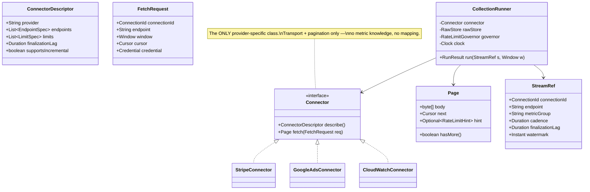
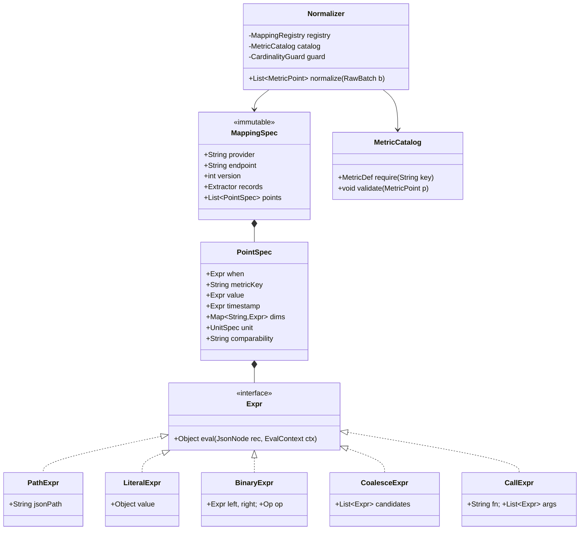
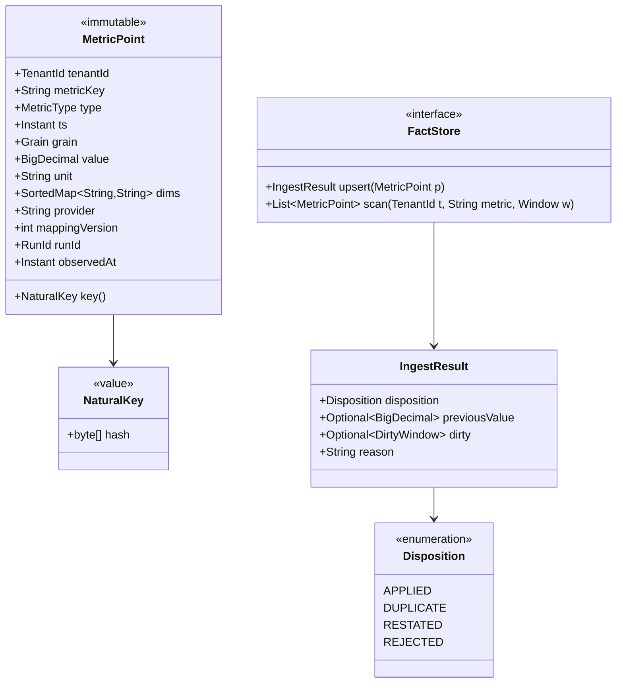
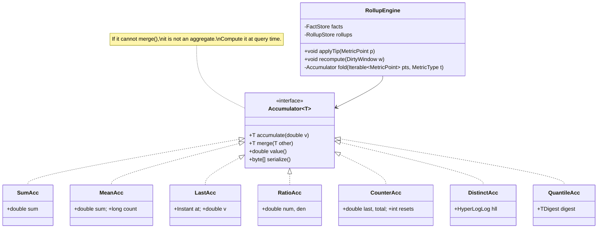

# 18. Metric Collection & Normalization Engine

[← LLD index](README.md) · [All docs](../README.md)

---

*(added, not from the notebook)*

The companion class design for
[38. Metrics Aggregation Platform](../hld/38-metrics-aggregation-platform.md). The HLD
answers *where the boxes go*; this answers the question the interviewer asks next:
**what are the classes, and why does adding the fortieth provider not touch any of them?**

Two forces shape everything:

1. **Provider-specific logic must be confined to one seam.** Forty providers, two thousand
   metric mappings. If "add a provider" means editing a normalizer, an enum, a rollup
   function and a `switch`, the design has already failed.
2. **The same numbers arrive repeatedly, and sometimes different.** A re-poll of an
   overlapping window, a retry after a lost ack, a provider restating last Tuesday — all
   land in the same method. That method needs **four** answers, not two.

- [Requirements](#requirements)
- [Design decision: mapping as data, not code](#design-decision-mapping-as-data-not-code)
- [Class model](#class-model) — [collection](#1-collection-the-connector-seam) · [transform chain](#2-the-transform-chain-a-composite) · [ingest](#3-ingest-the-four-outcomes) · [accumulators](#4-accumulators-merge-is-the-contract)
- [Concurrency](#concurrency)
- [Rate-limit gates and lock ordering](#rate-limit-gates-and-lock-ordering)
- [Testing: mappings are data, so tests are data](#testing-mappings-are-data-so-tests-are-data)
- [What actually fails candidates](#what-actually-fails-candidates)
- [Extensions](#extensions)

## Requirements

**i) Functional**

- (a) Collect a **window** of data from a provider endpoint, paginated, resumable
- (b) Persist the response **verbatim** before interpreting a single field
- (c) Transform raw records into canonical `MetricPoint`s using a **versioned mapping**
- (d) Ingest points **idempotently**: the same point twice must not change any aggregate
- (e) Detect a **restatement** (same key, different value) and mark the affected window dirty
- (f) Maintain rollups per (metric × grain × dimension set), by streaming and by recompute
- (g) Quarantine records that cannot be mapped, with enough context to replay them later

**ii) NFR**

- (a) Adding a provider must not modify any existing class — a new `Connector` + mapping file
- (b) Adding or fixing a mapping must not require a **deploy**, and must be replayable over
  already-collected raw data
- (c) Collection is **at-least-once**; ingest must make it effectively-once
- (d) Points for the same cell may be ingested **concurrently** by different workers
- (e) Provider rate limits are shared across the fleet and hierarchical
- (f) Deterministic and testable — no wall-clock reads, no live HTTP in unit tests

**Out of scope** — the OAuth dance and token storage, the query/serving layer, the
dashboard, and provider-side data quality. Say it out loud; scoping is graded.

## Design decision: mapping as data, not code

The thing being graded is that you did **not** write this:

```java
// the anti-design
List<MetricPoint> normalize(String provider, JsonNode raw) {
    switch (provider) {
        case "stripe" -> {
            for (JsonNode n : raw.get("data"))
                if (n.get("type").asText().equals("charge"))
                    out.add(new MetricPoint("revenue.gross", n.get("amount").asLong(), ...));
        }
        case "meta" -> { /* 200 more lines */ }
    }
}
```

Three separate bugs in that shape: provider knowledge leaks out of the connector seam;
the mapping is untested because it is imperative; and there is no version stamp, so data
normalized by yesterday's buggy code is indistinguishable from today's.

| | **Mapping as data** (recommended) | **Mapping as code** |
|---|---|---|
| Shape | declarative `MappingSpec` interpreted by one engine | a class per provider |
| Ship a fix | config push, versioned + reviewed | deploy |
| Re-normalize history | replay raw with `mapping_version = 8` | impossible without a one-off script |
| Testing | golden fixtures, raw JSON → expected points | mocks and hand-written asserts |
| Expressiveness | limited to what the expression language supports | unlimited |
| Escape hatch | a `CustomTransform` step registered by name | — |

Pick data, and name the escape hatch out loud: perhaps 5 % of mappings need real code
(a provider returning a CSV inside a base64 field, a cursor that must be decoded). Those
register a named `Transform` in the registry; the *mapping* still references it by name and
version, so the lineage stamp survives.

**The two things every fact carries** — `mapping_version` and `run_id` — are what make
"we normalized it wrong" a recoverable event rather than a data loss event.

## Class model

### 1) Collection: the connector seam



The interface is deliberately tiny:

```java
public interface Connector {
    ConnectorDescriptor describe();
    /** One page. Throws ProviderException; never retries internally. */
    Page fetch(FetchRequest req) throws ProviderException;
}
```

Retries, backoff, rate-limit acquisition, raw persistence and cursor advancement live in
`CollectionRunner`, once, for every provider. A connector author who has to think about
backoff will get it wrong forty times.

```java
final class CollectionRunner {
    RunResult run(StreamRef s, Window w) {
        RunId runId = RunId.of(s, w, clock.instant());   // deterministic → replay-safe
        Cursor cursor = Cursor.START;
        int page = 0;
        do {
            try (Lease lease = governor.acquire(s)) {           // may park
                Page p = connector.fetch(new FetchRequest(s, w, cursor, creds.get(s)));
                rawStore.put(runId, page++, p.body());          // verbatim, content-hashed
                p.hint().ifPresent(governor::observe);          // feed real limits back
                cursor = p.next();
            } catch (RateLimited e) {
                governor.penalize(s, e.retryAfter());
                return RunResult.park(e.retryAfter());          // resumable: cursor kept
            } catch (ProviderException e) {
                return RunResult.retryable(e);                  // outer policy decides
            }
        } while (cursor != Cursor.END);

        events.publish(new RawBatch(runId, s, w, page));        // pointer, not data
        return RunResult.ok(runId, page);
    }
}
```

Three deliberate choices worth defending:

- **`RunId` is derived, not random.** `hash(stream, window, attempt-bucket)` — so a retry
  after a crash writes to the same content-addressed raw keys instead of orphaning a partial
  run. The same discipline as deriving an idempotency key from `(workflow_id, activity_id)`
  in the [durable execution engine](../hld/36-durable-execution-engine.md#4-at-least-once-activities-always).
- **The runner publishes a pointer, not the payload.** Kafka messages stay small and the raw
  bytes have exactly one home.
- **A rate limit is a `park`, not a failure.** The cursor and the pages already written
  survive; the task resumes where it stopped.

### 2) The transform chain: a composite

Same shape as the [rule engine](15-rule-engine.md) and the
[spreadsheet](16-spreadsheet-with-formulas.md) — an expression tree over an input record,
interpreted rather than compiled. That is not a coincidence; it is the third time in this
notebook that "user-defined logic over a record" has the same answer.



```java
public sealed interface Expr permits PathExpr, LiteralExpr, BinaryExpr, CoalesceExpr, CallExpr {
    Object eval(JsonNode record, EvalContext ctx);
}

record PathExpr(String jsonPath) implements Expr {
    public Object eval(JsonNode r, EvalContext ctx) { return JsonPath.read(r, jsonPath); }
}
record BinaryExpr(Expr left, Op op, Expr right) implements Expr {
    public Object eval(JsonNode r, EvalContext ctx) {
        return op.apply(left.eval(r, ctx), right.eval(r, ctx));   // op from a factory per operand type
    }
}
record CallExpr(String fn, List<Expr> args) implements Expr {
    public Object eval(JsonNode r, EvalContext ctx) {
        return ctx.functions().get(fn)          // registry lookup, not a switch
                  .apply(args.stream().map(a -> a.eval(r, ctx)).toList());
    }
}
```

`CallExpr` + a function registry is the escape hatch: `parse_ts(tz)`, `to_minor_units`,
`decode_base64_csv` are registered by name and versioned with the mapping, so a mapping stays
declarative while still reaching real code where it must.

The normalizer itself is small, and stateless — which is what makes replay trivial:

```java
public List<MetricPoint> normalize(RawBatch batch) {
    MappingSpec spec = registry.get(batch.provider(), batch.endpoint(), batch.mappingVersion());
    List<MetricPoint> out = new ArrayList<>();
    for (JsonNode rec : spec.records().apply(rawStore.read(batch.runId()))) {
        for (PointSpec ps : spec.points()) {
            if (!truthy(ps.when().eval(rec, ctx))) continue;
            try {
                MetricPoint p = build(ps, rec, batch);   // unit conversion, tz, dim mapping
                catalog.validate(p);                     // metric exists, dims allowlisted, unit matches
                guard.check(p);                          // cardinality budget
                out.add(p);
            } catch (MappingException e) {
                quarantine.put(batch.runId(), rec, spec.version(), e);   // never silently drop
            }
        }
    }
    return out;
}
```

Two rules encoded there and worth saying aloud:

- **Validation is against the catalog, not against nothing.** An unknown `metric_key`, a
  dimension outside the allowlist, or a unit that disagrees with the metric definition is a
  `REJECTED`, not a row.
- **A failed record is quarantined with its `run_id` and `mapping_version`**, so fixing the
  mapping and replaying the quarantine is a normal operation rather than an archaeology
  project. And quarantining does **not** advance the stream watermark — a hole must stay
  visible.

### 3) Ingest: the four outcomes

The single method every point passes through, and the heart of the design:



```java
public IngestResult upsert(MetricPoint p) {
    NaturalKey k = p.key();                    // hash(tenant, metric, provider, conn, dims, ts, grain)
    Fact existing = facts.get(k);

    if (existing == null)
        return insert(k, p, APPLIED);

    if (existing.value().compareTo(p.value()) == 0)
        return IngestResult.duplicate();       // ← normal. no write, no alert, no dirty window

    if (p.observedAt().isBefore(existing.observedAt()))
        return IngestResult.reject("stale observation");   // an older truth arriving late

    supersede(existing, p);                    // keep the prior version, stamp valid_to
    return IngestResult.restated(existing.value(), DirtyWindow.of(p));
}
```

**Four outcomes, not two** — the same insight as the
[OMS event handler](17-order-management-system.md#the-four-outcomes-of-an-inbound-event):

| Disposition | When | What must happen |
|---|---|---|
| `APPLIED` | new cell | insert; mark the window dirty |
| `DUPLICATE` | same key, **same value** | nothing. This is the *expected* case for the trailing sweep and every retry — **it must not alert, must not write, and must not dirty the window** |
| `RESTATED` | same key, **different value**, newer observation | supersede (keep the old version), dirty the window, emit a restatement event |
| `REJECTED` | unknown metric, bad unit, cardinality budget, stale observation | quarantine with reason; never advance the watermark |

Collapsing `DUPLICATE` into `APPLIED` is the most expensive mistake available here: the
trailing sweep re-ingests every point in the finalization window on every pass, so every
sweep would dirty every window, and the recompute queue becomes the whole pipeline again.
Collapsing it into `REJECTED` is worse — it alerts on the normal case, and the alerts get
muted within a week.

`RESTATED` writes a `DirtyWindow` rather than touching a rollup, and a debounce worker
coalesces those into ranges before recomputing. The invariant: **ingest never mutates an
aggregate, it only records a fact and a debt.**

### 4) Accumulators: `merge` is the contract



```java
public interface Accumulator<T extends Accumulator<T>> {
    T accumulate(double v);
    T merge(T other);          // MUST be associative and commutative
    double value();
}

record MeanAcc(double sum, long count) implements Accumulator<MeanAcc> {
    public MeanAcc accumulate(double v) { return new MeanAcc(sum + v, count + 1); }
    public MeanAcc merge(MeanAcc o)     { return new MeanAcc(sum + o.sum, count + o.count); }
    public double value()               { return count == 0 ? Double.NaN : sum / count; }
}
```

`MeanAcc` stores `(sum, count)`, never the mean. That one type is the whole "you cannot
average an average" answer, expressed so the wrong thing is not representable. `RatioAcc`
does the same for CTR and conversion rate; `CounterAcc` carries a reset count so a monotonic
provider counter that resets does not read as a large negative delta.

`MetricType → Accumulator` is a factory lookup, so a new metric type is a registry entry:

```java
Accumulator<?> newAcc(MetricType t) {
    return switch (t) {                 // the ONE switch that is legitimate — closed, tiny, total
        case DELTA   -> SumAcc.EMPTY;
        case GAUGE   -> LastAcc.EMPTY;
        case COUNTER -> CounterAcc.EMPTY;
        case RATIO   -> RatioAcc.EMPTY;
    };
}
```

And the property that keeps the design honest — **one fold, two triggers**:

```java
void applyTip(MetricPoint p)      { rollups.mergeCell(cellOf(p), fold(List.of(p), p.type())); }
void recompute(DirtyWindow w)     { rollups.replaceCell(w.cell(), fold(facts.scan(w), w.type())); }
```

Streaming and batch call the same `fold`. If they were two implementations you would own a
Lambda architecture and its permanent skew bug; `merge` being associative is exactly what
makes `applyTip` an optimisation of `recompute` rather than a second source of truth.

## Concurrency

The bug is the familiar one: `read cell → add → write cell` is **check-then-act**, and two
workers ingesting points for the same `(metric, grain, bucket, dims)` cell will lose one.
The usual ladder, and the answer changes with the grain:

| Level | Approach | Verdict |
|---|---|---|
| 1 | one lock around the rollup store | correct, and a single-threaded pipeline. No. |
| 2 | **striped locks** on `hash(cellKey) % N` | simple, ~N-way parallel; contention only on genuinely hot cells |
| 3 | **OCC**: `version` on the cell, CAS retry | best under low contention, which is the normal case — thousands of cells, few collisions |
| 4 | **single writer per cell** by partitioning | best under *high* contention; no locks at all |

```java
// level 3 — the default
boolean merged = false;
for (int attempt = 0; !merged && attempt < MAX_CAS; attempt++) {
    Cell cur = rollups.get(key);                      // (acc, version)
    Cell next = cur.withAcc(cur.acc().merge(delta));
    merged = rollups.compareAndSet(key, cur.version(), next);
}
if (!merged) dirtyWindows.add(key.window());          // give up, let recompute own it
```

The fallback in the last line is the part worth volunteering: **when CAS contention loses,
degrade to the recompute path** rather than spinning. The rollup is a pure function of L1, so
"I could not merge this cheaply" is never a correctness problem — it is a scheduling one.

Level 4 deserves a sentence because it is the escape from the whole problem: key the Kafka
partition by `cellKey` so every point for a cell reaches the same consumer, and the merge
becomes single-threaded local state with no lock and no CAS — the same single-writer trick
the [durable execution engine](../hld/36-durable-execution-engine.md#sharding-and-the-single-writer-trick)
uses for its shards. The cost is that a hot cell becomes a hot partition.

`FactStore.upsert` has its own check-then-act (`get` then `insert`/`supersede`). That one is
resolved in the store, not in Java: a unique constraint on the natural key plus
`INSERT … ON CONFLICT DO UPDATE … WHERE excluded.observed_at > facts.observed_at`, so the
compare and the write are one statement and the stale-observation rule is enforced by the
database rather than by a racing read.

## Rate-limit gates and lock ordering

A single fetch may need budget from three buckets. Acquire them **in a fixed global order**,
release in reverse — the same discipline as per-folder locks in the
[file system](10-file-system.md), for the same reason:

```java
enum LimitScope { APP, ACCOUNT, ENDPOINT }   // ordinal IS the acquisition order

Lease acquire(StreamRef s) {
    List<Bucket> held = new ArrayList<>();
    for (LimitScope scope : LimitScope.values()) {          // always APP → ACCOUNT → ENDPOINT
        Bucket b = buckets.get(scope, s);
        if (!b.tryAcquire(1, clock)) { releaseAll(held); throw new RateLimited(b.retryAfter()); }
        held.add(b);
    }
    return new Lease(held);                                  // AutoCloseable
}
```

Two properties fall out. **Acquire the scarcest scope first** (the shared app bucket) so a
starved worker fails before consuming per-account budget it cannot use. And **fail fast
rather than block** — a parked task returns to the scheduler, freeing the worker, instead of
holding a thread against a limit that resets in 30 seconds.

`Bucket` takes an injected `Clock`, and the test harness uses a `ManualClock` with `step()`
— the same simulated-time seam as the [rate limiter](13-rate-limiter-full-design.md),
[elevator](08-elevator.md) and [parking lot](09-parking-lot.md). Nothing in this engine reads
the wall clock directly; a design that does cannot be tested for windowing, and windowing is
where the bugs are.

## Testing: mappings are data, so tests are data

The payoff for the whole "mapping as data" decision:

```
fixtures/stripe/balance_transactions/v7/
    raw.json            ← a real captured L0 payload, secrets scrubbed
    expected.jsonl      ← the exact MetricPoints, sorted by natural key
```

One parameterized test walks every fixture directory, runs `Normalizer.normalize`, and
diffs. Adding a provider adds a directory; fixing a mapping bug adds the raw payload that
exposed it. Because L0 keeps real payloads, the fixture corpus is *harvested from
production*, not invented — the same idea as replaying an exported history against current
code in the
[durable execution engine](../hld/36-durable-execution-engine.md#2-versioning-is-the-hard-part).

Three properties worth asserting beyond the golden diff:

- **Idempotency**: ingest the same batch twice → the second pass is all `DUPLICATE` and every
  rollup is byte-identical.
- **Merge associativity**: for random point sets, `fold(a ++ b) == fold(a).merge(fold(b))`.
  This is the property that lets streaming and recompute agree; assert it, do not assume it.
- **Restatement**: ingest, change one value, re-ingest → exactly one `RESTATED`, one dirty
  window, and a recompute that reproduces the batch-computed answer.

## What actually fails candidates

- A **`switch (provider)`** anywhere outside the connector registry.
- **Two outcomes instead of four** — no `DUPLICATE`, so the normal case alerts or the
  recompute queue melts.
- **Mutating a rollup during ingest.** Ingest records a fact and a debt; aggregation is a
  separate, recomputable pass.
- **Storing an average as a scalar** — or a ratio, or a distinct count. If it does not
  `merge()`, it is not an aggregate.
- **Random `RunId` / random idempotency keys**, so a retry cannot recognise its own partial work.
- **Dropping unmappable records silently** instead of quarantining, and advancing the
  watermark over the hole.
- **Reading the wall clock** inside the engine, making every windowing test flaky.
- Acquiring rate-limit buckets in **variable order** — a deadlock that only appears at
  saturation, which is exactly when you cannot afford it.
- No **version stamp** on the fact, so "normalized by the buggy mapping" is unqueryable.

## Extensions

- **New connector as an SPI.** `ServiceLoader<Connector>` plus a descriptor; the runner,
  governor, normalizer and rollup engine are untouched. Interviewers often ask "add
  provider #41" — the answer is a class and a YAML file.
- **Hot-reloading the mapping registry**, with in-flight runs pinned to the version they
  started with. Versions are immutable; a "fix" is always a new version, never an edit.
- **Quarantine replay** as a first-class job: `replay(runId, mappingVersion)` re-reads L0 and
  re-normalizes. This is the same code path as backfill, which is the same code path as a
  mapping fix — one mechanism, three names.
- **Backpressure** between fetch and normalize: a bounded queue, and a full queue parks the
  scheduler rather than dropping. Forces the answers on graceful shutdown (drain, then
  commit offsets) — the same question the [logging service](12-logging-service.md) asks.
- **Cardinality guard** with a per-tenant budget: over budget, fold the long tail into
  `__other__` and raise a tenant-visible warning instead of silently poisoning the index.
- **Schema drift detection**: fingerprint each raw payload's key paths; a new fingerprint
  opens a mapping-review task before it becomes a quarantine flood.
- **Per-connector conformance suite** — every `Connector` implementation is run against a
  shared contract test (pagination terminates, cursor is resumable, a 429 surfaces as
  `RateLimited`, credentials never appear in the raw body). Forty providers means forty
  chances to violate the contract quietly.

## Related

- [38. Metrics Aggregation Platform (HLD)](../hld/38-metrics-aggregation-platform.md) — the
  system this is the inside of: three layers, restatement, scheduling, serving
- [17. Order Management System](17-order-management-system.md) — the four-outcome event
  handler and the table-driven machine this borrows from
- [15. Rule Engine](15-rule-engine.md) · [16. Spreadsheet](16-spreadsheet-with-formulas.md) —
  the same composite/interpreter for user-defined expressions
- [13. Rate Limiter (Full Design)](13-rate-limiter-full-design.md) — the buckets, here used
  outbound against someone else's limit
- [12. Logging Service](12-logging-service.md) — bounded queue, backpressure, graceful drain
- [LLD appendix](../appendix/lld.md) — concurrency primitives and the task execution engine
