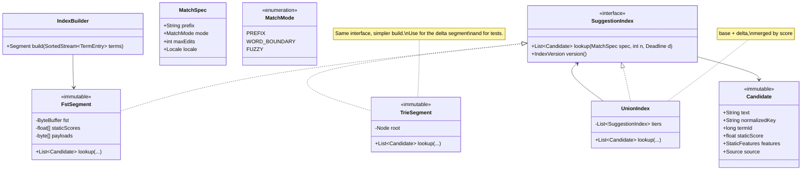
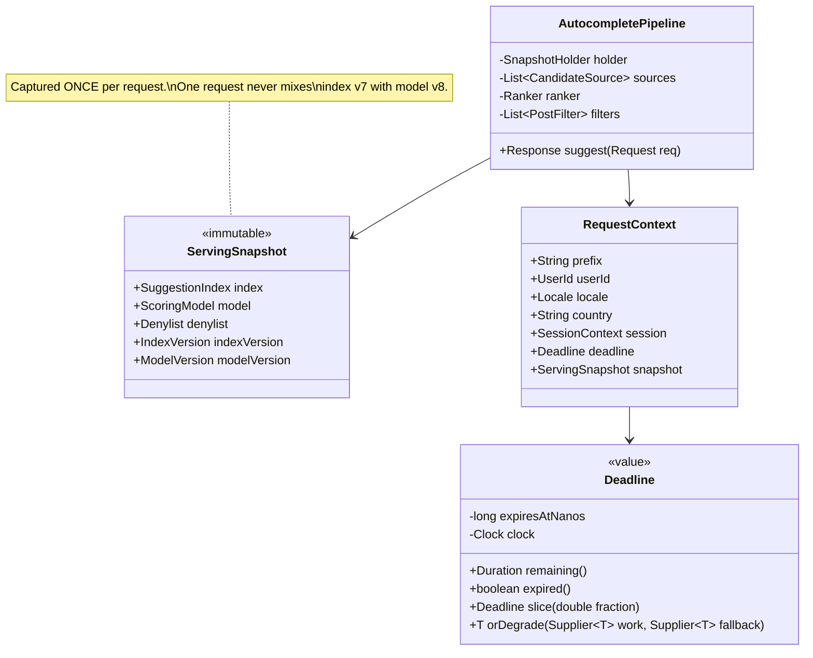
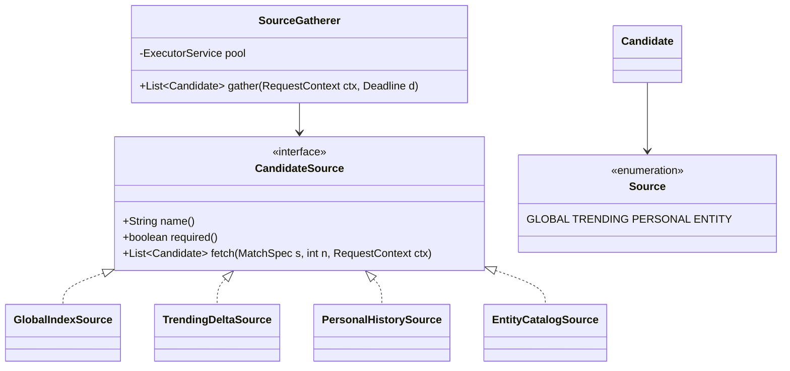
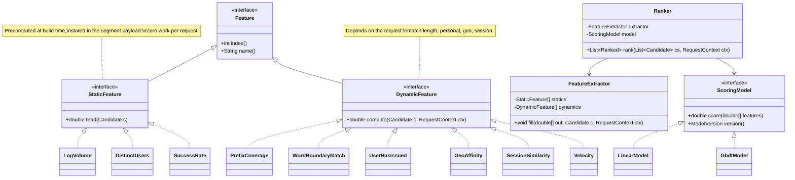
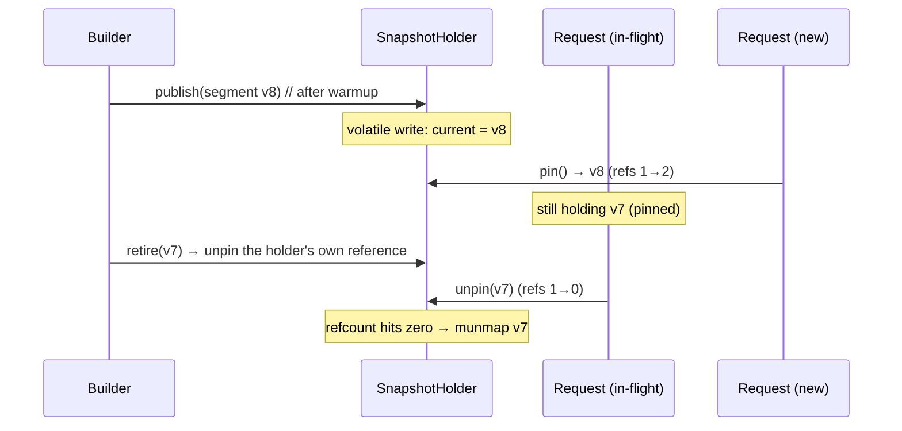
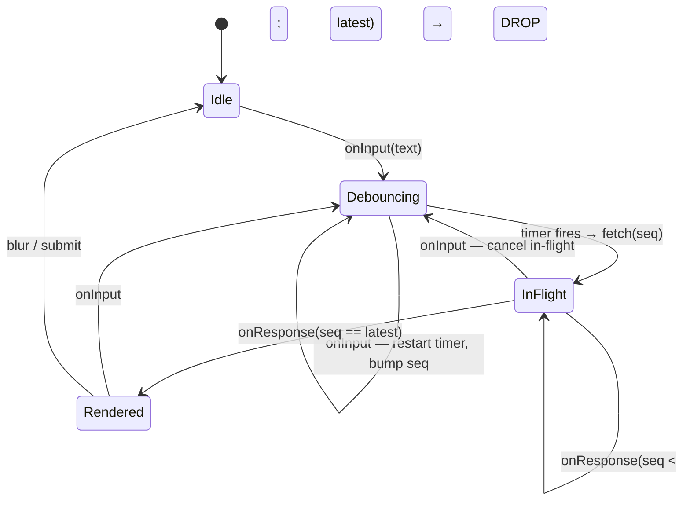

# 19. Autocomplete Index & Ranker

[← LLD index](README.md) · [All docs](../README.md)

---

*(added, not from the notebook)*

The class design inside
[39. Search Autocomplete with Relevance](../hld/39-search-autocomplete.md). The HLD argues
for a two-stage generate-then-rank pipeline; this is the code, and it is shaped by three
constraints that most LLD problems do not have:

1. **There is a hard deadline, and being late is worse than being wrong.** Every stage must
   be able to give up and return something. That makes the *budget* a first-class object
   passed down the call stack, not a timeout on each individual call.
2. **The read path must not take a lock.** At 200k QPS a mutex on the index is the whole
   design. The answer is not a finer-grained lock — it is **no shared mutable state at all**:
   an immutable segment behind a volatile reference.
3. **Half the latency bug surface is on the client.** The most common defect in a real
   typeahead is not slow ranking; it is the dropdown showing results for a prefix the user
   stopped typing two keystrokes ago.

- [Requirements](#requirements)
- [Design decision: mutable trie vs immutable segment](#design-decision-mutable-trie-vs-immutable-segment)
- [Class model](#class-model) — [index](#1-the-index-immutable-segments) · [pipeline](#2-the-request-pipeline-a-deadline-is-an-object) · [sources](#3-candidate-sources-required-vs-optional) · [ranker](#4-the-ranker-static-vs-dynamic-features) · [filters](#5-post-filters-order-matters)
- [Concurrency: swap, pin, retire](#concurrency-swap-pin-retire)
- [The client controller](#the-client-controller) ← *the bug this problem is really about*
- [Testing](#testing)
- [What actually fails candidates](#what-actually-fails-candidates)
- [Extensions](#extensions)

## Requirements

**i) Functional**

- (a) `suggest(prefix, context) → List<Suggestion>` of size ≤ 10, ranked
- (b) Candidates from several sources — global index, trending delta, the user's history,
  an entity catalog — merged and ranked together
- (c) Scoring is a **pluggable model** over a feature vector, swappable for A/B without an
  index rebuild
- (d) Post-processing: suppression, near-duplicate collapsing, diversity, slot constraints
- (e) The index is **replaced**, never mutated: build a new segment, swap it in, retire the old
- (f) A suppression list can be updated independently of the index, within seconds

**ii) NFR**

- (a) **p99 < 50 ms**, and a stage that cannot finish in budget must **degrade, not fail**
- (b) The read path takes **no locks** and allocates as little as possible
- (c) A single request sees **one consistent** (index, model, denylist) triple
- (d) Swapping an index must not spike p99 or free memory a reader is still using
- (e) Adding a candidate source or a feature must not modify existing classes
- (f) Deterministic and testable — injected `Clock`, no wall-clock reads inside the pipeline

**Out of scope** — the index *build* pipeline (offline, a different program), model training,
and the network/RPC layer. Say it; scoping is graded.

## Design decision: mutable trie vs immutable segment

The instinct is a trie with `insert()` and a cached top-K per node. It is the right teaching
structure and the wrong serving structure, and being able to say exactly why is the point:

```java
// the anti-design
class TrieNode {
    Map<Character, TrieNode> children = new HashMap<>();
    List<Candidate> topK = new ArrayList<>();          // mutable cache
}
void insert(String term, double weight) {
    // walk down, then walk back up re-computing topK on EVERY ancestor
    // …under a write lock that every reader now contends on
}
```

Three separate problems: an insert invalidates the cached top-K of **every ancestor prefix**,
so a single update is O(len × K) writes; the read path now needs a lock or a concurrent map,
on the hottest path in the system; and there is no version boundary, so a request can observe
a half-applied update.

| | **Immutable segment + swap** (recommended) | **Mutable trie** |
|---|---|---|
| Read path | lock-free, one volatile read | lock or concurrent structure |
| Update | build offline, atomic pointer swap | in place, invalidating ancestors |
| Freshness | limited by build cadence (minutes) | immediate |
| Rollback | swap the pointer back | not possible |
| Memory | shared prefixes *and* suffixes (FST), mmap-able, off-heap | pointer-heavy, GC pressure |
| Consistency | a request sees exactly one version | can observe a partial update |

Pick immutable, and get freshness from a **second small segment** rather than from mutability:
a delta segment rebuilt every few minutes and unioned at query time. The pattern generalises —
it is the same "small mutable tier in front of a large immutable one" as an LSM tree's memtable.

## Class model

### 1) The index: immutable segments



The teaching structure, built once and then frozen — note there is no `insert`:

```java
final class TrieSegment implements SuggestionIndex {
    /** Built bottom-up by the builder; every field final, never touched again. */
    private record Node(Map<Character, Node> children, Candidate[] topK) {}

    private final Node root;
    private final IndexVersion version;

    public List<Candidate> lookup(MatchSpec spec, int n, Deadline d) {
        Node cur = root;
        for (char c : spec.prefix().toCharArray()) {
            cur = cur.children().get(c);
            if (cur == null) return List.of();
        }
        // topK is materialized at build time — no traversal of the subtree at query time
        return Arrays.asList(cur.topK()).subList(0, Math.min(n, cur.topK().length));
    }
}
```

`topK` is `final` and produced by the builder in one bottom-up pass, merging children's
arrays — a k-way merge of already-sorted lists, so the whole index is built in
O(total terms × K). That it is a *build-time* artifact rather than a *maintained cache* is
the entire difference between the two designs.

`FstSegment` is the production form: the same interface over a memory-mapped transducer, so
the 4 GB index is off-heap, shared between processes, and paged by the OS. Keeping both
behind `SuggestionIndex` means the trie stays as the reference implementation that tests
assert the FST against — a differential test is far more valuable here than hand-written
expectations.

`UnionIndex` composes tiers (base + delta) and is where "merge two sorted candidate lists by
static score" lives, once.

### 2) The request pipeline: a deadline is an object



```java
public Response suggest(Request req) {
    RequestContext ctx = new RequestContext(req, holder.pin(), new Deadline(clock, BUDGET));

    List<Candidate> cands = gather(ctx, ctx.deadline().slice(0.55));   // ~25 ms
    if (cands.isEmpty()) return Response.empty(ctx.snapshot());

    List<Ranked> ranked = ctx.deadline().orDegrade(
            () -> ranker.rank(cands, ctx),                             // ~5 ms
            () -> Ranked.byStaticScore(cands));                        // the degradation

    for (PostFilter f : filters) ranked = f.apply(ranked, ctx);        // ~2 ms
    return Response.of(ranked.subList(0, min(K, ranked.size())), ctx.snapshot());
}
```

Three things that are deliberate:

- **One `Deadline` for the whole request, sliced per stage** — not a timeout per downstream
  call. Per-call timeouts compose into a total that is the *sum* of the timeouts, which is
  never the number you promised. A shared deadline means a slow first stage automatically
  squeezes the later ones, which is the behaviour you actually want.
- **`orDegrade` makes the fallback explicit at every stage.** A ranker that overruns returns
  static-score order — a worse list, on time. This is the code-level expression of the HLD's
  degradation ladder, and having it in the type rather than in a comment is what makes it
  survive contact with a deadline.
- **`ServingSnapshot` is pinned once.** Reading `index` and `model` as separate volatile
  fields at different moments lets a single request score index-v7 candidates with a
  model trained on v8's feature layout. That produces subtly wrong rankings and no error
  anywhere. Capture the triple atomically.

### 3) Candidate sources: required vs optional



```java
List<Candidate> gather(RequestContext ctx, Deadline d) {
    List<Future<List<Candidate>>> futures = sources.stream()
            .map(s -> pool.submit(() -> s.fetch(ctx.matchSpec(), N_PER_SOURCE, ctx)))
            .toList();

    List<Candidate> all = new ArrayList<>();
    for (int i = 0; i < sources.size(); i++) {
        CandidateSource s = sources.get(i);
        try {
            all.addAll(futures.get(i).get(d.remaining().toMillis(), MILLISECONDS));
        } catch (TimeoutException | ExecutionException e) {
            futures.get(i).cancel(true);
            metrics.sourceDropped(s.name());
            if (s.required()) throw new SourceUnavailable(s.name(), e);   // global index down
            // optional source: proceed without it. A missing personal
            // list is a slightly worse ranking; waiting for it is a broken feature.
        }
    }
    return dedupeByTermId(all);
}
```

The `required()` flag is the whole design of this class. The global index failing is an
error worth surfacing; the personal-history service being slow is *expected*, and the correct
behaviour is to ship the response without it. Treating all sources alike gives you either a
pipeline that fails when a nice-to-have is down, or one that silently returns nothing when
the essential source is.

Note the `MatchSpec` is passed *down* rather than each source parsing the prefix: fuzzy
escalation is decided once, centrally — exact first, widen only if the exact pass is thin —
so sources cannot individually decide to be expensive.

### 4) The ranker: static vs dynamic features



```java
public List<Ranked> rank(List<Candidate> cs, RequestContext ctx) {
    double[] fv = new double[extractor.size()];        // one buffer, reused across candidates
    List<Ranked> out = new ArrayList<>(cs.size());
    for (Candidate c : cs) {
        extractor.fill(fv, c, ctx);
        double s = ctx.snapshot().model().score(fv);
        out.add(new Ranked(c, s, ctx.logFeatures() ? fv.clone() : null));
    }
    out.sort(comparingDouble(Ranked::score).reversed());
    return out;
}
```

Four decisions worth defending:

- **The static/dynamic split is the performance design.** Popularity, distinct-user count and
  historical success rate are the same for every request, so they are computed by the build
  pipeline and stored in the segment payload — read as an array offset, not computed. Only
  the request-dependent features cost anything at serve time. Getting this backwards (a
  `PopularityFeature` that hits a store per candidate) is 200 lookups on a 5 ms budget.
- **Features are an indexed array, not a `Map<String, Double>`.** At 200 candidates × 40
  features × 200k QPS, boxing and hashing are the profile. `Feature.index()` is assigned once
  at registry construction, and the model's coefficient array is validated against the
  registry at load — a mismatch is a startup failure, not a silently wrong score.
- **`ScoringModel` is a strategy behind a version.** A/B is two model artifacts, one index;
  the winner is a config change.
- **Log the feature vector that was actually scored** (sampled). Recomputing features offline
  from logs to build training data is how training/serving skew gets in — the vector you
  scored is the only one that is definitionally correct.

### 5) Post-filters: order matters

```java
public interface PostFilter {
    List<Ranked> apply(List<Ranked> in, RequestContext ctx);
}
```

The chain, and the order is load-bearing:

| # | Filter | Why here |
|---:|---|---|
| 1 | `DenylistFilter` | versioned separately from the index; also applied at candidate generation — **defence in depth**, because the two lists update on different clocks |
| 2 | `NearDuplicateFilter` | collapse on `normalizedKey`, keep the highest-scoring surface form |
| 3 | `DiversityFilter` | cap per-intent slots after duplicates are gone, not before |
| 4 | `SlotConstraintFilter` | ≤ 3 personal, ≥ 6 global — applied on the ranked list |
| 5 | *truncate to K* | **last** |

```java
static String normalizedKey(String s) {
    return Normalizer.normalize(s, Normalizer.Form.NFKC)
            .toLowerCase(Locale.ROOT)
            .replaceAll("\\p{Punct}", "")
            .replaceAll("\\s+", " ")
            .trim();
}
```

**Truncating before deduping is the classic bug**: take the top 10, then collapse
`"iphone 15"` / `"iphone15"` / `"i phone 15"`, and render six suggestions in a ten-slot
dropdown. Filter on the full ranked list, truncate once, at the end.

## Concurrency: swap, pin, retire

Most problems in this notebook end with the same ladder — one coarse lock, then a read/write
split, then per-entity locks. **This one does not**, and saying why is the interesting part:
the read path has no shared mutable state to protect. The index is immutable; publishing a
new one is a single reference assignment. That is copy-on-write / RCU, and it is strictly
better than any lock here because readers pay nothing at all.

The one genuine hazard is **retiring a segment while requests are still reading it** — with
a memory-mapped FST, unmapping under a live reader is a segfault, not a stale read.



```java
final class SnapshotHolder {
    private volatile ServingSnapshot current;          // the only mutable field

    ServingSnapshot pin() {
        for (;;) {
            ServingSnapshot s = current;               // one volatile read
            if (s.tryPin()) return s;                  // CAS refs 0→fail, n→n+1
            // lost a race with retirement; re-read and try the new one
        }
    }

    void publish(ServingSnapshot next) {
        ServingSnapshot prev = current;
        current = next;                                // readers see it from here on
        prev.unpin();                                  // drop the holder's own reference
    }
}
```

Two details that are easy to get wrong and worth volunteering:

- **`tryPin` must be a CAS that refuses to resurrect zero**, not a plain increment. A reader
  that reads `current` a nanosecond before a swap and increments a refcount that already hit
  zero has revived a freed mapping. The retry loop re-reads `current` and gets the new
  segment — correct, and lock-free.
- **Warm before publishing.** A freshly mapped 4 GB segment is entirely cold; the first
  thousand requests take page faults and p99 goes to hundreds of milliseconds on every deploy.
  The builder touches the pages (or replays a sample of production prefixes) *before* calling
  `publish`, and the node stays out of the load balancer until warmup completes. Index swap
  is one of the few operations here that can hurt p99 more than a bad query.

The pieces that *do* need ordinary synchronization are small and off the hot path: the
denylist (a `volatile` reference to an immutable set — same pattern, different cadence) and
the per-user personal index (a bounded LRU, striped locks, and a miss is simply an absent
optional source).

## The client controller

The bug this problem is actually about, and the one candidates who have only read about tries
never mention.

The user types `c`, `o`, `r`, `o`, `n`. Five requests are in flight. Responses arrive out of
order — the response for `"cor"` takes 180 ms, the response for `"coron"` takes 20 ms — and a
naive handler renders `"coron"`'s results, then overwrites them with `"cor"`'s. The dropdown
now shows suggestions for a prefix the user left two keystrokes ago, and it looks like a
ranking bug rather than a race.



```java
final class TypeaheadController {
    private long nextSeq = 0;
    private long lastRenderedSeq = -1;
    private String currentText = "";
    private ScheduledFuture<?> debounce;
    private Cancellable inFlight;

    void onInput(String text) {
        currentText = text;
        if (debounce != null) debounce.cancel(false);
        if (inFlight != null) inFlight.cancel();               // free the connection early

        renderProvisional(localCache.filterFor(text));         // instant, may be wrong

        debounce = scheduler.schedule(() -> {
            long seq = ++nextSeq;
            inFlight = client.suggest(text, seq, (s, resp) -> onResponse(s, text, resp));
        }, DEBOUNCE_MS, MILLISECONDS);
    }

    private void onResponse(long seq, String requestedFor, Response resp) {
        if (seq <= lastRenderedSeq) return;                    // ← stale: a slower earlier request
        if (!currentText.startsWith(requestedFor)) return;     // ← user has moved on entirely
        lastRenderedSeq = seq;
        localCache.put(requestedFor, resp);
        render(resp);
    }
}
```

Four things carrying weight:

- **Monotonic sequence numbers with a `lastRenderedSeq` high-water mark.** Never render a
  response older than what is on screen. This is the same check-then-act discipline as
  everywhere else in this notebook, just against *time* rather than against state.
- **The second guard is not redundant.** The sequence check handles reordering; the
  `startsWith` check handles the user having deleted characters or pasted something new, where
  a newer sequence number can still be for the wrong text.
- **Cancel in flight on every keystroke.** Not for correctness — the guards handle that — but
  because six abandoned in-flight requests per query is exactly the multiplier that made the
  QPS number in the HLD as large as it is.
- **The provisional render is explicitly allowed to be wrong.** Filtering the cached list for
  `"cor"` down to `"coro"` is instant and usually right; the real response replaces it. What
  it must never do is *stay* — the provisional render and the authoritative one are two
  states, not two sources of truth.

Debounce interval is injected config, not a constant, so the server can raise it under load —
the load-shedding lever from the HLD, which only exists if the client reads it from the
response.

## Testing

- **Differential test**: build the same term set into `TrieSegment` and `FstSegment`, assert
  identical output for a large prefix corpus. The simple structure is the oracle for the fast
  one — far better than hand-written expectations, which encode the same misunderstanding
  twice.
- **Golden ranking fixtures**: `(candidates + context) → expected order`, per model version.
  A model change that reorders a fixture must be an explicit diff in review.
- **Deadline injection**: a `ManualClock` plus a source that sleeps past its slice — assert
  the response is *static-score order*, on time, with the degradation metric incremented.
  Every fallback branch needs a test, because in production it only runs when things are
  already going badly.
- **Swap under load**: hammer `pin()` from many threads while publishing and retiring
  segments; assert no reader ever sees a retired segment and the refcount reaches zero exactly
  once. This is the test that catches a plain-increment `tryPin`.
- **Out-of-order client responses**: deliver a slow early response after a fast late one and
  assert the dropdown shows the late one. One test, the most valuable in the file.
- **Filter order**: assert the response has exactly K entries when duplicates exist — the
  regression test for truncate-before-dedup.

## What actually fails candidates

- **A mutable trie with a lock on the read path** — and no answer for what an `insert` does to
  every ancestor's cached top-K.
- **A timeout per downstream call instead of one shared budget**, so the "50 ms" service
  routinely takes 200.
- **No degradation branch.** If the ranker cannot fail open to static order, the deadline
  is decoration.
- **Computing static features per request** — 200 store lookups on a 5 ms budget.
- **Reading index and model versions separately**, so a request mixes them.
- **Publishing a segment without warmup or refcounting** — a p99 cliff on every deploy, or a
  segfault under one.
- **Truncating before deduping.**
- Treating every candidate source as **required**, so an optional dependency's latency
  becomes yours.
- **Forgetting the stale-response race on the client** — the defect users actually report.
- A `Map<String, Double>` feature vector at 200k QPS.

## Extensions

- **Fuzzy matching** as a `MatchMode`: intersect the FST with a Levenshtein automaton, and
  escalate `PREFIX → FUZZY(1) → FUZZY(2)` only while the candidate count is below target and
  the deadline allows. The escalation policy lives in one place, not in each source.
- **Word-boundary matching** by indexing each word-boundary suffix as an extra entry pointing
  at the same `termId` — hence `termId` on `Candidate`, and hence deduping by `termId` in the
  gatherer rather than by string.
- **Per-vertical sharding** when the entity catalog outgrows memory: `SuggestionIndex` per
  vertical, a `ScatterGatherIndex` implementing the same interface, and per-vertical deadline
  slices so one slow vertical cannot spend the whole budget.
- **Model registry and A/B**: `ScoringModel` resolved per request from an experiment
  assignment; the model version is already in the response, so log joins work without extra
  plumbing.
- **Feature logging with sampling** for training data, emitting the exact scored vector.
- **A denylist bloom filter** in front of the exact set, so the common (not-suppressed) case
  is a hash and no lookup.
- **Query-time locale routing**: `SuggestionIndex` per language behind a router, with script
  detection choosing the transliterated index for CJK input.

## Related

- [39. Search Autocomplete with Relevance (HLD)](../hld/39-search-autocomplete.md) — the
  system this sits inside: two-stage ranking, the feedback loop, safety, degradation
- [13. Rate Limiter (Full Design)](13-rate-limiter-full-design.md) — the injected `Clock` and
  `step()` seam, reused here for deadline tests
- [12. Logging Service](12-logging-service.md) — bounded queues and shedding, the same
  "degrade rather than block" instinct
- [18. Metric Collection & Normalization Engine](18-metric-normalization-engine.md) —
  immutable versioned artifacts published by a build plane and swapped by a serving plane;
  the same shape as index segments here
- [10. File System](10-file-system.md) — the usual concurrency ladder, for contrast with the
  copy-on-write answer this problem needs
- [LLD appendix](../appendix/lld.md) — concurrency primitives
