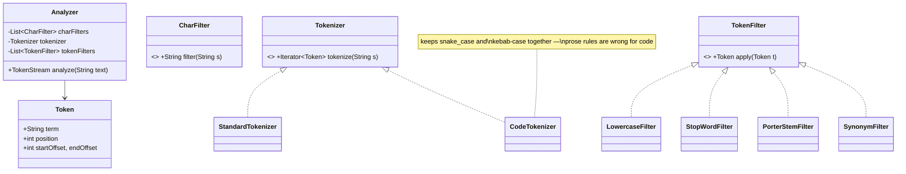
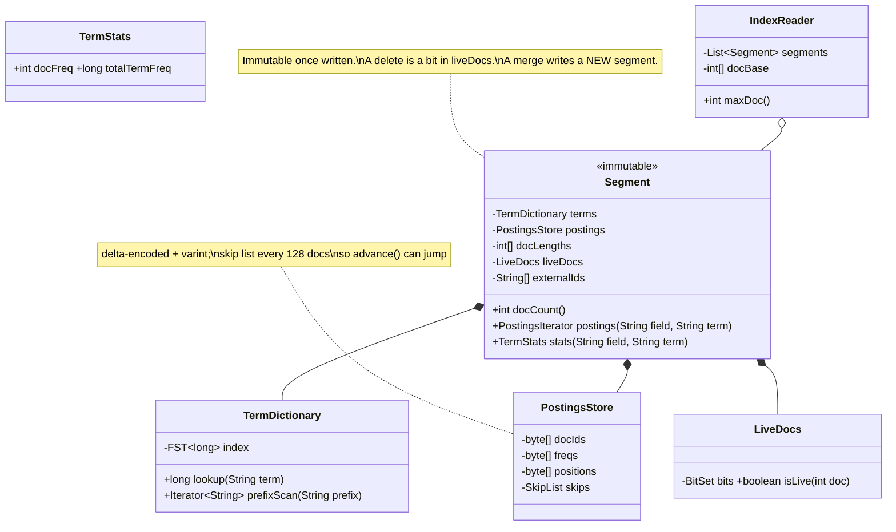
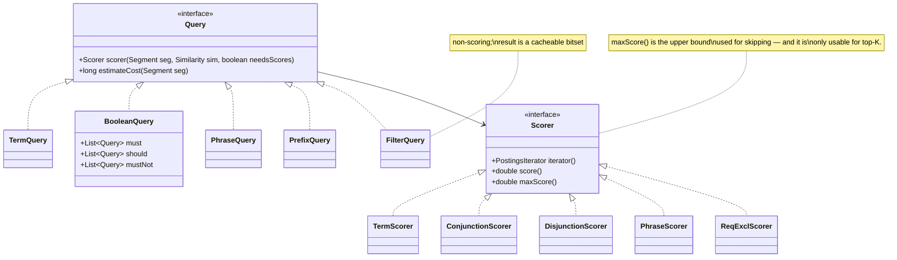
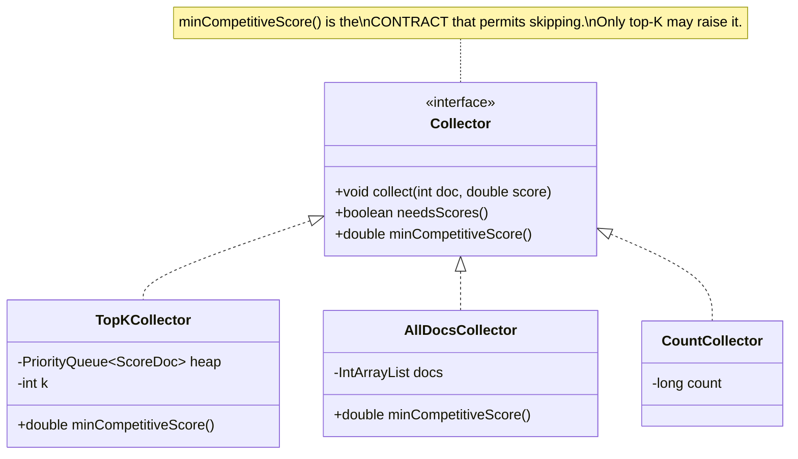
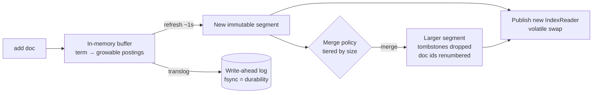

# 20. Inverted Index & Query Evaluator

[← LLD index](README.md) · [All docs](../README.md)

---

*(added, not from the notebook)*

The inside of [40. Full-Text Document Search](../hld/40-document-search.md) — what Lucene is
doing when Elasticsearch answers a query. Build an index over a set of documents, then answer
`"connection refused" AND repo:payments` with **the list of every document that matches**.

The design has one central abstraction and one central consequence.

**The abstraction:** a query does not produce a *set* of documents, it produces an
**iterator over document ids in ascending order**. Every operator — AND, OR, NOT, phrase,
range, filter — is an iterator that composes other iterators. Nothing is ever materialized.
That single decision is why a search engine can answer a three-term query over a hundred
million documents by touching a few thousand of them.

**The consequence:** because the caller wants *all* matches rather than the top ten, the
fastest execution mode in the engine becomes **illegal**. Top-K search skips documents that
cannot beat the current 10th-best score; exhaustive retrieval has no such threshold, so no
document may be skipped. That is not a tuning difference — it changes which code path is
correct, and the design has to make that explicit rather than leaving it as a flag someone
sets wrongly.

- [Requirements](#requirements)
- [Design decision: iterators, not sets](#design-decision-iterators-not-sets)
- [Class model](#class-model) — [analysis](#1-analysis-text--terms) · [the index](#2-the-index-postings-and-segments) · [queries](#3-queries-compose-into-iterators) · [phrases](#4-phrases-and-the-line-boundary) · [scoring](#5-scoring-bm25-behind-a-strategy) · [collectors](#6-collectors-who-decides-what-may-be-skipped)
- [Search across segments, deletes, and doc ids](#search-across-segments-deletes-and-doc-ids)
- [Writing: buffer, flush, refresh, merge](#writing-buffer-flush-refresh-merge)
- [Concurrency](#concurrency)
- [Testing](#testing)
- [What actually fails candidates](#what-actually-fails-candidates)
- [Extensions](#extensions)

## Requirements

**i) Functional**

- (a) `index(docId, List<String> lines)` — build an inverted index over a document's lines
- (b) `search(Query) → all matching document ids`, and separately, top-K by relevance
- (c) Query types: term, **phrase** (must not span a line boundary), boolean
  (`MUST` / `SHOULD` / `MUST_NOT`), prefix, and a non-scoring filter
- (d) Report **which line matched**, for highlighting
- (e) Documents can be updated and deleted
- (f) Relevance scoring, pluggable

**ii) NFR**

- (a) Query cost proportional to the **rarest** term's posting list, not to the corpus
- (b) No result set is ever fully materialized in memory during evaluation
- (c) Reads take no locks; the writer never blocks a reader
- (d) The index survives a crash and reopens (segment + commit point)
- (e) Adding a query type must not modify existing query types or the searcher

**Out of scope** — distribution and sharding (that is the [HLD](../hld/40-document-search.md)),
on-disk byte formats and compression codecs beyond naming them, and the query *parser*
(string → `Query` tree is a separate, well-understood problem —
see [15. Rule Engine](15-rule-engine.md) for that shape).

## Design decision: iterators, not sets

The instinct is to make each term return a `Set<Integer>` and intersect:

```java
// the anti-design
Set<Integer> result = new HashSet<>(postings.get("connection"));
result.retainAll(postings.get("refused"));
result.retainAll(postings.get("timeout"));
```

It is correct and it is unusable. `postings.get("connection")` materializes a list that may
hold ten million ids; `retainAll` walks all of them; and you have paid for the *most common*
term in the query even though the rarest one might match only forty documents. It also cannot
stream, cannot skip, and cannot stop early.

| | **Iterator composition** (recommended) | **Materialized sets** |
|---|---|---|
| Memory | O(number of leaves) | O(largest posting list) |
| Cost driver | the **rarest** term | the **most common** term |
| Skipping | `advance(target)` jumps via skip lists | impossible |
| Early termination | natural (collector-driven) | impossible |
| New operator | a new iterator class | a new set operation, plus memory |
| Streaming results | yes | no |

The interface is small enough to write from memory, and everything else in this document is
an implementation of it:

```java
public interface PostingsIterator {
    int NO_MORE_DOCS = Integer.MAX_VALUE;   // sentinel: makes loops terminate without special cases

    int docId();                 // current doc, or NO_MORE_DOCS
    int nextDoc();               // advance to the next matching doc
    int advance(int target);     // first matching doc >= target  ← the important one
    long cost();                 // estimated number of matches, for planning
}
```

`advance(target)` is what makes the whole thing fast: backed by a **skip list** over the
posting list, it jumps forward without decoding the ids in between. And `NO_MORE_DOCS` being
`Integer.MAX_VALUE` rather than `-1` is deliberate — an exhausted iterator compares greater
than every real doc id, so the intersection loop below needs no termination special case.

## Class model

### 1) Analysis: text → terms

The same pipeline shape as the [metric transform chain](18-metric-normalization-engine.md)
and the [logging service](12-logging-service.md) formatters — a composed chain, configured
rather than hard-coded, because index-time and query-time must use *the same* one.



The two rules that cause most "why doesn't this match" bugs:

- **The same `Analyzer` instance configuration must run at index time and query time.** If
  indexing stems `running → run` and the query does not, the term simply is not there. Make
  the analyzer a property of the *field*, resolved from the schema in both paths, so the two
  cannot drift.
- **Position and offset are different things.** *Position* is the token's ordinal, used for
  phrase matching. *Offset* is the character range in the original text, used for
  highlighting. You need both, and conflating them produces highlights that drift by a few
  characters on every stop word.

### 2) The index: postings and segments



The physical layout for one term, which is worth being able to sketch:

```
term "refused"  →  docFreq = 3
   docIds    (delta+varint)   [ 12, +79, +311 ]        → 12, 91, 402
   freqs                      [  1,   1,    2 ]
   positions (delta+varint)   [ [9], [8], [17, 240] ]
```

**Delta encoding is why this fits.** Doc ids are strictly ascending, so store the gaps;
gaps are small, so varint or PFor-delta packs them into a byte or two. A posting list of ten
million ids becomes ~10 MB instead of 40 MB, and it decodes at memory bandwidth.

**Skip lists are why `advance` is cheap.** Every 128 documents, record `(docId, byte offset)`.
`advance(50000)` binary-searches the skip entries, seeks, and decodes one block — instead of
decoding fifty thousand deltas.

`TermDictionary` as an FST is the same structure as the
[autocomplete index](19-autocomplete-index-and-ranker.md#1-the-index-immutable-segments), and
for the same reasons: shared prefixes and suffixes, memory-mappable, and it supports prefix
scans and automaton intersection — which is where `PrefixQuery` and fuzzy matching come from.

### 3) Queries compose into iterators



`BooleanQuery` is a composite — `must` / `should` / `mustNot` each hold `Query` children, so
arbitrary nesting is free. Same shape as the [rule engine](15-rule-engine.md)'s expression
tree; the difference is that evaluation produces an iterator rather than a value.

**Conjunction — the leapfrog.** The algorithm every candidate should be able to write:

```java
final class ConjunctionIterator implements PostingsIterator {
    private final PostingsIterator[] its;   // sorted by cost() ASCENDING — rarest term first
    private int doc = -1;

    public int nextDoc() { return advance(doc + 1); }

    public int advance(int target) {
        int candidate = its[0].advance(target);          // the rarest term proposes
        while (candidate != NO_MORE_DOCS) {
            boolean agreed = true;
            for (int i = 1; i < its.length; i++) {
                int d = its[i].advance(candidate);       // every other term must agree
                if (d != candidate) {                    // it overshot — new candidate
                    candidate = its[0].advance(d);
                    agreed = false;
                    break;
                }
            }
            if (agreed) return doc = candidate;
        }
        return doc = NO_MORE_DOCS;
    }
}
```

Two details carry the performance:

- **Sort the sub-iterators by `cost()` ascending.** The rarest term drives the loop, so a
  query for `"the" AND "xyzzy"` costs roughly the length of `xyzzy`'s postings, not `the`'s.
  Skipping this sort is the single biggest self-inflicted slowdown in a hand-written engine —
  it is correct either way, which is why it survives code review.
- **When a term overshoots, jump the driver to *its* position** rather than stepping by one.
  That is the "leapfrog": both sides skip forward, and neither ever decodes the gap.

**Disjunction** is a min-heap keyed on `docId()`: pop the smallest, advance it, push it back,
collect every iterator currently sitting on that doc so their scores can be summed.
**`MUST_NOT`** is `ReqExclScorer` — a required iterator with an excluded one advanced in
lockstep, skipping any doc where both agree. Note it is a *filter over* the required
iterator, never a set complement: there is no such thing as "iterate the documents that do
not contain X" without walking the entire corpus.

### 4) Phrases and the line boundary

Phrase matching is two stages, and the order matters: **intersect on documents first, then
check positions.** Positions are the expensive data; only decode them for documents that
already contain every term.

```java
final class PhraseScorer implements Scorer {
    private final ConjunctionIterator docs;      // stage 1: all terms present
    private final PositionsIterator[] posns;     // stage 2: adjacency, per candidate doc
    private final int slop;

    boolean matchesPhrase() {
        // For a two-term phrase: does some p in posns[0] have p+1 in posns[1]?
        // Generalized: align each term by subtracting its offset in the phrase,
        // then look for a position all terms agree on (within slop).
        for (int p : posns[0]) {
            boolean ok = true;
            for (int i = 1; i < posns.length && ok; i++)
                ok = posns[i].seekTo(p + i) && posns[i].position() - i - p <= slop;
            if (ok) { lastMatchPosition = p; return true; }
        }
        return false;
    }
}
```

**The line-boundary requirement falls out of the indexing, not the query.** Index each
document's lines as separate values of the same field, inserting a **position gap** between
them:

```java
int position = 0;
for (String line : doc.lines()) {
    for (Token t : analyzer.analyze(line)) postings.add(term(t), docId, position++);
    position += POSITION_GAP;        // 100 — larger than any phrase or slop
    lineStarts.add(position);        // for mapping a match position back to a line number
}
```

Two terms on consecutive lines are now 100+ positions apart, so a phrase query with slop 0
cannot match across the break — the requirement enforced by arithmetic rather than by a check
anyone can forget. This is exactly what `position_increment_gap` does in Elasticsearch.
`lineStarts` is a sorted array, so a matched position binary-searches to a line number in
O(log lines) — which is how you answer *"which line matched?"* and produce the highlight.

### 5) Scoring: BM25 behind a strategy

```java
public interface Similarity {
    double score(int tf, int docLength, TermStats stats, CollectionStats coll);
}

final class BM25Similarity implements Similarity {
    private final double k1 = 1.2, b = 0.75;

    public double score(int tf, int dl, TermStats t, CollectionStats c) {
        double idf  = Math.log(1 + (c.docCount() - t.docFreq() + 0.5) / (t.docFreq() + 0.5));
        double norm = tf + k1 * (1 - b + b * dl / c.avgDocLength());
        return idf * (tf * (k1 + 1)) / norm;
    }
}
```

Both parameters exist to fix a specific TF-IDF failure:

- **`k1` saturates term frequency.** Without it, a file containing `timeout` two hundred times
  outranks the file that actually explains the timeout. The 50th occurrence should add almost
  nothing over the 10th.
- **`b` normalizes by length.** Without it, long documents win everything simply by containing
  more words.

`Similarity` is a strategy so `BooleanSimilarity` (constant score — for filters) and
`ConstantScore` slot in without touching a scorer. That matters more than it sounds: an
exhaustive "return all matches" query does not need scores at all, and the cheapest score is
the one never computed.

### 6) Collectors: who decides what may be skipped

The seam the whole problem statement turns on.



```java
final class TopKCollector implements Collector {
    private final PriorityQueue<ScoreDoc> heap;   // min-heap of size k
    public boolean needsScores() { return true; }
    public void collect(int doc, double score) {
        if (heap.size() < k)                   heap.add(new ScoreDoc(doc, score));
        else if (score > heap.peek().score()) { heap.poll(); heap.add(new ScoreDoc(doc, score)); }
    }
    /** Once full, nothing below the heap's worst can make the results. Skip it. */
    public double minCompetitiveScore() {
        return heap.size() < k ? Double.NEGATIVE_INFINITY : heap.peek().score();
    }
}

final class AllDocsCollector implements Collector {
    private final IntArrayList docs = new IntArrayList();
    public boolean needsScores() { return false; }        // caller wants the list, not a ranking
    public void collect(int doc, double score) { docs.add(doc); }
    /** Every match must be returned, so NOTHING may be skipped — ever. */
    public double minCompetitiveScore() { return Double.NEGATIVE_INFINITY; }
}
```

The scorer consults `minCompetitiveScore()` and uses each sub-scorer's `maxScore()` upper
bound to skip whole blocks of postings that cannot possibly clear the bar — this is
**block-max WAND**, and on a top-10 query it routinely skips 90 % of the postings.

**With `AllDocsCollector` that bar never rises, so no block is ever skipped, and the query
degrades to a full walk of the intersection.** That is not a bug to fix — it is the definition
of exhaustive retrieval. What matters is that the design makes it *structural*: the collector
declares what it needs and the scorer obeys. The failure mode to avoid is a WAND
implementation that skips based on a top-K assumption while an exhaustive collector is
attached, which silently returns an incomplete answer — no error, no crash, just missing
documents that nobody notices for a year.

Three consequences worth stating out loud, because they are the LLD-level restatement of the
[HLD's "returning all matches"](../hld/40-document-search.md#returning-all-matches) section:

1. **Exhaustive retrieval is priced per match, not per result.** A million matches costs a
   million `collect` calls, whatever the caller ultimately reads.
2. **Ask for scores only if you need them.** `needsScores() == false` lets the scorer skip
   frequency and norm decoding entirely — often a 2–3× saving on a pure "which documents
   match" query.
3. **Stream, don't accumulate.** `AllDocsCollector` holding an `IntArrayList` of a million ids
   is 4 MB and fine; ten million per concurrent query is not. Make the collector a consumer
   callback so results can be written straight to the caller.

## Search across segments, deletes, and doc ids

```java
void search(Query q, Collector collector) {
    for (int i = 0; i < reader.segments().size(); i++) {
        Segment seg = reader.segments().get(i);
        int docBase = reader.docBase()[i];                     // ← segment-local → global
        Scorer scorer = q.scorer(seg, similarity, collector.needsScores());
        PostingsIterator it = scorer.iterator();
        LiveDocs live = seg.liveDocs();

        for (int d = it.nextDoc(); d != NO_MORE_DOCS; d = it.nextDoc()) {
            if (!live.isLive(d)) continue;                     // ← deleted: tombstone, not removal
            collector.collect(docBase + d, collector.needsScores() ? scorer.score() : 0);
        }
    }
}
```

Three traps live in those ten lines:

- **Doc ids are segment-local, dense, and *not stable*.** They are array offsets, they restart
  at 0 in each segment, and a merge renumbers them. Never persist one, never return one to a
  caller, never use one as a foreign key. The external id is a stored field looked up at the
  very end, for the survivors only — which is exactly the two-phase query/fetch split the
  [HLD](../hld/40-document-search.md#query-execution-scatter-gather-fetch) describes, one
  level down.
- **A delete is a bit, not a removal.** The posting lists still contain the document; the
  `liveDocs` bitset filters it at iteration. Space is reclaimed only when a merge rewrites the
  segment. Forgetting the `isLive` check returns deleted documents; forgetting that deletes
  accumulate is why an update-heavy index quietly doubles in size.
- **Term statistics are per segment.** `docFreq` for `"refused"` differs across segments, so
  the same document can score differently depending on which segment it sits in. Usually
  invisible; conspicuous in small indices. The fix is a pre-pass collecting global stats —
  Elasticsearch's `dfs_query_then_fetch`.

## Writing: buffer, flush, refresh, merge



```java
final class IndexWriter {
    private final Map<Term, PostingBuilder> buffer = new HashMap<>();
    private final Translog translog;

    synchronized void add(Document d) {              // single writer
        translog.append(d);                          // durability first
        int localDoc = nextLocalDoc++;
        for (Field f : d.fields())
            for (Token t : analyzerFor(f).analyze(f.value()))
                buffer.computeIfAbsent(term(f, t), k -> new PostingBuilder())
                      .add(localDoc, t.position());
    }

    Segment flush() {                                // sorted terms → immutable segment
        Segment s = SegmentBuilder.build(buffer);    // FST dictionary + delta-encoded postings
        buffer.clear();
        return s;
    }
}
```

The four words are distinct and routinely confused — the same distinction the
[HLD makes operationally](../hld/40-document-search.md#consistency-es-is-not-your-database):

| | Does what | Buys |
|---|---|---|
| **add** | writes the translog, updates the in-memory buffer | nothing visible yet |
| **flush / refresh** | turns the buffer into a new immutable segment and publishes a reader | **visibility** |
| **commit** | fsyncs segments, writes a commit point, truncates the translog | **recoverability** |
| **merge** | rewrites N segments into one, dropping tombstones, renumbering ids | **efficiency** |

**Why immutable segments rather than an updatable index?** Because a mutable posting list
needs a lock on the read path, and reads outnumber writes by orders of magnitude here. An
append-only buffer plus periodic immutable snapshots is the same trade an LSM tree makes, and
the same one the
[autocomplete index](19-autocomplete-index-and-ranker.md#design-decision-mutable-trie-vs-immutable-segment)
makes. The cost is visibility latency (a document is invisible until the next refresh) and
merge write-amplification — both worth it, and both worth naming as costs.

## Concurrency

As with the autocomplete index, the interesting answer is that the usual lock ladder does not
apply: **there is no shared mutable state on the read path.** Segments are immutable, an
`IndexReader` is an immutable list of them, and publishing is one volatile write.

| Component | Approach |
|---|---|
| Read path | lock-free — a volatile read of the current `IndexReader`, then immutable data |
| Writer | **single writer** (one thread, or a lock on `IndexWriter`); no reader ever contends with it |
| Buffer → segment | build off to the side, publish by swapping the reader reference |
| Segment retirement | **refcount pin/unpin**, so a merge cannot delete files a running query is reading |
| Merges | background threads producing new immutable segments; the swap is the only shared moment |

The one real hazard is the same one as in
[LLD 19](19-autocomplete-index-and-ranker.md#concurrency-swap-pin-retire): a merge finishing
while a query iterates the segments it just replaced. The reader pins its segment list for
the life of the query and unpins at the end; a segment's files are deleted only when its
refcount reaches zero. On a memory-mapped index, getting this wrong is a segfault rather than
a stale read — worth saying, because it explains why the refcount is not optional bookkeeping.

Queries parallelize cleanly across segments (each is independent, and the collector merges),
which is the natural intra-node concurrency: partition by segment, not by lock.

## Testing

- **A brute-force oracle.** Keep a trivially correct implementation — scan every document,
  regex the text — and assert the real engine returns exactly the same document set for
  thousands of generated queries. Everything else in the file is an optimization of that
  oracle, so differential testing is the highest-value test here. Same idea as the
  trie-vs-FST differential test in [LLD 19](19-autocomplete-index-and-ranker.md#testing).
- **`advance()` contract tests**: `advance(t)` must return the first doc `>= t`, must be
  monotonic, must be idempotent when `t <= docId()`, and must return `NO_MORE_DOCS` past the
  end. Nearly every intersection bug is really a broken `advance`.
- **Top-K equals exhaustive-then-sort.** Run the same query with `TopKCollector(10)` and with
  `AllDocsCollector` sorted by score, and assert the first ten agree. This is the test that
  catches a WAND optimization skipping something it should not — the failure mode that is
  otherwise invisible.
- **Phrase across a line break** must *not* match; phrase within a line must. The position-gap
  regression test.
- **Deletes**: delete, search (absent), merge, search (still absent), and assert the space was
  reclaimed.
- **Concurrent merge under query**: hammer searches while merging and retiring segments;
  assert no query sees a deleted file and no refcount leaks.

## What actually fails candidates

- **Materializing sets instead of composing iterators** — the answer works on a toy corpus
  and dies on a real one.
- **Not sorting conjunction sub-iterators by cost**, so the common term drives the loop.
- **Decoding positions before intersecting documents** — paying phrase cost on every document
  containing any term.
- **Returning internal doc ids**, which are segment-local and renumbered by every merge.
- **Forgetting `liveDocs`**, so deleted documents come back.
- **Applying top-K skipping under an exhaustive collector** — silently incomplete results,
  the worst failure mode in the file.
- **Not knowing why BM25 has `k1` and `b`**, i.e. treating scoring as a black box.
- **Index-time and query-time analyzers that differ.**
- **A mutable posting list with a lock on the read path.**
- Having no answer for **how a phrase is prevented from spanning a line**, which is the actual
  question asked.

## Extensions

- **Fuzzy and wildcard terms**: intersect a Levenshtein (or wildcard) automaton with the FST
  term dictionary to enumerate matching terms, then union their posting lists — the same
  automaton-over-FST trick as
  [autocomplete](19-autocomplete-index-and-ranker.md#extensions). Cap the expansion
  (`max_expansions`), because a leading wildcard enumerates the entire dictionary.
- **Filter caching**: a non-scoring `FilterQuery` result is a bitset over a segment, and
  segments are immutable — so cache it keyed by `(segment, filter)`. It stays valid for the
  segment's lifetime. This is exactly why `filter` beats `must` in the HLD.
- **Doc values** — a column-oriented, per-field store alongside the inverted index, for
  sorting, faceting and aggregation. The inverted index answers "which documents contain X";
  doc values answer "for these documents, what is field Y". Two access patterns, two layouts.
- **Highlighting** from stored offsets, plus the `lineStarts` binary search to name the line.
- **Field boosts and multi-field queries** — `title^3` is a per-clause multiplier on the
  scorer, not a change to `Similarity`.
- **Block-max WAND** as an explicit opt-in path, selected by `Collector.needsScores()` **and**
  a finite `minCompetitiveScore()`, so it can never engage under an exhaustive collector.
- **Index sorting**: write documents to a segment in a useful order (e.g. by recency) so a
  query sorted the same way can stop early — one of the few legitimate early exits that also
  works without scores.

## Related

- [40. Full-Text Document Search (HLD)](../hld/40-document-search.md) — the system around
  this: mappings, scatter-gather, deep pagination, sharding, and ES as a derived index
- [19. Autocomplete Index & Ranker](19-autocomplete-index-and-ranker.md) — the FST, immutable
  segments, and the pin/retire refcount, in a lower-latency setting
- [15. Rule Engine](15-rule-engine.md) · [16. Spreadsheet](16-spreadsheet-with-formulas.md) —
  the composite expression tree that `BooleanQuery` is another instance of
- [18. Metric Collection & Normalization Engine](18-metric-normalization-engine.md) — the
  analysis chain as a configured pipeline, and immutable artifacts published by a build plane
- [10. File System](10-file-system.md) — the usual lock ladder, for contrast
- [HLD appendix → Elasticsearch](../appendix/hld.md#1-elastic-search-eventual-consistent) —
  segments, DocValues, node roles
