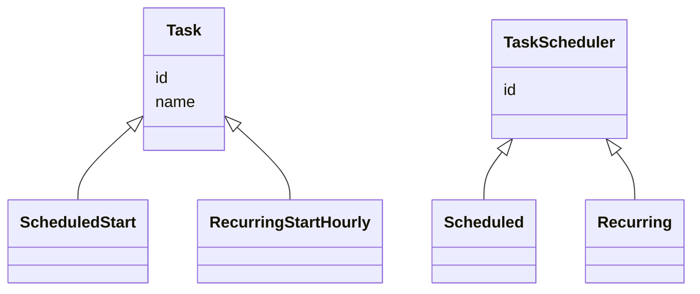
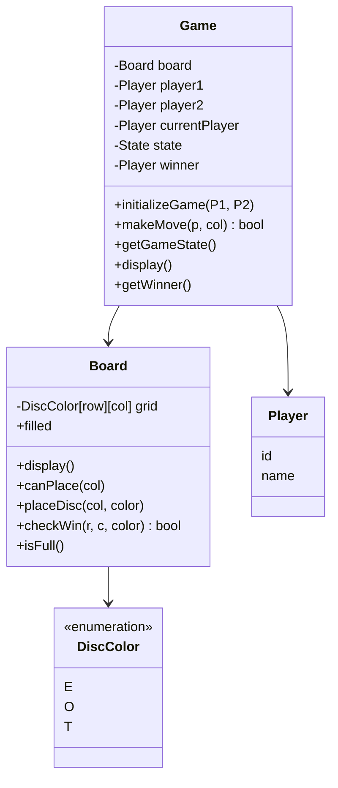
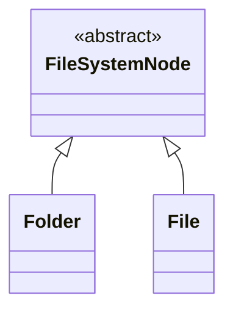
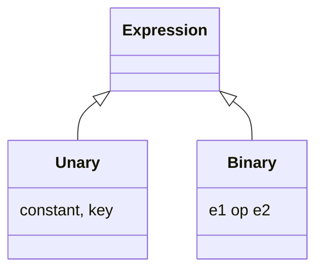
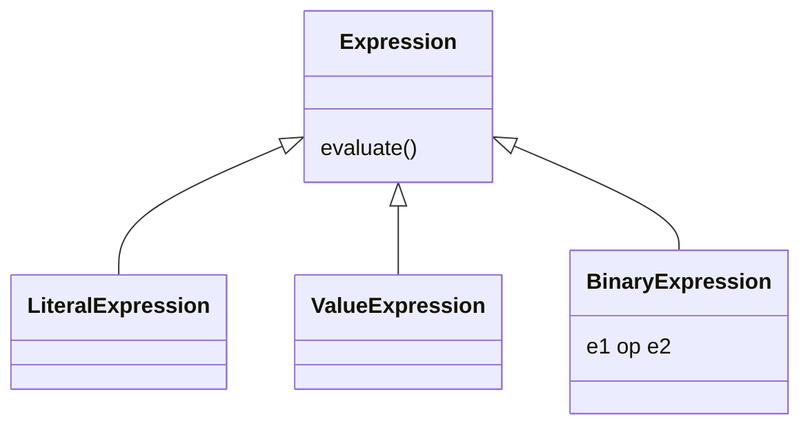

# LLD Problems — Notes

*Transcribed from handwritten Xournal++ notebook (`lld_problems.xopp`), 41 pages.*

## Table of Contents
1. [Task Scheduler](#1-task-scheduler) *(with class diagram)*
2. [Publisher-Subscriber Model](#2-publisher-subscriber-model)
3. [Payment Wallet (LLD)](#3-payment-wallet-lld)
4. [Rate Limiter](#4-rate-limiter) *(title only)*
5. [Google Calendar (Slot)](#5-google-calendar-slot) *(title only)*
6. [Connect Four](#6-connect-four) *(with class diagram)*
7. [Amazon Locker](#7-amazon-locker)
8. [Elevator](#8-elevator)
9. [Parking Lot](#9-parking-lot)
10. [File System](#10-file-system) *(with class diagram)*
11. [Movie Ticket Booking](#11-movie-ticket-booking)
12. [Logging Service](#12-logging-service)
13. [Rate Limiter (Full Design)](#13-rate-limiter-full-design)
14. [Inventory Management](#14-inventory-management)
15. [Build a Rule Engine](#15-build-a-rule-engine) *(with class diagram)*
16. [Design Spreadsheet with Formulas](#16-design-spreadsheet-with-formulas) *(with class diagram)*

*Note: problem numbering resets partway through the notebook (pages restart at "1" around Connect Four, then continue "2, 4, 5, 8, 9, 10..." from Amazon Locker onward) — renumbered here sequentially 1–16 for continuity, with the original in-notes number preserved as a parenthetical where it jumps.*

---

## 1) Task Scheduler

### Requirements

**i) Functional**
- (a) Submit a scheduled Task
- (b) Submit one-time Task (start)
- Run (a) & (b)

**ii) NFR**
- (a) Concurrency, thread safe
- (b) Task failure recovery (retries: 3)
- (c) Logging task lifecycle details

### Core Components / Entities
1. Task (id, name, ...)
2. TaskScheduler (
3. Execution environment
4. API service



**iv) Priority queue, get NextTask**
- Scheduler runs every 30 seconds
- Pulls list of task from PQ
- Dispatches to Resource Manager
- Resource manager returns status
- If scheduling fails / task fails, re-add to the PQ

Base — System clock: 12:00pm

`PQ<Task> → (start-time)`

### API Service
- SubmitService API — always on some server

```
/submit { } → PQ | Tasks (queue/store)
```

Scheduler // OS — singleton on every machine
```
request ↓ (mem, CPU) ↑ accept → Resource Manager (Thread Pool) → Task.execute()
```

30 sec, resources available, waitlist

DB, schema, interfaces
DTO's, concurrency

Task object should have mechanism to arrive at task_state

`TaskStatus execute()`

---

## 2) Publisher-Subscriber Model

### Functional requirements
1. Write to a topic
2. Read from a topic

### NFR
1. Guarantees:
   - (a) At-least — focus on this
   - (b) Exactly
   - (c) At-most
   - Duplicate handling?
2. Scalability / Load
3. Thread safe
4. Ordering
5. Retries (DLQ)
6. Backpressure

### Core Components
- Message (id, message)
- Queue (id)
- write(message, topic)
- read(topic)

Observer pattern can be used
- Notify when message is produced to all the consumers subscribed to the topic

- Initializations (Object lifecycle)
- Application DTOs
- DB — classes, interfaces

---

## 3) Payment Wallet (LLD)

### Functional Requirements
1. Add to wallet
2. Spend from wallet
3. Transaction history
4. Wallet-wallet transfer
5. Multicurrency support?

### NFR
1. Transactional guarantees
   - Atomicity of transactions (concurrency, thread safe)
   - Immutability
   - Retries on failure

### Core Entities
- User
- Wallet (Account)
- TransactionStatus
- Transaction

Saga vs 2PC
Idempotency key

---

## 4) Rate Limiter
*(title only in notes — no further detail recorded)*

---

## 5) Google Calendar (Slot)
*(title only in notes — no further detail recorded)*

---

## 6) Connect Four
*(numbered "1)" in the original notes — likely starts a new session/page group)*

### Requirements
- 7×6 grid
- Players take turns
- Connect 4 of pieces — win

### Entities
- Game
- Grid
- Player

### API
```
Game:
  trackTurn
  takeInput
  endStateReached?
  markCell()

Grid, Player:
  modifyCell
  endStateTraverse
  (POJO)
```

### Class design
- Game
  - Player: P1, P2
  - State
  - Grid

### Clarify
1. Functional
   - How do players interact?
   - How game ends? (draw & win)
2. Edge case / failure handling
3. NFR — concurrency?

### Requirements (refined)
1. Two players take turn, 7×6 board
2. Disc falls to lowest available cell in column
3. Game ends:
   - Win (V, H, D — 4 discs)
   - Draw — board is full
4. Invalid moves:
   - Dropping in full column
   - Moving out of turn
   - Game ends

### Out of scope
- UI support
- Concurrent
- Undo
- Move history
- Configurable board

### Entities & Relationships
- **Game** — Board, P1, P2; whose turn?
  - API for `move`, `gameState`, `display()`
- **Board** — 7×6 grid
  - `makeMove(col, marker)`
  - `display()`
- **Player** — id, disp-name

### Class Design


State enum: `{IN-PROG, WON, DRAW}`
*(checkWin uses DFS to trace 4-in-a-row)*

---

## 7) Amazon Locker
*(numbered "2)" — new session, restart numbering)*

Driver → [box] ← Customer

**Driver**
1. Deposits a package into available compartment
   - (a) Single or multiple
   - (b) Availability — system or human
   - (c) How system selects slot?
   - (d) Slot sizes

**Flow**
1. Customer places order (package)
2. Driver delivers order in compartment
   - (a) Slot is selected
   - (b) Driver places [package]
   - (c) Access code generated, notified (SMS, Email)
3. Customer retrieves package by:
   1. Selecting slot
   2. Entering access code

### Clarify — Edge cases
- (e) Access code expiry?
- (f) 3 times fail
- (g) What if compartments full

### Requirements
1. Driver deposits a package by size (S, M, L)
   - Driver enters size
   - System matches a slot (size)
   - Opens compartment
   - Driver deposits package & closes compartment
   - System generates access code (TTL)
   - Access code sent to customer
2. User retrieves package by entering access code
   - User enters access code
   - Validates
   - Throw exception if code expired, invalid
3. System
   - Monitors & expires code

### Out of scope
- Whether valid package stored (assume it is)
- UI
- Notification system
- Driver access control
- Order management system

### Entities
- Driver (name, id)
- User (name, id)
- Locker
  - Compartment[]
- Compartment
  - isFree
  - size {S, M, L}
  - AccessToken
- AccessToken (code, expiration, package)

### More Clarifying questions + Extensions + Optimizations
1. Is access token a bearer token?
2. Do we need to handle OMS?
3. Address: not handling — 2-phase approach: open → deposit/pickup → close

1. Open expired compartments()
2. Index by accessCode for fast access
3. Index by compartment size + isFree for fast access
4. Non-add-size fallback — change allocation strategy
5. Compartments can break — add state OUT_OF_SERVICE
6. Ensure package is deposited — confirmDeposit API (which can be called via sensor), prompt deposit

---

## 8) Elevator

- Multiple elevators serving different floors
- On request, match a lift ↑↓
- Passenger select destination floors
- Multiple requests, # floors

User, `reqLift(floor, direction)`, Lift
Lift contains: Buttons, Floor, User

### Functional
- Design for single system?
- Lift capacity handling?

### Flow
1. User requests ↑↓ from a floor
2. Appropriate lift returned via match strategy — first available
3. Lift state (which floor?)
   - (a) Do we need to simulate real-time?
   - (b) Keep time tracking out of system
   - (c) System responds to time unit trigger
4. User presses lift destination floor (optional)
5. Do we need to track user?

### Edge cases
1. Multiple destinations?
2. Pressed ↑ but down floor? Cancellations?
3. Same floor — reject!

### Base case
3 elevators, 10 floors

### Requirements
1. System manages 3 elevators, 10 floors
2. User can request from any floor ↑↓, returns a lift
3. User selects destination floor
4. `step()` function
5. Concurrent pickup requests (extend critical section locking)
6. Invalid floors (not possible)

**Note:** Destination request can happen async
⭐ Idle state is important (don't move lift if no requests)

### Out of scope
- Passenger limits
- Lift stop delay
- UI
- Configurability (but can be extended easily to configure if required)
- Lift door mechanics

### LiftService
`// This is responsible for handling requests`
`Map<Lift>`
- `requestLift(fromFloor, direction)`
- `assignLift(strategy)`
- `step()`
- `validateBounds()`
- `requestDestination`

### Lift
- # of floors
- currentFloor
- currentDirection
- upQueue, downQueue — from `requestLift`
- destinationQueue

`step()`
- `onFloorReached` — // process
- `changeDirection()`

⭐ To simplify, keep idle state at TOP or BOTTOM floor only

### Extensions
1. How to add priority floors / express elevator
   - Add LiftType, based on this reject requests & stops
2. How to cancel floor request
   - Add/remove request API
   - `removeLiftCall`
   - `removeDestCall`
3. Multiple lift calls
   - Make all functions critical section using **lock**
   - This will allow only single operation at a time

---

## 9) Parking Lot
*(numbered "4)")*

- Multiple spots

### Flow
- Vehicle enters system
- System assigns available slot
- Vehicle parked in the spot
- Vehicle exits, system calculates fee, frees up spot (by showing ticket)

### Scoping questions — Solution optimized?
1. Only 1 parking slot?
2. Concurrency?
3. Spots of different sizes / cars? Fallback on size? Separate slot types
4. Only single trigger, assume entry & parking as same operation
5. Simulation `step()`?
6. Multiple floor?
7. Fee calculated (rounded to hour), base price, start with simple

### Edge cases
8. Parking is full; ticket is invalid

### Out of scope / Assumptions
- UI
- Third party (payment, physical h/w)
- User service
- The ticket is not lost

### Requirements

**Flow 1**
1. Vehicle enters parking spot (car, truck)
2. System returns valid parking spot (assign)
3. The car is parked in this slot
4. System returns ticket (start-time, vehicle, slot)

**Flow 2**
1. Vehicle exits parking spot, show valid ticket
2. End-time captured, fee calculated
3. Stamped on ticket
4. Slot freed

### System
`step` function for simulation

- **Parking**: slots, addSlots
- **ParkingService**: park, unpark
- **Slot**: slotType, slotId
- **Ticket**: st-time, e-time, fee, slot, vehicle
- **Vehicle**: vehicleId, type

### Extensibility
1. Multifloor parking
   - ParkingLot → has floors → has slots
   - Change findSlot logic
2. How to add different pricing for different types
   - Create a Factory which returns PricingStrategy object based on vehicleType
3. Concurrency, multiple entry, exits
   1. **Simple approach**: keep a single lock for park, unpark operations. Every entrance, exit calls this. (coarse-grained lock)
   2. **Better approach** (medium concurrency):
      - Have read lock on findAvailableSlots
      - Have write lock on park()/unpark() (some operations might be unsuccessful — 3 retry)
      - This is low contention scenario (OCC-like)

---

## 10) File System

Windows Explorer (in-memory)
- Navigate folders
- Create files
- Move files

### Scoping questions
1. Input path, show all files/folders
2. Which file format supported?
3. What if file(s) with same name? *(edge)*
4. Copy from → to destination (handle clashes)
5. Move files
6. How root folder looks like? Single root?
7. Do they have content?
8. Scale?
9. What bookkeeping (created, permissions, modified)?

Any functional I missed? — 10) Deletes files/folders

### Edge cases
File, folder within same folder, same name?

### Requirements
- Create a file/folder
- Have a root
- Delete file/folder (recursive)
- Display folder contents (given path)
- Move a file from path A → B
- De-duplicate file names
- Allow to create file content (simple text)
- Rename
- Scale

### Out of scope
- UI
- Multiple formats
- Multiple roots
- Book keeping (created, modified)

### Entities
- **File**: name, text, Path
- **Folder**: name, Path
- **Path**: `List<String> nodes`, `parsePath`

### FileService
- createFile
- delete
- move
- rename
- createFolder
- list (display)

### Internal Structure
Graph / Tree

**Folder**
- name
- Path
- `Map<name, Folder>`
- `addChild()`

**File**
- setContent
- getContent
- `@addChild()` — "invalid"

⭐ Better is to have abstract base class `FileSystemNode`


⚠️ To implement `move` — cycle detection

### Extensibility
1. How to make system thread safe (check-then-act)
   - **Coarse-grained**: permit only one operation on entire filesystem by having a single lock
   - **Fine-grained lock**: create lock for every folder involved (to avoid deadlock, acquire locks in consistent order)
   - **Coarse-grained read-write lock** with retries
2. How would you add search functionality
   e.g. search config.json
   - Perform DFS on folder, return empty if !exists, return path if exists, combine paths at root. O(n)
   - If optimization? Use index

---

## 11) Movie Ticket Booking
*(Similar to parking slot)*

- Users search movie
- Browse theatres, showtimes
- Select seat
- Reserve ticket

### Scoping questions / Requirements
1. User search movie by name (exact?) — can also browse theatres → return `List<Show>`
   *(strategy good here)*
2. List shows. `Show = theatre, screen, timings`. List by theatre?
3. User selects show → list available seats (no fancy seats)
4. User selects seats (block for 10 mins)
5. User confirms & books seat (pays). The seat is confirmed & ticket returned. (No cancellations)

### Edge cases
- Concurrent flow handling
- When 2 users book same seat

### Out of scope
- UI
- Payment
- Cancellation flow
- Fancy search
- Fancy cancellations
- Full-fledged DB

### Entities
- **Theatre**: `List<Show>`
- **Show**: startTime, endTime, `List<Seats>`, Movie
- **Movie**: name

- **SearchService**: searchByMovie, searchByTheatre → `List<Show>`
- **Theatre**: addShow
- **Show**: seats, start, end, movie (movie shared across)
- **BookingService**:
  - selectSeats(show, List\<Seat\>)
  - bookSeats(show, List\<Seat\>)

### Concurrency
1. Coarse-grain → single bookSeatsThread
2. Medium-grain → read lock on gets, write lock on book (check & set)
3. Lock for every seat, acquired in consistent order

- For every seat can also go for atomic reference: status, compareAndSet
  (But should be avoided in case we need to perform bookSeat op in multiple steps)

### Extensibility
1. Support dynamically adding shows, movies, theatres — expose methods
2. How to implement temporary seat holds

For Seat: have status {AVAILABLE, ON_HOLD, BOOKED}
- On successful payment confirmation: ON_HOLD → BOOKED
- Wait for payment flow to succeed (keep window, use refund)

---

## 12) Logging Service

In-process library
1. `logger.info("user signed in")` — message, timestamp, severity
2. `logger.warn` — S1, S2, S3

### Scoping Requirements
1. Will single application call?
2. What if different services call? (where to stamp svc-name?)
3. What levels?
4. Where will logger write?
   - Console
   - File
   - Multiple destinations
5. Formats? JSON, CSV, plaintext — depends on destination (but independent)
6. Concurrency — one record write should not mix up [with another]

### Requirements
1. Single application, singleton central logger
2. Multiple levels
3. Multiple dest
4. Multiple formats — initialized at startup
5. Concurrency

### Entities
- **Logger**: debug, log, warn, info, error, fatal
- **Writer**: Console, File (abstract with subclasses)
- **Writer**: Format {CSV, JSON, plaintext}
- **Formatter**: format
- **LogRecord**: timestamp, level, message

Singleton + Writer composition + Observer on logger + concurrency

### Extensibility
1. How to make `log()` non-blocking?
   - Flaky writers
   - We can make writes **async**
   - Put a blocking queue (which sleeps when condition [full/empty])
   - Process requests

**Follow-ups**
1. Graceful shutdowns
2. Bounded queue → drop in case queue full (throw exception to client)

- Async-write: non-blocking behavior
- Thread-safe-write: no interleaving

2. Hierarchical named logger?
   - (a) `com.app.service` → Logger
   - (b) `com.app.service.payment` → Logger
   - If (b) is null, fallback to (a). Factory + `getInstance`

---

## 13) Rate Limiter (Full Design)
*(numbered "8)")*

> Deployment-level view of the same problem: [Rate Limiter HLD diagram](diagrams/rate-limiter.png) — see [HLD Problem 13](hld_problems.md#problem-13--rate-limiter--12h).

- How many client requests API can make (window)
- request → rateLimiter checks. If cap hit, request rejected.

### Scoping
1. Where is rate limiter located?
   `client → rateLimiter → API`. All calls go to rate limiter.
   `register(apiName)`, `check(apiName)` — (quota, window)
2. Multiple APIs
3. `step()` simulation? Or system time?
4. Multiple algo extensible? Templatize RateLimiter?
5. Static rules? What else parameter — user, API, device?
   `request, config` — config is heterogeneous. Return (status, message)? When to retry/reset?
6. No config?
7. Concurrency? ✗

### Flow
- Client calls RateLimiter (headers + algo, Request)
- RateLimiter is configured for APIs (config varies for different algos)
- RateLimiter accepts, redirects to actual API & returns response, else
- Reject request with (code, response)
- `step()` function — SystemService

### Out of scope
- Distributed
- Complex rules?

### Entities
- **Request**
- **RateLimiter**: config, (status, code), `process(Request)` → SlidingWindow
- **Config**: API
- **SlidingWindow** (maintain queue, clear expired)
- **SystemService**: `step()`
- **APIRateLimiter mapping**: `Map<API, RateLimiter>`

### Extensibility
1. How would you add new rate-limit algorithm?
   - Add it in the factory for each API
2. Dynamically handle config changes?
   - Update in factory object via put method
   - **Better**: expose `updateConfig` method for each limiter to **preserve** the ongoing state
3. How to handle concurrency?
   - ConcurrentHashMap — makes sure requests are added consistently in queue
   - Locks per limiterKey: to atomically execute check-and-set operations (in this case, cleanup + accept/reject request — check on limit)
4. Memory growth?
   - Extract out storage + lock — storage layer

---

## 14) Inventory Management
*(numbered "8)")*

- Product stocks, multiple warehouses
- Inventory add to warehouse
- Order ships, deduct stock
- Transfer inventory between warehouses
- Alerting

### Scoping
1. How is order placed? AVAIL, RESERV
2. Different thresholds for low?
3. When order placed, nearest warehouse — what if not available?
4. Fixed warehouses at start?
5. Concurrency? Multiple requests, same warehouse
6. When inventory runs low, trigger automatic transfer?

### Assumptions
- No -ve inventory
- Fixed warehouse
- Order directed to ONLY nearest warehouse

### Requirements
1. Track warehouse inventories
2. Add stock
3. Remove stock (no OMS)
4. When inventory low:
   - Alert warehouse (client)
   - Request transfer between warehouse
5. Concurrency

### Entities
- **WarehouseService**: `Map<Warehouse>`, addStock, removeStock, transfer
- **Warehouse**: id, addStock, removeStock, `Map<PI>` (Product Inventory)
- **ProductInventory**: Product, quantity
- **AlertConfig**: (threshold, AlertListener)

AlertConfiguration is tricky!

### Extensions
1. How do you prevent overselling?
   - Locking
   - Order place, shipped — single operation
   - In real life, add status "reserve" to differentiate. Lock-only & reserve/available.
   - Pessimistic vs optimistic
2. How would you handle inventory that's being shipped between?
   - Currently atomic operation
   - Treat logistics also as warehouse (not visible to end users)

---

## 15) Build a Rule Engine
*(numbered "9)")*

Users can define rules:
- `age > 18`
- `country == "IN"`

**Condition**: operator, key, value
**User**: age, salary, experience

- How is input object given? Is it a map?
- Datatype validation in scope? Is there ordering? Nested values?

**Condition**
- operator
- key
- value

**Condition** (recursive form)
- condition (type, key)
- operator
- condition (type, value)
- type

**Expression** = (expression op expression)
Type: `>`, `<`, `=`, `!=` — int, String, instanceOf

- Unary?
- Binary?
- Nested?
- Brackets?

### Solution
- Tokenize
- Parse, using a stack once expression is populated
- Collapse the stack, & evaluate

- Factory to support different types
- Composite pattern to expressions



Dynamically decide which evaluator for `(e1 op e2) op (e3 op e4)`

---

## 16) Design Spreadsheet with Formulas
*(numbered "10)")*

### Requirements
1. Each cell can have literal
2. Cell can have formula
3. Formula: `+ - / *` (no brackets)
4. If we update x, all dependent cells updated
5. Memoize while doing so

### Out of scope
- Brackets
- Validation?

**Cell** (location, expression)
`record Location()`
- Use this in `nodesMap`
- Dependency graph: `Map<Location, Set<Location>>`

When expression starts with `=` — formula based



**Parser** — `split("\\s")`
Expression creator: operator, operand stack — alternate operator & operand

- Traverse graph to get downstreams. Re-evaluate that cell expression.
- Detect cycle in dependency graph.

While updating any cell, detect cycle with formula.

### API
```
setValue(location: str, value)
getValue(location)
```

### Excel
Dependency graphs — outDependencies, inDependencies
`Map<loc, Cell>`
- expression
- value
- → location

When we `setValue` in cell:
1. If literal → evaluate, expression = LiteralExp
2. If expression:
   - Parse & create expression
   - & upsert dependency graph

- While updating, check cycle in dependency graph; else throw error, otherwise add
- Update all downstreams (call setValue)

`Excel → Cell → Expression → VariableExp` (init)

During update, there can be cyclic dependency.

---

*End of transcription.*
