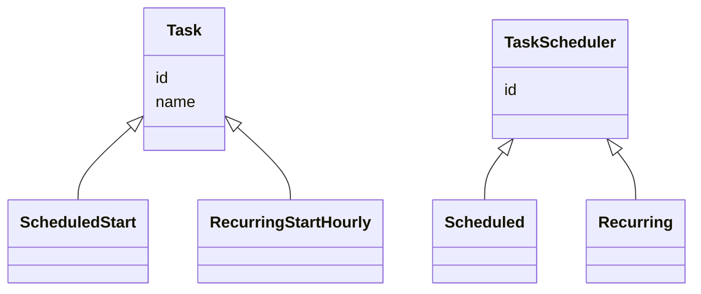
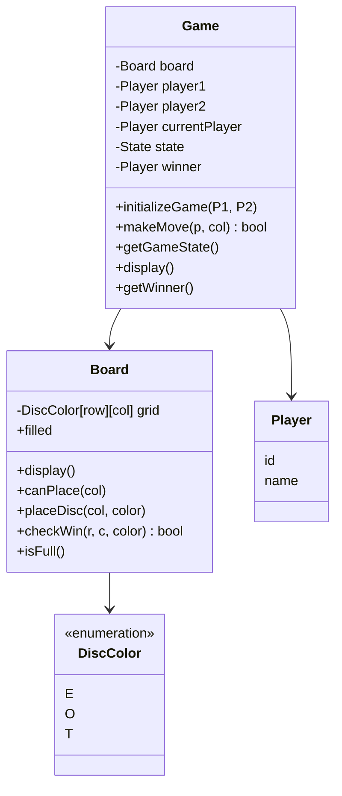

# LLD Problems — Notes

*Transcribed from handwritten Xournal++ notebook (`lld_problems.xopp`), 41 pages.*

---

## 1) Task Scheduler

### Requirements

**i) Functional**
- (a) Submit a scheduled Task
- (b) Submit one-time Task (start)
- Run (a) & (b)

**ii) NFR**
- (a) Concurrency, thread safe
- (b) Task failure recovery (retries: 3)
- (c) Logging task lifecycle details

### Core Components / Entities
1. Task (id, name, ...)
2. TaskScheduler (
3. Execution environment
4. API service



**iv) Priority queue, get NextTask**
- Scheduler runs every 30 seconds
- Pulls list of task from PQ
- Dispatches to Resource Manager
- Resource manager returns status
- If scheduling fails / task fails, re-add to the PQ

Base — System clock: 12:00pm

`PQ<Task> → (start-time)`

### API Service
- SubmitService API — always on some server

```
/submit { } → PQ | Tasks (queue/store)
```

Scheduler // OS — singleton on every machine
```
request ↓ (mem, CPU) ↑ accept → Resource Manager (Thread Pool) → Task.execute()
```

30 sec, resources available, waitlist

DB, schema, interfaces
DTO's, concurrency

Task object should have mechanism to arrive at task_state

`TaskStatus execute()`

---

## 2) Publisher-Subscriber Model

### Functional requirements
1. Write to a topic
2. Read from a topic

### NFR
1. Guarantees:
   - (a) At-least — focus on this
   - (b) Exactly
   - (c) At-most
   - Duplicate handling?
2. Scalability / Load
3. Thread safe
4. Ordering
5. Retries (DLQ)
6. Backpressure

### Core Components
- Message (id, message)
- Queue (id)
- write(message, topic)
- read(topic)

Observer pattern can be used
- Notify when message is produced to all the consumers subscribed to the topic

- Initializations (Object lifecycle)
- Application DTOs
- DB — classes, interfaces

---

## 3) Payment Wallet (LLD)

### Functional Requirements
1. Add to wallet
2. Spend from wallet
3. Transaction history
4. Wallet-wallet transfer
5. Multicurrency support?

### NFR
1. Transactional guarantees
   - Atomicity of transactions (concurrency, thread safe)
   - Immutability
   - Retries on failure

### Core Entities
- User
- Wallet (Account)
- TransactionStatus
- Transaction

Saga vs 2PC
Idempotency key

---

## 4) Rate Limiter
*(title only in notes — no further detail recorded)*

---

## 5) Google Calendar (Slot)
*(title only in notes — no further detail recorded)*

---

## 6) Connect Four
*(numbered "1)" in the original notes — likely starts a new session/page group)*

### Requirements
- 7×6 grid
- Players take turns
- Connect 4 of pieces — win

### Entities
- Game
- Grid
- Player

### API
```
Game:
  trackTurn
  takeInput
  endStateReached?
  markCell()

Grid, Player:
  modifyCell
  endStateTraverse
  (POJO)
```

### Class design
- Game
  - Player: P1, P2
  - State
  - Grid

### Clarify
1. Functional
   - How do players interact?
   - How game ends? (draw & win)
2. Edge case / failure handling
3. NFR — concurrency?

### Requirements (refined)
1. Two players take turn, 7×6 board
2. Disc falls to lowest available cell in column
3. Game ends:
   - Win (V, H, D — 4 discs)
   - Draw — board is full
4. Invalid moves:
   - Dropping in full column
   - Moving out of turn
   - Game ends

### Out of scope
- UI support
- Concurrent
- Undo
- Move history
- Configurable board

### Entities & Relationships
- **Game** — Board, P1, P2; whose turn?
  - API for `move`, `gameState`, `display()`
- **Board** — 7×6 grid
  - `makeMove(col, marker)`
  - `display()`
- **Player** — id, disp-name

### Class Design


State enum: `{IN-PROG, WON, DRAW}`
*(checkWin uses DFS to trace 4-in-a-row)*

---

## 7) Amazon Locker
*(numbered "2)" — new session, restart numbering)*

Driver → [box] ← Customer

**Driver**
1. Deposits a package into available compartment
   - (a) Single or multiple
   - (b) Availability — system or human
   - (c) How system selects slot?
   - (d) Slot sizes

**Flow**
1. Customer places order (package)
2. Driver delivers order in compartment
   - (a) Slot is selected
   - (b) Driver places [package]
   - (c) Access code generated, notified (SMS, Email)
3. Customer retrieves package by:
   1. Selecting slot
   2. Entering access code

### Clarify — Edge cases
- (e) Access code expiry?
- (f) 3 times fail
- (g) What if compartments full

### Requirements
1. Driver deposits a package by size (S, M, L)
   - Driver enters size
   - System matches a slot (size)
   - Opens compartment
   - Driver deposits package & closes compartment
   - System generates access code (TTL)
   - Access code sent to customer
2. User retrieves package by entering access code
   - User enters access code
   - Validates
   - Throw exception if code expired, invalid
3. System
   - Monitors & expires code

### Out of scope
- Whether valid package stored (assume it is)
- UI
- Notification system
- Driver access control
- Order management system

### Entities
- Driver (name, id)
- User (name, id)
- Locker
  - Compartment[]
- Compartment
  - isFree
  - size {S, M, L}
  - AccessToken
- AccessToken (code, expiration, package)

### More Clarifying questions + Extensions + Optimizations
1. Is access token a bearer token?
2. Do we need to handle OMS?
3. Address: not handling — 2-phase approach: open → deposit/pickup → close

1. Open expired compartments()
2. Index by accessCode for fast access
3. Index by compartment size + isFree for fast access
4. Non-add-size fallback — change allocation strategy
5. Compartments can break — add state OUT_OF_SERVICE
6. Ensure package is deposited — confirmDeposit API (which can be called via sensor), prompt deposit

---

## 8) Elevator

- Multiple elevators serving different floors
- On request, match a lift ↑↓
- Passenger select destination floors
- Multiple requests, # floors

User, `reqLift(floor, direction)`, Lift
Lift contains: Buttons, Floor, User

### Functional
- Design for single system?
- Lift capacity handling?

### Flow
1. User requests ↑↓ from a floor
2. Appropriate lift returned via match strategy — first available
3. Lift state (which floor?)
   - (a) Do we need to simulate real-time?
   - (b) Keep time tracking out of system
   - (c) System responds to time unit trigger
4. User presses lift destination floor (optional)
5. Do we need to track user?

### Edge cases
1. Multiple destinations?
2. Pressed ↑ but down floor? Cancellations?
3. Same floor — reject!

### Base case
3 elevators, 10 floors

### Requirements
1. System manages 3 elevators, 10 floors
2. User can request from any floor ↑↓, returns a lift
3. User selects destination floor
4. `step()` function
5. Concurrent pickup requests (extend critical section locking)
6. Invalid floors (not possible)

**Note:** Destination request can happen async
⭐ Idle state is important (don't move lift if no requests)

### Out of scope
- Passenger limits
- Lift stop delay
- UI
- Configurability (but can be extended easily to configure if required)
- Lift door mechanics

### LiftService
`// This is responsible for handling requests`
`Map<Lift>`
- `requestLift(fromFloor, direction)`
- `assignLift(strategy)`
- `step()`
- `validateBounds()`
- `requestDestination`

### Lift
- # of floors
- currentFloor
- currentDirection
- upQueue, downQueue — from `requestLift`
- destinationQueue

`step()`
- `onFloorReached` — // process
- `changeDirection()`

⭐ To simplify, keep idle state at TOP or BOTTOM floor only

### Extensions
1. How to add priority floors / express elevator
   - Add LiftType, based on this reject requests & stops
2. How to cancel floor request
   - Add/remove request API
   - `removeLiftCall`
   - `removeDestCall`
3. Multiple lift calls
   - Make all functions critical section using **lock**
   - This will allow only single operation at a time

---

## 9) Parking Lot
*(numbered "4)")*

- Multiple spots

### Flow
- Vehicle enters system
- System assigns available slot
- Vehicle parked in the spot
- Vehicle exits, system calculates fee, frees up spot (by showing ticket)

### Scoping questions — Solution optimized?
1. Only 1 parking slot?
2. Concurrency?
3. Spots of different sizes / cars? Fallback on size? Separate slot types
4. Only single trigger, assume entry & parking as same operation
5. Simulation `step()`?
6. Multiple floor?
7. Fee calculated (rounded to hour), base price, start with simple

### Edge cases
8. Parking is full; ticket is invalid

### Out of scope / Assumptions
- UI
- Third party (payment, physical h/w)
- User service
- The ticket is not lost

### Requirements

**Flow 1**
1. Vehicle enters parking spot (car, truck)
2. System returns valid parking spot (assign)
3. The car is parked in this slot
4. System returns ticket (start-time, vehicle, slot)

**Flow 2**
1. Vehicle exits parking spot, show valid ticket
2. End-time captured, fee calculated
3. Stamped on ticket
4. Slot freed

### System
`step` function for simulation

- **Parking**: slots, addSlots
- **ParkingService**: park, unpark
- **Slot**: slotType, slotId
- **Ticket**: st-time, e-time, fee, slot, vehicle
- **Vehicle**: vehicleId, type

### Extensibility
1. Multifloor parking
   - ParkingLot → has floors → has slots
   - Change findSlot logic
2. How to add different pricing for different types
   - Create a Factory which returns PricingStrategy object based on vehicleType
3. Concurrency, multiple entry, exits
   1. **Simple approach**: keep a single lock for park, unpark operations. Every entrance, exit calls this. (coarse-grained lock)
   2. **Better approach** (medium concurrency):
      - Have read lock on findAvailableSlots
      - Have write lock on park()/unpark() (some operations might be unsuccessful — 3 retry)
      - This is low contention scenario (OCC-like)

---

## 10) File System

Windows Explorer (in-memory)
- Navigate folders
- Create files
- Move files

### Scoping questions
1. Input path, show all files/folders
2. Which file format supported?
3. What if file(s) with same name? *(edge)*
4. Copy from → to destination (handle clashes)
5. Move files
6. How root folder looks like? Single root?
7. Do they have content?
8. Scale?
9. What bookkeeping (created, permissions, modified)?

Any functional I missed? — 10) Deletes files/folders

### Edge cases
File, folder within same folder, same name?

### Requirements
- Create a file/folder
- Have a root
- Delete file/folder (recursive)
- Display folder contents (given path)
- Move a file from path A → B
- De-duplicate file names
- Allow to create file content (simple text)
- Rename
- Scale

### Out of scope
- UI
- Multiple formats
- Multiple roots
- Book keeping (created, modified)

