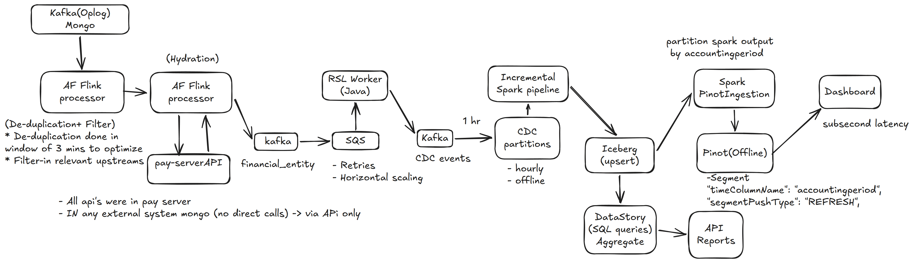

# Revenue Recognition — End to End

*Standalone whiteboard design. Not part of the HLD problem set — kept separately because there is no
matching problem in [`hld_problems.md`](hld_problems.md).*

Whiteboard source — [open in Excalidraw](https://excalidraw.com/#json=RzulstEkMllbVQ9jA4rOD,0ZAuh-n8lQKxbVTM_SXBcg) · offline copy: [`diagrams/excalidraw/revenue-recognition.excalidraw`](diagrams/excalidraw/revenue-recognition.excalidraw)

## Flow

1. **Kafka (Oplog) ← Mongo** — change stream off the Mongo oplog is the entry point of the pipeline.
2. **AF Flink processor** — two stages:
   - *De-duplication + filter* — de-dup done in a **3 min window** to optimise; filter-in only the
     relevant upstreams.
   - *Hydration* — calls **pay-server API** to enrich the event (`financial_entity`).
3. **Kafka** → **SQS** — buffer between the streaming and the worker tier; gives **retries** and
   **horizontal scaling**.
4. **RSL Worker (Java)** — consumes SQS, writes back to **Kafka** as CDC events.
5. **CDC partitions** — hourly / offline partitions feeding the batch layer.
6. **Incremental Spark pipeline** — runs on a **1 hr** cadence, upserts into **Iceberg**.
7. Iceberg fans out into two serving paths:
   - **Spark PinotIngestion → Pinot (Offline) → Dashboard** — sub-second query latency.
     Segment config: `"timeColumnName": "accountingperiod"`, `"segmentPushType": "REFRESH"`.
     Spark output is partitioned by `accountingperiod`.
   - **DataStory (SQL queries, aggregate) → API Reports**.

## Constraints noted on the board

- All APIs live in **pay-server**.
- Any external system reaching Mongo does so **via the API only** — no direct DB calls.
